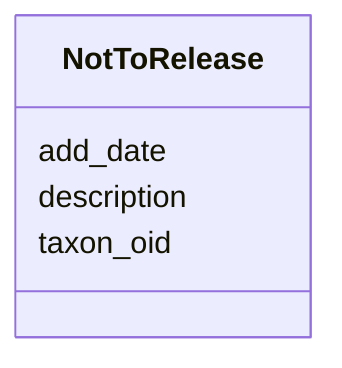

# Class: NotToRelease 


URI: [imgsg_dev:NotToRelease](https://w3id.org/jgi/imgsg_dev/NotToRelease)





<!-- no inheritance hierarchy -->


## Slots

| Name | Cardinality and Range | Description | Inheritance |
| ---  | --- | --- | --- |
| [taxon_oid](taxon_oid.md) | 0..1 <br/> [Integer](Integer.md) |  | direct |
| [description](description.md) | 0..1 <br/> [String](String.md) |  | direct |
| [add_date](add_date.md) | 0..1 <br/> [Datetime](Datetime.md) |  | direct |


## Identifier and Mapping Information


### Schema Source


* from schema: https://w3id.org/jgi/imgsg_dev


## Mappings

| Mapping Type | Mapped Value |
| ---  | ---  |
| self | imgsg_dev:NotToRelease |
| native | imgsg_dev:NotToRelease |


## LinkML Source

<!-- TODO: investigate https://stackoverflow.com/questions/37606292/how-to-create-tabbed-code-blocks-in-mkdocs-or-sphinx -->

### Direct

<details>
```yaml
name: not_to_release
from_schema: https://w3id.org/jgi/imgsg_dev
attributes:
  taxon_oid:
    name: taxon_oid
    from_schema: https://w3id.org/jgi/imgsg_dev
    domain_of:
    - initiate_restore
    - not_to_release
    - perferred_mbin_queue
    - portal_taxons
    - reprocess_submissions_phajek
    - reprocess_with_coverage_phajek
    - taxon_gene_info
    - taxon_scaffold_info
    range: integer
    required: false
  description:
    name: description
    from_schema: https://w3id.org/jgi/imgsg_dev
    domain_of:
    - gold_sequencing_project
    - img_group_news
    - imgcv
    - not_to_release
    - ora_aspnet_applications
    - ora_aspnet_roles
    - ora_aspnet_sitemap
    - project_info_biosample
    - public_workspace
    - study_load
    - submission_proc_stats
    - web_page_codecv
    - webpagecv
    range: string
    required: false
  add_date:
    name: add_date
    from_schema: https://w3id.org/jgi/imgsg_dev
    domain_of:
    - contact
    - env_sample
    - gold_sequencing_project
    - img_group
    - img_group_news
    - not_to_release
    - perferred_mbin_queue
    - project_info
    - project_info_04112013
    - rnaseq_notify_phajek
    - rnaseq_notify_phajek_dev
    - study_load
    - vsample
    range: datetime
    required: false

```
</details>

### Induced

<details>
```yaml
name: not_to_release
from_schema: https://w3id.org/jgi/imgsg_dev
attributes:
  taxon_oid:
    name: taxon_oid
    from_schema: https://w3id.org/jgi/imgsg_dev
    alias: taxon_oid
    owner: not_to_release
    domain_of:
    - initiate_restore
    - not_to_release
    - perferred_mbin_queue
    - portal_taxons
    - reprocess_submissions_phajek
    - reprocess_with_coverage_phajek
    - taxon_gene_info
    - taxon_scaffold_info
    range: integer
    required: false
  description:
    name: description
    from_schema: https://w3id.org/jgi/imgsg_dev
    alias: description
    owner: not_to_release
    domain_of:
    - gold_sequencing_project
    - img_group_news
    - imgcv
    - not_to_release
    - ora_aspnet_applications
    - ora_aspnet_roles
    - ora_aspnet_sitemap
    - project_info_biosample
    - public_workspace
    - study_load
    - submission_proc_stats
    - web_page_codecv
    - webpagecv
    range: string
    required: false
  add_date:
    name: add_date
    from_schema: https://w3id.org/jgi/imgsg_dev
    alias: add_date
    owner: not_to_release
    domain_of:
    - contact
    - env_sample
    - gold_sequencing_project
    - img_group
    - img_group_news
    - not_to_release
    - perferred_mbin_queue
    - project_info
    - project_info_04112013
    - rnaseq_notify_phajek
    - rnaseq_notify_phajek_dev
    - study_load
    - vsample
    range: datetime
    required: false

```
</details>