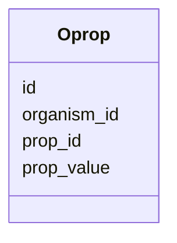

# Class: Oprop 


URI: [imgsg_dev:Oprop](https://w3id.org/jgi/imgsg_dev/Oprop)





<!-- no inheritance hierarchy -->


## Slots

| Name | Cardinality and Range | Description | Inheritance |
| ---  | --- | --- | --- |
| [id](id.md) | 0..1 <br/> [Integer](Integer.md) |  | direct |
| [organism_id](organism_id.md) | 0..1 <br/> [Integer](Integer.md) |  | direct |
| [prop_id](prop_id.md) | 0..1 <br/> [Integer](Integer.md) |  | direct |
| [prop_value](prop_value.md) | 0..1 <br/> [String](String.md) |  | direct |


## Identifier and Mapping Information


### Schema Source


* from schema: https://w3id.org/jgi/imgsg_dev


## Mappings

| Mapping Type | Mapped Value |
| ---  | ---  |
| self | imgsg_dev:Oprop |
| native | imgsg_dev:Oprop |


## LinkML Source

<!-- TODO: investigate https://stackoverflow.com/questions/37606292/how-to-create-tabbed-code-blocks-in-mkdocs-or-sphinx -->

### Direct

<details>
```yaml
name: oprop
from_schema: https://w3id.org/jgi/imgsg_dev
attributes:
  id:
    name: id
    from_schema: https://w3id.org/jgi/imgsg_dev
    domain_of:
    - dacc_logon
    - env_sample_data_links
    - gold_ap_genbank
    - master_list
    - oprop
    - ora_aspnet_personaliznperuser
    - ora_aspnet_sitemap
    - pig_genbank_emailed_accs
    - pig_reruns
    - pig_retractions
    - pig_tracks
    - plan_table
    - plan_table_20131114
    - project_info_data_links
    - project_info_data_links_112013
    - t_reddy_test
    - workflow_stats
    range: integer
    required: false
  organism_id:
    name: organism_id
    from_schema: https://w3id.org/jgi/imgsg_dev
    rank: 1000
    domain_of:
    - oprop
    range: integer
    required: false
  prop_id:
    name: prop_id
    from_schema: https://w3id.org/jgi/imgsg_dev
    rank: 1000
    domain_of:
    - oprop
    range: integer
    required: false
  prop_value:
    name: prop_value
    from_schema: https://w3id.org/jgi/imgsg_dev
    rank: 1000
    domain_of:
    - oprop
    range: string
    required: false

```
</details>

### Induced

<details>
```yaml
name: oprop
from_schema: https://w3id.org/jgi/imgsg_dev
attributes:
  id:
    name: id
    from_schema: https://w3id.org/jgi/imgsg_dev
    alias: id
    owner: oprop
    domain_of:
    - dacc_logon
    - env_sample_data_links
    - gold_ap_genbank
    - master_list
    - oprop
    - ora_aspnet_personaliznperuser
    - ora_aspnet_sitemap
    - pig_genbank_emailed_accs
    - pig_reruns
    - pig_retractions
    - pig_tracks
    - plan_table
    - plan_table_20131114
    - project_info_data_links
    - project_info_data_links_112013
    - t_reddy_test
    - workflow_stats
    range: integer
    required: false
  organism_id:
    name: organism_id
    from_schema: https://w3id.org/jgi/imgsg_dev
    rank: 1000
    alias: organism_id
    owner: oprop
    domain_of:
    - oprop
    range: integer
    required: false
  prop_id:
    name: prop_id
    from_schema: https://w3id.org/jgi/imgsg_dev
    rank: 1000
    alias: prop_id
    owner: oprop
    domain_of:
    - oprop
    range: integer
    required: false
  prop_value:
    name: prop_value
    from_schema: https://w3id.org/jgi/imgsg_dev
    rank: 1000
    alias: prop_value
    owner: oprop
    domain_of:
    - oprop
    range: string
    required: false

```
</details>