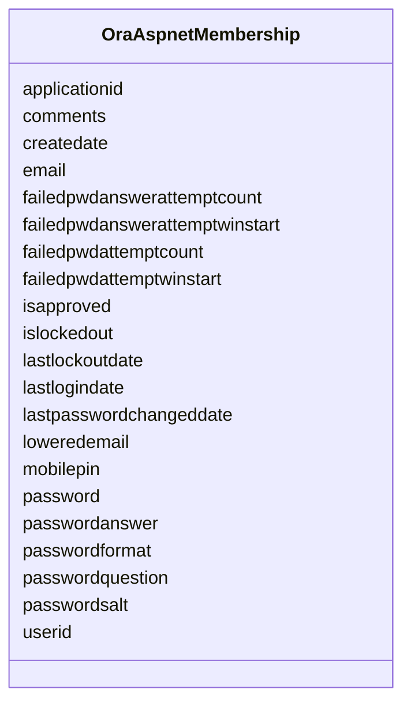

# Class: OraAspnetMembership 


URI: [imgsg_dev:OraAspnetMembership](https://w3id.org/jgi/imgsg_dev/OraAspnetMembership)





<!-- no inheritance hierarchy -->


## Slots

| Name | Cardinality and Range | Description | Inheritance |
| ---  | --- | --- | --- |
| [applicationid](applicationid.md) | 0..1 <br/> [String](String.md) |  | direct |
| [userid](userid.md) | 0..1 <br/> [String](String.md) |  | direct |
| [password](password.md) | 0..1 <br/> [String](String.md) |  | direct |
| [passwordformat](passwordformat.md) | 0..1 <br/> [Integer](Integer.md) |  | direct |
| [passwordsalt](passwordsalt.md) | 0..1 <br/> [String](String.md) |  | direct |
| [mobilepin](mobilepin.md) | 0..1 <br/> [String](String.md) |  | direct |
| [email](email.md) | 0..1 <br/> [String](String.md) |  | direct |
| [loweredemail](loweredemail.md) | 0..1 <br/> [String](String.md) |  | direct |
| [passwordquestion](passwordquestion.md) | 0..1 <br/> [String](String.md) |  | direct |
| [passwordanswer](passwordanswer.md) | 0..1 <br/> [String](String.md) |  | direct |
| [isapproved](isapproved.md) | 0..1 <br/> [Integer](Integer.md) |  | direct |
| [islockedout](islockedout.md) | 0..1 <br/> [Integer](Integer.md) |  | direct |
| [createdate](createdate.md) | 0..1 <br/> [Datetime](Datetime.md) |  | direct |
| [lastlogindate](lastlogindate.md) | 0..1 <br/> [Datetime](Datetime.md) |  | direct |
| [lastpasswordchangeddate](lastpasswordchangeddate.md) | 0..1 <br/> [Datetime](Datetime.md) |  | direct |
| [lastlockoutdate](lastlockoutdate.md) | 0..1 <br/> [Datetime](Datetime.md) |  | direct |
| [failedpwdattemptcount](failedpwdattemptcount.md) | 0..1 <br/> [Integer](Integer.md) |  | direct |
| [failedpwdattemptwinstart](failedpwdattemptwinstart.md) | 0..1 <br/> [Datetime](Datetime.md) |  | direct |
| [failedpwdanswerattemptcount](failedpwdanswerattemptcount.md) | 0..1 <br/> [Integer](Integer.md) |  | direct |
| [failedpwdanswerattemptwinstart](failedpwdanswerattemptwinstart.md) | 0..1 <br/> [Datetime](Datetime.md) |  | direct |
| [comments](comments.md) | 0..1 <br/> [String](String.md) |  | direct |


## Identifier and Mapping Information


### Schema Source


* from schema: https://w3id.org/jgi/imgsg_dev


## Mappings

| Mapping Type | Mapped Value |
| ---  | ---  |
| self | imgsg_dev:OraAspnetMembership |
| native | imgsg_dev:OraAspnetMembership |


## LinkML Source

<!-- TODO: investigate https://stackoverflow.com/questions/37606292/how-to-create-tabbed-code-blocks-in-mkdocs-or-sphinx -->

### Direct

<details>
```yaml
name: ora_aspnet_membership
from_schema: https://w3id.org/jgi/imgsg_dev
attributes:
  applicationid:
    name: applicationid
    from_schema: https://w3id.org/jgi/imgsg_dev
    domain_of:
    - ora_aspnet_applications
    - ora_aspnet_membership
    - ora_aspnet_paths
    - ora_aspnet_roles
    - ora_aspnet_sitemap
    - ora_aspnet_users
    range: string
    required: false
  userid:
    name: userid
    from_schema: https://w3id.org/jgi/imgsg_dev
    rank: 1000
    domain_of:
    - ora_aspnet_membership
    - ora_aspnet_personaliznperuser
    - ora_aspnet_profile
    - ora_aspnet_users
    - ora_aspnet_usersinroles
    range: string
    required: false
  password:
    name: password
    from_schema: https://w3id.org/jgi/imgsg_dev
    domain_of:
    - contact
    - dacc_logon
    - ora_aspnet_membership
    range: string
    required: false
  passwordformat:
    name: passwordformat
    from_schema: https://w3id.org/jgi/imgsg_dev
    rank: 1000
    domain_of:
    - ora_aspnet_membership
    range: integer
    required: false
  passwordsalt:
    name: passwordsalt
    from_schema: https://w3id.org/jgi/imgsg_dev
    rank: 1000
    domain_of:
    - ora_aspnet_membership
    range: string
    required: false
  mobilepin:
    name: mobilepin
    from_schema: https://w3id.org/jgi/imgsg_dev
    rank: 1000
    domain_of:
    - ora_aspnet_membership
    range: string
    required: false
  email:
    name: email
    from_schema: https://w3id.org/jgi/imgsg_dev
    domain_of:
    - cancelled_user
    - contact
    - gold_analysis_project_users
    - ora_aspnet_membership
    - request_account
    range: string
    required: false
  loweredemail:
    name: loweredemail
    from_schema: https://w3id.org/jgi/imgsg_dev
    rank: 1000
    domain_of:
    - ora_aspnet_membership
    range: string
    required: false
  passwordquestion:
    name: passwordquestion
    from_schema: https://w3id.org/jgi/imgsg_dev
    rank: 1000
    domain_of:
    - ora_aspnet_membership
    range: string
    required: false
  passwordanswer:
    name: passwordanswer
    from_schema: https://w3id.org/jgi/imgsg_dev
    rank: 1000
    domain_of:
    - ora_aspnet_membership
    range: string
    required: false
  isapproved:
    name: isapproved
    from_schema: https://w3id.org/jgi/imgsg_dev
    rank: 1000
    domain_of:
    - ora_aspnet_membership
    range: integer
    required: false
  islockedout:
    name: islockedout
    from_schema: https://w3id.org/jgi/imgsg_dev
    rank: 1000
    domain_of:
    - ora_aspnet_membership
    range: integer
    required: false
  createdate:
    name: createdate
    from_schema: https://w3id.org/jgi/imgsg_dev
    rank: 1000
    domain_of:
    - ora_aspnet_membership
    range: datetime
    required: false
  lastlogindate:
    name: lastlogindate
    from_schema: https://w3id.org/jgi/imgsg_dev
    rank: 1000
    domain_of:
    - ora_aspnet_membership
    range: datetime
    required: false
  lastpasswordchangeddate:
    name: lastpasswordchangeddate
    from_schema: https://w3id.org/jgi/imgsg_dev
    rank: 1000
    domain_of:
    - ora_aspnet_membership
    range: datetime
    required: false
  lastlockoutdate:
    name: lastlockoutdate
    from_schema: https://w3id.org/jgi/imgsg_dev
    rank: 1000
    domain_of:
    - ora_aspnet_membership
    range: datetime
    required: false
  failedpwdattemptcount:
    name: failedpwdattemptcount
    from_schema: https://w3id.org/jgi/imgsg_dev
    rank: 1000
    domain_of:
    - ora_aspnet_membership
    range: integer
    required: false
  failedpwdattemptwinstart:
    name: failedpwdattemptwinstart
    from_schema: https://w3id.org/jgi/imgsg_dev
    rank: 1000
    domain_of:
    - ora_aspnet_membership
    range: datetime
    required: false
  failedpwdanswerattemptcount:
    name: failedpwdanswerattemptcount
    from_schema: https://w3id.org/jgi/imgsg_dev
    rank: 1000
    domain_of:
    - ora_aspnet_membership
    range: integer
    required: false
  failedpwdanswerattemptwinstart:
    name: failedpwdanswerattemptwinstart
    from_schema: https://w3id.org/jgi/imgsg_dev
    rank: 1000
    domain_of:
    - ora_aspnet_membership
    range: datetime
    required: false
  comments:
    name: comments
    from_schema: https://w3id.org/jgi/imgsg_dev
    domain_of:
    - assembly
    - cancelled_user
    - contact
    - env_sample
    - gold_analysis_project
    - gold_sequencing_project
    - img_group
    - ora_aspnet_membership
    - project_info
    - project_info_04112013
    - project_info_genbank_authors
    - project_info_nitrogen_fixation
    - request_account
    - submission
    - submission_history
    - submission_proc_steps
    - v5_ap_imperfect_view
    - vsample
    range: string
    required: false

```
</details>

### Induced

<details>
```yaml
name: ora_aspnet_membership
from_schema: https://w3id.org/jgi/imgsg_dev
attributes:
  applicationid:
    name: applicationid
    from_schema: https://w3id.org/jgi/imgsg_dev
    alias: applicationid
    owner: ora_aspnet_membership
    domain_of:
    - ora_aspnet_applications
    - ora_aspnet_membership
    - ora_aspnet_paths
    - ora_aspnet_roles
    - ora_aspnet_sitemap
    - ora_aspnet_users
    range: string
    required: false
  userid:
    name: userid
    from_schema: https://w3id.org/jgi/imgsg_dev
    rank: 1000
    alias: userid
    owner: ora_aspnet_membership
    domain_of:
    - ora_aspnet_membership
    - ora_aspnet_personaliznperuser
    - ora_aspnet_profile
    - ora_aspnet_users
    - ora_aspnet_usersinroles
    range: string
    required: false
  password:
    name: password
    from_schema: https://w3id.org/jgi/imgsg_dev
    alias: password
    owner: ora_aspnet_membership
    domain_of:
    - contact
    - dacc_logon
    - ora_aspnet_membership
    range: string
    required: false
  passwordformat:
    name: passwordformat
    from_schema: https://w3id.org/jgi/imgsg_dev
    rank: 1000
    alias: passwordformat
    owner: ora_aspnet_membership
    domain_of:
    - ora_aspnet_membership
    range: integer
    required: false
  passwordsalt:
    name: passwordsalt
    from_schema: https://w3id.org/jgi/imgsg_dev
    rank: 1000
    alias: passwordsalt
    owner: ora_aspnet_membership
    domain_of:
    - ora_aspnet_membership
    range: string
    required: false
  mobilepin:
    name: mobilepin
    from_schema: https://w3id.org/jgi/imgsg_dev
    rank: 1000
    alias: mobilepin
    owner: ora_aspnet_membership
    domain_of:
    - ora_aspnet_membership
    range: string
    required: false
  email:
    name: email
    from_schema: https://w3id.org/jgi/imgsg_dev
    alias: email
    owner: ora_aspnet_membership
    domain_of:
    - cancelled_user
    - contact
    - gold_analysis_project_users
    - ora_aspnet_membership
    - request_account
    range: string
    required: false
  loweredemail:
    name: loweredemail
    from_schema: https://w3id.org/jgi/imgsg_dev
    rank: 1000
    alias: loweredemail
    owner: ora_aspnet_membership
    domain_of:
    - ora_aspnet_membership
    range: string
    required: false
  passwordquestion:
    name: passwordquestion
    from_schema: https://w3id.org/jgi/imgsg_dev
    rank: 1000
    alias: passwordquestion
    owner: ora_aspnet_membership
    domain_of:
    - ora_aspnet_membership
    range: string
    required: false
  passwordanswer:
    name: passwordanswer
    from_schema: https://w3id.org/jgi/imgsg_dev
    rank: 1000
    alias: passwordanswer
    owner: ora_aspnet_membership
    domain_of:
    - ora_aspnet_membership
    range: string
    required: false
  isapproved:
    name: isapproved
    from_schema: https://w3id.org/jgi/imgsg_dev
    rank: 1000
    alias: isapproved
    owner: ora_aspnet_membership
    domain_of:
    - ora_aspnet_membership
    range: integer
    required: false
  islockedout:
    name: islockedout
    from_schema: https://w3id.org/jgi/imgsg_dev
    rank: 1000
    alias: islockedout
    owner: ora_aspnet_membership
    domain_of:
    - ora_aspnet_membership
    range: integer
    required: false
  createdate:
    name: createdate
    from_schema: https://w3id.org/jgi/imgsg_dev
    rank: 1000
    alias: createdate
    owner: ora_aspnet_membership
    domain_of:
    - ora_aspnet_membership
    range: datetime
    required: false
  lastlogindate:
    name: lastlogindate
    from_schema: https://w3id.org/jgi/imgsg_dev
    rank: 1000
    alias: lastlogindate
    owner: ora_aspnet_membership
    domain_of:
    - ora_aspnet_membership
    range: datetime
    required: false
  lastpasswordchangeddate:
    name: lastpasswordchangeddate
    from_schema: https://w3id.org/jgi/imgsg_dev
    rank: 1000
    alias: lastpasswordchangeddate
    owner: ora_aspnet_membership
    domain_of:
    - ora_aspnet_membership
    range: datetime
    required: false
  lastlockoutdate:
    name: lastlockoutdate
    from_schema: https://w3id.org/jgi/imgsg_dev
    rank: 1000
    alias: lastlockoutdate
    owner: ora_aspnet_membership
    domain_of:
    - ora_aspnet_membership
    range: datetime
    required: false
  failedpwdattemptcount:
    name: failedpwdattemptcount
    from_schema: https://w3id.org/jgi/imgsg_dev
    rank: 1000
    alias: failedpwdattemptcount
    owner: ora_aspnet_membership
    domain_of:
    - ora_aspnet_membership
    range: integer
    required: false
  failedpwdattemptwinstart:
    name: failedpwdattemptwinstart
    from_schema: https://w3id.org/jgi/imgsg_dev
    rank: 1000
    alias: failedpwdattemptwinstart
    owner: ora_aspnet_membership
    domain_of:
    - ora_aspnet_membership
    range: datetime
    required: false
  failedpwdanswerattemptcount:
    name: failedpwdanswerattemptcount
    from_schema: https://w3id.org/jgi/imgsg_dev
    rank: 1000
    alias: failedpwdanswerattemptcount
    owner: ora_aspnet_membership
    domain_of:
    - ora_aspnet_membership
    range: integer
    required: false
  failedpwdanswerattemptwinstart:
    name: failedpwdanswerattemptwinstart
    from_schema: https://w3id.org/jgi/imgsg_dev
    rank: 1000
    alias: failedpwdanswerattemptwinstart
    owner: ora_aspnet_membership
    domain_of:
    - ora_aspnet_membership
    range: datetime
    required: false
  comments:
    name: comments
    from_schema: https://w3id.org/jgi/imgsg_dev
    alias: comments
    owner: ora_aspnet_membership
    domain_of:
    - assembly
    - cancelled_user
    - contact
    - env_sample
    - gold_analysis_project
    - gold_sequencing_project
    - img_group
    - ora_aspnet_membership
    - project_info
    - project_info_04112013
    - project_info_genbank_authors
    - project_info_nitrogen_fixation
    - request_account
    - submission
    - submission_history
    - submission_proc_steps
    - v5_ap_imperfect_view
    - vsample
    range: string
    required: false

```
</details>