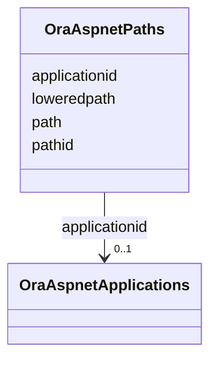

# Class: OraAspnetPaths 


URI: [imgsg_dev:OraAspnetPaths](https://w3id.org/jgi/imgsg_dev/OraAspnetPaths)





<!-- no inheritance hierarchy -->


## Slots

| Name | Cardinality and Range | Description | Inheritance |
| ---  | --- | --- | --- |
| [applicationid](applicationid.md) | 0..1 <br/> [OraAspnetApplications](OraAspnetApplications.md) | Foreign key to ora_aspnet_applications | direct |
| [pathid](pathid.md) | 0..1 <br/> [String](String.md) |  | direct |
| [path](path.md) | 0..1 <br/> [String](String.md) |  | direct |
| [loweredpath](loweredpath.md) | 0..1 <br/> [String](String.md) |  | direct |


## Usages

| used by | used in | type | used |
| ---  | --- | --- | --- |
| [OraAspnetPersonaliznallusers](OraAspnetPersonaliznallusers.md) | [pathid](pathid.md) | range | [OraAspnetPaths](OraAspnetPaths.md) |
| [OraAspnetPersonaliznperuser](OraAspnetPersonaliznperuser.md) | [pathid](pathid.md) | range | [OraAspnetPaths](OraAspnetPaths.md) |


## Identifier and Mapping Information


### Schema Source


* from schema: https://w3id.org/jgi/imgsg_dev


## Mappings

| Mapping Type | Mapped Value |
| ---  | ---  |
| self | imgsg_dev:OraAspnetPaths |
| native | imgsg_dev:OraAspnetPaths |


## LinkML Source

<!-- TODO: investigate https://stackoverflow.com/questions/37606292/how-to-create-tabbed-code-blocks-in-mkdocs-or-sphinx -->

### Direct

<details>
```yaml
name: ora_aspnet_paths
from_schema: https://w3id.org/jgi/imgsg_dev
attributes:
  applicationid:
    name: applicationid
    description: Foreign key to ora_aspnet_applications
    from_schema: https://w3id.org/jgi/imgsg_dev
    domain_of:
    - ora_aspnet_applications
    - ora_aspnet_membership
    - ora_aspnet_paths
    - ora_aspnet_roles
    - ora_aspnet_sitemap
    - ora_aspnet_users
    range: ora_aspnet_applications
    required: false
  pathid:
    name: pathid
    from_schema: https://w3id.org/jgi/imgsg_dev
    rank: 1000
    domain_of:
    - ora_aspnet_paths
    - ora_aspnet_personaliznallusers
    - ora_aspnet_personaliznperuser
    range: string
    required: false
  path:
    name: path
    from_schema: https://w3id.org/jgi/imgsg_dev
    rank: 1000
    domain_of:
    - ora_aspnet_paths
    range: string
    required: false
  loweredpath:
    name: loweredpath
    from_schema: https://w3id.org/jgi/imgsg_dev
    rank: 1000
    domain_of:
    - ora_aspnet_paths
    range: string
    required: false

```
</details>

### Induced

<details>
```yaml
name: ora_aspnet_paths
from_schema: https://w3id.org/jgi/imgsg_dev
attributes:
  applicationid:
    name: applicationid
    description: Foreign key to ora_aspnet_applications
    from_schema: https://w3id.org/jgi/imgsg_dev
    alias: applicationid
    owner: ora_aspnet_paths
    domain_of:
    - ora_aspnet_applications
    - ora_aspnet_membership
    - ora_aspnet_paths
    - ora_aspnet_roles
    - ora_aspnet_sitemap
    - ora_aspnet_users
    range: ora_aspnet_applications
    required: false
  pathid:
    name: pathid
    from_schema: https://w3id.org/jgi/imgsg_dev
    rank: 1000
    alias: pathid
    owner: ora_aspnet_paths
    domain_of:
    - ora_aspnet_paths
    - ora_aspnet_personaliznallusers
    - ora_aspnet_personaliznperuser
    range: string
    required: false
  path:
    name: path
    from_schema: https://w3id.org/jgi/imgsg_dev
    rank: 1000
    alias: path
    owner: ora_aspnet_paths
    domain_of:
    - ora_aspnet_paths
    range: string
    required: false
  loweredpath:
    name: loweredpath
    from_schema: https://w3id.org/jgi/imgsg_dev
    rank: 1000
    alias: loweredpath
    owner: ora_aspnet_paths
    domain_of:
    - ora_aspnet_paths
    range: string
    required: false

```
</details>