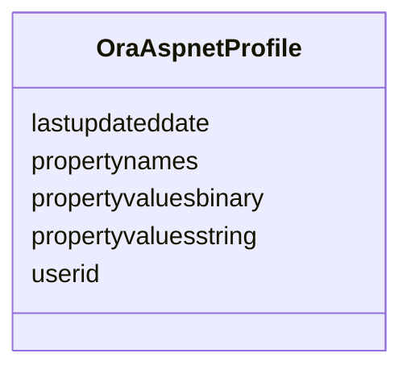

# Class: OraAspnetProfile 


URI: [imgsg_dev:OraAspnetProfile](https://w3id.org/jgi/imgsg_dev/OraAspnetProfile)





<!-- no inheritance hierarchy -->


## Slots

| Name | Cardinality and Range | Description | Inheritance |
| ---  | --- | --- | --- |
| [userid](userid.md) | 0..1 <br/> [String](String.md) |  | direct |
| [propertynames](propertynames.md) | 0..1 <br/> [String](String.md) |  | direct |
| [propertyvaluesstring](propertyvaluesstring.md) | 0..1 <br/> [String](String.md) |  | direct |
| [propertyvaluesbinary](propertyvaluesbinary.md) | 0..1 <br/> [String](String.md) |  | direct |
| [lastupdateddate](lastupdateddate.md) | 0..1 <br/> [Datetime](Datetime.md) |  | direct |


## Identifier and Mapping Information


### Schema Source


* from schema: https://w3id.org/jgi/imgsg_dev


## Mappings

| Mapping Type | Mapped Value |
| ---  | ---  |
| self | imgsg_dev:OraAspnetProfile |
| native | imgsg_dev:OraAspnetProfile |


## LinkML Source

<!-- TODO: investigate https://stackoverflow.com/questions/37606292/how-to-create-tabbed-code-blocks-in-mkdocs-or-sphinx -->

### Direct

<details>
```yaml
name: ora_aspnet_profile
from_schema: https://w3id.org/jgi/imgsg_dev
attributes:
  userid:
    name: userid
    from_schema: https://w3id.org/jgi/imgsg_dev
    domain_of:
    - ora_aspnet_membership
    - ora_aspnet_personaliznperuser
    - ora_aspnet_profile
    - ora_aspnet_users
    - ora_aspnet_usersinroles
    range: string
    required: false
  propertynames:
    name: propertynames
    from_schema: https://w3id.org/jgi/imgsg_dev
    rank: 1000
    domain_of:
    - ora_aspnet_profile
    range: string
    required: false
  propertyvaluesstring:
    name: propertyvaluesstring
    from_schema: https://w3id.org/jgi/imgsg_dev
    rank: 1000
    domain_of:
    - ora_aspnet_profile
    range: string
    required: false
  propertyvaluesbinary:
    name: propertyvaluesbinary
    from_schema: https://w3id.org/jgi/imgsg_dev
    rank: 1000
    domain_of:
    - ora_aspnet_profile
    range: string
    required: false
  lastupdateddate:
    name: lastupdateddate
    from_schema: https://w3id.org/jgi/imgsg_dev
    domain_of:
    - ora_aspnet_personaliznallusers
    - ora_aspnet_personaliznperuser
    - ora_aspnet_profile
    range: datetime
    required: false

```
</details>

### Induced

<details>
```yaml
name: ora_aspnet_profile
from_schema: https://w3id.org/jgi/imgsg_dev
attributes:
  userid:
    name: userid
    from_schema: https://w3id.org/jgi/imgsg_dev
    alias: userid
    owner: ora_aspnet_profile
    domain_of:
    - ora_aspnet_membership
    - ora_aspnet_personaliznperuser
    - ora_aspnet_profile
    - ora_aspnet_users
    - ora_aspnet_usersinroles
    range: string
    required: false
  propertynames:
    name: propertynames
    from_schema: https://w3id.org/jgi/imgsg_dev
    rank: 1000
    alias: propertynames
    owner: ora_aspnet_profile
    domain_of:
    - ora_aspnet_profile
    range: string
    required: false
  propertyvaluesstring:
    name: propertyvaluesstring
    from_schema: https://w3id.org/jgi/imgsg_dev
    rank: 1000
    alias: propertyvaluesstring
    owner: ora_aspnet_profile
    domain_of:
    - ora_aspnet_profile
    range: string
    required: false
  propertyvaluesbinary:
    name: propertyvaluesbinary
    from_schema: https://w3id.org/jgi/imgsg_dev
    rank: 1000
    alias: propertyvaluesbinary
    owner: ora_aspnet_profile
    domain_of:
    - ora_aspnet_profile
    range: string
    required: false
  lastupdateddate:
    name: lastupdateddate
    from_schema: https://w3id.org/jgi/imgsg_dev
    alias: lastupdateddate
    owner: ora_aspnet_profile
    domain_of:
    - ora_aspnet_personaliznallusers
    - ora_aspnet_personaliznperuser
    - ora_aspnet_profile
    range: datetime
    required: false

```
</details>