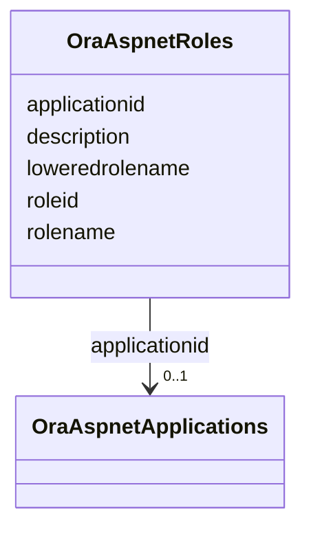

# Class: OraAspnetRoles 


URI: [imgsg_dev:OraAspnetRoles](https://w3id.org/jgi/imgsg_dev/OraAspnetRoles)





<!-- no inheritance hierarchy -->


## Slots

| Name | Cardinality and Range | Description | Inheritance |
| ---  | --- | --- | --- |
| [applicationid](applicationid.md) | 0..1 <br/> [OraAspnetApplications](OraAspnetApplications.md) | Foreign key to ora_aspnet_applications | direct |
| [roleid](roleid.md) | 0..1 <br/> [String](String.md) |  | direct |
| [rolename](rolename.md) | 0..1 <br/> [String](String.md) |  | direct |
| [loweredrolename](loweredrolename.md) | 0..1 <br/> [String](String.md) |  | direct |
| [description](description.md) | 0..1 <br/> [String](String.md) |  | direct |


## Usages

| used by | used in | type | used |
| ---  | --- | --- | --- |
| [OraAspnetUsersinroles](OraAspnetUsersinroles.md) | [roleid](roleid.md) | range | [OraAspnetRoles](OraAspnetRoles.md) |


## Identifier and Mapping Information


### Schema Source


* from schema: https://w3id.org/jgi/imgsg_dev


## Mappings

| Mapping Type | Mapped Value |
| ---  | ---  |
| self | imgsg_dev:OraAspnetRoles |
| native | imgsg_dev:OraAspnetRoles |


## LinkML Source

<!-- TODO: investigate https://stackoverflow.com/questions/37606292/how-to-create-tabbed-code-blocks-in-mkdocs-or-sphinx -->

### Direct

<details>
```yaml
name: ora_aspnet_roles
from_schema: https://w3id.org/jgi/imgsg_dev
attributes:
  applicationid:
    name: applicationid
    description: Foreign key to ora_aspnet_applications
    from_schema: https://w3id.org/jgi/imgsg_dev
    domain_of:
    - ora_aspnet_applications
    - ora_aspnet_membership
    - ora_aspnet_paths
    - ora_aspnet_roles
    - ora_aspnet_sitemap
    - ora_aspnet_users
    range: ora_aspnet_applications
    required: false
  roleid:
    name: roleid
    from_schema: https://w3id.org/jgi/imgsg_dev
    rank: 1000
    domain_of:
    - ora_aspnet_roles
    - ora_aspnet_usersinroles
    range: string
    required: false
  rolename:
    name: rolename
    from_schema: https://w3id.org/jgi/imgsg_dev
    rank: 1000
    domain_of:
    - ora_aspnet_roles
    range: string
    required: false
  loweredrolename:
    name: loweredrolename
    from_schema: https://w3id.org/jgi/imgsg_dev
    rank: 1000
    domain_of:
    - ora_aspnet_roles
    range: string
    required: false
  description:
    name: description
    from_schema: https://w3id.org/jgi/imgsg_dev
    domain_of:
    - gold_sequencing_project
    - img_group_news
    - imgcv
    - not_to_release
    - ora_aspnet_applications
    - ora_aspnet_roles
    - ora_aspnet_sitemap
    - project_info_biosample
    - public_workspace
    - study_load
    - submission_proc_stats
    - web_page_codecv
    - webpagecv
    range: string
    required: false

```
</details>

### Induced

<details>
```yaml
name: ora_aspnet_roles
from_schema: https://w3id.org/jgi/imgsg_dev
attributes:
  applicationid:
    name: applicationid
    description: Foreign key to ora_aspnet_applications
    from_schema: https://w3id.org/jgi/imgsg_dev
    alias: applicationid
    owner: ora_aspnet_roles
    domain_of:
    - ora_aspnet_applications
    - ora_aspnet_membership
    - ora_aspnet_paths
    - ora_aspnet_roles
    - ora_aspnet_sitemap
    - ora_aspnet_users
    range: ora_aspnet_applications
    required: false
  roleid:
    name: roleid
    from_schema: https://w3id.org/jgi/imgsg_dev
    rank: 1000
    alias: roleid
    owner: ora_aspnet_roles
    domain_of:
    - ora_aspnet_roles
    - ora_aspnet_usersinroles
    range: string
    required: false
  rolename:
    name: rolename
    from_schema: https://w3id.org/jgi/imgsg_dev
    rank: 1000
    alias: rolename
    owner: ora_aspnet_roles
    domain_of:
    - ora_aspnet_roles
    range: string
    required: false
  loweredrolename:
    name: loweredrolename
    from_schema: https://w3id.org/jgi/imgsg_dev
    rank: 1000
    alias: loweredrolename
    owner: ora_aspnet_roles
    domain_of:
    - ora_aspnet_roles
    range: string
    required: false
  description:
    name: description
    from_schema: https://w3id.org/jgi/imgsg_dev
    alias: description
    owner: ora_aspnet_roles
    domain_of:
    - gold_sequencing_project
    - img_group_news
    - imgcv
    - not_to_release
    - ora_aspnet_applications
    - ora_aspnet_roles
    - ora_aspnet_sitemap
    - project_info_biosample
    - public_workspace
    - study_load
    - submission_proc_stats
    - web_page_codecv
    - webpagecv
    range: string
    required: false

```
</details>