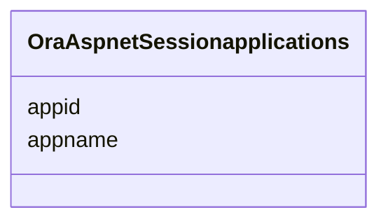

# Class: OraAspnetSessionapplications 


URI: [imgsg_dev:OraAspnetSessionapplications](https://w3id.org/jgi/imgsg_dev/OraAspnetSessionapplications)





<!-- no inheritance hierarchy -->


## Slots

| Name | Cardinality and Range | Description | Inheritance |
| ---  | --- | --- | --- |
| [appid](appid.md) | 0..1 <br/> [String](String.md) |  | direct |
| [appname](appname.md) | 0..1 <br/> [String](String.md) |  | direct |


## Identifier and Mapping Information


### Schema Source


* from schema: https://w3id.org/jgi/imgsg_dev


## Mappings

| Mapping Type | Mapped Value |
| ---  | ---  |
| self | imgsg_dev:OraAspnetSessionapplications |
| native | imgsg_dev:OraAspnetSessionapplications |


## LinkML Source

<!-- TODO: investigate https://stackoverflow.com/questions/37606292/how-to-create-tabbed-code-blocks-in-mkdocs-or-sphinx -->

### Direct

<details>
```yaml
name: ora_aspnet_sessionapplications
from_schema: https://w3id.org/jgi/imgsg_dev
attributes:
  appid:
    name: appid
    from_schema: https://w3id.org/jgi/imgsg_dev
    rank: 1000
    domain_of:
    - ora_aspnet_sessionapplications
    range: string
    required: false
  appname:
    name: appname
    from_schema: https://w3id.org/jgi/imgsg_dev
    rank: 1000
    domain_of:
    - ora_aspnet_sessionapplications
    range: string
    required: false

```
</details>

### Induced

<details>
```yaml
name: ora_aspnet_sessionapplications
from_schema: https://w3id.org/jgi/imgsg_dev
attributes:
  appid:
    name: appid
    from_schema: https://w3id.org/jgi/imgsg_dev
    rank: 1000
    alias: appid
    owner: ora_aspnet_sessionapplications
    domain_of:
    - ora_aspnet_sessionapplications
    range: string
    required: false
  appname:
    name: appname
    from_schema: https://w3id.org/jgi/imgsg_dev
    rank: 1000
    alias: appname
    owner: ora_aspnet_sessionapplications
    domain_of:
    - ora_aspnet_sessionapplications
    range: string
    required: false

```
</details>