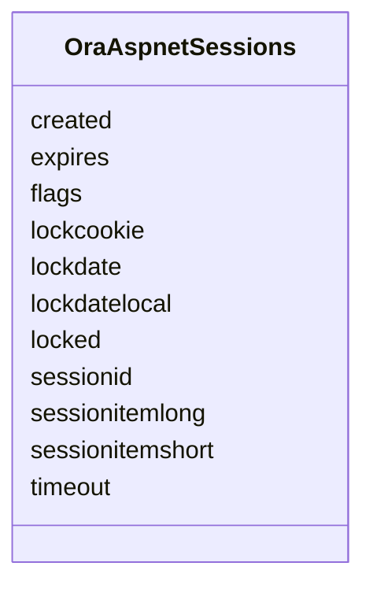

# Class: OraAspnetSessions 


URI: [imgsg_dev:OraAspnetSessions](https://w3id.org/jgi/imgsg_dev/OraAspnetSessions)





<!-- no inheritance hierarchy -->


## Slots

| Name | Cardinality and Range | Description | Inheritance |
| ---  | --- | --- | --- |
| [sessionid](sessionid.md) | 0..1 <br/> [String](String.md) |  | direct |
| [created](created.md) | 0..1 <br/> [Datetime](Datetime.md) |  | direct |
| [expires](expires.md) | 0..1 <br/> [Datetime](Datetime.md) |  | direct |
| [lockdate](lockdate.md) | 0..1 <br/> [Datetime](Datetime.md) |  | direct |
| [lockdatelocal](lockdatelocal.md) | 0..1 <br/> [Datetime](Datetime.md) |  | direct |
| [lockcookie](lockcookie.md) | 0..1 <br/> [Integer](Integer.md) |  | direct |
| [timeout](timeout.md) | 0..1 <br/> [Integer](Integer.md) |  | direct |
| [locked](locked.md) | 0..1 <br/> [Integer](Integer.md) |  | direct |
| [sessionitemshort](sessionitemshort.md) | 0..1 <br/> [String](String.md) |  | direct |
| [sessionitemlong](sessionitemlong.md) | 0..1 <br/> [String](String.md) |  | direct |
| [flags](flags.md) | 0..1 <br/> [Integer](Integer.md) |  | direct |


## Identifier and Mapping Information


### Schema Source


* from schema: https://w3id.org/jgi/imgsg_dev


## Mappings

| Mapping Type | Mapped Value |
| ---  | ---  |
| self | imgsg_dev:OraAspnetSessions |
| native | imgsg_dev:OraAspnetSessions |


## LinkML Source

<!-- TODO: investigate https://stackoverflow.com/questions/37606292/how-to-create-tabbed-code-blocks-in-mkdocs-or-sphinx -->

### Direct

<details>
```yaml
name: ora_aspnet_sessions
from_schema: https://w3id.org/jgi/imgsg_dev
attributes:
  sessionid:
    name: sessionid
    from_schema: https://w3id.org/jgi/imgsg_dev
    rank: 1000
    domain_of:
    - ora_aspnet_sessions
    range: string
    required: false
  created:
    name: created
    from_schema: https://w3id.org/jgi/imgsg_dev
    rank: 1000
    domain_of:
    - ora_aspnet_sessions
    range: datetime
    required: false
  expires:
    name: expires
    from_schema: https://w3id.org/jgi/imgsg_dev
    rank: 1000
    domain_of:
    - ora_aspnet_sessions
    range: datetime
    required: false
  lockdate:
    name: lockdate
    from_schema: https://w3id.org/jgi/imgsg_dev
    rank: 1000
    domain_of:
    - ora_aspnet_sessions
    range: datetime
    required: false
  lockdatelocal:
    name: lockdatelocal
    from_schema: https://w3id.org/jgi/imgsg_dev
    rank: 1000
    domain_of:
    - ora_aspnet_sessions
    range: datetime
    required: false
  lockcookie:
    name: lockcookie
    from_schema: https://w3id.org/jgi/imgsg_dev
    rank: 1000
    domain_of:
    - ora_aspnet_sessions
    range: integer
    required: false
  timeout:
    name: timeout
    from_schema: https://w3id.org/jgi/imgsg_dev
    rank: 1000
    domain_of:
    - ora_aspnet_sessions
    range: integer
    required: false
  locked:
    name: locked
    from_schema: https://w3id.org/jgi/imgsg_dev
    rank: 1000
    domain_of:
    - ora_aspnet_sessions
    range: integer
    required: false
  sessionitemshort:
    name: sessionitemshort
    from_schema: https://w3id.org/jgi/imgsg_dev
    rank: 1000
    domain_of:
    - ora_aspnet_sessions
    range: string
    required: false
  sessionitemlong:
    name: sessionitemlong
    from_schema: https://w3id.org/jgi/imgsg_dev
    rank: 1000
    domain_of:
    - ora_aspnet_sessions
    range: string
    required: false
  flags:
    name: flags
    from_schema: https://w3id.org/jgi/imgsg_dev
    rank: 1000
    domain_of:
    - ora_aspnet_sessions
    range: integer
    required: false

```
</details>

### Induced

<details>
```yaml
name: ora_aspnet_sessions
from_schema: https://w3id.org/jgi/imgsg_dev
attributes:
  sessionid:
    name: sessionid
    from_schema: https://w3id.org/jgi/imgsg_dev
    rank: 1000
    alias: sessionid
    owner: ora_aspnet_sessions
    domain_of:
    - ora_aspnet_sessions
    range: string
    required: false
  created:
    name: created
    from_schema: https://w3id.org/jgi/imgsg_dev
    rank: 1000
    alias: created
    owner: ora_aspnet_sessions
    domain_of:
    - ora_aspnet_sessions
    range: datetime
    required: false
  expires:
    name: expires
    from_schema: https://w3id.org/jgi/imgsg_dev
    rank: 1000
    alias: expires
    owner: ora_aspnet_sessions
    domain_of:
    - ora_aspnet_sessions
    range: datetime
    required: false
  lockdate:
    name: lockdate
    from_schema: https://w3id.org/jgi/imgsg_dev
    rank: 1000
    alias: lockdate
    owner: ora_aspnet_sessions
    domain_of:
    - ora_aspnet_sessions
    range: datetime
    required: false
  lockdatelocal:
    name: lockdatelocal
    from_schema: https://w3id.org/jgi/imgsg_dev
    rank: 1000
    alias: lockdatelocal
    owner: ora_aspnet_sessions
    domain_of:
    - ora_aspnet_sessions
    range: datetime
    required: false
  lockcookie:
    name: lockcookie
    from_schema: https://w3id.org/jgi/imgsg_dev
    rank: 1000
    alias: lockcookie
    owner: ora_aspnet_sessions
    domain_of:
    - ora_aspnet_sessions
    range: integer
    required: false
  timeout:
    name: timeout
    from_schema: https://w3id.org/jgi/imgsg_dev
    rank: 1000
    alias: timeout
    owner: ora_aspnet_sessions
    domain_of:
    - ora_aspnet_sessions
    range: integer
    required: false
  locked:
    name: locked
    from_schema: https://w3id.org/jgi/imgsg_dev
    rank: 1000
    alias: locked
    owner: ora_aspnet_sessions
    domain_of:
    - ora_aspnet_sessions
    range: integer
    required: false
  sessionitemshort:
    name: sessionitemshort
    from_schema: https://w3id.org/jgi/imgsg_dev
    rank: 1000
    alias: sessionitemshort
    owner: ora_aspnet_sessions
    domain_of:
    - ora_aspnet_sessions
    range: string
    required: false
  sessionitemlong:
    name: sessionitemlong
    from_schema: https://w3id.org/jgi/imgsg_dev
    rank: 1000
    alias: sessionitemlong
    owner: ora_aspnet_sessions
    domain_of:
    - ora_aspnet_sessions
    range: string
    required: false
  flags:
    name: flags
    from_schema: https://w3id.org/jgi/imgsg_dev
    rank: 1000
    alias: flags
    owner: ora_aspnet_sessions
    domain_of:
    - ora_aspnet_sessions
    range: integer
    required: false

```
</details>