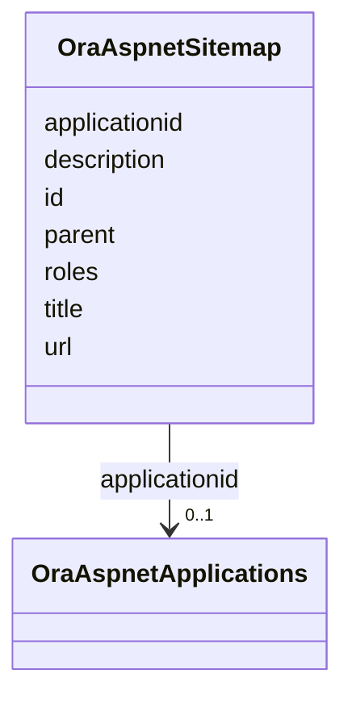

# Class: OraAspnetSitemap 


URI: [imgsg_dev:OraAspnetSitemap](https://w3id.org/jgi/imgsg_dev/OraAspnetSitemap)





<!-- no inheritance hierarchy -->


## Slots

| Name | Cardinality and Range | Description | Inheritance |
| ---  | --- | --- | --- |
| [applicationid](applicationid.md) | 0..1 <br/> [OraAspnetApplications](OraAspnetApplications.md) | Foreign key to ora_aspnet_applications | direct |
| [id](id.md) | 0..1 <br/> [Integer](Integer.md) |  | direct |
| [title](title.md) | 0..1 <br/> [String](String.md) |  | direct |
| [description](description.md) | 0..1 <br/> [String](String.md) |  | direct |
| [url](url.md) | 0..1 <br/> [String](String.md) |  | direct |
| [roles](roles.md) | 0..1 <br/> [String](String.md) |  | direct |
| [parent](parent.md) | 0..1 <br/> [Integer](Integer.md) |  | direct |


## Identifier and Mapping Information


### Schema Source


* from schema: https://w3id.org/jgi/imgsg_dev


## Mappings

| Mapping Type | Mapped Value |
| ---  | ---  |
| self | imgsg_dev:OraAspnetSitemap |
| native | imgsg_dev:OraAspnetSitemap |


## LinkML Source

<!-- TODO: investigate https://stackoverflow.com/questions/37606292/how-to-create-tabbed-code-blocks-in-mkdocs-or-sphinx -->

### Direct

<details>
```yaml
name: ora_aspnet_sitemap
from_schema: https://w3id.org/jgi/imgsg_dev
attributes:
  applicationid:
    name: applicationid
    description: Foreign key to ora_aspnet_applications
    from_schema: https://w3id.org/jgi/imgsg_dev
    domain_of:
    - ora_aspnet_applications
    - ora_aspnet_membership
    - ora_aspnet_paths
    - ora_aspnet_roles
    - ora_aspnet_sitemap
    - ora_aspnet_users
    range: ora_aspnet_applications
    required: false
  id:
    name: id
    from_schema: https://w3id.org/jgi/imgsg_dev
    domain_of:
    - dacc_logon
    - env_sample_data_links
    - gold_ap_genbank
    - master_list
    - oprop
    - ora_aspnet_personaliznperuser
    - ora_aspnet_sitemap
    - pig_genbank_emailed_accs
    - pig_reruns
    - pig_retractions
    - pig_tracks
    - plan_table
    - plan_table_20131114
    - project_info_data_links
    - project_info_data_links_112013
    - t_reddy_test
    - workflow_stats
    range: integer
    required: false
  title:
    name: title
    from_schema: https://w3id.org/jgi/imgsg_dev
    domain_of:
    - contact
    - gold_ap_publications
    - gold_sp_genome_publications
    - img_group_news
    - ora_aspnet_sitemap
    - request_account
    range: string
    required: false
  description:
    name: description
    from_schema: https://w3id.org/jgi/imgsg_dev
    domain_of:
    - gold_sequencing_project
    - img_group_news
    - imgcv
    - not_to_release
    - ora_aspnet_applications
    - ora_aspnet_roles
    - ora_aspnet_sitemap
    - project_info_biosample
    - public_workspace
    - study_load
    - submission_proc_stats
    - web_page_codecv
    - webpagecv
    range: string
    required: false
  url:
    name: url
    from_schema: https://w3id.org/jgi/imgsg_dev
    domain_of:
    - env_sample_data_links
    - env_sample_jgi_url
    - gold_sp_collaborator
    - gold_sp_seq_center
    - institutes
    - luseq_center
    - ora_aspnet_sitemap
    - project_info_data_links
    - project_info_data_links_112013
    - project_info_jgi_url
    - t_institutes_bak
    range: string
    required: false
  roles:
    name: roles
    from_schema: https://w3id.org/jgi/imgsg_dev
    rank: 1000
    domain_of:
    - ora_aspnet_sitemap
    range: string
    required: false
  parent:
    name: parent
    from_schema: https://w3id.org/jgi/imgsg_dev
    rank: 1000
    domain_of:
    - ora_aspnet_sitemap
    range: integer
    required: false

```
</details>

### Induced

<details>
```yaml
name: ora_aspnet_sitemap
from_schema: https://w3id.org/jgi/imgsg_dev
attributes:
  applicationid:
    name: applicationid
    description: Foreign key to ora_aspnet_applications
    from_schema: https://w3id.org/jgi/imgsg_dev
    alias: applicationid
    owner: ora_aspnet_sitemap
    domain_of:
    - ora_aspnet_applications
    - ora_aspnet_membership
    - ora_aspnet_paths
    - ora_aspnet_roles
    - ora_aspnet_sitemap
    - ora_aspnet_users
    range: ora_aspnet_applications
    required: false
  id:
    name: id
    from_schema: https://w3id.org/jgi/imgsg_dev
    alias: id
    owner: ora_aspnet_sitemap
    domain_of:
    - dacc_logon
    - env_sample_data_links
    - gold_ap_genbank
    - master_list
    - oprop
    - ora_aspnet_personaliznperuser
    - ora_aspnet_sitemap
    - pig_genbank_emailed_accs
    - pig_reruns
    - pig_retractions
    - pig_tracks
    - plan_table
    - plan_table_20131114
    - project_info_data_links
    - project_info_data_links_112013
    - t_reddy_test
    - workflow_stats
    range: integer
    required: false
  title:
    name: title
    from_schema: https://w3id.org/jgi/imgsg_dev
    alias: title
    owner: ora_aspnet_sitemap
    domain_of:
    - contact
    - gold_ap_publications
    - gold_sp_genome_publications
    - img_group_news
    - ora_aspnet_sitemap
    - request_account
    range: string
    required: false
  description:
    name: description
    from_schema: https://w3id.org/jgi/imgsg_dev
    alias: description
    owner: ora_aspnet_sitemap
    domain_of:
    - gold_sequencing_project
    - img_group_news
    - imgcv
    - not_to_release
    - ora_aspnet_applications
    - ora_aspnet_roles
    - ora_aspnet_sitemap
    - project_info_biosample
    - public_workspace
    - study_load
    - submission_proc_stats
    - web_page_codecv
    - webpagecv
    range: string
    required: false
  url:
    name: url
    from_schema: https://w3id.org/jgi/imgsg_dev
    alias: url
    owner: ora_aspnet_sitemap
    domain_of:
    - env_sample_data_links
    - env_sample_jgi_url
    - gold_sp_collaborator
    - gold_sp_seq_center
    - institutes
    - luseq_center
    - ora_aspnet_sitemap
    - project_info_data_links
    - project_info_data_links_112013
    - project_info_jgi_url
    - t_institutes_bak
    range: string
    required: false
  roles:
    name: roles
    from_schema: https://w3id.org/jgi/imgsg_dev
    rank: 1000
    alias: roles
    owner: ora_aspnet_sitemap
    domain_of:
    - ora_aspnet_sitemap
    range: string
    required: false
  parent:
    name: parent
    from_schema: https://w3id.org/jgi/imgsg_dev
    rank: 1000
    alias: parent
    owner: ora_aspnet_sitemap
    domain_of:
    - ora_aspnet_sitemap
    range: integer
    required: false

```
</details>