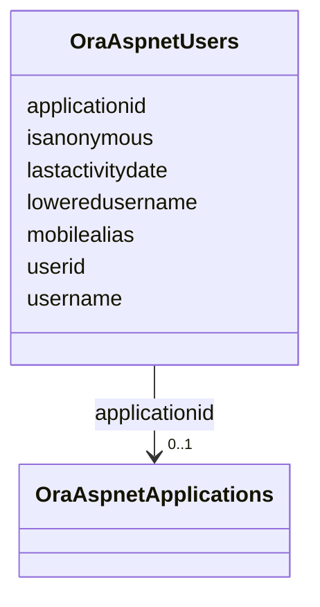

# Class: OraAspnetUsers 


URI: [imgsg_dev:OraAspnetUsers](https://w3id.org/jgi/imgsg_dev/OraAspnetUsers)





<!-- no inheritance hierarchy -->


## Slots

| Name | Cardinality and Range | Description | Inheritance |
| ---  | --- | --- | --- |
| [applicationid](applicationid.md) | 0..1 <br/> [OraAspnetApplications](OraAspnetApplications.md) | Foreign key to ora_aspnet_applications | direct |
| [userid](userid.md) | 0..1 <br/> [String](String.md) |  | direct |
| [username](username.md) | 0..1 <br/> [String](String.md) |  | direct |
| [loweredusername](loweredusername.md) | 0..1 <br/> [String](String.md) |  | direct |
| [mobilealias](mobilealias.md) | 0..1 <br/> [String](String.md) |  | direct |
| [isanonymous](isanonymous.md) | 0..1 <br/> [Integer](Integer.md) |  | direct |
| [lastactivitydate](lastactivitydate.md) | 0..1 <br/> [Datetime](Datetime.md) |  | direct |


## Usages

| used by | used in | type | used |
| ---  | --- | --- | --- |
| [OraAspnetPersonaliznperuser](OraAspnetPersonaliznperuser.md) | [userid](userid.md) | range | [OraAspnetUsers](OraAspnetUsers.md) |
| [OraAspnetUsersinroles](OraAspnetUsersinroles.md) | [userid](userid.md) | range | [OraAspnetUsers](OraAspnetUsers.md) |


## Identifier and Mapping Information


### Schema Source


* from schema: https://w3id.org/jgi/imgsg_dev


## Mappings

| Mapping Type | Mapped Value |
| ---  | ---  |
| self | imgsg_dev:OraAspnetUsers |
| native | imgsg_dev:OraAspnetUsers |


## LinkML Source

<!-- TODO: investigate https://stackoverflow.com/questions/37606292/how-to-create-tabbed-code-blocks-in-mkdocs-or-sphinx -->

### Direct

<details>
```yaml
name: ora_aspnet_users
from_schema: https://w3id.org/jgi/imgsg_dev
attributes:
  applicationid:
    name: applicationid
    description: Foreign key to ora_aspnet_applications
    from_schema: https://w3id.org/jgi/imgsg_dev
    domain_of:
    - ora_aspnet_applications
    - ora_aspnet_membership
    - ora_aspnet_paths
    - ora_aspnet_roles
    - ora_aspnet_sitemap
    - ora_aspnet_users
    range: ora_aspnet_applications
    required: false
  userid:
    name: userid
    from_schema: https://w3id.org/jgi/imgsg_dev
    domain_of:
    - ora_aspnet_membership
    - ora_aspnet_personaliznperuser
    - ora_aspnet_profile
    - ora_aspnet_users
    - ora_aspnet_usersinroles
    range: string
    required: false
  username:
    name: username
    from_schema: https://w3id.org/jgi/imgsg_dev
    domain_of:
    - cancelled_user
    - contact
    - dacc_logon
    - ora_aspnet_users
    - request_account
    - submission_history
    range: string
    required: false
  loweredusername:
    name: loweredusername
    from_schema: https://w3id.org/jgi/imgsg_dev
    rank: 1000
    domain_of:
    - ora_aspnet_users
    range: string
    required: false
  mobilealias:
    name: mobilealias
    from_schema: https://w3id.org/jgi/imgsg_dev
    rank: 1000
    domain_of:
    - ora_aspnet_users
    range: string
    required: false
  isanonymous:
    name: isanonymous
    from_schema: https://w3id.org/jgi/imgsg_dev
    rank: 1000
    domain_of:
    - ora_aspnet_users
    range: integer
    required: false
  lastactivitydate:
    name: lastactivitydate
    from_schema: https://w3id.org/jgi/imgsg_dev
    rank: 1000
    domain_of:
    - ora_aspnet_users
    range: datetime
    required: false

```
</details>

### Induced

<details>
```yaml
name: ora_aspnet_users
from_schema: https://w3id.org/jgi/imgsg_dev
attributes:
  applicationid:
    name: applicationid
    description: Foreign key to ora_aspnet_applications
    from_schema: https://w3id.org/jgi/imgsg_dev
    alias: applicationid
    owner: ora_aspnet_users
    domain_of:
    - ora_aspnet_applications
    - ora_aspnet_membership
    - ora_aspnet_paths
    - ora_aspnet_roles
    - ora_aspnet_sitemap
    - ora_aspnet_users
    range: ora_aspnet_applications
    required: false
  userid:
    name: userid
    from_schema: https://w3id.org/jgi/imgsg_dev
    alias: userid
    owner: ora_aspnet_users
    domain_of:
    - ora_aspnet_membership
    - ora_aspnet_personaliznperuser
    - ora_aspnet_profile
    - ora_aspnet_users
    - ora_aspnet_usersinroles
    range: string
    required: false
  username:
    name: username
    from_schema: https://w3id.org/jgi/imgsg_dev
    alias: username
    owner: ora_aspnet_users
    domain_of:
    - cancelled_user
    - contact
    - dacc_logon
    - ora_aspnet_users
    - request_account
    - submission_history
    range: string
    required: false
  loweredusername:
    name: loweredusername
    from_schema: https://w3id.org/jgi/imgsg_dev
    rank: 1000
    alias: loweredusername
    owner: ora_aspnet_users
    domain_of:
    - ora_aspnet_users
    range: string
    required: false
  mobilealias:
    name: mobilealias
    from_schema: https://w3id.org/jgi/imgsg_dev
    rank: 1000
    alias: mobilealias
    owner: ora_aspnet_users
    domain_of:
    - ora_aspnet_users
    range: string
    required: false
  isanonymous:
    name: isanonymous
    from_schema: https://w3id.org/jgi/imgsg_dev
    rank: 1000
    alias: isanonymous
    owner: ora_aspnet_users
    domain_of:
    - ora_aspnet_users
    range: integer
    required: false
  lastactivitydate:
    name: lastactivitydate
    from_schema: https://w3id.org/jgi/imgsg_dev
    rank: 1000
    alias: lastactivitydate
    owner: ora_aspnet_users
    domain_of:
    - ora_aspnet_users
    range: datetime
    required: false

```
</details>