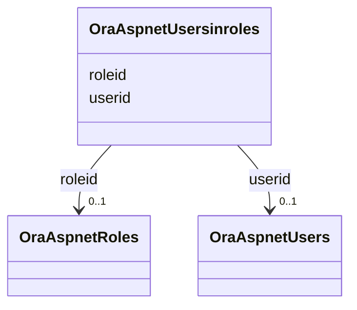

# Class: OraAspnetUsersinroles 


URI: [imgsg_dev:OraAspnetUsersinroles](https://w3id.org/jgi/imgsg_dev/OraAspnetUsersinroles)





<!-- no inheritance hierarchy -->


## Slots

| Name | Cardinality and Range | Description | Inheritance |
| ---  | --- | --- | --- |
| [userid](userid.md) | 0..1 <br/> [OraAspnetUsers](OraAspnetUsers.md) | Foreign key to ora_aspnet_users | direct |
| [roleid](roleid.md) | 0..1 <br/> [OraAspnetRoles](OraAspnetRoles.md) | Foreign key to ora_aspnet_roles | direct |


## Identifier and Mapping Information


### Schema Source


* from schema: https://w3id.org/jgi/imgsg_dev


## Mappings

| Mapping Type | Mapped Value |
| ---  | ---  |
| self | imgsg_dev:OraAspnetUsersinroles |
| native | imgsg_dev:OraAspnetUsersinroles |


## LinkML Source

<!-- TODO: investigate https://stackoverflow.com/questions/37606292/how-to-create-tabbed-code-blocks-in-mkdocs-or-sphinx -->

### Direct

<details>
```yaml
name: ora_aspnet_usersinroles
from_schema: https://w3id.org/jgi/imgsg_dev
attributes:
  userid:
    name: userid
    description: Foreign key to ora_aspnet_users
    from_schema: https://w3id.org/jgi/imgsg_dev
    domain_of:
    - ora_aspnet_membership
    - ora_aspnet_personaliznperuser
    - ora_aspnet_profile
    - ora_aspnet_users
    - ora_aspnet_usersinroles
    range: ora_aspnet_users
    required: false
  roleid:
    name: roleid
    description: Foreign key to ora_aspnet_roles
    from_schema: https://w3id.org/jgi/imgsg_dev
    domain_of:
    - ora_aspnet_roles
    - ora_aspnet_usersinroles
    range: ora_aspnet_roles
    required: false

```
</details>

### Induced

<details>
```yaml
name: ora_aspnet_usersinroles
from_schema: https://w3id.org/jgi/imgsg_dev
attributes:
  userid:
    name: userid
    description: Foreign key to ora_aspnet_users
    from_schema: https://w3id.org/jgi/imgsg_dev
    alias: userid
    owner: ora_aspnet_usersinroles
    domain_of:
    - ora_aspnet_membership
    - ora_aspnet_personaliznperuser
    - ora_aspnet_profile
    - ora_aspnet_users
    - ora_aspnet_usersinroles
    range: ora_aspnet_users
    required: false
  roleid:
    name: roleid
    description: Foreign key to ora_aspnet_roles
    from_schema: https://w3id.org/jgi/imgsg_dev
    alias: roleid
    owner: ora_aspnet_usersinroles
    domain_of:
    - ora_aspnet_roles
    - ora_aspnet_usersinroles
    range: ora_aspnet_roles
    required: false

```
</details>