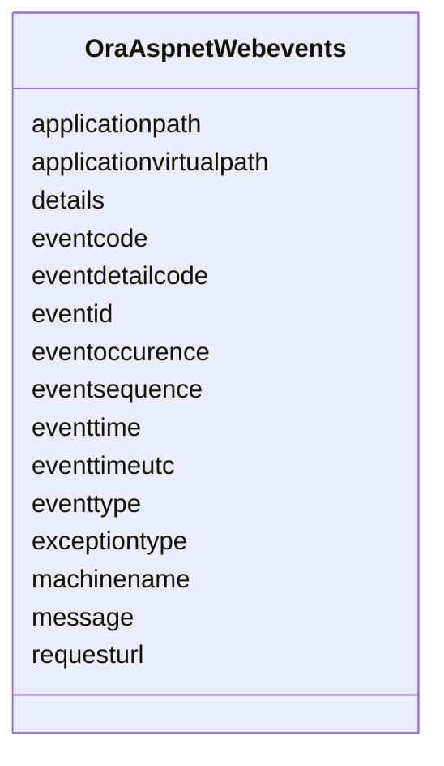

# Class: OraAspnetWebevents 


URI: [imgsg_dev:OraAspnetWebevents](https://w3id.org/jgi/imgsg_dev/OraAspnetWebevents)





<!-- no inheritance hierarchy -->


## Slots

| Name | Cardinality and Range | Description | Inheritance |
| ---  | --- | --- | --- |
| [eventid](eventid.md) | 0..1 <br/> [String](String.md) |  | direct |
| [eventtimeutc](eventtimeutc.md) | 0..1 <br/> [Datetime](Datetime.md) |  | direct |
| [eventtime](eventtime.md) | 0..1 <br/> [Datetime](Datetime.md) |  | direct |
| [eventtype](eventtype.md) | 0..1 <br/> [String](String.md) |  | direct |
| [eventsequence](eventsequence.md) | 0..1 <br/> [Integer](Integer.md) |  | direct |
| [eventoccurence](eventoccurence.md) | 0..1 <br/> [Integer](Integer.md) |  | direct |
| [eventcode](eventcode.md) | 0..1 <br/> [Integer](Integer.md) |  | direct |
| [eventdetailcode](eventdetailcode.md) | 0..1 <br/> [Integer](Integer.md) |  | direct |
| [message](message.md) | 0..1 <br/> [String](String.md) |  | direct |
| [applicationpath](applicationpath.md) | 0..1 <br/> [String](String.md) |  | direct |
| [applicationvirtualpath](applicationvirtualpath.md) | 0..1 <br/> [String](String.md) |  | direct |
| [machinename](machinename.md) | 0..1 <br/> [String](String.md) |  | direct |
| [requesturl](requesturl.md) | 0..1 <br/> [String](String.md) |  | direct |
| [exceptiontype](exceptiontype.md) | 0..1 <br/> [String](String.md) |  | direct |
| [details](details.md) | 0..1 <br/> [String](String.md) |  | direct |


## Identifier and Mapping Information


### Schema Source


* from schema: https://w3id.org/jgi/imgsg_dev


## Mappings

| Mapping Type | Mapped Value |
| ---  | ---  |
| self | imgsg_dev:OraAspnetWebevents |
| native | imgsg_dev:OraAspnetWebevents |


## LinkML Source

<!-- TODO: investigate https://stackoverflow.com/questions/37606292/how-to-create-tabbed-code-blocks-in-mkdocs-or-sphinx -->

### Direct

<details>
```yaml
name: ora_aspnet_webevents
from_schema: https://w3id.org/jgi/imgsg_dev
attributes:
  eventid:
    name: eventid
    from_schema: https://w3id.org/jgi/imgsg_dev
    rank: 1000
    domain_of:
    - ora_aspnet_webevents
    range: string
    required: false
  eventtimeutc:
    name: eventtimeutc
    from_schema: https://w3id.org/jgi/imgsg_dev
    rank: 1000
    domain_of:
    - ora_aspnet_webevents
    range: datetime
    required: false
  eventtime:
    name: eventtime
    from_schema: https://w3id.org/jgi/imgsg_dev
    rank: 1000
    domain_of:
    - ora_aspnet_webevents
    range: datetime
    required: false
  eventtype:
    name: eventtype
    from_schema: https://w3id.org/jgi/imgsg_dev
    rank: 1000
    domain_of:
    - ora_aspnet_webevents
    range: string
    required: false
  eventsequence:
    name: eventsequence
    from_schema: https://w3id.org/jgi/imgsg_dev
    rank: 1000
    domain_of:
    - ora_aspnet_webevents
    range: integer
    required: false
  eventoccurence:
    name: eventoccurence
    from_schema: https://w3id.org/jgi/imgsg_dev
    rank: 1000
    domain_of:
    - ora_aspnet_webevents
    range: integer
    required: false
  eventcode:
    name: eventcode
    from_schema: https://w3id.org/jgi/imgsg_dev
    rank: 1000
    domain_of:
    - ora_aspnet_webevents
    range: integer
    required: false
  eventdetailcode:
    name: eventdetailcode
    from_schema: https://w3id.org/jgi/imgsg_dev
    rank: 1000
    domain_of:
    - ora_aspnet_webevents
    range: integer
    required: false
  message:
    name: message
    from_schema: https://w3id.org/jgi/imgsg_dev
    rank: 1000
    domain_of:
    - ora_aspnet_webevents
    range: string
    required: false
  applicationpath:
    name: applicationpath
    from_schema: https://w3id.org/jgi/imgsg_dev
    rank: 1000
    domain_of:
    - ora_aspnet_webevents
    range: string
    required: false
  applicationvirtualpath:
    name: applicationvirtualpath
    from_schema: https://w3id.org/jgi/imgsg_dev
    rank: 1000
    domain_of:
    - ora_aspnet_webevents
    range: string
    required: false
  machinename:
    name: machinename
    from_schema: https://w3id.org/jgi/imgsg_dev
    rank: 1000
    domain_of:
    - ora_aspnet_webevents
    range: string
    required: false
  requesturl:
    name: requesturl
    from_schema: https://w3id.org/jgi/imgsg_dev
    rank: 1000
    domain_of:
    - ora_aspnet_webevents
    range: string
    required: false
  exceptiontype:
    name: exceptiontype
    from_schema: https://w3id.org/jgi/imgsg_dev
    rank: 1000
    domain_of:
    - ora_aspnet_webevents
    range: string
    required: false
  details:
    name: details
    from_schema: https://w3id.org/jgi/imgsg_dev
    rank: 1000
    domain_of:
    - ora_aspnet_webevents
    range: string
    required: false

```
</details>

### Induced

<details>
```yaml
name: ora_aspnet_webevents
from_schema: https://w3id.org/jgi/imgsg_dev
attributes:
  eventid:
    name: eventid
    from_schema: https://w3id.org/jgi/imgsg_dev
    rank: 1000
    alias: eventid
    owner: ora_aspnet_webevents
    domain_of:
    - ora_aspnet_webevents
    range: string
    required: false
  eventtimeutc:
    name: eventtimeutc
    from_schema: https://w3id.org/jgi/imgsg_dev
    rank: 1000
    alias: eventtimeutc
    owner: ora_aspnet_webevents
    domain_of:
    - ora_aspnet_webevents
    range: datetime
    required: false
  eventtime:
    name: eventtime
    from_schema: https://w3id.org/jgi/imgsg_dev
    rank: 1000
    alias: eventtime
    owner: ora_aspnet_webevents
    domain_of:
    - ora_aspnet_webevents
    range: datetime
    required: false
  eventtype:
    name: eventtype
    from_schema: https://w3id.org/jgi/imgsg_dev
    rank: 1000
    alias: eventtype
    owner: ora_aspnet_webevents
    domain_of:
    - ora_aspnet_webevents
    range: string
    required: false
  eventsequence:
    name: eventsequence
    from_schema: https://w3id.org/jgi/imgsg_dev
    rank: 1000
    alias: eventsequence
    owner: ora_aspnet_webevents
    domain_of:
    - ora_aspnet_webevents
    range: integer
    required: false
  eventoccurence:
    name: eventoccurence
    from_schema: https://w3id.org/jgi/imgsg_dev
    rank: 1000
    alias: eventoccurence
    owner: ora_aspnet_webevents
    domain_of:
    - ora_aspnet_webevents
    range: integer
    required: false
  eventcode:
    name: eventcode
    from_schema: https://w3id.org/jgi/imgsg_dev
    rank: 1000
    alias: eventcode
    owner: ora_aspnet_webevents
    domain_of:
    - ora_aspnet_webevents
    range: integer
    required: false
  eventdetailcode:
    name: eventdetailcode
    from_schema: https://w3id.org/jgi/imgsg_dev
    rank: 1000
    alias: eventdetailcode
    owner: ora_aspnet_webevents
    domain_of:
    - ora_aspnet_webevents
    range: integer
    required: false
  message:
    name: message
    from_schema: https://w3id.org/jgi/imgsg_dev
    rank: 1000
    alias: message
    owner: ora_aspnet_webevents
    domain_of:
    - ora_aspnet_webevents
    range: string
    required: false
  applicationpath:
    name: applicationpath
    from_schema: https://w3id.org/jgi/imgsg_dev
    rank: 1000
    alias: applicationpath
    owner: ora_aspnet_webevents
    domain_of:
    - ora_aspnet_webevents
    range: string
    required: false
  applicationvirtualpath:
    name: applicationvirtualpath
    from_schema: https://w3id.org/jgi/imgsg_dev
    rank: 1000
    alias: applicationvirtualpath
    owner: ora_aspnet_webevents
    domain_of:
    - ora_aspnet_webevents
    range: string
    required: false
  machinename:
    name: machinename
    from_schema: https://w3id.org/jgi/imgsg_dev
    rank: 1000
    alias: machinename
    owner: ora_aspnet_webevents
    domain_of:
    - ora_aspnet_webevents
    range: string
    required: false
  requesturl:
    name: requesturl
    from_schema: https://w3id.org/jgi/imgsg_dev
    rank: 1000
    alias: requesturl
    owner: ora_aspnet_webevents
    domain_of:
    - ora_aspnet_webevents
    range: string
    required: false
  exceptiontype:
    name: exceptiontype
    from_schema: https://w3id.org/jgi/imgsg_dev
    rank: 1000
    alias: exceptiontype
    owner: ora_aspnet_webevents
    domain_of:
    - ora_aspnet_webevents
    range: string
    required: false
  details:
    name: details
    from_schema: https://w3id.org/jgi/imgsg_dev
    rank: 1000
    alias: details
    owner: ora_aspnet_webevents
    domain_of:
    - ora_aspnet_webevents
    range: string
    required: false

```
</details>