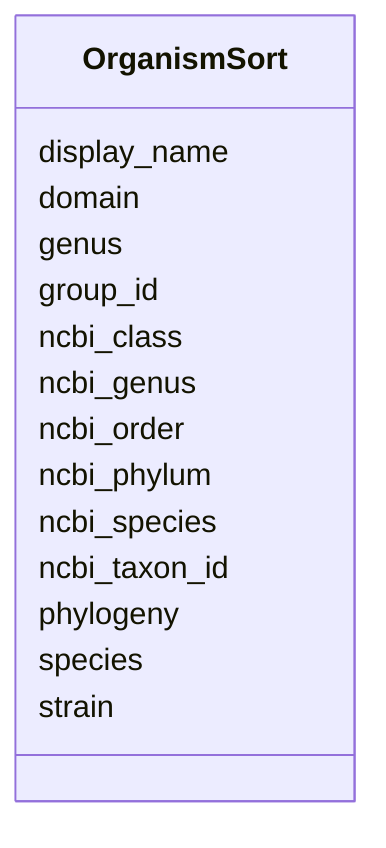

# Class: OrganismSort 


URI: [imgsg_dev:OrganismSort](https://w3id.org/jgi/imgsg_dev/OrganismSort)





<!-- no inheritance hierarchy -->


## Slots

| Name | Cardinality and Range | Description | Inheritance |
| ---  | --- | --- | --- |
| [display_name](display_name.md) | 0..1 <br/> [String](String.md) |  | direct |
| [ncbi_taxon_id](ncbi_taxon_id.md) | 0..1 <br/> [String](String.md) |  | direct |
| [strain](strain.md) | 0..1 <br/> [String](String.md) |  | direct |
| [genus](genus.md) | 0..1 <br/> [String](String.md) |  | direct |
| [species](species.md) | 0..1 <br/> [String](String.md) |  | direct |
| [domain](domain.md) | 0..1 <br/> [String](String.md) |  | direct |
| [phylogeny](phylogeny.md) | 0..1 <br/> [String](String.md) |  | direct |
| [ncbi_phylum](ncbi_phylum.md) | 0..1 <br/> [String](String.md) |  | direct |
| [ncbi_class](ncbi_class.md) | 0..1 <br/> [String](String.md) |  | direct |
| [ncbi_order](ncbi_order.md) | 0..1 <br/> [String](String.md) |  | direct |
| [ncbi_genus](ncbi_genus.md) | 0..1 <br/> [String](String.md) |  | direct |
| [ncbi_species](ncbi_species.md) | 0..1 <br/> [String](String.md) |  | direct |
| [group_id](group_id.md) | 0..1 <br/> [Integer](Integer.md) |  | direct |


## Identifier and Mapping Information


### Schema Source


* from schema: https://w3id.org/jgi/imgsg_dev


## Mappings

| Mapping Type | Mapped Value |
| ---  | ---  |
| self | imgsg_dev:OrganismSort |
| native | imgsg_dev:OrganismSort |


## LinkML Source

<!-- TODO: investigate https://stackoverflow.com/questions/37606292/how-to-create-tabbed-code-blocks-in-mkdocs-or-sphinx -->

### Direct

<details>
```yaml
name: organism_sort
from_schema: https://w3id.org/jgi/imgsg_dev
attributes:
  display_name:
    name: display_name
    from_schema: https://w3id.org/jgi/imgsg_dev
    domain_of:
    - genbank_refseq_crossover
    - gold_sequencing_project
    - organism_sort
    - pig_genbank_emailed_accs
    - pig_reruns
    - pig_retractions
    - pig_tracks
    - project_info
    - project_info_04112013
    range: string
    required: false
  ncbi_taxon_id:
    name: ncbi_taxon_id
    from_schema: https://w3id.org/jgi/imgsg_dev
    domain_of:
    - env_sample
    - genbank_refseq_crossover
    - gold_sequencing_project
    - organism_sort
    - project_info
    - project_info_04112013
    - project_info_bioproject
    range: string
    required: false
  strain:
    name: strain
    from_schema: https://w3id.org/jgi/imgsg_dev
    domain_of:
    - gold_analysis_project
    - gold_sequencing_project
    - organism_sort
    - project_info
    - project_info_04112013
    - project_info_biosample
    range: string
    required: false
  genus:
    name: genus
    from_schema: https://w3id.org/jgi/imgsg_dev
    domain_of:
    - gold_analysis_project
    - gold_sequencing_project
    - organism_sort
    - project_info
    - project_info_04112013
    range: string
    required: false
  species:
    name: species
    from_schema: https://w3id.org/jgi/imgsg_dev
    domain_of:
    - gold_analysis_project
    - gold_sequencing_project
    - organism_sort
    - project_info
    - project_info_04112013
    range: string
    required: false
  domain:
    name: domain
    from_schema: https://w3id.org/jgi/imgsg_dev
    domain_of:
    - gold_analysis_project
    - gold_sequencing_project
    - organism_sort
    - project_info
    - project_info_04112013
    - v5_ap_imperfect_view
    range: string
    required: false
  phylogeny:
    name: phylogeny
    from_schema: https://w3id.org/jgi/imgsg_dev
    domain_of:
    - gold_sequencing_project
    - organism_sort
    - project_info
    - project_info_04112013
    range: string
    required: false
  ncbi_phylum:
    name: ncbi_phylum
    from_schema: https://w3id.org/jgi/imgsg_dev
    domain_of:
    - gold_analysis_project
    - gold_sequencing_project
    - organism_sort
    - project_info
    - project_info_04112013
    - v5_ap_imperfect_view
    range: string
    required: false
  ncbi_class:
    name: ncbi_class
    from_schema: https://w3id.org/jgi/imgsg_dev
    domain_of:
    - gold_analysis_project
    - gold_sequencing_project
    - organism_sort
    - project_info
    - project_info_04112013
    - v5_ap_imperfect_view
    range: string
    required: false
  ncbi_order:
    name: ncbi_order
    from_schema: https://w3id.org/jgi/imgsg_dev
    domain_of:
    - gold_analysis_project
    - gold_sequencing_project
    - organism_sort
    - project_info
    - project_info_04112013
    - v5_ap_imperfect_view
    range: string
    required: false
  ncbi_genus:
    name: ncbi_genus
    from_schema: https://w3id.org/jgi/imgsg_dev
    domain_of:
    - gold_analysis_project
    - gold_sequencing_project
    - organism_sort
    - project_info
    - project_info_04112013
    - v5_ap_imperfect_view
    range: string
    required: false
  ncbi_species:
    name: ncbi_species
    from_schema: https://w3id.org/jgi/imgsg_dev
    domain_of:
    - gold_analysis_project
    - gold_sequencing_project
    - organism_sort
    - project_info
    - project_info_04112013
    - v5_ap_imperfect_view
    range: string
    required: false
  group_id:
    name: group_id
    from_schema: https://w3id.org/jgi/imgsg_dev
    domain_of:
    - contact_workspace_group
    - img_group
    - img_group_news
    - organism_sort
    - t_alex_test
    range: integer
    required: false

```
</details>

### Induced

<details>
```yaml
name: organism_sort
from_schema: https://w3id.org/jgi/imgsg_dev
attributes:
  display_name:
    name: display_name
    from_schema: https://w3id.org/jgi/imgsg_dev
    alias: display_name
    owner: organism_sort
    domain_of:
    - genbank_refseq_crossover
    - gold_sequencing_project
    - organism_sort
    - pig_genbank_emailed_accs
    - pig_reruns
    - pig_retractions
    - pig_tracks
    - project_info
    - project_info_04112013
    range: string
    required: false
  ncbi_taxon_id:
    name: ncbi_taxon_id
    from_schema: https://w3id.org/jgi/imgsg_dev
    alias: ncbi_taxon_id
    owner: organism_sort
    domain_of:
    - env_sample
    - genbank_refseq_crossover
    - gold_sequencing_project
    - organism_sort
    - project_info
    - project_info_04112013
    - project_info_bioproject
    range: string
    required: false
  strain:
    name: strain
    from_schema: https://w3id.org/jgi/imgsg_dev
    alias: strain
    owner: organism_sort
    domain_of:
    - gold_analysis_project
    - gold_sequencing_project
    - organism_sort
    - project_info
    - project_info_04112013
    - project_info_biosample
    range: string
    required: false
  genus:
    name: genus
    from_schema: https://w3id.org/jgi/imgsg_dev
    alias: genus
    owner: organism_sort
    domain_of:
    - gold_analysis_project
    - gold_sequencing_project
    - organism_sort
    - project_info
    - project_info_04112013
    range: string
    required: false
  species:
    name: species
    from_schema: https://w3id.org/jgi/imgsg_dev
    alias: species
    owner: organism_sort
    domain_of:
    - gold_analysis_project
    - gold_sequencing_project
    - organism_sort
    - project_info
    - project_info_04112013
    range: string
    required: false
  domain:
    name: domain
    from_schema: https://w3id.org/jgi/imgsg_dev
    alias: domain
    owner: organism_sort
    domain_of:
    - gold_analysis_project
    - gold_sequencing_project
    - organism_sort
    - project_info
    - project_info_04112013
    - v5_ap_imperfect_view
    range: string
    required: false
  phylogeny:
    name: phylogeny
    from_schema: https://w3id.org/jgi/imgsg_dev
    alias: phylogeny
    owner: organism_sort
    domain_of:
    - gold_sequencing_project
    - organism_sort
    - project_info
    - project_info_04112013
    range: string
    required: false
  ncbi_phylum:
    name: ncbi_phylum
    from_schema: https://w3id.org/jgi/imgsg_dev
    alias: ncbi_phylum
    owner: organism_sort
    domain_of:
    - gold_analysis_project
    - gold_sequencing_project
    - organism_sort
    - project_info
    - project_info_04112013
    - v5_ap_imperfect_view
    range: string
    required: false
  ncbi_class:
    name: ncbi_class
    from_schema: https://w3id.org/jgi/imgsg_dev
    alias: ncbi_class
    owner: organism_sort
    domain_of:
    - gold_analysis_project
    - gold_sequencing_project
    - organism_sort
    - project_info
    - project_info_04112013
    - v5_ap_imperfect_view
    range: string
    required: false
  ncbi_order:
    name: ncbi_order
    from_schema: https://w3id.org/jgi/imgsg_dev
    alias: ncbi_order
    owner: organism_sort
    domain_of:
    - gold_analysis_project
    - gold_sequencing_project
    - organism_sort
    - project_info
    - project_info_04112013
    - v5_ap_imperfect_view
    range: string
    required: false
  ncbi_genus:
    name: ncbi_genus
    from_schema: https://w3id.org/jgi/imgsg_dev
    alias: ncbi_genus
    owner: organism_sort
    domain_of:
    - gold_analysis_project
    - gold_sequencing_project
    - organism_sort
    - project_info
    - project_info_04112013
    - v5_ap_imperfect_view
    range: string
    required: false
  ncbi_species:
    name: ncbi_species
    from_schema: https://w3id.org/jgi/imgsg_dev
    alias: ncbi_species
    owner: organism_sort
    domain_of:
    - gold_analysis_project
    - gold_sequencing_project
    - organism_sort
    - project_info
    - project_info_04112013
    - v5_ap_imperfect_view
    range: string
    required: false
  group_id:
    name: group_id
    from_schema: https://w3id.org/jgi/imgsg_dev
    alias: group_id
    owner: organism_sort
    domain_of:
    - contact_workspace_group
    - img_group
    - img_group_news
    - organism_sort
    - t_alex_test
    range: integer
    required: false

```
</details>