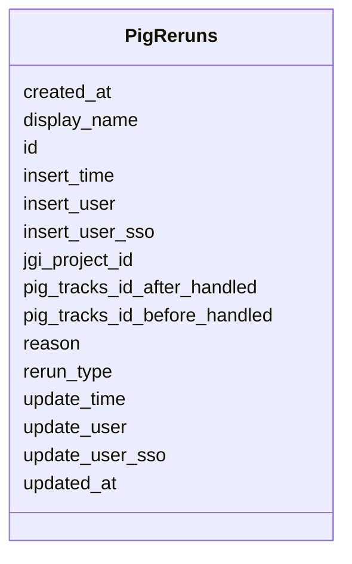

# Class: PigReruns 


URI: [imgsg_dev:PigReruns](https://w3id.org/jgi/imgsg_dev/PigReruns)





<!-- no inheritance hierarchy -->


## Slots

| Name | Cardinality and Range | Description | Inheritance |
| ---  | --- | --- | --- |
| [id](id.md) | 0..1 <br/> [Integer](Integer.md) |  | direct |
| [jgi_project_id](jgi_project_id.md) | 0..1 <br/> [Integer](Integer.md) |  | direct |
| [pig_tracks_id_before_handled](pig_tracks_id_before_handled.md) | 0..1 <br/> [Integer](Integer.md) |  | direct |
| [pig_tracks_id_after_handled](pig_tracks_id_after_handled.md) | 0..1 <br/> [Integer](Integer.md) |  | direct |
| [display_name](display_name.md) | 0..1 <br/> [String](String.md) |  | direct |
| [rerun_type](rerun_type.md) | 0..1 <br/> [String](String.md) |  | direct |
| [reason](reason.md) | 0..1 <br/> [String](String.md) |  | direct |
| [insert_user_sso](insert_user_sso.md) | 0..1 <br/> [String](String.md) |  | direct |
| [insert_user](insert_user.md) | 0..1 <br/> [String](String.md) |  | direct |
| [insert_time](insert_time.md) | 0..1 <br/> [Datetime](Datetime.md) |  | direct |
| [update_user_sso](update_user_sso.md) | 0..1 <br/> [String](String.md) |  | direct |
| [update_user](update_user.md) | 0..1 <br/> [String](String.md) |  | direct |
| [update_time](update_time.md) | 0..1 <br/> [Datetime](Datetime.md) |  | direct |
| [created_at](created_at.md) | 0..1 <br/> [Datetime](Datetime.md) |  | direct |
| [updated_at](updated_at.md) | 0..1 <br/> [Datetime](Datetime.md) |  | direct |


## Identifier and Mapping Information


### Schema Source


* from schema: https://w3id.org/jgi/imgsg_dev


## Mappings

| Mapping Type | Mapped Value |
| ---  | ---  |
| self | imgsg_dev:PigReruns |
| native | imgsg_dev:PigReruns |


## LinkML Source

<!-- TODO: investigate https://stackoverflow.com/questions/37606292/how-to-create-tabbed-code-blocks-in-mkdocs-or-sphinx -->

### Direct

<details>
```yaml
name: pig_reruns
from_schema: https://w3id.org/jgi/imgsg_dev
attributes:
  id:
    name: id
    from_schema: https://w3id.org/jgi/imgsg_dev
    domain_of:
    - dacc_logon
    - env_sample_data_links
    - gold_ap_genbank
    - master_list
    - oprop
    - ora_aspnet_personaliznperuser
    - ora_aspnet_sitemap
    - pig_genbank_emailed_accs
    - pig_reruns
    - pig_retractions
    - pig_tracks
    - plan_table
    - plan_table_20131114
    - project_info_data_links
    - project_info_data_links_112013
    - t_reddy_test
    - workflow_stats
    range: integer
    required: false
  jgi_project_id:
    name: jgi_project_id
    from_schema: https://w3id.org/jgi/imgsg_dev
    domain_of:
    - lanl_project
    - ornl_project
    - pig_reruns
    - pig_retractions
    - pig_tracks
    - project_info_bioproject
    - project_info_biosample
    - project_info_genbank
    - t_jgi_catalogue
    range: integer
    required: false
  pig_tracks_id_before_handled:
    name: pig_tracks_id_before_handled
    from_schema: https://w3id.org/jgi/imgsg_dev
    rank: 1000
    domain_of:
    - pig_reruns
    range: integer
    required: false
  pig_tracks_id_after_handled:
    name: pig_tracks_id_after_handled
    from_schema: https://w3id.org/jgi/imgsg_dev
    rank: 1000
    domain_of:
    - pig_reruns
    range: integer
    required: false
  display_name:
    name: display_name
    from_schema: https://w3id.org/jgi/imgsg_dev
    domain_of:
    - genbank_refseq_crossover
    - gold_sequencing_project
    - organism_sort
    - pig_genbank_emailed_accs
    - pig_reruns
    - pig_retractions
    - pig_tracks
    - project_info
    - project_info_04112013
    range: string
    required: false
  rerun_type:
    name: rerun_type
    from_schema: https://w3id.org/jgi/imgsg_dev
    rank: 1000
    domain_of:
    - pig_reruns
    range: string
    required: false
  reason:
    name: reason
    from_schema: https://w3id.org/jgi/imgsg_dev
    rank: 1000
    domain_of:
    - pig_reruns
    range: string
    required: false
  insert_user_sso:
    name: insert_user_sso
    from_schema: https://w3id.org/jgi/imgsg_dev
    domain_of:
    - pig_genbank_emailed_accs
    - pig_reruns
    - pig_retractions
    range: string
    required: false
  insert_user:
    name: insert_user
    from_schema: https://w3id.org/jgi/imgsg_dev
    domain_of:
    - pig_genbank_emailed_accs
    - pig_reruns
    - pig_retractions
    - pig_tracks
    - project_info_genbank
    range: string
    required: false
  insert_time:
    name: insert_time
    from_schema: https://w3id.org/jgi/imgsg_dev
    domain_of:
    - pig_genbank_emailed_accs
    - pig_reruns
    - pig_retractions
    - pig_tracks
    - project_info_genbank
    range: datetime
    required: false
  update_user_sso:
    name: update_user_sso
    from_schema: https://w3id.org/jgi/imgsg_dev
    domain_of:
    - pig_genbank_emailed_accs
    - pig_reruns
    - pig_retractions
    range: string
    required: false
  update_user:
    name: update_user
    from_schema: https://w3id.org/jgi/imgsg_dev
    domain_of:
    - pig_genbank_emailed_accs
    - pig_reruns
    - pig_retractions
    - pig_tracks
    - project_info_genbank
    range: string
    required: false
  update_time:
    name: update_time
    from_schema: https://w3id.org/jgi/imgsg_dev
    domain_of:
    - pig_genbank_emailed_accs
    - pig_reruns
    - pig_retractions
    - pig_tracks
    - project_info_genbank
    range: datetime
    required: false
  created_at:
    name: created_at
    from_schema: https://w3id.org/jgi/imgsg_dev
    domain_of:
    - pig_genbank_emailed_accs
    - pig_reruns
    - pig_retractions
    - pig_tracks
    range: datetime
    required: false
  updated_at:
    name: updated_at
    from_schema: https://w3id.org/jgi/imgsg_dev
    domain_of:
    - pig_genbank_emailed_accs
    - pig_reruns
    - pig_retractions
    - pig_tracks
    range: datetime
    required: false

```
</details>

### Induced

<details>
```yaml
name: pig_reruns
from_schema: https://w3id.org/jgi/imgsg_dev
attributes:
  id:
    name: id
    from_schema: https://w3id.org/jgi/imgsg_dev
    alias: id
    owner: pig_reruns
    domain_of:
    - dacc_logon
    - env_sample_data_links
    - gold_ap_genbank
    - master_list
    - oprop
    - ora_aspnet_personaliznperuser
    - ora_aspnet_sitemap
    - pig_genbank_emailed_accs
    - pig_reruns
    - pig_retractions
    - pig_tracks
    - plan_table
    - plan_table_20131114
    - project_info_data_links
    - project_info_data_links_112013
    - t_reddy_test
    - workflow_stats
    range: integer
    required: false
  jgi_project_id:
    name: jgi_project_id
    from_schema: https://w3id.org/jgi/imgsg_dev
    alias: jgi_project_id
    owner: pig_reruns
    domain_of:
    - lanl_project
    - ornl_project
    - pig_reruns
    - pig_retractions
    - pig_tracks
    - project_info_bioproject
    - project_info_biosample
    - project_info_genbank
    - t_jgi_catalogue
    range: integer
    required: false
  pig_tracks_id_before_handled:
    name: pig_tracks_id_before_handled
    from_schema: https://w3id.org/jgi/imgsg_dev
    rank: 1000
    alias: pig_tracks_id_before_handled
    owner: pig_reruns
    domain_of:
    - pig_reruns
    range: integer
    required: false
  pig_tracks_id_after_handled:
    name: pig_tracks_id_after_handled
    from_schema: https://w3id.org/jgi/imgsg_dev
    rank: 1000
    alias: pig_tracks_id_after_handled
    owner: pig_reruns
    domain_of:
    - pig_reruns
    range: integer
    required: false
  display_name:
    name: display_name
    from_schema: https://w3id.org/jgi/imgsg_dev
    alias: display_name
    owner: pig_reruns
    domain_of:
    - genbank_refseq_crossover
    - gold_sequencing_project
    - organism_sort
    - pig_genbank_emailed_accs
    - pig_reruns
    - pig_retractions
    - pig_tracks
    - project_info
    - project_info_04112013
    range: string
    required: false
  rerun_type:
    name: rerun_type
    from_schema: https://w3id.org/jgi/imgsg_dev
    rank: 1000
    alias: rerun_type
    owner: pig_reruns
    domain_of:
    - pig_reruns
    range: string
    required: false
  reason:
    name: reason
    from_schema: https://w3id.org/jgi/imgsg_dev
    rank: 1000
    alias: reason
    owner: pig_reruns
    domain_of:
    - pig_reruns
    range: string
    required: false
  insert_user_sso:
    name: insert_user_sso
    from_schema: https://w3id.org/jgi/imgsg_dev
    alias: insert_user_sso
    owner: pig_reruns
    domain_of:
    - pig_genbank_emailed_accs
    - pig_reruns
    - pig_retractions
    range: string
    required: false
  insert_user:
    name: insert_user
    from_schema: https://w3id.org/jgi/imgsg_dev
    alias: insert_user
    owner: pig_reruns
    domain_of:
    - pig_genbank_emailed_accs
    - pig_reruns
    - pig_retractions
    - pig_tracks
    - project_info_genbank
    range: string
    required: false
  insert_time:
    name: insert_time
    from_schema: https://w3id.org/jgi/imgsg_dev
    alias: insert_time
    owner: pig_reruns
    domain_of:
    - pig_genbank_emailed_accs
    - pig_reruns
    - pig_retractions
    - pig_tracks
    - project_info_genbank
    range: datetime
    required: false
  update_user_sso:
    name: update_user_sso
    from_schema: https://w3id.org/jgi/imgsg_dev
    alias: update_user_sso
    owner: pig_reruns
    domain_of:
    - pig_genbank_emailed_accs
    - pig_reruns
    - pig_retractions
    range: string
    required: false
  update_user:
    name: update_user
    from_schema: https://w3id.org/jgi/imgsg_dev
    alias: update_user
    owner: pig_reruns
    domain_of:
    - pig_genbank_emailed_accs
    - pig_reruns
    - pig_retractions
    - pig_tracks
    - project_info_genbank
    range: string
    required: false
  update_time:
    name: update_time
    from_schema: https://w3id.org/jgi/imgsg_dev
    alias: update_time
    owner: pig_reruns
    domain_of:
    - pig_genbank_emailed_accs
    - pig_reruns
    - pig_retractions
    - pig_tracks
    - project_info_genbank
    range: datetime
    required: false
  created_at:
    name: created_at
    from_schema: https://w3id.org/jgi/imgsg_dev
    alias: created_at
    owner: pig_reruns
    domain_of:
    - pig_genbank_emailed_accs
    - pig_reruns
    - pig_retractions
    - pig_tracks
    range: datetime
    required: false
  updated_at:
    name: updated_at
    from_schema: https://w3id.org/jgi/imgsg_dev
    alias: updated_at
    owner: pig_reruns
    domain_of:
    - pig_genbank_emailed_accs
    - pig_reruns
    - pig_retractions
    - pig_tracks
    range: datetime
    required: false

```
</details>