# Class: ProjectInfo 


URI: [imgsg_dev:ProjectInfo](https://w3id.org/jgi/imgsg_dev/ProjectInfo)

```mermaid
 classDiagram
    class ProjectInfo
    click ProjectInfo href "../ProjectInfo/"
      ProjectInfo : add_date
        
      ProjectInfo : additional_body_sample_site
        
      ProjectInfo : altitude
        
      ProjectInfo : annotator_comments
        
      ProjectInfo : assembly_accession
        
      ProjectInfo : assembly_method
        
      ProjectInfo : availability
        
      ProjectInfo : bei_status
        
      ProjectInfo : binning_method
        
      ProjectInfo : bioproject_accession
        
      ProjectInfo : bioproject_description
        
      ProjectInfo : bioproject_name
        
      ProjectInfo : bioproject_relevance
        
      ProjectInfo : bioproject_title
        
      ProjectInfo : biosafety_level
        
      ProjectInfo : biosample_accession
        
      ProjectInfo : biotic_rel
        
      ProjectInfo : body_product
        
      ProjectInfo : cell_diameter
        
      ProjectInfo : cell_length
        
      ProjectInfo : cell_shape
        
      ProjectInfo : chromosome_count
        
      ProjectInfo : clade
        
      ProjectInfo : color
        
      ProjectInfo : comments
        
      ProjectInfo : commercial
        
      ProjectInfo : commercial_comments
        
      ProjectInfo : common_name
        
      ProjectInfo : completion_date
        
      ProjectInfo : contact_email
        
      ProjectInfo : contact_name
        
      ProjectInfo : contact_oid
        
      ProjectInfo : contact_url
        
      ProjectInfo : contig_count
        
      ProjectInfo : coordinate_type
        
      ProjectInfo : culture_collection
        
      ProjectInfo : culture_type
        
      ProjectInfo : cultured
        
      ProjectInfo : current_finishing_status
        
      ProjectInfo : dacc_display
        
      ProjectInfo : depth
        
      ProjectInfo : display_name
        
      ProjectInfo : doi_id
        
      ProjectInfo : domain
        
      ProjectInfo : ecosystem
        
      ProjectInfo : ecosystem_category
        
      ProjectInfo : ecosystem_subtype
        
      ProjectInfo : ecosystem_type
        
      ProjectInfo : ecotype
        
      ProjectInfo : er_sample_id
        
      ProjectInfo : est_size
        
      ProjectInfo : exemplar_doi_id
        
      ProjectInfo : exemplar_name
        
      ProjectInfo : finishing_goal
        
      ProjectInfo : fk_study_id
        
          
    
        
        
        ProjectInfo --> "0..1" Study : fk_study_id
        click Study href "../Study/"
    

        
      ProjectInfo : funding_program
        
      ProjectInfo : gc_perc
        
      ProjectInfo : gcat_id
        
      ProjectInfo : genbank_low_quality_annotation
        
      ProjectInfo : genbank_low_quality_genome
        
      ProjectInfo : gene_calling_method
        
      ProjectInfo : gene_count
        
      ProjectInfo : genome_count
        
      ProjectInfo : genus
        
      ProjectInfo : genus_synonyms
        
      ProjectInfo : geo_location
        
      ProjectInfo : gold_id_old
        
      ProjectInfo : gold_stamp_id
        
      ProjectInfo : goldv5_project_id
        
      ProjectInfo : gpts_bioclassification_name
        
      ProjectInfo : gpts_comments
        
      ProjectInfo : gpts_embargo_days
        
      ProjectInfo : gpts_embargo_start_date
        
      ProjectInfo : gpts_last_mod_date
        
      ProjectInfo : gpts_ncbi_scientific_name
        
      ProjectInfo : gpts_public_release_date
        
      ProjectInfo : gram_stain
        
      ProjectInfo : greengenes_id
        
      ProjectInfo : growth_conditions
        
      ProjectInfo : habitat_category
        
      ProjectInfo : hmp_date_dna_received
        
      ProjectInfo : hmp_dna_received
        
      ProjectInfo : hmp_draft_seq_completion_date
        
      ProjectInfo : hmp_id
        
      ProjectInfo : hmp_iso_avail_comments
        
      ProjectInfo : hmp_iso_comments
        
      ProjectInfo : hmp_isolate_selection_source
        
      ProjectInfo : hmp_isolation_bodysite
        
      ProjectInfo : hmp_isolation_bodysubsite
        
      ProjectInfo : hmp_project_comments
        
      ProjectInfo : hmp_project_status
        
      ProjectInfo : hmp_seq_begin_date
        
      ProjectInfo : homd_id
        
      ProjectInfo : host_age
        
      ProjectInfo : host_comments
        
      ProjectInfo : host_gender
        
      ProjectInfo : host_health
        
      ProjectInfo : host_medication
        
      ProjectInfo : host_name
        
      ProjectInfo : host_race
        
      ProjectInfo : host_spec
        
      ProjectInfo : host_taxon_id
        
      ProjectInfo : id_16s
        
      ProjectInfo : image_url
        
      ProjectInfo : img_contact
        
      ProjectInfo : img_exp_oid
        
      ProjectInfo : img_oid
        
      ProjectInfo : information_name
        
      ProjectInfo : information_url
        
      ProjectInfo : iso_comments
        
      ProjectInfo : iso_country
        
      ProjectInfo : iso_method
        
      ProjectInfo : iso_pubmed_id
        
      ProjectInfo : iso_source
        
      ProjectInfo : iso_year
        
      ProjectInfo : isolate_selected
        
      ProjectInfo : isolation
        
      ProjectInfo : its_proposal_id
        
      ProjectInfo : its_spid
        
      ProjectInfo : its_spid_old
        
      ProjectInfo : jgi_dir_number
        
      ProjectInfo : jgi_final_deliverable
        
      ProjectInfo : jgi_funding_program
        
      ProjectInfo : jgi_funding_year
        
      ProjectInfo : jgi_product_name
        
      ProjectInfo : jgi_project_type
        
      ProjectInfo : jgi_proposal_id
        
      ProjectInfo : jgi_sequencing_goal
        
      ProjectInfo : jgi_status
        
      ProjectInfo : jgi_visibility
        
      ProjectInfo : known_non_hosts
        
      ProjectInfo : latitude
        
      ProjectInfo : legacy_gold_id
        
      ProjectInfo : library_method
        
      ProjectInfo : loc_coord
        
      ProjectInfo : locus_tag
        
      ProjectInfo : longhurst_code
        
      ProjectInfo : longhurst_description
        
      ProjectInfo : longitude
        
      ProjectInfo : map_link_url
        
      ProjectInfo : mod_date
        
      ProjectInfo : modified_by
        
      ProjectInfo : motility
        
      ProjectInfo : ncbi_archive_id
        
      ProjectInfo : ncbi_class
        
      ProjectInfo : ncbi_family
        
      ProjectInfo : ncbi_genus
        
      ProjectInfo : ncbi_order
        
      ProjectInfo : ncbi_phylum
        
      ProjectInfo : ncbi_project_id
        
      ProjectInfo : ncbi_project_name
        
      ProjectInfo : ncbi_species
        
      ProjectInfo : ncbi_submit_status
        
      ProjectInfo : ncbi_superkingdom
        
      ProjectInfo : ncbi_taxon_id
        
      ProjectInfo : no_of_reads
        
      ProjectInfo : nucleic_acid_type
        
      ProjectInfo : organism_comments
        
      ProjectInfo : organism_type
        
      ProjectInfo : other_hosts
        
      ProjectInfo : otu
        
      ProjectInfo : oxygen_req
        
      ProjectInfo : ph
        
      ProjectInfo : phase
        
      ProjectInfo : phase_status
        
      ProjectInfo : phylogeny
        
      ProjectInfo : plasmid_count
        
      ProjectInfo : pmid
        
      ProjectInfo : pmo_project_id
        
      ProjectInfo : pressure
        
      ProjectInfo : proj_desc
        
      ProjectInfo : project_comments
        
      ProjectInfo : project_goal
        
      ProjectInfo : project_oid
        
      ProjectInfo : project_status
        
      ProjectInfo : project_type
        
      ProjectInfo : project_web_page
        
      ProjectInfo : proposal_name
        
      ProjectInfo : proteomics_data
        
      ProjectInfo : proteomics_link_url
        
      ProjectInfo : pub_journal
        
      ProjectInfo : pub_link
        
      ProjectInfo : pub_vol
        
      ProjectInfo : publication_date
        
      ProjectInfo : refseq_ids
        
      ProjectInfo : refseq_link_url
        
      ProjectInfo : related_project_oid
        
      ProjectInfo : reviewed
        
      ProjectInfo : salinity
        
      ProjectInfo : sample_oid
        
      ProjectInfo : scaffold_count
        
      ProjectInfo : scientific_program
        
      ProjectInfo : scope_of_work
        
      ProjectInfo : seq_center_proj_id
        
      ProjectInfo : seq_country
        
      ProjectInfo : seq_depth
        
      ProjectInfo : seq_quality
        
      ProjectInfo : seq_status
        
      ProjectInfo : seq_status_link
        
      ProjectInfo : serovar
        
      ProjectInfo : short_read_archive_id
        
      ProjectInfo : show_in_dacc
        
      ProjectInfo : show_in_gold
        
      ProjectInfo : singlet_count
        
      ProjectInfo : species
        
      ProjectInfo : species_synonyms
        
      ProjectInfo : specific_ecosystem
        
      ProjectInfo : sporulation
        
      ProjectInfo : strain
        
      ProjectInfo : strain_habitat
        
      ProjectInfo : strain_info_id
        
      ProjectInfo : submitters_project_name
        
      ProjectInfo : subspecies
        
      ProjectInfo : symbiont
        
      ProjectInfo : symbiont_taxon_id
        
      ProjectInfo : symbiotic_interaction
        
      ProjectInfo : symbiotic_rel
        
      ProjectInfo : taxon_doi_id
        
      ProjectInfo : temp_optimum
        
      ProjectInfo : temp_range
        
      ProjectInfo : transcriptomics_data
        
      ProjectInfo : transcriptomics_link_url
        
      ProjectInfo : type_strain
        
      ProjectInfo : uncultured_type
        
      ProjectInfo : units
        
      ProjectInfo : vector
        
      ProjectInfo : viral_group
        
      ProjectInfo : viral_subgroup
        
      ProjectInfo : web_page_code
        
      ProjectInfo : wiki_link_url
        
      
```





<!-- no inheritance hierarchy -->


## Slots

| Name | Cardinality and Range | Description | Inheritance |
| ---  | --- | --- | --- |
| [project_oid](project_oid.md) | 0..1 <br/> [Integer](Integer.md) |  | direct |
| [gold_stamp_id](gold_stamp_id.md) | 0..1 <br/> [String](String.md) |  | direct |
| [gold_id_old](gold_id_old.md) | 0..1 <br/> [String](String.md) |  | direct |
| [display_name](display_name.md) | 0..1 <br/> [String](String.md) |  | direct |
| [common_name](common_name.md) | 0..1 <br/> [String](String.md) |  | direct |
| [genus](genus.md) | 0..1 <br/> [String](String.md) |  | direct |
| [genus_synonyms](genus_synonyms.md) | 0..1 <br/> [String](String.md) |  | direct |
| [species](species.md) | 0..1 <br/> [String](String.md) |  | direct |
| [species_synonyms](species_synonyms.md) | 0..1 <br/> [String](String.md) |  | direct |
| [strain](strain.md) | 0..1 <br/> [String](String.md) |  | direct |
| [serovar](serovar.md) | 0..1 <br/> [String](String.md) |  | direct |
| [phylogeny](phylogeny.md) | 0..1 <br/> [String](String.md) |  | direct |
| [ncbi_taxon_id](ncbi_taxon_id.md) | 0..1 <br/> [String](String.md) |  | direct |
| [ncbi_superkingdom](ncbi_superkingdom.md) | 0..1 <br/> [String](String.md) |  | direct |
| [domain](domain.md) | 0..1 <br/> [String](String.md) |  | direct |
| [ncbi_phylum](ncbi_phylum.md) | 0..1 <br/> [String](String.md) |  | direct |
| [ncbi_class](ncbi_class.md) | 0..1 <br/> [String](String.md) |  | direct |
| [ncbi_order](ncbi_order.md) | 0..1 <br/> [String](String.md) |  | direct |
| [ncbi_family](ncbi_family.md) | 0..1 <br/> [String](String.md) |  | direct |
| [ncbi_genus](ncbi_genus.md) | 0..1 <br/> [String](String.md) |  | direct |
| [ncbi_species](ncbi_species.md) | 0..1 <br/> [String](String.md) |  | direct |
| [culture_collection](culture_collection.md) | 0..1 <br/> [String](String.md) |  | direct |
| [ncbi_project_id](ncbi_project_id.md) | 0..1 <br/> [Integer](Integer.md) |  | direct |
| [symbiont](symbiont.md) | 0..1 <br/> [String](String.md) |  | direct |
| [symbiont_taxon_id](symbiont_taxon_id.md) | 0..1 <br/> [Integer](Integer.md) |  | direct |
| [isolation](isolation.md) | 0..1 <br/> [String](String.md) |  | direct |
| [oxygen_req](oxygen_req.md) | 0..1 <br/> [String](String.md) |  | direct |
| [cell_shape](cell_shape.md) | 0..1 <br/> [String](String.md) |  | direct |
| [motility](motility.md) | 0..1 <br/> [String](String.md) |  | direct |
| [sporulation](sporulation.md) | 0..1 <br/> [String](String.md) |  | direct |
| [temp_range](temp_range.md) | 0..1 <br/> [String](String.md) |  | direct |
| [temp_optimum](temp_optimum.md) | 0..1 <br/> [String](String.md) |  | direct |
| [salinity](salinity.md) | 0..1 <br/> [String](String.md) |  | direct |
| [pressure](pressure.md) | 0..1 <br/> [String](String.md) |  | direct |
| [ph](ph.md) | 0..1 <br/> [String](String.md) |  | direct |
| [comments](comments.md) | 0..1 <br/> [String](String.md) |  | direct |
| [project_web_page](project_web_page.md) | 0..1 <br/> [String](String.md) |  | direct |
| [project_type](project_type.md) | 0..1 <br/> [String](String.md) |  | direct |
| [seq_country](seq_country.md) | 0..1 <br/> [String](String.md) |  | direct |
| [seq_status](seq_status.md) | 0..1 <br/> [String](String.md) |  | direct |
| [seq_status_link](seq_status_link.md) | 0..1 <br/> [String](String.md) |  | direct |
| [project_status](project_status.md) | 0..1 <br/> [String](String.md) |  | direct |
| [library_method](library_method.md) | 0..1 <br/> [String](String.md) |  | direct |
| [binning_method](binning_method.md) | 0..1 <br/> [String](String.md) |  | direct |
| [assembly_method](assembly_method.md) | 0..1 <br/> [String](String.md) |  | direct |
| [seq_depth](seq_depth.md) | 0..1 <br/> [String](String.md) |  | direct |
| [gene_calling_method](gene_calling_method.md) | 0..1 <br/> [String](String.md) |  | direct |
| [contig_count](contig_count.md) | 0..1 <br/> [Integer](Integer.md) |  | direct |
| [est_size](est_size.md) | 0..1 <br/> [Integer](Integer.md) |  | direct |
| [units](units.md) | 0..1 <br/> [String](String.md) |  | direct |
| [gene_count](gene_count.md) | 0..1 <br/> [Integer](Integer.md) |  | direct |
| [gc_perc](gc_perc.md) | 0..1 <br/> [Float](Float.md) |  | direct |
| [chromosome_count](chromosome_count.md) | 0..1 <br/> [Integer](Integer.md) |  | direct |
| [plasmid_count](plasmid_count.md) | 0..1 <br/> [Integer](Integer.md) |  | direct |
| [singlet_count](singlet_count.md) | 0..1 <br/> [Integer](Integer.md) |  | direct |
| [completion_date](completion_date.md) | 0..1 <br/> [Datetime](Datetime.md) |  | direct |
| [contact_name](contact_name.md) | 0..1 <br/> [String](String.md) |  | direct |
| [contact_email](contact_email.md) | 0..1 <br/> [String](String.md) |  | direct |
| [contact_url](contact_url.md) | 0..1 <br/> [String](String.md) |  | direct |
| [img_oid](img_oid.md) | 0..1 <br/> [Integer](Integer.md) |  | direct |
| [gcat_id](gcat_id.md) | 0..1 <br/> [String](String.md) |  | direct |
| [greengenes_id](greengenes_id.md) | 0..1 <br/> [String](String.md) |  | direct |
| [strain_info_id](strain_info_id.md) | 0..1 <br/> [Integer](Integer.md) |  | direct |
| [refseq_ids](refseq_ids.md) | 0..1 <br/> [String](String.md) |  | direct |
| [refseq_link_url](refseq_link_url.md) | 0..1 <br/> [String](String.md) |  | direct |
| [map_link_url](map_link_url.md) | 0..1 <br/> [String](String.md) |  | direct |
| [wiki_link_url](wiki_link_url.md) | 0..1 <br/> [String](String.md) |  | direct |
| [information_name](information_name.md) | 0..1 <br/> [String](String.md) |  | direct |
| [information_url](information_url.md) | 0..1 <br/> [String](String.md) |  | direct |
| [add_date](add_date.md) | 0..1 <br/> [Datetime](Datetime.md) |  | direct |
| [mod_date](mod_date.md) | 0..1 <br/> [Datetime](Datetime.md) |  | direct |
| [modified_by](modified_by.md) | 0..1 <br/> [Integer](Integer.md) |  | direct |
| [availability](availability.md) | 0..1 <br/> [String](String.md) |  | direct |
| [contact_oid](contact_oid.md) | 0..1 <br/> [Integer](Integer.md) |  | direct |
| [genome_count](genome_count.md) | 0..1 <br/> [Integer](Integer.md) |  | direct |
| [web_page_code](web_page_code.md) | 0..1 <br/> [Integer](Integer.md) |  | direct |
| [pub_journal](pub_journal.md) | 0..1 <br/> [String](String.md) |  | direct |
| [pub_vol](pub_vol.md) | 0..1 <br/> [String](String.md) |  | direct |
| [pub_link](pub_link.md) | 0..1 <br/> [String](String.md) |  | direct |
| [iso_year](iso_year.md) | 0..1 <br/> [String](String.md) |  | direct |
| [iso_country](iso_country.md) | 0..1 <br/> [String](String.md) |  | direct |
| [geo_location](geo_location.md) | 0..1 <br/> [String](String.md) |  | direct |
| [loc_coord](loc_coord.md) | 0..1 <br/> [String](String.md) |  | direct |
| [cell_diameter](cell_diameter.md) | 0..1 <br/> [String](String.md) |  | direct |
| [cell_length](cell_length.md) | 0..1 <br/> [String](String.md) |  | direct |
| [color](color.md) | 0..1 <br/> [String](String.md) |  | direct |
| [ncbi_project_name](ncbi_project_name.md) | 0..1 <br/> [String](String.md) |  | direct |
| [latitude](latitude.md) | 0..1 <br/> [String](String.md) |  | direct |
| [longitude](longitude.md) | 0..1 <br/> [String](String.md) |  | direct |
| [altitude](altitude.md) | 0..1 <br/> [String](String.md) |  | direct |
| [gram_stain](gram_stain.md) | 0..1 <br/> [String](String.md) |  | direct |
| [host_name](host_name.md) | 0..1 <br/> [String](String.md) |  | direct |
| [host_taxon_id](host_taxon_id.md) | 0..1 <br/> [Integer](Integer.md) |  | direct |
| [host_gender](host_gender.md) | 0..1 <br/> [String](String.md) |  | direct |
| [host_age](host_age.md) | 0..1 <br/> [String](String.md) |  | direct |
| [host_health](host_health.md) | 0..1 <br/> [String](String.md) |  | direct |
| [biotic_rel](biotic_rel.md) | 0..1 <br/> [String](String.md) |  | direct |
| [symbiotic_interaction](symbiotic_interaction.md) | 0..1 <br/> [String](String.md) |  | direct |
| [symbiotic_rel](symbiotic_rel.md) | 0..1 <br/> [String](String.md) |  | direct |
| [ncbi_archive_id](ncbi_archive_id.md) | 0..1 <br/> [Integer](Integer.md) |  | direct |
| [iso_pubmed_id](iso_pubmed_id.md) | 0..1 <br/> [Integer](Integer.md) |  | direct |
| [depth](depth.md) | 0..1 <br/> [String](String.md) |  | direct |
| [vector](vector.md) | 0..1 <br/> [String](String.md) |  | direct |
| [host_spec](host_spec.md) | 0..1 <br/> [Integer](Integer.md) |  | direct |
| [iso_comments](iso_comments.md) | 0..1 <br/> [String](String.md) |  | direct |
| [iso_source](iso_source.md) | 0..1 <br/> [String](String.md) |  | direct |
| [habitat_category](habitat_category.md) | 0..1 <br/> [String](String.md) |  | direct |
| [host_race](host_race.md) | 0..1 <br/> [String](String.md) |  | direct |
| [hmp_isolation_bodysite](hmp_isolation_bodysite.md) | 0..1 <br/> [String](String.md) |  | direct |
| [hmp_isolation_bodysubsite](hmp_isolation_bodysubsite.md) | 0..1 <br/> [String](String.md) |  | direct |
| [host_comments](host_comments.md) | 0..1 <br/> [String](String.md) |  | direct |
| [hmp_id](hmp_id.md) | 0..1 <br/> [Integer](Integer.md) |  | direct |
| [ncbi_submit_status](ncbi_submit_status.md) | 0..1 <br/> [String](String.md) |  | direct |
| [locus_tag](locus_tag.md) | 0..1 <br/> [String](String.md) |  | direct |
| [funding_program](funding_program.md) | 0..1 <br/> [String](String.md) |  | direct |
| [short_read_archive_id](short_read_archive_id.md) | 0..1 <br/> [String](String.md) |  | direct |
| [seq_quality](seq_quality.md) | 0..1 <br/> [String](String.md) |  | direct |
| [type_strain](type_strain.md) | 0..1 <br/> [String](String.md) |  | direct |
| [homd_id](homd_id.md) | 0..1 <br/> [String](String.md) |  | direct |
| [host_medication](host_medication.md) | 0..1 <br/> [String](String.md) |  | direct |
| [proj_desc](proj_desc.md) | 0..1 <br/> [String](String.md) |  | direct |
| [otu](otu.md) | 0..1 <br/> [Integer](Integer.md) |  | direct |
| [no_of_reads](no_of_reads.md) | 0..1 <br/> [String](String.md) |  | direct |
| [additional_body_sample_site](additional_body_sample_site.md) | 0..1 <br/> [String](String.md) |  | direct |
| [project_goal](project_goal.md) | 0..1 <br/> [String](String.md) |  | direct |
| [bei_status](bei_status.md) | 0..1 <br/> [String](String.md) |  | direct |
| [biosafety_level](biosafety_level.md) | 0..1 <br/> [Integer](Integer.md) |  | direct |
| [isolate_selected](isolate_selected.md) | 0..1 <br/> [String](String.md) |  | direct |
| [hmp_iso_comments](hmp_iso_comments.md) | 0..1 <br/> [String](String.md) |  | direct |
| [hmp_iso_avail_comments](hmp_iso_avail_comments.md) | 0..1 <br/> [String](String.md) |  | direct |
| [hmp_project_comments](hmp_project_comments.md) | 0..1 <br/> [String](String.md) |  | direct |
| [hmp_dna_received](hmp_dna_received.md) | 0..1 <br/> [String](String.md) |  | direct |
| [hmp_date_dna_received](hmp_date_dna_received.md) | 0..1 <br/> [Datetime](Datetime.md) |  | direct |
| [hmp_project_status](hmp_project_status.md) | 0..1 <br/> [String](String.md) |  | direct |
| [body_product](body_product.md) | 0..1 <br/> [String](String.md) |  | direct |
| [hmp_seq_begin_date](hmp_seq_begin_date.md) | 0..1 <br/> [Datetime](Datetime.md) |  | direct |
| [hmp_draft_seq_completion_date](hmp_draft_seq_completion_date.md) | 0..1 <br/> [Datetime](Datetime.md) |  | direct |
| [proteomics_data](proteomics_data.md) | 0..1 <br/> [String](String.md) |  | direct |
| [proteomics_link_url](proteomics_link_url.md) | 0..1 <br/> [String](String.md) |  | direct |
| [transcriptomics_data](transcriptomics_data.md) | 0..1 <br/> [String](String.md) |  | direct |
| [transcriptomics_link_url](transcriptomics_link_url.md) | 0..1 <br/> [String](String.md) |  | direct |
| [organism_comments](organism_comments.md) | 0..1 <br/> [String](String.md) |  | direct |
| [iso_method](iso_method.md) | 0..1 <br/> [String](String.md) |  | direct |
| [id_16s](id_16s.md) | 0..1 <br/> [String](String.md) |  | direct |
| [show_in_dacc](show_in_dacc.md) | 0..1 <br/> [String](String.md) |  | direct |
| [hmp_isolate_selection_source](hmp_isolate_selection_source.md) | 0..1 <br/> [String](String.md) |  | direct |
| [ecosystem](ecosystem.md) | 0..1 <br/> [String](String.md) |  | direct |
| [ecosystem_category](ecosystem_category.md) | 0..1 <br/> [String](String.md) |  | direct |
| [ecosystem_type](ecosystem_type.md) | 0..1 <br/> [String](String.md) |  | direct |
| [ecosystem_subtype](ecosystem_subtype.md) | 0..1 <br/> [String](String.md) |  | direct |
| [specific_ecosystem](specific_ecosystem.md) | 0..1 <br/> [String](String.md) |  | direct |
| [image_url](image_url.md) | 0..1 <br/> [String](String.md) |  | direct |
| [submitters_project_name](submitters_project_name.md) | 0..1 <br/> [String](String.md) |  | direct |
| [seq_center_proj_id](seq_center_proj_id.md) | 0..1 <br/> [Integer](Integer.md) |  | direct |
| [proposal_name](proposal_name.md) | 0..1 <br/> [String](String.md) |  | direct |
| [dacc_display](dacc_display.md) | 0..1 <br/> [String](String.md) |  | direct |
| [pmid](pmid.md) | 0..1 <br/> [Integer](Integer.md) |  | direct |
| [doi_id](doi_id.md) | 0..1 <br/> [String](String.md) |  | direct |
| [publication_date](publication_date.md) | 0..1 <br/> [Datetime](Datetime.md) |  | direct |
| [sample_oid](sample_oid.md) | 0..1 <br/> [Integer](Integer.md) |  | direct |
| [finishing_goal](finishing_goal.md) | 0..1 <br/> [String](String.md) |  | direct |
| [current_finishing_status](current_finishing_status.md) | 0..1 <br/> [String](String.md) |  | direct |
| [scope_of_work](scope_of_work.md) | 0..1 <br/> [String](String.md) |  | direct |
| [bioproject_relevance](bioproject_relevance.md) | 0..1 <br/> [String](String.md) |  | direct |
| [pmo_project_id](pmo_project_id.md) | 0..1 <br/> [Integer](Integer.md) |  | direct |
| [img_contact](img_contact.md) | 0..1 <br/> [String](String.md) |  | direct |
| [jgi_proposal_id](jgi_proposal_id.md) | 0..1 <br/> [Integer](Integer.md) |  | direct |
| [scientific_program](scientific_program.md) | 0..1 <br/> [String](String.md) |  | direct |
| [jgi_project_type](jgi_project_type.md) | 0..1 <br/> [String](String.md) |  | direct |
| [jgi_status](jgi_status.md) | 0..1 <br/> [String](String.md) |  | direct |
| [gpts_comments](gpts_comments.md) | 0..1 <br/> [String](String.md) |  | direct |
| [gpts_last_mod_date](gpts_last_mod_date.md) | 0..1 <br/> [Datetime](Datetime.md) |  | direct |
| [jgi_funding_program](jgi_funding_program.md) | 0..1 <br/> [String](String.md) |  | direct |
| [jgi_dir_number](jgi_dir_number.md) | 0..1 <br/> [Integer](Integer.md) |  | direct |
| [jgi_visibility](jgi_visibility.md) | 0..1 <br/> [String](String.md) |  | direct |
| [growth_conditions](growth_conditions.md) | 0..1 <br/> [String](String.md) |  | direct |
| [coordinate_type](coordinate_type.md) | 0..1 <br/> [String](String.md) |  | direct |
| [jgi_final_deliverable](jgi_final_deliverable.md) | 0..1 <br/> [String](String.md) |  | direct |
| [jgi_product_name](jgi_product_name.md) | 0..1 <br/> [String](String.md) |  | direct |
| [jgi_funding_year](jgi_funding_year.md) | 0..1 <br/> [Integer](Integer.md) |  | direct |
| [jgi_sequencing_goal](jgi_sequencing_goal.md) | 0..1 <br/> [String](String.md) |  | direct |
| [reviewed](reviewed.md) | 0..1 <br/> [String](String.md) |  | direct |
| [organism_type](organism_type.md) | 0..1 <br/> [String](String.md) |  | direct |
| [cultured](cultured.md) | 0..1 <br/> [String](String.md) |  | direct |
| [uncultured_type](uncultured_type.md) | 0..1 <br/> [String](String.md) |  | direct |
| [nucleic_acid_type](nucleic_acid_type.md) | 0..1 <br/> [String](String.md) |  | direct |
| [culture_type](culture_type.md) | 0..1 <br/> [String](String.md) |  | direct |
| [gpts_ncbi_scientific_name](gpts_ncbi_scientific_name.md) | 0..1 <br/> [String](String.md) |  | direct |
| [gpts_bioclassification_name](gpts_bioclassification_name.md) | 0..1 <br/> [String](String.md) |  | direct |
| [scaffold_count](scaffold_count.md) | 0..1 <br/> [Integer](Integer.md) |  | direct |
| [bioproject_accession](bioproject_accession.md) | 0..1 <br/> [String](String.md) |  | direct |
| [show_in_gold](show_in_gold.md) | 0..1 <br/> [String](String.md) |  | direct |
| [gpts_embargo_start_date](gpts_embargo_start_date.md) | 0..1 <br/> [Datetime](Datetime.md) |  | direct |
| [gpts_embargo_days](gpts_embargo_days.md) | 0..1 <br/> [Integer](Integer.md) |  | direct |
| [gpts_public_release_date](gpts_public_release_date.md) | 0..1 <br/> [Datetime](Datetime.md) |  | direct |
| [phase](phase.md) | 0..1 <br/> [String](String.md) |  | direct |
| [phase_status](phase_status.md) | 0..1 <br/> [String](String.md) |  | direct |
| [related_project_oid](related_project_oid.md) | 0..1 <br/> [Integer](Integer.md) |  | direct |
| [its_spid](its_spid.md) | 0..1 <br/> [Integer](Integer.md) |  | direct |
| [bioproject_description](bioproject_description.md) | 0..1 <br/> [String](String.md) |  | direct |
| [bioproject_name](bioproject_name.md) | 0..1 <br/> [String](String.md) |  | direct |
| [bioproject_title](bioproject_title.md) | 0..1 <br/> [String](String.md) |  | direct |
| [its_proposal_id](its_proposal_id.md) | 0..1 <br/> [Integer](Integer.md) |  | direct |
| [other_hosts](other_hosts.md) | 0..1 <br/> [String](String.md) |  | direct |
| [known_non_hosts](known_non_hosts.md) | 0..1 <br/> [String](String.md) |  | direct |
| [commercial_comments](commercial_comments.md) | 0..1 <br/> [String](String.md) |  | direct |
| [commercial](commercial.md) | 0..1 <br/> [String](String.md) |  | direct |
| [taxon_doi_id](taxon_doi_id.md) | 0..1 <br/> [String](String.md) |  | direct |
| [exemplar_doi_id](exemplar_doi_id.md) | 0..1 <br/> [String](String.md) |  | direct |
| [exemplar_name](exemplar_name.md) | 0..1 <br/> [String](String.md) |  | direct |
| [project_comments](project_comments.md) | 0..1 <br/> [String](String.md) |  | direct |
| [annotator_comments](annotator_comments.md) | 0..1 <br/> [String](String.md) |  | direct |
| [biosample_accession](biosample_accession.md) | 0..1 <br/> [String](String.md) |  | direct |
| [subspecies](subspecies.md) | 0..1 <br/> [String](String.md) |  | direct |
| [er_sample_id](er_sample_id.md) | 0..1 <br/> [String](String.md) |  | direct |
| [strain_habitat](strain_habitat.md) | 0..1 <br/> [String](String.md) |  | direct |
| [its_spid_old](its_spid_old.md) | 0..1 <br/> [Integer](Integer.md) |  | direct |
| [fk_study_id](fk_study_id.md) | 0..1 <br/> [Study](Study.md) | Foreign key to study | direct |
| [img_exp_oid](img_exp_oid.md) | 0..1 <br/> [String](String.md) |  | direct |
| [goldv5_project_id](goldv5_project_id.md) | 0..1 <br/> [Integer](Integer.md) |  | direct |
| [viral_group](viral_group.md) | 0..1 <br/> [String](String.md) |  | direct |
| [viral_subgroup](viral_subgroup.md) | 0..1 <br/> [String](String.md) |  | direct |
| [genbank_low_quality_annotation](genbank_low_quality_annotation.md) | 0..1 <br/> [String](String.md) |  | direct |
| [genbank_low_quality_genome](genbank_low_quality_genome.md) | 0..1 <br/> [String](String.md) |  | direct |
| [assembly_accession](assembly_accession.md) | 0..1 <br/> [String](String.md) |  | direct |
| [legacy_gold_id](legacy_gold_id.md) | 0..1 <br/> [String](String.md) |  | direct |
| [clade](clade.md) | 0..1 <br/> [String](String.md) |  | direct |
| [ecotype](ecotype.md) | 0..1 <br/> [String](String.md) |  | direct |
| [longhurst_code](longhurst_code.md) | 0..1 <br/> [String](String.md) |  | direct |
| [longhurst_description](longhurst_description.md) | 0..1 <br/> [String](String.md) |  | direct |


## Usages

| used by | used in | type | used |
| ---  | --- | --- | --- |
| [BioprojectPropagation](BioprojectPropagation.md) | [project_oid](project_oid.md) | range | [ProjectInfo](ProjectInfo.md) |
| [ProjectInfoBioproject](ProjectInfoBioproject.md) | [project_oid](project_oid.md) | range | [ProjectInfo](ProjectInfo.md) |
| [ProjectInfoBodyProducts](ProjectInfoBodyProducts.md) | [project_oid](project_oid.md) | range | [ProjectInfo](ProjectInfo.md) |
| [ProjectInfoBodySites](ProjectInfoBodySites.md) | [project_oid](project_oid.md) | range | [ProjectInfo](ProjectInfo.md) |
| [ProjectInfoDataLinks](ProjectInfoDataLinks.md) | [project_oid](project_oid.md) | range | [ProjectInfo](ProjectInfo.md) |
| [ProjectInfoNitrogenFixation](ProjectInfoNitrogenFixation.md) | [project_oid](project_oid.md) | range | [ProjectInfo](ProjectInfo.md) |
| [ProjectInfoProjectRelevance](ProjectInfoProjectRelevance.md) | [project_oid](project_oid.md) | range | [ProjectInfo](ProjectInfo.md) |


## Identifier and Mapping Information


### Schema Source


* from schema: https://w3id.org/jgi/imgsg_dev


## Mappings

| Mapping Type | Mapped Value |
| ---  | ---  |
| self | imgsg_dev:ProjectInfo |
| native | imgsg_dev:ProjectInfo |


## LinkML Source

<!-- TODO: investigate https://stackoverflow.com/questions/37606292/how-to-create-tabbed-code-blocks-in-mkdocs-or-sphinx -->

### Direct

<details>
```yaml
name: project_info
from_schema: https://w3id.org/jgi/imgsg_dev
attributes:
  project_oid:
    name: project_oid
    from_schema: https://w3id.org/jgi/imgsg_dev
    domain_of:
    - bioproject_propagation
    - biosample
    - data_quality_flags
    - env_sample_soil_metadata
    - genbank_refseq_crossover
    - gold_analysis_project_lookup
    - gold_analysis_project_lookup2
    - gold_img_nat_prod_entity
    - ncbi_accessions
    - ncbi_accessions_jbtest
    - proj_info_cell_arrange_042014
    - project_info
    - project_info_04112013
    - project_info_bioproject
    - project_info_body_products
    - project_info_body_sites
    - project_info_cell_arrangement
    - project_info_collaborators
    - project_info_cyano_metadata
    - project_info_data_links
    - project_info_data_links_112013
    - project_info_diseases
    - project_info_energy_source
    - project_info_habitat
    - project_info_jgi_url
    - project_info_metabolism
    - project_info_natural_prods
    - project_info_nitrogen_fixation
    - project_info_nprods_metadata
    - project_info_phenotypes
    - project_info_project_relevance
    - project_info_seq_method
    - project_meta_updates
    - study_load
    - t_alex_test
    - t_all_gold_jgi_projects
    range: integer
    required: false
  gold_stamp_id:
    name: gold_stamp_id
    from_schema: https://w3id.org/jgi/imgsg_dev
    rank: 1000
    domain_of:
    - project_info
    - project_info_04112013
    - vsample
    range: string
    required: false
  gold_id_old:
    name: gold_id_old
    from_schema: https://w3id.org/jgi/imgsg_dev
    rank: 1000
    domain_of:
    - project_info
    - project_info_04112013
    range: string
    required: false
  display_name:
    name: display_name
    from_schema: https://w3id.org/jgi/imgsg_dev
    domain_of:
    - genbank_refseq_crossover
    - gold_sequencing_project
    - organism_sort
    - pig_genbank_emailed_accs
    - pig_reruns
    - pig_retractions
    - pig_tracks
    - project_info
    - project_info_04112013
    range: string
    required: false
  common_name:
    name: common_name
    from_schema: https://w3id.org/jgi/imgsg_dev
    rank: 1000
    domain_of:
    - project_info
    - project_info_04112013
    range: string
    required: false
  genus:
    name: genus
    from_schema: https://w3id.org/jgi/imgsg_dev
    domain_of:
    - gold_analysis_project
    - gold_sequencing_project
    - organism_sort
    - project_info
    - project_info_04112013
    range: string
    required: false
  genus_synonyms:
    name: genus_synonyms
    from_schema: https://w3id.org/jgi/imgsg_dev
    rank: 1000
    domain_of:
    - project_info
    - project_info_04112013
    range: string
    required: false
  species:
    name: species
    from_schema: https://w3id.org/jgi/imgsg_dev
    domain_of:
    - gold_analysis_project
    - gold_sequencing_project
    - organism_sort
    - project_info
    - project_info_04112013
    range: string
    required: false
  species_synonyms:
    name: species_synonyms
    from_schema: https://w3id.org/jgi/imgsg_dev
    rank: 1000
    domain_of:
    - project_info
    - project_info_04112013
    range: string
    required: false
  strain:
    name: strain
    from_schema: https://w3id.org/jgi/imgsg_dev
    domain_of:
    - gold_analysis_project
    - gold_sequencing_project
    - organism_sort
    - project_info
    - project_info_04112013
    - project_info_biosample
    range: string
    required: false
  serovar:
    name: serovar
    from_schema: https://w3id.org/jgi/imgsg_dev
    rank: 1000
    domain_of:
    - project_info
    - project_info_04112013
    range: string
    required: false
  phylogeny:
    name: phylogeny
    from_schema: https://w3id.org/jgi/imgsg_dev
    domain_of:
    - gold_sequencing_project
    - organism_sort
    - project_info
    - project_info_04112013
    range: string
    required: false
  ncbi_taxon_id:
    name: ncbi_taxon_id
    from_schema: https://w3id.org/jgi/imgsg_dev
    domain_of:
    - env_sample
    - genbank_refseq_crossover
    - gold_sequencing_project
    - organism_sort
    - project_info
    - project_info_04112013
    - project_info_bioproject
    range: string
    required: false
  ncbi_superkingdom:
    name: ncbi_superkingdom
    from_schema: https://w3id.org/jgi/imgsg_dev
    domain_of:
    - gold_analysis_project
    - project_info
    - project_info_04112013
    range: string
    required: false
  domain:
    name: domain
    from_schema: https://w3id.org/jgi/imgsg_dev
    domain_of:
    - gold_analysis_project
    - gold_sequencing_project
    - organism_sort
    - project_info
    - project_info_04112013
    - v5_ap_imperfect_view
    range: string
    required: false
  ncbi_phylum:
    name: ncbi_phylum
    from_schema: https://w3id.org/jgi/imgsg_dev
    domain_of:
    - gold_analysis_project
    - gold_sequencing_project
    - organism_sort
    - project_info
    - project_info_04112013
    - v5_ap_imperfect_view
    range: string
    required: false
  ncbi_class:
    name: ncbi_class
    from_schema: https://w3id.org/jgi/imgsg_dev
    domain_of:
    - gold_analysis_project
    - gold_sequencing_project
    - organism_sort
    - project_info
    - project_info_04112013
    - v5_ap_imperfect_view
    range: string
    required: false
  ncbi_order:
    name: ncbi_order
    from_schema: https://w3id.org/jgi/imgsg_dev
    domain_of:
    - gold_analysis_project
    - gold_sequencing_project
    - organism_sort
    - project_info
    - project_info_04112013
    - v5_ap_imperfect_view
    range: string
    required: false
  ncbi_family:
    name: ncbi_family
    from_schema: https://w3id.org/jgi/imgsg_dev
    domain_of:
    - gold_analysis_project
    - gold_sequencing_project
    - project_info
    - project_info_04112013
    - v5_ap_imperfect_view
    range: string
    required: false
  ncbi_genus:
    name: ncbi_genus
    from_schema: https://w3id.org/jgi/imgsg_dev
    domain_of:
    - gold_analysis_project
    - gold_sequencing_project
    - organism_sort
    - project_info
    - project_info_04112013
    - v5_ap_imperfect_view
    range: string
    required: false
  ncbi_species:
    name: ncbi_species
    from_schema: https://w3id.org/jgi/imgsg_dev
    domain_of:
    - gold_analysis_project
    - gold_sequencing_project
    - organism_sort
    - project_info
    - project_info_04112013
    - v5_ap_imperfect_view
    range: string
    required: false
  culture_collection:
    name: culture_collection
    from_schema: https://w3id.org/jgi/imgsg_dev
    rank: 1000
    domain_of:
    - project_info
    - project_info_04112013
    range: string
    required: false
  ncbi_project_id:
    name: ncbi_project_id
    from_schema: https://w3id.org/jgi/imgsg_dev
    domain_of:
    - env_sample
    - gold_sequencing_project
    - project_info
    - project_info_04112013
    - project_info_bioproject
    - project_info_biosample
    - study_load
    - vsample
    range: integer
    required: false
  symbiont:
    name: symbiont
    from_schema: https://w3id.org/jgi/imgsg_dev
    rank: 1000
    domain_of:
    - project_info
    - project_info_04112013
    range: string
    required: false
  symbiont_taxon_id:
    name: symbiont_taxon_id
    from_schema: https://w3id.org/jgi/imgsg_dev
    rank: 1000
    domain_of:
    - project_info
    - project_info_04112013
    range: integer
    required: false
  isolation:
    name: isolation
    from_schema: https://w3id.org/jgi/imgsg_dev
    domain_of:
    - gold_sequencing_project
    - project_info
    - project_info_04112013
    range: string
    required: false
  oxygen_req:
    name: oxygen_req
    from_schema: https://w3id.org/jgi/imgsg_dev
    domain_of:
    - env_sample
    - gold_sequencing_project
    - project_info
    - project_info_04112013
    - vsample
    range: string
    required: false
  cell_shape:
    name: cell_shape
    from_schema: https://w3id.org/jgi/imgsg_dev
    domain_of:
    - gold_sequencing_project
    - project_info
    - project_info_04112013
    range: string
    required: false
  motility:
    name: motility
    from_schema: https://w3id.org/jgi/imgsg_dev
    domain_of:
    - gold_sequencing_project
    - project_info
    - project_info_04112013
    range: string
    required: false
  sporulation:
    name: sporulation
    from_schema: https://w3id.org/jgi/imgsg_dev
    domain_of:
    - gold_sequencing_project
    - project_info
    - project_info_04112013
    range: string
    required: false
  temp_range:
    name: temp_range
    from_schema: https://w3id.org/jgi/imgsg_dev
    domain_of:
    - env_sample
    - gold_sequencing_project
    - project_info
    - project_info_04112013
    - vsample
    range: string
    required: false
  temp_optimum:
    name: temp_optimum
    from_schema: https://w3id.org/jgi/imgsg_dev
    rank: 1000
    domain_of:
    - project_info
    - project_info_04112013
    range: string
    required: false
  salinity:
    name: salinity
    from_schema: https://w3id.org/jgi/imgsg_dev
    domain_of:
    - env_sample
    - gold_sequencing_project
    - project_info
    - project_info_04112013
    - vsample
    range: string
    required: false
  pressure:
    name: pressure
    from_schema: https://w3id.org/jgi/imgsg_dev
    domain_of:
    - env_sample
    - gold_sequencing_project
    - project_info
    - project_info_04112013
    - vsample
    range: string
    required: false
  ph:
    name: ph
    from_schema: https://w3id.org/jgi/imgsg_dev
    domain_of:
    - env_sample
    - gold_sequencing_project
    - project_info
    - project_info_04112013
    - vsample
    range: string
    required: false
  comments:
    name: comments
    from_schema: https://w3id.org/jgi/imgsg_dev
    domain_of:
    - assembly
    - cancelled_user
    - contact
    - env_sample
    - gold_analysis_project
    - gold_sequencing_project
    - img_group
    - ora_aspnet_membership
    - project_info
    - project_info_04112013
    - project_info_genbank_authors
    - project_info_nitrogen_fixation
    - request_account
    - submission
    - submission_history
    - submission_proc_steps
    - v5_ap_imperfect_view
    - vsample
    range: string
    required: false
  project_web_page:
    name: project_web_page
    from_schema: https://w3id.org/jgi/imgsg_dev
    rank: 1000
    domain_of:
    - project_info
    - project_info_04112013
    range: string
    required: false
  project_type:
    name: project_type
    from_schema: https://w3id.org/jgi/imgsg_dev
    rank: 1000
    domain_of:
    - project_info
    - project_info_04112013
    range: string
    required: false
  seq_country:
    name: seq_country
    from_schema: https://w3id.org/jgi/imgsg_dev
    domain_of:
    - env_sample
    - project_info
    - project_info_04112013
    - vsample
    range: string
    required: false
  seq_status:
    name: seq_status
    from_schema: https://w3id.org/jgi/imgsg_dev
    domain_of:
    - env_sample
    - gold_sequencing_project
    - project_info
    - project_info_04112013
    - submission
    - vsample
    range: string
    required: false
  seq_status_link:
    name: seq_status_link
    from_schema: https://w3id.org/jgi/imgsg_dev
    domain_of:
    - env_sample
    - project_info
    - project_info_04112013
    - vsample
    range: string
    required: false
  project_status:
    name: project_status
    from_schema: https://w3id.org/jgi/imgsg_dev
    domain_of:
    - env_sample
    - gold_sequencing_project
    - project_info
    - project_info_04112013
    - t_all_gold_jgi_projects
    range: string
    required: false
  library_method:
    name: library_method
    from_schema: https://w3id.org/jgi/imgsg_dev
    domain_of:
    - env_sample
    - project_info
    - project_info_04112013
    - vsample
    range: string
    required: false
  binning_method:
    name: binning_method
    from_schema: https://w3id.org/jgi/imgsg_dev
    domain_of:
    - env_sample
    - gold_analysis_project
    - project_info
    - project_info_04112013
    - vsample
    range: string
    required: false
  assembly_method:
    name: assembly_method
    from_schema: https://w3id.org/jgi/imgsg_dev
    domain_of:
    - env_sample
    - gold_analysis_project
    - pig_tracks
    - project_info
    - project_info_04112013
    - project_info_genbank
    - vsample
    range: string
    required: false
  seq_depth:
    name: seq_depth
    from_schema: https://w3id.org/jgi/imgsg_dev
    domain_of:
    - env_sample
    - project_info
    - project_info_04112013
    - vsample
    range: string
    required: false
  gene_calling_method:
    name: gene_calling_method
    from_schema: https://w3id.org/jgi/imgsg_dev
    domain_of:
    - env_sample
    - gold_analysis_project
    - project_info
    - project_info_04112013
    - vsample
    range: string
    required: false
  contig_count:
    name: contig_count
    from_schema: https://w3id.org/jgi/imgsg_dev
    domain_of:
    - env_sample
    - gold_analysis_project
    - pig_tracks
    - project_info
    - project_info_04112013
    - project_info_genbank
    - v5_ap_imperfect_view
    - vsample
    range: integer
    required: false
  est_size:
    name: est_size
    from_schema: https://w3id.org/jgi/imgsg_dev
    domain_of:
    - env_sample
    - project_info
    - project_info_04112013
    - vsample
    range: integer
    required: false
  units:
    name: units
    from_schema: https://w3id.org/jgi/imgsg_dev
    domain_of:
    - env_sample
    - project_info
    - project_info_04112013
    - vsample
    range: string
    required: false
  gene_count:
    name: gene_count
    from_schema: https://w3id.org/jgi/imgsg_dev
    domain_of:
    - env_sample
    - gold_analysis_project
    - project_info
    - project_info_04112013
    - vsample
    range: integer
    required: false
  gc_perc:
    name: gc_perc
    from_schema: https://w3id.org/jgi/imgsg_dev
    domain_of:
    - env_sample
    - project_info
    - project_info_04112013
    - vsample
    range: float
    required: false
  chromosome_count:
    name: chromosome_count
    from_schema: https://w3id.org/jgi/imgsg_dev
    domain_of:
    - env_sample
    - pig_tracks
    - project_info
    - project_info_04112013
    - project_info_genbank
    - vsample
    range: integer
    required: false
  plasmid_count:
    name: plasmid_count
    from_schema: https://w3id.org/jgi/imgsg_dev
    domain_of:
    - env_sample
    - pig_tracks
    - project_info
    - project_info_04112013
    - project_info_genbank
    - vsample
    range: integer
    required: false
  singlet_count:
    name: singlet_count
    from_schema: https://w3id.org/jgi/imgsg_dev
    domain_of:
    - env_sample
    - project_info
    - project_info_04112013
    - vsample
    range: integer
    required: false
  completion_date:
    name: completion_date
    from_schema: https://w3id.org/jgi/imgsg_dev
    domain_of:
    - gold_analysis_project
    - project_info
    - project_info_04112013
    range: datetime
    required: false
  contact_name:
    name: contact_name
    from_schema: https://w3id.org/jgi/imgsg_dev
    rank: 1000
    domain_of:
    - project_info
    - project_info_04112013
    range: string
    required: false
  contact_email:
    name: contact_email
    from_schema: https://w3id.org/jgi/imgsg_dev
    domain_of:
    - gold_study
    - project_info
    - project_info_04112013
    - submission
    range: string
    required: false
  contact_url:
    name: contact_url
    from_schema: https://w3id.org/jgi/imgsg_dev
    rank: 1000
    domain_of:
    - project_info
    - project_info_04112013
    range: string
    required: false
  img_oid:
    name: img_oid
    from_schema: https://w3id.org/jgi/imgsg_dev
    domain_of:
    - env_sample
    - gold_img_nat_prod_entity
    - project_info
    - project_info_04112013
    - project_info_natural_prods
    - project_info_nprods_metadata
    - vsample
    range: integer
    required: false
  gcat_id:
    name: gcat_id
    from_schema: https://w3id.org/jgi/imgsg_dev
    rank: 1000
    domain_of:
    - project_info
    - project_info_04112013
    range: string
    required: false
  greengenes_id:
    name: greengenes_id
    from_schema: https://w3id.org/jgi/imgsg_dev
    rank: 1000
    domain_of:
    - project_info
    - project_info_04112013
    range: string
    required: false
  strain_info_id:
    name: strain_info_id
    from_schema: https://w3id.org/jgi/imgsg_dev
    rank: 1000
    domain_of:
    - project_info
    - project_info_04112013
    range: integer
    required: false
  refseq_ids:
    name: refseq_ids
    from_schema: https://w3id.org/jgi/imgsg_dev
    rank: 1000
    domain_of:
    - project_info
    - project_info_04112013
    range: string
    required: false
  refseq_link_url:
    name: refseq_link_url
    from_schema: https://w3id.org/jgi/imgsg_dev
    rank: 1000
    domain_of:
    - project_info
    - project_info_04112013
    range: string
    required: false
  map_link_url:
    name: map_link_url
    from_schema: https://w3id.org/jgi/imgsg_dev
    rank: 1000
    domain_of:
    - project_info
    - project_info_04112013
    range: string
    required: false
  wiki_link_url:
    name: wiki_link_url
    from_schema: https://w3id.org/jgi/imgsg_dev
    rank: 1000
    domain_of:
    - project_info
    - project_info_04112013
    range: string
    required: false
  information_name:
    name: information_name
    from_schema: https://w3id.org/jgi/imgsg_dev
    rank: 1000
    domain_of:
    - project_info
    - project_info_04112013
    range: string
    required: false
  information_url:
    name: information_url
    from_schema: https://w3id.org/jgi/imgsg_dev
    rank: 1000
    domain_of:
    - project_info
    - project_info_04112013
    range: string
    required: false
  add_date:
    name: add_date
    from_schema: https://w3id.org/jgi/imgsg_dev
    domain_of:
    - contact
    - env_sample
    - gold_sequencing_project
    - img_group
    - img_group_news
    - not_to_release
    - perferred_mbin_queue
    - project_info
    - project_info_04112013
    - rnaseq_notify_phajek
    - rnaseq_notify_phajek_dev
    - study_load
    - vsample
    range: datetime
    required: false
  mod_date:
    name: mod_date
    from_schema: https://w3id.org/jgi/imgsg_dev
    domain_of:
    - announcement
    - cancelled_user
    - env_sample
    - gold_analysis_project
    - gold_sequencing_project
    - gold_study
    - img_group_news
    - lanl_project
    - ornl_project
    - project_info
    - project_info_04112013
    - project_info_natural_prods
    - request_account
    - study_load
    - submission
    - submission_history
    - vsample
    range: datetime
    required: false
  modified_by:
    name: modified_by
    from_schema: https://w3id.org/jgi/imgsg_dev
    domain_of:
    - announcement
    - cancelled_user
    - env_sample
    - gold_sequencing_project
    - project_info
    - project_info_04112013
    - project_info_natural_prods
    - request_account
    - submission
    - submission_history
    - vsample
    range: integer
    required: false
  availability:
    name: availability
    from_schema: https://w3id.org/jgi/imgsg_dev
    rank: 1000
    domain_of:
    - project_info
    - project_info_04112013
    range: string
    required: false
  contact_oid:
    name: contact_oid
    from_schema: https://w3id.org/jgi/imgsg_dev
    domain_of:
    - analysis_project_permissions
    - contact
    - contact_img_groups
    - contact_jgi_accounts
    - contact_project_permissions
    - contact_protexp_permissions
    - contact_rna_data_permissions
    - contact_rnaexp_permissions
    - contact_sample_permissions
    - contact_sample_perms
    - contact_snp_exp_permissions
    - contact_taxon_permissions
    - contact_workspace_group
    - gold_sequencing_project
    - gold_study
    - project_info
    - project_info_04112013
    - public_workspace
    range: integer
    required: false
  genome_count:
    name: genome_count
    from_schema: https://w3id.org/jgi/imgsg_dev
    rank: 1000
    domain_of:
    - project_info
    - project_info_04112013
    range: integer
    required: false
  web_page_code:
    name: web_page_code
    from_schema: https://w3id.org/jgi/imgsg_dev
    rank: 1000
    domain_of:
    - project_info
    - project_info_04112013
    range: integer
    required: false
  pub_journal:
    name: pub_journal
    from_schema: https://w3id.org/jgi/imgsg_dev
    domain_of:
    - env_sample
    - project_info
    - project_info_04112013
    - vsample
    range: string
    required: false
  pub_vol:
    name: pub_vol
    from_schema: https://w3id.org/jgi/imgsg_dev
    domain_of:
    - env_sample
    - project_info
    - project_info_04112013
    - vsample
    range: string
    required: false
  pub_link:
    name: pub_link
    from_schema: https://w3id.org/jgi/imgsg_dev
    domain_of:
    - env_sample
    - project_info
    - project_info_04112013
    - vsample
    range: string
    required: false
  iso_year:
    name: iso_year
    from_schema: https://w3id.org/jgi/imgsg_dev
    rank: 1000
    domain_of:
    - project_info
    - project_info_04112013
    range: string
    required: false
  iso_country:
    name: iso_country
    from_schema: https://w3id.org/jgi/imgsg_dev
    domain_of:
    - env_sample
    - gold_sequencing_project
    - project_info
    - project_info_04112013
    - vsample
    range: string
    required: false
  geo_location:
    name: geo_location
    from_schema: https://w3id.org/jgi/imgsg_dev
    domain_of:
    - env_sample
    - gold_sequencing_project
    - project_info
    - project_info_04112013
    - vsample
    range: string
    required: false
  loc_coord:
    name: loc_coord
    from_schema: https://w3id.org/jgi/imgsg_dev
    rank: 1000
    domain_of:
    - project_info
    - project_info_04112013
    range: string
    required: false
  cell_diameter:
    name: cell_diameter
    from_schema: https://w3id.org/jgi/imgsg_dev
    rank: 1000
    domain_of:
    - project_info
    - project_info_04112013
    range: string
    required: false
  cell_length:
    name: cell_length
    from_schema: https://w3id.org/jgi/imgsg_dev
    rank: 1000
    domain_of:
    - project_info
    - project_info_04112013
    range: string
    required: false
  color:
    name: color
    from_schema: https://w3id.org/jgi/imgsg_dev
    rank: 1000
    domain_of:
    - project_info
    - project_info_04112013
    range: string
    required: false
  ncbi_project_name:
    name: ncbi_project_name
    from_schema: https://w3id.org/jgi/imgsg_dev
    domain_of:
    - env_sample
    - project_info
    - project_info_04112013
    - project_info_bioproject
    - project_info_biosample
    - vsample
    range: string
    required: false
  latitude:
    name: latitude
    from_schema: https://w3id.org/jgi/imgsg_dev
    domain_of:
    - countrycv
    - env_sample
    - gold_sequencing_project
    - project_info
    - project_info_04112013
    - vsample
    range: string
    required: false
  longitude:
    name: longitude
    from_schema: https://w3id.org/jgi/imgsg_dev
    domain_of:
    - countrycv
    - env_sample
    - gold_sequencing_project
    - project_info
    - project_info_04112013
    - vsample
    range: string
    required: false
  altitude:
    name: altitude
    from_schema: https://w3id.org/jgi/imgsg_dev
    domain_of:
    - env_sample
    - gold_sequencing_project
    - project_info
    - project_info_04112013
    - vsample
    range: string
    required: false
  gram_stain:
    name: gram_stain
    from_schema: https://w3id.org/jgi/imgsg_dev
    domain_of:
    - gold_sequencing_project
    - project_info
    - project_info_04112013
    range: string
    required: false
  host_name:
    name: host_name
    from_schema: https://w3id.org/jgi/imgsg_dev
    domain_of:
    - env_sample
    - gold_sequencing_project
    - project_info
    - project_info_04112013
    - vsample
    range: string
    required: false
  host_taxon_id:
    name: host_taxon_id
    from_schema: https://w3id.org/jgi/imgsg_dev
    domain_of:
    - env_sample
    - project_info
    - project_info_04112013
    - vsample
    range: integer
    required: false
  host_gender:
    name: host_gender
    from_schema: https://w3id.org/jgi/imgsg_dev
    domain_of:
    - env_sample
    - gold_sequencing_project
    - project_info
    - project_info_04112013
    - vsample
    range: string
    required: false
  host_age:
    name: host_age
    from_schema: https://w3id.org/jgi/imgsg_dev
    domain_of:
    - env_sample
    - project_info
    - project_info_04112013
    - vsample
    range: string
    required: false
  host_health:
    name: host_health
    from_schema: https://w3id.org/jgi/imgsg_dev
    rank: 1000
    domain_of:
    - project_info
    - project_info_04112013
    range: string
    required: false
  biotic_rel:
    name: biotic_rel
    from_schema: https://w3id.org/jgi/imgsg_dev
    domain_of:
    - gold_sequencing_project
    - project_info
    - project_info_04112013
    range: string
    required: false
  symbiotic_interaction:
    name: symbiotic_interaction
    from_schema: https://w3id.org/jgi/imgsg_dev
    rank: 1000
    domain_of:
    - project_info
    - project_info_04112013
    range: string
    required: false
  symbiotic_rel:
    name: symbiotic_rel
    from_schema: https://w3id.org/jgi/imgsg_dev
    rank: 1000
    domain_of:
    - project_info
    - project_info_04112013
    range: string
    required: false
  ncbi_archive_id:
    name: ncbi_archive_id
    from_schema: https://w3id.org/jgi/imgsg_dev
    domain_of:
    - env_sample
    - project_info
    - project_info_04112013
    - vsample
    range: integer
    required: false
  iso_pubmed_id:
    name: iso_pubmed_id
    from_schema: https://w3id.org/jgi/imgsg_dev
    domain_of:
    - env_sample
    - project_info
    - project_info_04112013
    - vsample
    range: integer
    required: false
  depth:
    name: depth
    from_schema: https://w3id.org/jgi/imgsg_dev
    domain_of:
    - env_sample
    - gold_sequencing_project
    - plan_table
    - project_info
    - project_info_04112013
    - vsample
    range: string
    required: false
  vector:
    name: vector
    from_schema: https://w3id.org/jgi/imgsg_dev
    domain_of:
    - env_sample
    - project_info
    - project_info_04112013
    - vsample
    range: string
    required: false
  host_spec:
    name: host_spec
    from_schema: https://w3id.org/jgi/imgsg_dev
    domain_of:
    - env_sample
    - project_info
    - project_info_04112013
    - vsample
    range: integer
    required: false
  iso_comments:
    name: iso_comments
    from_schema: https://w3id.org/jgi/imgsg_dev
    domain_of:
    - env_sample
    - project_info
    - project_info_04112013
    - vsample
    range: string
    required: false
  iso_source:
    name: iso_source
    from_schema: https://w3id.org/jgi/imgsg_dev
    domain_of:
    - env_sample
    - project_info
    - project_info_04112013
    - vsample
    range: string
    required: false
  habitat_category:
    name: habitat_category
    from_schema: https://w3id.org/jgi/imgsg_dev
    rank: 1000
    domain_of:
    - project_info
    - project_info_04112013
    range: string
    required: false
  host_race:
    name: host_race
    from_schema: https://w3id.org/jgi/imgsg_dev
    domain_of:
    - env_sample
    - project_info
    - project_info_04112013
    - vsample
    range: string
    required: false
  hmp_isolation_bodysite:
    name: hmp_isolation_bodysite
    from_schema: https://w3id.org/jgi/imgsg_dev
    rank: 1000
    domain_of:
    - project_info
    - project_info_04112013
    range: string
    required: false
  hmp_isolation_bodysubsite:
    name: hmp_isolation_bodysubsite
    from_schema: https://w3id.org/jgi/imgsg_dev
    rank: 1000
    domain_of:
    - project_info
    - project_info_04112013
    range: string
    required: false
  host_comments:
    name: host_comments
    from_schema: https://w3id.org/jgi/imgsg_dev
    domain_of:
    - env_sample
    - project_info
    - project_info_04112013
    - vsample
    range: string
    required: false
  hmp_id:
    name: hmp_id
    from_schema: https://w3id.org/jgi/imgsg_dev
    domain_of:
    - gold_sequencing_project
    - project_info
    - project_info_04112013
    range: integer
    required: false
  ncbi_submit_status:
    name: ncbi_submit_status
    from_schema: https://w3id.org/jgi/imgsg_dev
    rank: 1000
    domain_of:
    - project_info
    - project_info_04112013
    range: string
    required: false
  locus_tag:
    name: locus_tag
    from_schema: https://w3id.org/jgi/imgsg_dev
    domain_of:
    - gold_analysis_project
    - gold_sequencing_project
    - project_info
    - project_info_04112013
    range: string
    required: false
  funding_program:
    name: funding_program
    from_schema: https://w3id.org/jgi/imgsg_dev
    domain_of:
    - gold_sequencing_project
    - project_info
    - project_info_04112013
    range: string
    required: false
  short_read_archive_id:
    name: short_read_archive_id
    from_schema: https://w3id.org/jgi/imgsg_dev
    rank: 1000
    domain_of:
    - project_info
    - project_info_04112013
    range: string
    required: false
  seq_quality:
    name: seq_quality
    from_schema: https://w3id.org/jgi/imgsg_dev
    domain_of:
    - env_sample
    - gold_sequencing_project
    - project_info
    - project_info_04112013
    - vsample
    range: string
    required: false
  type_strain:
    name: type_strain
    from_schema: https://w3id.org/jgi/imgsg_dev
    domain_of:
    - gold_sequencing_project
    - project_info
    - project_info_04112013
    range: string
    required: false
  homd_id:
    name: homd_id
    from_schema: https://w3id.org/jgi/imgsg_dev
    rank: 1000
    domain_of:
    - project_info
    - project_info_04112013
    range: string
    required: false
  host_medication:
    name: host_medication
    from_schema: https://w3id.org/jgi/imgsg_dev
    domain_of:
    - env_sample
    - project_info
    - project_info_04112013
    - vsample
    range: string
    required: false
  proj_desc:
    name: proj_desc
    from_schema: https://w3id.org/jgi/imgsg_dev
    rank: 1000
    domain_of:
    - project_info
    - project_info_04112013
    range: string
    required: false
  otu:
    name: otu
    from_schema: https://w3id.org/jgi/imgsg_dev
    rank: 1000
    domain_of:
    - project_info
    - project_info_04112013
    range: integer
    required: false
  no_of_reads:
    name: no_of_reads
    from_schema: https://w3id.org/jgi/imgsg_dev
    rank: 1000
    domain_of:
    - project_info
    - project_info_04112013
    range: string
    required: false
  additional_body_sample_site:
    name: additional_body_sample_site
    from_schema: https://w3id.org/jgi/imgsg_dev
    rank: 1000
    domain_of:
    - project_info
    - project_info_04112013
    range: string
    required: false
  project_goal:
    name: project_goal
    from_schema: https://w3id.org/jgi/imgsg_dev
    rank: 1000
    domain_of:
    - project_info
    - project_info_04112013
    range: string
    required: false
  bei_status:
    name: bei_status
    from_schema: https://w3id.org/jgi/imgsg_dev
    rank: 1000
    domain_of:
    - project_info
    - project_info_04112013
    range: string
    required: false
  biosafety_level:
    name: biosafety_level
    from_schema: https://w3id.org/jgi/imgsg_dev
    rank: 1000
    domain_of:
    - project_info
    - project_info_04112013
    range: integer
    required: false
  isolate_selected:
    name: isolate_selected
    from_schema: https://w3id.org/jgi/imgsg_dev
    rank: 1000
    domain_of:
    - project_info
    - project_info_04112013
    range: string
    required: false
  hmp_iso_comments:
    name: hmp_iso_comments
    from_schema: https://w3id.org/jgi/imgsg_dev
    rank: 1000
    domain_of:
    - project_info
    - project_info_04112013
    range: string
    required: false
  hmp_iso_avail_comments:
    name: hmp_iso_avail_comments
    from_schema: https://w3id.org/jgi/imgsg_dev
    rank: 1000
    domain_of:
    - project_info
    - project_info_04112013
    range: string
    required: false
  hmp_project_comments:
    name: hmp_project_comments
    from_schema: https://w3id.org/jgi/imgsg_dev
    rank: 1000
    domain_of:
    - project_info
    - project_info_04112013
    range: string
    required: false
  hmp_dna_received:
    name: hmp_dna_received
    from_schema: https://w3id.org/jgi/imgsg_dev
    rank: 1000
    domain_of:
    - project_info
    - project_info_04112013
    range: string
    required: false
  hmp_date_dna_received:
    name: hmp_date_dna_received
    from_schema: https://w3id.org/jgi/imgsg_dev
    rank: 1000
    domain_of:
    - project_info
    - project_info_04112013
    range: datetime
    required: false
  hmp_project_status:
    name: hmp_project_status
    from_schema: https://w3id.org/jgi/imgsg_dev
    rank: 1000
    domain_of:
    - project_info
    - project_info_04112013
    range: string
    required: false
  body_product:
    name: body_product
    from_schema: https://w3id.org/jgi/imgsg_dev
    domain_of:
    - env_sample
    - project_info
    - project_info_04112013
    - project_info_body_products
    - vsample
    range: string
    required: false
  hmp_seq_begin_date:
    name: hmp_seq_begin_date
    from_schema: https://w3id.org/jgi/imgsg_dev
    rank: 1000
    domain_of:
    - project_info
    - project_info_04112013
    range: datetime
    required: false
  hmp_draft_seq_completion_date:
    name: hmp_draft_seq_completion_date
    from_schema: https://w3id.org/jgi/imgsg_dev
    rank: 1000
    domain_of:
    - project_info
    - project_info_04112013
    range: datetime
    required: false
  proteomics_data:
    name: proteomics_data
    from_schema: https://w3id.org/jgi/imgsg_dev
    rank: 1000
    domain_of:
    - project_info
    - project_info_04112013
    range: string
    required: false
  proteomics_link_url:
    name: proteomics_link_url
    from_schema: https://w3id.org/jgi/imgsg_dev
    rank: 1000
    domain_of:
    - project_info
    - project_info_04112013
    range: string
    required: false
  transcriptomics_data:
    name: transcriptomics_data
    from_schema: https://w3id.org/jgi/imgsg_dev
    rank: 1000
    domain_of:
    - project_info
    - project_info_04112013
    range: string
    required: false
  transcriptomics_link_url:
    name: transcriptomics_link_url
    from_schema: https://w3id.org/jgi/imgsg_dev
    rank: 1000
    domain_of:
    - project_info
    - project_info_04112013
    range: string
    required: false
  organism_comments:
    name: organism_comments
    from_schema: https://w3id.org/jgi/imgsg_dev
    rank: 1000
    domain_of:
    - project_info
    - project_info_04112013
    range: string
    required: false
  iso_method:
    name: iso_method
    from_schema: https://w3id.org/jgi/imgsg_dev
    rank: 1000
    domain_of:
    - project_info
    - project_info_04112013
    range: string
    required: false
  id_16s:
    name: id_16s
    from_schema: https://w3id.org/jgi/imgsg_dev
    rank: 1000
    domain_of:
    - project_info
    - project_info_04112013
    range: string
    required: false
  show_in_dacc:
    name: show_in_dacc
    from_schema: https://w3id.org/jgi/imgsg_dev
    domain_of:
    - env_sample
    - project_info
    - project_info_04112013
    - vsample
    range: string
    required: false
  hmp_isolate_selection_source:
    name: hmp_isolate_selection_source
    from_schema: https://w3id.org/jgi/imgsg_dev
    rank: 1000
    domain_of:
    - project_info
    - project_info_04112013
    range: string
    required: false
  ecosystem:
    name: ecosystem
    from_schema: https://w3id.org/jgi/imgsg_dev
    domain_of:
    - cvecosystem
    - env_sample
    - gold_analysis_project
    - gold_sequencing_project
    - gold_study
    - metagenomic_class_nodes
    - metagenomic_class_nodes_new
    - metagenomic_class_nodes_new_bk
    - metagenomic_classification
    - project_info
    - project_info_04112013
    - v5_ap_imperfect_view
    - vsample
    range: string
    required: false
  ecosystem_category:
    name: ecosystem_category
    from_schema: https://w3id.org/jgi/imgsg_dev
    domain_of:
    - cvecosystem_category
    - env_sample
    - gold_analysis_project
    - gold_sequencing_project
    - gold_study
    - metagenomic_class_nodes
    - metagenomic_class_nodes_new
    - metagenomic_class_nodes_new_bk
    - metagenomic_classification
    - project_info
    - project_info_04112013
    - v5_ap_imperfect_view
    - vsample
    range: string
    required: false
  ecosystem_type:
    name: ecosystem_type
    from_schema: https://w3id.org/jgi/imgsg_dev
    domain_of:
    - cvecosystem_type
    - env_sample
    - gold_analysis_project
    - gold_sequencing_project
    - gold_study
    - metagenomic_class_nodes
    - metagenomic_class_nodes_new
    - metagenomic_class_nodes_new_bk
    - metagenomic_classification
    - project_info
    - project_info_04112013
    - v5_ap_imperfect_view
    - vsample
    range: string
    required: false
  ecosystem_subtype:
    name: ecosystem_subtype
    from_schema: https://w3id.org/jgi/imgsg_dev
    domain_of:
    - cvecosystem_subtype
    - env_sample
    - gold_analysis_project
    - gold_sequencing_project
    - gold_study
    - metagenomic_class_nodes
    - metagenomic_class_nodes_new
    - metagenomic_class_nodes_new_bk
    - metagenomic_classification
    - project_info
    - project_info_04112013
    - v5_ap_imperfect_view
    - vsample
    range: string
    required: false
  specific_ecosystem:
    name: specific_ecosystem
    from_schema: https://w3id.org/jgi/imgsg_dev
    domain_of:
    - cvspecific_ecosystem
    - env_sample
    - gold_analysis_project
    - gold_sequencing_project
    - gold_study
    - metagenomic_class_nodes
    - metagenomic_class_nodes_new
    - metagenomic_class_nodes_new_bk
    - metagenomic_classification
    - project_info
    - project_info_04112013
    - v5_ap_imperfect_view
    - vsample
    range: string
    required: false
  image_url:
    name: image_url
    from_schema: https://w3id.org/jgi/imgsg_dev
    domain_of:
    - env_sample
    - project_info
    - project_info_04112013
    - vsample
    range: string
    required: false
  submitters_project_name:
    name: submitters_project_name
    from_schema: https://w3id.org/jgi/imgsg_dev
    rank: 1000
    domain_of:
    - project_info
    - project_info_04112013
    range: string
    required: false
  seq_center_proj_id:
    name: seq_center_proj_id
    from_schema: https://w3id.org/jgi/imgsg_dev
    rank: 1000
    domain_of:
    - project_info
    - project_info_04112013
    range: integer
    required: false
  proposal_name:
    name: proposal_name
    from_schema: https://w3id.org/jgi/imgsg_dev
    domain_of:
    - env_sample
    - project_info
    - project_info_04112013
    - project_info_bioproject
    range: string
    required: false
  dacc_display:
    name: dacc_display
    from_schema: https://w3id.org/jgi/imgsg_dev
    rank: 1000
    domain_of:
    - project_info
    - project_info_04112013
    range: string
    required: false
  pmid:
    name: pmid
    from_schema: https://w3id.org/jgi/imgsg_dev
    rank: 1000
    domain_of:
    - project_info
    - project_info_04112013
    range: integer
    required: false
  doi_id:
    name: doi_id
    from_schema: https://w3id.org/jgi/imgsg_dev
    rank: 1000
    domain_of:
    - project_info
    - project_info_04112013
    range: string
    required: false
  publication_date:
    name: publication_date
    from_schema: https://w3id.org/jgi/imgsg_dev
    domain_of:
    - gold_ap_publications
    - gold_sp_genome_publications
    - project_info
    - project_info_04112013
    range: datetime
    required: false
  sample_oid:
    name: sample_oid
    from_schema: https://w3id.org/jgi/imgsg_dev
    domain_of:
    - contact_sample_perms
    - env_sample
    - env_sample_data_links
    - env_sample_diseases
    - env_sample_energy_source
    - env_sample_habitat_type
    - env_sample_jgi_url
    - env_sample_metabolism
    - env_sample_misc_meta_data
    - env_sample_phenotypes
    - env_sample_seq_method
    - gold_analysis_project_lookup
    - gold_analysis_project_lookup2
    - project_info
    - project_info_04112013
    - project_info_bioproject
    - project_info_biosample
    - submission
    - submission_samples
    - vsample
    range: integer
    required: false
  finishing_goal:
    name: finishing_goal
    from_schema: https://w3id.org/jgi/imgsg_dev
    rank: 1000
    domain_of:
    - project_info
    - project_info_04112013
    range: string
    required: false
  current_finishing_status:
    name: current_finishing_status
    from_schema: https://w3id.org/jgi/imgsg_dev
    rank: 1000
    domain_of:
    - project_info
    - project_info_04112013
    range: string
    required: false
  scope_of_work:
    name: scope_of_work
    from_schema: https://w3id.org/jgi/imgsg_dev
    domain_of:
    - env_sample
    - project_info
    - project_info_04112013
    range: string
    required: false
  bioproject_relevance:
    name: bioproject_relevance
    from_schema: https://w3id.org/jgi/imgsg_dev
    rank: 1000
    domain_of:
    - project_info
    - project_info_04112013
    range: string
    required: false
  pmo_project_id:
    name: pmo_project_id
    from_schema: https://w3id.org/jgi/imgsg_dev
    domain_of:
    - assembly
    - env_sample
    - gold_analysis_project_lookup
    - gold_analysis_project_lookup2
    - gold_sequencing_project
    - goldv5_view
    - project_info
    - project_info_04112013
    range: integer
    required: false
  img_contact:
    name: img_contact
    from_schema: https://w3id.org/jgi/imgsg_dev
    rank: 1000
    domain_of:
    - project_info
    - project_info_04112013
    range: string
    required: false
  jgi_proposal_id:
    name: jgi_proposal_id
    from_schema: https://w3id.org/jgi/imgsg_dev
    rank: 1000
    domain_of:
    - project_info
    - project_info_04112013
    range: integer
    required: false
  scientific_program:
    name: scientific_program
    from_schema: https://w3id.org/jgi/imgsg_dev
    domain_of:
    - env_sample
    - project_info
    - project_info_04112013
    - project_info_bioproject
    - project_info_biosample
    range: string
    required: false
  jgi_project_type:
    name: jgi_project_type
    from_schema: https://w3id.org/jgi/imgsg_dev
    domain_of:
    - env_sample
    - project_info
    - project_info_04112013
    range: string
    required: false
  jgi_status:
    name: jgi_status
    from_schema: https://w3id.org/jgi/imgsg_dev
    domain_of:
    - env_sample
    - project_info
    - project_info_04112013
    range: string
    required: false
  gpts_comments:
    name: gpts_comments
    from_schema: https://w3id.org/jgi/imgsg_dev
    domain_of:
    - env_sample
    - project_info
    - project_info_04112013
    range: string
    required: false
  gpts_last_mod_date:
    name: gpts_last_mod_date
    from_schema: https://w3id.org/jgi/imgsg_dev
    domain_of:
    - env_sample
    - project_info
    - project_info_04112013
    range: datetime
    required: false
  jgi_funding_program:
    name: jgi_funding_program
    from_schema: https://w3id.org/jgi/imgsg_dev
    domain_of:
    - env_sample
    - project_info
    - project_info_04112013
    range: string
    required: false
  jgi_dir_number:
    name: jgi_dir_number
    from_schema: https://w3id.org/jgi/imgsg_dev
    domain_of:
    - env_sample
    - project_info
    - project_info_04112013
    range: integer
    required: false
  jgi_visibility:
    name: jgi_visibility
    from_schema: https://w3id.org/jgi/imgsg_dev
    domain_of:
    - env_sample
    - project_info
    - project_info_04112013
    range: string
    required: false
  growth_conditions:
    name: growth_conditions
    from_schema: https://w3id.org/jgi/imgsg_dev
    domain_of:
    - env_sample
    - project_info
    - project_info_04112013
    range: string
    required: false
  coordinate_type:
    name: coordinate_type
    from_schema: https://w3id.org/jgi/imgsg_dev
    domain_of:
    - env_sample
    - project_info
    - project_info_04112013
    range: string
    required: false
  jgi_final_deliverable:
    name: jgi_final_deliverable
    from_schema: https://w3id.org/jgi/imgsg_dev
    domain_of:
    - env_sample
    - project_info
    - project_info_04112013
    range: string
    required: false
  jgi_product_name:
    name: jgi_product_name
    from_schema: https://w3id.org/jgi/imgsg_dev
    domain_of:
    - env_sample
    - project_info
    - project_info_04112013
    range: string
    required: false
  jgi_funding_year:
    name: jgi_funding_year
    from_schema: https://w3id.org/jgi/imgsg_dev
    domain_of:
    - env_sample
    - project_info
    - project_info_04112013
    range: integer
    required: false
  jgi_sequencing_goal:
    name: jgi_sequencing_goal
    from_schema: https://w3id.org/jgi/imgsg_dev
    rank: 1000
    domain_of:
    - project_info
    - project_info_04112013
    range: string
    required: false
  reviewed:
    name: reviewed
    from_schema: https://w3id.org/jgi/imgsg_dev
    rank: 1000
    domain_of:
    - project_info
    - project_info_04112013
    range: string
    required: false
  organism_type:
    name: organism_type
    from_schema: https://w3id.org/jgi/imgsg_dev
    rank: 1000
    domain_of:
    - project_info
    - project_info_04112013
    range: string
    required: false
  cultured:
    name: cultured
    from_schema: https://w3id.org/jgi/imgsg_dev
    domain_of:
    - gold_analysis_project
    - gold_sequencing_project
    - project_info
    - project_info_04112013
    range: string
    required: false
  uncultured_type:
    name: uncultured_type
    from_schema: https://w3id.org/jgi/imgsg_dev
    domain_of:
    - gold_analysis_project
    - gold_sequencing_project
    - project_info
    - project_info_04112013
    range: string
    required: false
  nucleic_acid_type:
    name: nucleic_acid_type
    from_schema: https://w3id.org/jgi/imgsg_dev
    domain_of:
    - env_sample
    - project_info
    - project_info_04112013
    range: string
    required: false
  culture_type:
    name: culture_type
    from_schema: https://w3id.org/jgi/imgsg_dev
    domain_of:
    - gold_analysis_project
    - gold_sequencing_project
    - pig_retractions
    - project_info
    - project_info_04112013
    range: string
    required: false
  gpts_ncbi_scientific_name:
    name: gpts_ncbi_scientific_name
    from_schema: https://w3id.org/jgi/imgsg_dev
    rank: 1000
    domain_of:
    - project_info
    - project_info_04112013
    range: string
    required: false
  gpts_bioclassification_name:
    name: gpts_bioclassification_name
    from_schema: https://w3id.org/jgi/imgsg_dev
    rank: 1000
    domain_of:
    - project_info
    - project_info_04112013
    range: string
    required: false
  scaffold_count:
    name: scaffold_count
    from_schema: https://w3id.org/jgi/imgsg_dev
    domain_of:
    - env_sample
    - gold_analysis_project
    - project_info
    - project_info_04112013
    - submission
    - v5_ap_imperfect_view
    range: integer
    required: false
  bioproject_accession:
    name: bioproject_accession
    from_schema: https://w3id.org/jgi/imgsg_dev
    domain_of:
    - env_sample
    - gold_sequencing_project
    - load_genbank_prok_data
    - ncbi_accessions
    - ncbi_accessions_jbtest
    - project_info
    - project_info_04112013
    range: string
    required: false
  show_in_gold:
    name: show_in_gold
    from_schema: https://w3id.org/jgi/imgsg_dev
    rank: 1000
    domain_of:
    - project_info
    - project_info_04112013
    range: string
    required: false
  gpts_embargo_start_date:
    name: gpts_embargo_start_date
    from_schema: https://w3id.org/jgi/imgsg_dev
    domain_of:
    - env_sample
    - project_info
    - project_info_04112013
    range: datetime
    required: false
  gpts_embargo_days:
    name: gpts_embargo_days
    from_schema: https://w3id.org/jgi/imgsg_dev
    domain_of:
    - env_sample
    - project_info
    - project_info_04112013
    range: integer
    required: false
  gpts_public_release_date:
    name: gpts_public_release_date
    from_schema: https://w3id.org/jgi/imgsg_dev
    domain_of:
    - env_sample
    - project_info
    - project_info_04112013
    range: datetime
    required: false
  phase:
    name: phase
    from_schema: https://w3id.org/jgi/imgsg_dev
    domain_of:
    - env_sample
    - project_info
    - project_info_04112013
    range: string
    required: false
  phase_status:
    name: phase_status
    from_schema: https://w3id.org/jgi/imgsg_dev
    domain_of:
    - env_sample
    - project_info
    - project_info_04112013
    range: string
    required: false
  related_project_oid:
    name: related_project_oid
    from_schema: https://w3id.org/jgi/imgsg_dev
    rank: 1000
    domain_of:
    - project_info
    - project_info_04112013
    range: integer
    required: false
  its_spid:
    name: its_spid
    from_schema: https://w3id.org/jgi/imgsg_dev
    domain_of:
    - assembly
    - env_sample
    - gold_analysis_project_lookup
    - gold_analysis_project_lookup2
    - gold_sequencing_project
    - goldv5_view
    - project_info
    - project_info_04112013
    - rnaseq_notify_phajek
    - rnaseq_notify_phajek_dev
    - t_all_gold_jgi_projects
    range: integer
    required: false
  bioproject_description:
    name: bioproject_description
    from_schema: https://w3id.org/jgi/imgsg_dev
    domain_of:
    - env_sample
    - project_info
    - project_info_04112013
    range: string
    required: false
  bioproject_name:
    name: bioproject_name
    from_schema: https://w3id.org/jgi/imgsg_dev
    rank: 1000
    domain_of:
    - project_info
    - project_info_04112013
    - study_load
    range: string
    required: false
  bioproject_title:
    name: bioproject_title
    from_schema: https://w3id.org/jgi/imgsg_dev
    rank: 1000
    domain_of:
    - project_info
    - project_info_04112013
    range: string
    required: false
  its_proposal_id:
    name: its_proposal_id
    from_schema: https://w3id.org/jgi/imgsg_dev
    domain_of:
    - env_sample
    - gold_sequencing_project
    - project_info
    - project_info_04112013
    - study_load
    range: integer
    required: false
  other_hosts:
    name: other_hosts
    from_schema: https://w3id.org/jgi/imgsg_dev
    rank: 1000
    domain_of:
    - project_info
    - project_info_04112013
    range: string
    required: false
  known_non_hosts:
    name: known_non_hosts
    from_schema: https://w3id.org/jgi/imgsg_dev
    rank: 1000
    domain_of:
    - project_info
    - project_info_04112013
    range: string
    required: false
  commercial_comments:
    name: commercial_comments
    from_schema: https://w3id.org/jgi/imgsg_dev
    rank: 1000
    domain_of:
    - project_info
    - project_info_04112013
    range: string
    required: false
  commercial:
    name: commercial
    from_schema: https://w3id.org/jgi/imgsg_dev
    rank: 1000
    domain_of:
    - project_info
    - project_info_04112013
    range: string
    required: false
  taxon_doi_id:
    name: taxon_doi_id
    from_schema: https://w3id.org/jgi/imgsg_dev
    rank: 1000
    domain_of:
    - project_info
    - project_info_04112013
    range: string
    required: false
  exemplar_doi_id:
    name: exemplar_doi_id
    from_schema: https://w3id.org/jgi/imgsg_dev
    rank: 1000
    domain_of:
    - project_info
    - project_info_04112013
    range: string
    required: false
  exemplar_name:
    name: exemplar_name
    from_schema: https://w3id.org/jgi/imgsg_dev
    rank: 1000
    domain_of:
    - project_info
    - project_info_04112013
    range: string
    required: false
  project_comments:
    name: project_comments
    from_schema: https://w3id.org/jgi/imgsg_dev
    rank: 1000
    domain_of:
    - project_info
    - project_info_04112013
    range: string
    required: false
  annotator_comments:
    name: annotator_comments
    from_schema: https://w3id.org/jgi/imgsg_dev
    domain_of:
    - env_sample
    - project_info
    - project_info_04112013
    range: string
    required: false
  biosample_accession:
    name: biosample_accession
    from_schema: https://w3id.org/jgi/imgsg_dev
    domain_of:
    - biosample
    - biosample_attribute
    - env_sample
    - gold_sequencing_project
    - load_genbank_prok_data
    - project_info
    - project_info_04112013
    range: string
    required: false
  subspecies:
    name: subspecies
    from_schema: https://w3id.org/jgi/imgsg_dev
    rank: 1000
    domain_of:
    - project_info
    - project_info_04112013
    range: string
    required: false
  er_sample_id:
    name: er_sample_id
    from_schema: https://w3id.org/jgi/imgsg_dev
    domain_of:
    - goldv5_view
    - project_info
    - project_info_04112013
    range: string
    required: false
  strain_habitat:
    name: strain_habitat
    from_schema: https://w3id.org/jgi/imgsg_dev
    rank: 1000
    domain_of:
    - project_info
    - project_info_04112013
    range: string
    required: false
  its_spid_old:
    name: its_spid_old
    from_schema: https://w3id.org/jgi/imgsg_dev
    domain_of:
    - env_sample
    - project_info
    - project_info_04112013
    range: integer
    required: false
  fk_study_id:
    name: fk_study_id
    description: Foreign key to study
    from_schema: https://w3id.org/jgi/imgsg_dev
    rank: 1000
    domain_of:
    - project_info
    - project_info_04112013
    range: study
    required: false
  img_exp_oid:
    name: img_exp_oid
    from_schema: https://w3id.org/jgi/imgsg_dev
    domain_of:
    - env_sample
    - project_info
    - project_info_04112013
    range: string
    required: false
  goldv5_project_id:
    name: goldv5_project_id
    from_schema: https://w3id.org/jgi/imgsg_dev
    domain_of:
    - env_sample
    - gold_analysis_project_lookup
    - project_info
    range: integer
    required: false
  viral_group:
    name: viral_group
    from_schema: https://w3id.org/jgi/imgsg_dev
    domain_of:
    - gold_sequencing_project
    - project_info
    range: string
    required: false
  viral_subgroup:
    name: viral_subgroup
    from_schema: https://w3id.org/jgi/imgsg_dev
    domain_of:
    - gold_sequencing_project
    - project_info
    range: string
    required: false
  genbank_low_quality_annotation:
    name: genbank_low_quality_annotation
    from_schema: https://w3id.org/jgi/imgsg_dev
    domain_of:
    - gold_analysis_project
    - project_info
    range: string
    required: false
  genbank_low_quality_genome:
    name: genbank_low_quality_genome
    from_schema: https://w3id.org/jgi/imgsg_dev
    domain_of:
    - gold_analysis_project
    - project_info
    range: string
    required: false
  assembly_accession:
    name: assembly_accession
    from_schema: https://w3id.org/jgi/imgsg_dev
    domain_of:
    - gold_analysis_project_genbanks
    - gold_ap_genbank
    - load_genbank_prok_data
    - ncbi_accessions
    - ncbi_accessions_jbtest
    - project_info
    range: string
    required: false
  legacy_gold_id:
    name: legacy_gold_id
    from_schema: https://w3id.org/jgi/imgsg_dev
    domain_of:
    - env_sample
    - gold_analysis_project_lookup
    - goldv5_view
    - project_info
    - study_load
    range: string
    required: false
  clade:
    name: clade
    from_schema: https://w3id.org/jgi/imgsg_dev
    domain_of:
    - env_sample
    - gold_sequencing_project
    - project_info
    range: string
    required: false
  ecotype:
    name: ecotype
    from_schema: https://w3id.org/jgi/imgsg_dev
    domain_of:
    - env_sample
    - gold_sequencing_project
    - project_info
    range: string
    required: false
  longhurst_code:
    name: longhurst_code
    from_schema: https://w3id.org/jgi/imgsg_dev
    domain_of:
    - env_sample
    - gold_sequencing_project
    - project_info
    range: string
    required: false
  longhurst_description:
    name: longhurst_description
    from_schema: https://w3id.org/jgi/imgsg_dev
    domain_of:
    - env_sample
    - gold_sequencing_project
    - project_info
    range: string
    required: false

```
</details>

### Induced

<details>
```yaml
name: project_info
from_schema: https://w3id.org/jgi/imgsg_dev
attributes:
  project_oid:
    name: project_oid
    from_schema: https://w3id.org/jgi/imgsg_dev
    alias: project_oid
    owner: project_info
    domain_of:
    - bioproject_propagation
    - biosample
    - data_quality_flags
    - env_sample_soil_metadata
    - genbank_refseq_crossover
    - gold_analysis_project_lookup
    - gold_analysis_project_lookup2
    - gold_img_nat_prod_entity
    - ncbi_accessions
    - ncbi_accessions_jbtest
    - proj_info_cell_arrange_042014
    - project_info
    - project_info_04112013
    - project_info_bioproject
    - project_info_body_products
    - project_info_body_sites
    - project_info_cell_arrangement
    - project_info_collaborators
    - project_info_cyano_metadata
    - project_info_data_links
    - project_info_data_links_112013
    - project_info_diseases
    - project_info_energy_source
    - project_info_habitat
    - project_info_jgi_url
    - project_info_metabolism
    - project_info_natural_prods
    - project_info_nitrogen_fixation
    - project_info_nprods_metadata
    - project_info_phenotypes
    - project_info_project_relevance
    - project_info_seq_method
    - project_meta_updates
    - study_load
    - t_alex_test
    - t_all_gold_jgi_projects
    range: integer
    required: false
  gold_stamp_id:
    name: gold_stamp_id
    from_schema: https://w3id.org/jgi/imgsg_dev
    rank: 1000
    alias: gold_stamp_id
    owner: project_info
    domain_of:
    - project_info
    - project_info_04112013
    - vsample
    range: string
    required: false
  gold_id_old:
    name: gold_id_old
    from_schema: https://w3id.org/jgi/imgsg_dev
    rank: 1000
    alias: gold_id_old
    owner: project_info
    domain_of:
    - project_info
    - project_info_04112013
    range: string
    required: false
  display_name:
    name: display_name
    from_schema: https://w3id.org/jgi/imgsg_dev
    alias: display_name
    owner: project_info
    domain_of:
    - genbank_refseq_crossover
    - gold_sequencing_project
    - organism_sort
    - pig_genbank_emailed_accs
    - pig_reruns
    - pig_retractions
    - pig_tracks
    - project_info
    - project_info_04112013
    range: string
    required: false
  common_name:
    name: common_name
    from_schema: https://w3id.org/jgi/imgsg_dev
    rank: 1000
    alias: common_name
    owner: project_info
    domain_of:
    - project_info
    - project_info_04112013
    range: string
    required: false
  genus:
    name: genus
    from_schema: https://w3id.org/jgi/imgsg_dev
    alias: genus
    owner: project_info
    domain_of:
    - gold_analysis_project
    - gold_sequencing_project
    - organism_sort
    - project_info
    - project_info_04112013
    range: string
    required: false
  genus_synonyms:
    name: genus_synonyms
    from_schema: https://w3id.org/jgi/imgsg_dev
    rank: 1000
    alias: genus_synonyms
    owner: project_info
    domain_of:
    - project_info
    - project_info_04112013
    range: string
    required: false
  species:
    name: species
    from_schema: https://w3id.org/jgi/imgsg_dev
    alias: species
    owner: project_info
    domain_of:
    - gold_analysis_project
    - gold_sequencing_project
    - organism_sort
    - project_info
    - project_info_04112013
    range: string
    required: false
  species_synonyms:
    name: species_synonyms
    from_schema: https://w3id.org/jgi/imgsg_dev
    rank: 1000
    alias: species_synonyms
    owner: project_info
    domain_of:
    - project_info
    - project_info_04112013
    range: string
    required: false
  strain:
    name: strain
    from_schema: https://w3id.org/jgi/imgsg_dev
    alias: strain
    owner: project_info
    domain_of:
    - gold_analysis_project
    - gold_sequencing_project
    - organism_sort
    - project_info
    - project_info_04112013
    - project_info_biosample
    range: string
    required: false
  serovar:
    name: serovar
    from_schema: https://w3id.org/jgi/imgsg_dev
    rank: 1000
    alias: serovar
    owner: project_info
    domain_of:
    - project_info
    - project_info_04112013
    range: string
    required: false
  phylogeny:
    name: phylogeny
    from_schema: https://w3id.org/jgi/imgsg_dev
    alias: phylogeny
    owner: project_info
    domain_of:
    - gold_sequencing_project
    - organism_sort
    - project_info
    - project_info_04112013
    range: string
    required: false
  ncbi_taxon_id:
    name: ncbi_taxon_id
    from_schema: https://w3id.org/jgi/imgsg_dev
    alias: ncbi_taxon_id
    owner: project_info
    domain_of:
    - env_sample
    - genbank_refseq_crossover
    - gold_sequencing_project
    - organism_sort
    - project_info
    - project_info_04112013
    - project_info_bioproject
    range: string
    required: false
  ncbi_superkingdom:
    name: ncbi_superkingdom
    from_schema: https://w3id.org/jgi/imgsg_dev
    alias: ncbi_superkingdom
    owner: project_info
    domain_of:
    - gold_analysis_project
    - project_info
    - project_info_04112013
    range: string
    required: false
  domain:
    name: domain
    from_schema: https://w3id.org/jgi/imgsg_dev
    alias: domain
    owner: project_info
    domain_of:
    - gold_analysis_project
    - gold_sequencing_project
    - organism_sort
    - project_info
    - project_info_04112013
    - v5_ap_imperfect_view
    range: string
    required: false
  ncbi_phylum:
    name: ncbi_phylum
    from_schema: https://w3id.org/jgi/imgsg_dev
    alias: ncbi_phylum
    owner: project_info
    domain_of:
    - gold_analysis_project
    - gold_sequencing_project
    - organism_sort
    - project_info
    - project_info_04112013
    - v5_ap_imperfect_view
    range: string
    required: false
  ncbi_class:
    name: ncbi_class
    from_schema: https://w3id.org/jgi/imgsg_dev
    alias: ncbi_class
    owner: project_info
    domain_of:
    - gold_analysis_project
    - gold_sequencing_project
    - organism_sort
    - project_info
    - project_info_04112013
    - v5_ap_imperfect_view
    range: string
    required: false
  ncbi_order:
    name: ncbi_order
    from_schema: https://w3id.org/jgi/imgsg_dev
    alias: ncbi_order
    owner: project_info
    domain_of:
    - gold_analysis_project
    - gold_sequencing_project
    - organism_sort
    - project_info
    - project_info_04112013
    - v5_ap_imperfect_view
    range: string
    required: false
  ncbi_family:
    name: ncbi_family
    from_schema: https://w3id.org/jgi/imgsg_dev
    alias: ncbi_family
    owner: project_info
    domain_of:
    - gold_analysis_project
    - gold_sequencing_project
    - project_info
    - project_info_04112013
    - v5_ap_imperfect_view
    range: string
    required: false
  ncbi_genus:
    name: ncbi_genus
    from_schema: https://w3id.org/jgi/imgsg_dev
    alias: ncbi_genus
    owner: project_info
    domain_of:
    - gold_analysis_project
    - gold_sequencing_project
    - organism_sort
    - project_info
    - project_info_04112013
    - v5_ap_imperfect_view
    range: string
    required: false
  ncbi_species:
    name: ncbi_species
    from_schema: https://w3id.org/jgi/imgsg_dev
    alias: ncbi_species
    owner: project_info
    domain_of:
    - gold_analysis_project
    - gold_sequencing_project
    - organism_sort
    - project_info
    - project_info_04112013
    - v5_ap_imperfect_view
    range: string
    required: false
  culture_collection:
    name: culture_collection
    from_schema: https://w3id.org/jgi/imgsg_dev
    rank: 1000
    alias: culture_collection
    owner: project_info
    domain_of:
    - project_info
    - project_info_04112013
    range: string
    required: false
  ncbi_project_id:
    name: ncbi_project_id
    from_schema: https://w3id.org/jgi/imgsg_dev
    alias: ncbi_project_id
    owner: project_info
    domain_of:
    - env_sample
    - gold_sequencing_project
    - project_info
    - project_info_04112013
    - project_info_bioproject
    - project_info_biosample
    - study_load
    - vsample
    range: integer
    required: false
  symbiont:
    name: symbiont
    from_schema: https://w3id.org/jgi/imgsg_dev
    rank: 1000
    alias: symbiont
    owner: project_info
    domain_of:
    - project_info
    - project_info_04112013
    range: string
    required: false
  symbiont_taxon_id:
    name: symbiont_taxon_id
    from_schema: https://w3id.org/jgi/imgsg_dev
    rank: 1000
    alias: symbiont_taxon_id
    owner: project_info
    domain_of:
    - project_info
    - project_info_04112013
    range: integer
    required: false
  isolation:
    name: isolation
    from_schema: https://w3id.org/jgi/imgsg_dev
    alias: isolation
    owner: project_info
    domain_of:
    - gold_sequencing_project
    - project_info
    - project_info_04112013
    range: string
    required: false
  oxygen_req:
    name: oxygen_req
    from_schema: https://w3id.org/jgi/imgsg_dev
    alias: oxygen_req
    owner: project_info
    domain_of:
    - env_sample
    - gold_sequencing_project
    - project_info
    - project_info_04112013
    - vsample
    range: string
    required: false
  cell_shape:
    name: cell_shape
    from_schema: https://w3id.org/jgi/imgsg_dev
    alias: cell_shape
    owner: project_info
    domain_of:
    - gold_sequencing_project
    - project_info
    - project_info_04112013
    range: string
    required: false
  motility:
    name: motility
    from_schema: https://w3id.org/jgi/imgsg_dev
    alias: motility
    owner: project_info
    domain_of:
    - gold_sequencing_project
    - project_info
    - project_info_04112013
    range: string
    required: false
  sporulation:
    name: sporulation
    from_schema: https://w3id.org/jgi/imgsg_dev
    alias: sporulation
    owner: project_info
    domain_of:
    - gold_sequencing_project
    - project_info
    - project_info_04112013
    range: string
    required: false
  temp_range:
    name: temp_range
    from_schema: https://w3id.org/jgi/imgsg_dev
    alias: temp_range
    owner: project_info
    domain_of:
    - env_sample
    - gold_sequencing_project
    - project_info
    - project_info_04112013
    - vsample
    range: string
    required: false
  temp_optimum:
    name: temp_optimum
    from_schema: https://w3id.org/jgi/imgsg_dev
    rank: 1000
    alias: temp_optimum
    owner: project_info
    domain_of:
    - project_info
    - project_info_04112013
    range: string
    required: false
  salinity:
    name: salinity
    from_schema: https://w3id.org/jgi/imgsg_dev
    alias: salinity
    owner: project_info
    domain_of:
    - env_sample
    - gold_sequencing_project
    - project_info
    - project_info_04112013
    - vsample
    range: string
    required: false
  pressure:
    name: pressure
    from_schema: https://w3id.org/jgi/imgsg_dev
    alias: pressure
    owner: project_info
    domain_of:
    - env_sample
    - gold_sequencing_project
    - project_info
    - project_info_04112013
    - vsample
    range: string
    required: false
  ph:
    name: ph
    from_schema: https://w3id.org/jgi/imgsg_dev
    alias: ph
    owner: project_info
    domain_of:
    - env_sample
    - gold_sequencing_project
    - project_info
    - project_info_04112013
    - vsample
    range: string
    required: false
  comments:
    name: comments
    from_schema: https://w3id.org/jgi/imgsg_dev
    alias: comments
    owner: project_info
    domain_of:
    - assembly
    - cancelled_user
    - contact
    - env_sample
    - gold_analysis_project
    - gold_sequencing_project
    - img_group
    - ora_aspnet_membership
    - project_info
    - project_info_04112013
    - project_info_genbank_authors
    - project_info_nitrogen_fixation
    - request_account
    - submission
    - submission_history
    - submission_proc_steps
    - v5_ap_imperfect_view
    - vsample
    range: string
    required: false
  project_web_page:
    name: project_web_page
    from_schema: https://w3id.org/jgi/imgsg_dev
    rank: 1000
    alias: project_web_page
    owner: project_info
    domain_of:
    - project_info
    - project_info_04112013
    range: string
    required: false
  project_type:
    name: project_type
    from_schema: https://w3id.org/jgi/imgsg_dev
    rank: 1000
    alias: project_type
    owner: project_info
    domain_of:
    - project_info
    - project_info_04112013
    range: string
    required: false
  seq_country:
    name: seq_country
    from_schema: https://w3id.org/jgi/imgsg_dev
    alias: seq_country
    owner: project_info
    domain_of:
    - env_sample
    - project_info
    - project_info_04112013
    - vsample
    range: string
    required: false
  seq_status:
    name: seq_status
    from_schema: https://w3id.org/jgi/imgsg_dev
    alias: seq_status
    owner: project_info
    domain_of:
    - env_sample
    - gold_sequencing_project
    - project_info
    - project_info_04112013
    - submission
    - vsample
    range: string
    required: false
  seq_status_link:
    name: seq_status_link
    from_schema: https://w3id.org/jgi/imgsg_dev
    alias: seq_status_link
    owner: project_info
    domain_of:
    - env_sample
    - project_info
    - project_info_04112013
    - vsample
    range: string
    required: false
  project_status:
    name: project_status
    from_schema: https://w3id.org/jgi/imgsg_dev
    alias: project_status
    owner: project_info
    domain_of:
    - env_sample
    - gold_sequencing_project
    - project_info
    - project_info_04112013
    - t_all_gold_jgi_projects
    range: string
    required: false
  library_method:
    name: library_method
    from_schema: https://w3id.org/jgi/imgsg_dev
    alias: library_method
    owner: project_info
    domain_of:
    - env_sample
    - project_info
    - project_info_04112013
    - vsample
    range: string
    required: false
  binning_method:
    name: binning_method
    from_schema: https://w3id.org/jgi/imgsg_dev
    alias: binning_method
    owner: project_info
    domain_of:
    - env_sample
    - gold_analysis_project
    - project_info
    - project_info_04112013
    - vsample
    range: string
    required: false
  assembly_method:
    name: assembly_method
    from_schema: https://w3id.org/jgi/imgsg_dev
    alias: assembly_method
    owner: project_info
    domain_of:
    - env_sample
    - gold_analysis_project
    - pig_tracks
    - project_info
    - project_info_04112013
    - project_info_genbank
    - vsample
    range: string
    required: false
  seq_depth:
    name: seq_depth
    from_schema: https://w3id.org/jgi/imgsg_dev
    alias: seq_depth
    owner: project_info
    domain_of:
    - env_sample
    - project_info
    - project_info_04112013
    - vsample
    range: string
    required: false
  gene_calling_method:
    name: gene_calling_method
    from_schema: https://w3id.org/jgi/imgsg_dev
    alias: gene_calling_method
    owner: project_info
    domain_of:
    - env_sample
    - gold_analysis_project
    - project_info
    - project_info_04112013
    - vsample
    range: string
    required: false
  contig_count:
    name: contig_count
    from_schema: https://w3id.org/jgi/imgsg_dev
    alias: contig_count
    owner: project_info
    domain_of:
    - env_sample
    - gold_analysis_project
    - pig_tracks
    - project_info
    - project_info_04112013
    - project_info_genbank
    - v5_ap_imperfect_view
    - vsample
    range: integer
    required: false
  est_size:
    name: est_size
    from_schema: https://w3id.org/jgi/imgsg_dev
    alias: est_size
    owner: project_info
    domain_of:
    - env_sample
    - project_info
    - project_info_04112013
    - vsample
    range: integer
    required: false
  units:
    name: units
    from_schema: https://w3id.org/jgi/imgsg_dev
    alias: units
    owner: project_info
    domain_of:
    - env_sample
    - project_info
    - project_info_04112013
    - vsample
    range: string
    required: false
  gene_count:
    name: gene_count
    from_schema: https://w3id.org/jgi/imgsg_dev
    alias: gene_count
    owner: project_info
    domain_of:
    - env_sample
    - gold_analysis_project
    - project_info
    - project_info_04112013
    - vsample
    range: integer
    required: false
  gc_perc:
    name: gc_perc
    from_schema: https://w3id.org/jgi/imgsg_dev
    alias: gc_perc
    owner: project_info
    domain_of:
    - env_sample
    - project_info
    - project_info_04112013
    - vsample
    range: float
    required: false
  chromosome_count:
    name: chromosome_count
    from_schema: https://w3id.org/jgi/imgsg_dev
    alias: chromosome_count
    owner: project_info
    domain_of:
    - env_sample
    - pig_tracks
    - project_info
    - project_info_04112013
    - project_info_genbank
    - vsample
    range: integer
    required: false
  plasmid_count:
    name: plasmid_count
    from_schema: https://w3id.org/jgi/imgsg_dev
    alias: plasmid_count
    owner: project_info
    domain_of:
    - env_sample
    - pig_tracks
    - project_info
    - project_info_04112013
    - project_info_genbank
    - vsample
    range: integer
    required: false
  singlet_count:
    name: singlet_count
    from_schema: https://w3id.org/jgi/imgsg_dev
    alias: singlet_count
    owner: project_info
    domain_of:
    - env_sample
    - project_info
    - project_info_04112013
    - vsample
    range: integer
    required: false
  completion_date:
    name: completion_date
    from_schema: https://w3id.org/jgi/imgsg_dev
    alias: completion_date
    owner: project_info
    domain_of:
    - gold_analysis_project
    - project_info
    - project_info_04112013
    range: datetime
    required: false
  contact_name:
    name: contact_name
    from_schema: https://w3id.org/jgi/imgsg_dev
    rank: 1000
    alias: contact_name
    owner: project_info
    domain_of:
    - project_info
    - project_info_04112013
    range: string
    required: false
  contact_email:
    name: contact_email
    from_schema: https://w3id.org/jgi/imgsg_dev
    alias: contact_email
    owner: project_info
    domain_of:
    - gold_study
    - project_info
    - project_info_04112013
    - submission
    range: string
    required: false
  contact_url:
    name: contact_url
    from_schema: https://w3id.org/jgi/imgsg_dev
    rank: 1000
    alias: contact_url
    owner: project_info
    domain_of:
    - project_info
    - project_info_04112013
    range: string
    required: false
  img_oid:
    name: img_oid
    from_schema: https://w3id.org/jgi/imgsg_dev
    alias: img_oid
    owner: project_info
    domain_of:
    - env_sample
    - gold_img_nat_prod_entity
    - project_info
    - project_info_04112013
    - project_info_natural_prods
    - project_info_nprods_metadata
    - vsample
    range: integer
    required: false
  gcat_id:
    name: gcat_id
    from_schema: https://w3id.org/jgi/imgsg_dev
    rank: 1000
    alias: gcat_id
    owner: project_info
    domain_of:
    - project_info
    - project_info_04112013
    range: string
    required: false
  greengenes_id:
    name: greengenes_id
    from_schema: https://w3id.org/jgi/imgsg_dev
    rank: 1000
    alias: greengenes_id
    owner: project_info
    domain_of:
    - project_info
    - project_info_04112013
    range: string
    required: false
  strain_info_id:
    name: strain_info_id
    from_schema: https://w3id.org/jgi/imgsg_dev
    rank: 1000
    alias: strain_info_id
    owner: project_info
    domain_of:
    - project_info
    - project_info_04112013
    range: integer
    required: false
  refseq_ids:
    name: refseq_ids
    from_schema: https://w3id.org/jgi/imgsg_dev
    rank: 1000
    alias: refseq_ids
    owner: project_info
    domain_of:
    - project_info
    - project_info_04112013
    range: string
    required: false
  refseq_link_url:
    name: refseq_link_url
    from_schema: https://w3id.org/jgi/imgsg_dev
    rank: 1000
    alias: refseq_link_url
    owner: project_info
    domain_of:
    - project_info
    - project_info_04112013
    range: string
    required: false
  map_link_url:
    name: map_link_url
    from_schema: https://w3id.org/jgi/imgsg_dev
    rank: 1000
    alias: map_link_url
    owner: project_info
    domain_of:
    - project_info
    - project_info_04112013
    range: string
    required: false
  wiki_link_url:
    name: wiki_link_url
    from_schema: https://w3id.org/jgi/imgsg_dev
    rank: 1000
    alias: wiki_link_url
    owner: project_info
    domain_of:
    - project_info
    - project_info_04112013
    range: string
    required: false
  information_name:
    name: information_name
    from_schema: https://w3id.org/jgi/imgsg_dev
    rank: 1000
    alias: information_name
    owner: project_info
    domain_of:
    - project_info
    - project_info_04112013
    range: string
    required: false
  information_url:
    name: information_url
    from_schema: https://w3id.org/jgi/imgsg_dev
    rank: 1000
    alias: information_url
    owner: project_info
    domain_of:
    - project_info
    - project_info_04112013
    range: string
    required: false
  add_date:
    name: add_date
    from_schema: https://w3id.org/jgi/imgsg_dev
    alias: add_date
    owner: project_info
    domain_of:
    - contact
    - env_sample
    - gold_sequencing_project
    - img_group
    - img_group_news
    - not_to_release
    - perferred_mbin_queue
    - project_info
    - project_info_04112013
    - rnaseq_notify_phajek
    - rnaseq_notify_phajek_dev
    - study_load
    - vsample
    range: datetime
    required: false
  mod_date:
    name: mod_date
    from_schema: https://w3id.org/jgi/imgsg_dev
    alias: mod_date
    owner: project_info
    domain_of:
    - announcement
    - cancelled_user
    - env_sample
    - gold_analysis_project
    - gold_sequencing_project
    - gold_study
    - img_group_news
    - lanl_project
    - ornl_project
    - project_info
    - project_info_04112013
    - project_info_natural_prods
    - request_account
    - study_load
    - submission
    - submission_history
    - vsample
    range: datetime
    required: false
  modified_by:
    name: modified_by
    from_schema: https://w3id.org/jgi/imgsg_dev
    alias: modified_by
    owner: project_info
    domain_of:
    - announcement
    - cancelled_user
    - env_sample
    - gold_sequencing_project
    - project_info
    - project_info_04112013
    - project_info_natural_prods
    - request_account
    - submission
    - submission_history
    - vsample
    range: integer
    required: false
  availability:
    name: availability
    from_schema: https://w3id.org/jgi/imgsg_dev
    rank: 1000
    alias: availability
    owner: project_info
    domain_of:
    - project_info
    - project_info_04112013
    range: string
    required: false
  contact_oid:
    name: contact_oid
    from_schema: https://w3id.org/jgi/imgsg_dev
    alias: contact_oid
    owner: project_info
    domain_of:
    - analysis_project_permissions
    - contact
    - contact_img_groups
    - contact_jgi_accounts
    - contact_project_permissions
    - contact_protexp_permissions
    - contact_rna_data_permissions
    - contact_rnaexp_permissions
    - contact_sample_permissions
    - contact_sample_perms
    - contact_snp_exp_permissions
    - contact_taxon_permissions
    - contact_workspace_group
    - gold_sequencing_project
    - gold_study
    - project_info
    - project_info_04112013
    - public_workspace
    range: integer
    required: false
  genome_count:
    name: genome_count
    from_schema: https://w3id.org/jgi/imgsg_dev
    rank: 1000
    alias: genome_count
    owner: project_info
    domain_of:
    - project_info
    - project_info_04112013
    range: integer
    required: false
  web_page_code:
    name: web_page_code
    from_schema: https://w3id.org/jgi/imgsg_dev
    rank: 1000
    alias: web_page_code
    owner: project_info
    domain_of:
    - project_info
    - project_info_04112013
    range: integer
    required: false
  pub_journal:
    name: pub_journal
    from_schema: https://w3id.org/jgi/imgsg_dev
    alias: pub_journal
    owner: project_info
    domain_of:
    - env_sample
    - project_info
    - project_info_04112013
    - vsample
    range: string
    required: false
  pub_vol:
    name: pub_vol
    from_schema: https://w3id.org/jgi/imgsg_dev
    alias: pub_vol
    owner: project_info
    domain_of:
    - env_sample
    - project_info
    - project_info_04112013
    - vsample
    range: string
    required: false
  pub_link:
    name: pub_link
    from_schema: https://w3id.org/jgi/imgsg_dev
    alias: pub_link
    owner: project_info
    domain_of:
    - env_sample
    - project_info
    - project_info_04112013
    - vsample
    range: string
    required: false
  iso_year:
    name: iso_year
    from_schema: https://w3id.org/jgi/imgsg_dev
    rank: 1000
    alias: iso_year
    owner: project_info
    domain_of:
    - project_info
    - project_info_04112013
    range: string
    required: false
  iso_country:
    name: iso_country
    from_schema: https://w3id.org/jgi/imgsg_dev
    alias: iso_country
    owner: project_info
    domain_of:
    - env_sample
    - gold_sequencing_project
    - project_info
    - project_info_04112013
    - vsample
    range: string
    required: false
  geo_location:
    name: geo_location
    from_schema: https://w3id.org/jgi/imgsg_dev
    alias: geo_location
    owner: project_info
    domain_of:
    - env_sample
    - gold_sequencing_project
    - project_info
    - project_info_04112013
    - vsample
    range: string
    required: false
  loc_coord:
    name: loc_coord
    from_schema: https://w3id.org/jgi/imgsg_dev
    rank: 1000
    alias: loc_coord
    owner: project_info
    domain_of:
    - project_info
    - project_info_04112013
    range: string
    required: false
  cell_diameter:
    name: cell_diameter
    from_schema: https://w3id.org/jgi/imgsg_dev
    rank: 1000
    alias: cell_diameter
    owner: project_info
    domain_of:
    - project_info
    - project_info_04112013
    range: string
    required: false
  cell_length:
    name: cell_length
    from_schema: https://w3id.org/jgi/imgsg_dev
    rank: 1000
    alias: cell_length
    owner: project_info
    domain_of:
    - project_info
    - project_info_04112013
    range: string
    required: false
  color:
    name: color
    from_schema: https://w3id.org/jgi/imgsg_dev
    rank: 1000
    alias: color
    owner: project_info
    domain_of:
    - project_info
    - project_info_04112013
    range: string
    required: false
  ncbi_project_name:
    name: ncbi_project_name
    from_schema: https://w3id.org/jgi/imgsg_dev
    alias: ncbi_project_name
    owner: project_info
    domain_of:
    - env_sample
    - project_info
    - project_info_04112013
    - project_info_bioproject
    - project_info_biosample
    - vsample
    range: string
    required: false
  latitude:
    name: latitude
    from_schema: https://w3id.org/jgi/imgsg_dev
    alias: latitude
    owner: project_info
    domain_of:
    - countrycv
    - env_sample
    - gold_sequencing_project
    - project_info
    - project_info_04112013
    - vsample
    range: string
    required: false
  longitude:
    name: longitude
    from_schema: https://w3id.org/jgi/imgsg_dev
    alias: longitude
    owner: project_info
    domain_of:
    - countrycv
    - env_sample
    - gold_sequencing_project
    - project_info
    - project_info_04112013
    - vsample
    range: string
    required: false
  altitude:
    name: altitude
    from_schema: https://w3id.org/jgi/imgsg_dev
    alias: altitude
    owner: project_info
    domain_of:
    - env_sample
    - gold_sequencing_project
    - project_info
    - project_info_04112013
    - vsample
    range: string
    required: false
  gram_stain:
    name: gram_stain
    from_schema: https://w3id.org/jgi/imgsg_dev
    alias: gram_stain
    owner: project_info
    domain_of:
    - gold_sequencing_project
    - project_info
    - project_info_04112013
    range: string
    required: false
  host_name:
    name: host_name
    from_schema: https://w3id.org/jgi/imgsg_dev
    alias: host_name
    owner: project_info
    domain_of:
    - env_sample
    - gold_sequencing_project
    - project_info
    - project_info_04112013
    - vsample
    range: string
    required: false
  host_taxon_id:
    name: host_taxon_id
    from_schema: https://w3id.org/jgi/imgsg_dev
    alias: host_taxon_id
    owner: project_info
    domain_of:
    - env_sample
    - project_info
    - project_info_04112013
    - vsample
    range: integer
    required: false
  host_gender:
    name: host_gender
    from_schema: https://w3id.org/jgi/imgsg_dev
    alias: host_gender
    owner: project_info
    domain_of:
    - env_sample
    - gold_sequencing_project
    - project_info
    - project_info_04112013
    - vsample
    range: string
    required: false
  host_age:
    name: host_age
    from_schema: https://w3id.org/jgi/imgsg_dev
    alias: host_age
    owner: project_info
    domain_of:
    - env_sample
    - project_info
    - project_info_04112013
    - vsample
    range: string
    required: false
  host_health:
    name: host_health
    from_schema: https://w3id.org/jgi/imgsg_dev
    rank: 1000
    alias: host_health
    owner: project_info
    domain_of:
    - project_info
    - project_info_04112013
    range: string
    required: false
  biotic_rel:
    name: biotic_rel
    from_schema: https://w3id.org/jgi/imgsg_dev
    alias: biotic_rel
    owner: project_info
    domain_of:
    - gold_sequencing_project
    - project_info
    - project_info_04112013
    range: string
    required: false
  symbiotic_interaction:
    name: symbiotic_interaction
    from_schema: https://w3id.org/jgi/imgsg_dev
    rank: 1000
    alias: symbiotic_interaction
    owner: project_info
    domain_of:
    - project_info
    - project_info_04112013
    range: string
    required: false
  symbiotic_rel:
    name: symbiotic_rel
    from_schema: https://w3id.org/jgi/imgsg_dev
    rank: 1000
    alias: symbiotic_rel
    owner: project_info
    domain_of:
    - project_info
    - project_info_04112013
    range: string
    required: false
  ncbi_archive_id:
    name: ncbi_archive_id
    from_schema: https://w3id.org/jgi/imgsg_dev
    alias: ncbi_archive_id
    owner: project_info
    domain_of:
    - env_sample
    - project_info
    - project_info_04112013
    - vsample
    range: integer
    required: false
  iso_pubmed_id:
    name: iso_pubmed_id
    from_schema: https://w3id.org/jgi/imgsg_dev
    alias: iso_pubmed_id
    owner: project_info
    domain_of:
    - env_sample
    - project_info
    - project_info_04112013
    - vsample
    range: integer
    required: false
  depth:
    name: depth
    from_schema: https://w3id.org/jgi/imgsg_dev
    alias: depth
    owner: project_info
    domain_of:
    - env_sample
    - gold_sequencing_project
    - plan_table
    - project_info
    - project_info_04112013
    - vsample
    range: string
    required: false
  vector:
    name: vector
    from_schema: https://w3id.org/jgi/imgsg_dev
    alias: vector
    owner: project_info
    domain_of:
    - env_sample
    - project_info
    - project_info_04112013
    - vsample
    range: string
    required: false
  host_spec:
    name: host_spec
    from_schema: https://w3id.org/jgi/imgsg_dev
    alias: host_spec
    owner: project_info
    domain_of:
    - env_sample
    - project_info
    - project_info_04112013
    - vsample
    range: integer
    required: false
  iso_comments:
    name: iso_comments
    from_schema: https://w3id.org/jgi/imgsg_dev
    alias: iso_comments
    owner: project_info
    domain_of:
    - env_sample
    - project_info
    - project_info_04112013
    - vsample
    range: string
    required: false
  iso_source:
    name: iso_source
    from_schema: https://w3id.org/jgi/imgsg_dev
    alias: iso_source
    owner: project_info
    domain_of:
    - env_sample
    - project_info
    - project_info_04112013
    - vsample
    range: string
    required: false
  habitat_category:
    name: habitat_category
    from_schema: https://w3id.org/jgi/imgsg_dev
    rank: 1000
    alias: habitat_category
    owner: project_info
    domain_of:
    - project_info
    - project_info_04112013
    range: string
    required: false
  host_race:
    name: host_race
    from_schema: https://w3id.org/jgi/imgsg_dev
    alias: host_race
    owner: project_info
    domain_of:
    - env_sample
    - project_info
    - project_info_04112013
    - vsample
    range: string
    required: false
  hmp_isolation_bodysite:
    name: hmp_isolation_bodysite
    from_schema: https://w3id.org/jgi/imgsg_dev
    rank: 1000
    alias: hmp_isolation_bodysite
    owner: project_info
    domain_of:
    - project_info
    - project_info_04112013
    range: string
    required: false
  hmp_isolation_bodysubsite:
    name: hmp_isolation_bodysubsite
    from_schema: https://w3id.org/jgi/imgsg_dev
    rank: 1000
    alias: hmp_isolation_bodysubsite
    owner: project_info
    domain_of:
    - project_info
    - project_info_04112013
    range: string
    required: false
  host_comments:
    name: host_comments
    from_schema: https://w3id.org/jgi/imgsg_dev
    alias: host_comments
    owner: project_info
    domain_of:
    - env_sample
    - project_info
    - project_info_04112013
    - vsample
    range: string
    required: false
  hmp_id:
    name: hmp_id
    from_schema: https://w3id.org/jgi/imgsg_dev
    alias: hmp_id
    owner: project_info
    domain_of:
    - gold_sequencing_project
    - project_info
    - project_info_04112013
    range: integer
    required: false
  ncbi_submit_status:
    name: ncbi_submit_status
    from_schema: https://w3id.org/jgi/imgsg_dev
    rank: 1000
    alias: ncbi_submit_status
    owner: project_info
    domain_of:
    - project_info
    - project_info_04112013
    range: string
    required: false
  locus_tag:
    name: locus_tag
    from_schema: https://w3id.org/jgi/imgsg_dev
    alias: locus_tag
    owner: project_info
    domain_of:
    - gold_analysis_project
    - gold_sequencing_project
    - project_info
    - project_info_04112013
    range: string
    required: false
  funding_program:
    name: funding_program
    from_schema: https://w3id.org/jgi/imgsg_dev
    alias: funding_program
    owner: project_info
    domain_of:
    - gold_sequencing_project
    - project_info
    - project_info_04112013
    range: string
    required: false
  short_read_archive_id:
    name: short_read_archive_id
    from_schema: https://w3id.org/jgi/imgsg_dev
    rank: 1000
    alias: short_read_archive_id
    owner: project_info
    domain_of:
    - project_info
    - project_info_04112013
    range: string
    required: false
  seq_quality:
    name: seq_quality
    from_schema: https://w3id.org/jgi/imgsg_dev
    alias: seq_quality
    owner: project_info
    domain_of:
    - env_sample
    - gold_sequencing_project
    - project_info
    - project_info_04112013
    - vsample
    range: string
    required: false
  type_strain:
    name: type_strain
    from_schema: https://w3id.org/jgi/imgsg_dev
    alias: type_strain
    owner: project_info
    domain_of:
    - gold_sequencing_project
    - project_info
    - project_info_04112013
    range: string
    required: false
  homd_id:
    name: homd_id
    from_schema: https://w3id.org/jgi/imgsg_dev
    rank: 1000
    alias: homd_id
    owner: project_info
    domain_of:
    - project_info
    - project_info_04112013
    range: string
    required: false
  host_medication:
    name: host_medication
    from_schema: https://w3id.org/jgi/imgsg_dev
    alias: host_medication
    owner: project_info
    domain_of:
    - env_sample
    - project_info
    - project_info_04112013
    - vsample
    range: string
    required: false
  proj_desc:
    name: proj_desc
    from_schema: https://w3id.org/jgi/imgsg_dev
    rank: 1000
    alias: proj_desc
    owner: project_info
    domain_of:
    - project_info
    - project_info_04112013
    range: string
    required: false
  otu:
    name: otu
    from_schema: https://w3id.org/jgi/imgsg_dev
    rank: 1000
    alias: otu
    owner: project_info
    domain_of:
    - project_info
    - project_info_04112013
    range: integer
    required: false
  no_of_reads:
    name: no_of_reads
    from_schema: https://w3id.org/jgi/imgsg_dev
    rank: 1000
    alias: no_of_reads
    owner: project_info
    domain_of:
    - project_info
    - project_info_04112013
    range: string
    required: false
  additional_body_sample_site:
    name: additional_body_sample_site
    from_schema: https://w3id.org/jgi/imgsg_dev
    rank: 1000
    alias: additional_body_sample_site
    owner: project_info
    domain_of:
    - project_info
    - project_info_04112013
    range: string
    required: false
  project_goal:
    name: project_goal
    from_schema: https://w3id.org/jgi/imgsg_dev
    rank: 1000
    alias: project_goal
    owner: project_info
    domain_of:
    - project_info
    - project_info_04112013
    range: string
    required: false
  bei_status:
    name: bei_status
    from_schema: https://w3id.org/jgi/imgsg_dev
    rank: 1000
    alias: bei_status
    owner: project_info
    domain_of:
    - project_info
    - project_info_04112013
    range: string
    required: false
  biosafety_level:
    name: biosafety_level
    from_schema: https://w3id.org/jgi/imgsg_dev
    rank: 1000
    alias: biosafety_level
    owner: project_info
    domain_of:
    - project_info
    - project_info_04112013
    range: integer
    required: false
  isolate_selected:
    name: isolate_selected
    from_schema: https://w3id.org/jgi/imgsg_dev
    rank: 1000
    alias: isolate_selected
    owner: project_info
    domain_of:
    - project_info
    - project_info_04112013
    range: string
    required: false
  hmp_iso_comments:
    name: hmp_iso_comments
    from_schema: https://w3id.org/jgi/imgsg_dev
    rank: 1000
    alias: hmp_iso_comments
    owner: project_info
    domain_of:
    - project_info
    - project_info_04112013
    range: string
    required: false
  hmp_iso_avail_comments:
    name: hmp_iso_avail_comments
    from_schema: https://w3id.org/jgi/imgsg_dev
    rank: 1000
    alias: hmp_iso_avail_comments
    owner: project_info
    domain_of:
    - project_info
    - project_info_04112013
    range: string
    required: false
  hmp_project_comments:
    name: hmp_project_comments
    from_schema: https://w3id.org/jgi/imgsg_dev
    rank: 1000
    alias: hmp_project_comments
    owner: project_info
    domain_of:
    - project_info
    - project_info_04112013
    range: string
    required: false
  hmp_dna_received:
    name: hmp_dna_received
    from_schema: https://w3id.org/jgi/imgsg_dev
    rank: 1000
    alias: hmp_dna_received
    owner: project_info
    domain_of:
    - project_info
    - project_info_04112013
    range: string
    required: false
  hmp_date_dna_received:
    name: hmp_date_dna_received
    from_schema: https://w3id.org/jgi/imgsg_dev
    rank: 1000
    alias: hmp_date_dna_received
    owner: project_info
    domain_of:
    - project_info
    - project_info_04112013
    range: datetime
    required: false
  hmp_project_status:
    name: hmp_project_status
    from_schema: https://w3id.org/jgi/imgsg_dev
    rank: 1000
    alias: hmp_project_status
    owner: project_info
    domain_of:
    - project_info
    - project_info_04112013
    range: string
    required: false
  body_product:
    name: body_product
    from_schema: https://w3id.org/jgi/imgsg_dev
    alias: body_product
    owner: project_info
    domain_of:
    - env_sample
    - project_info
    - project_info_04112013
    - project_info_body_products
    - vsample
    range: string
    required: false
  hmp_seq_begin_date:
    name: hmp_seq_begin_date
    from_schema: https://w3id.org/jgi/imgsg_dev
    rank: 1000
    alias: hmp_seq_begin_date
    owner: project_info
    domain_of:
    - project_info
    - project_info_04112013
    range: datetime
    required: false
  hmp_draft_seq_completion_date:
    name: hmp_draft_seq_completion_date
    from_schema: https://w3id.org/jgi/imgsg_dev
    rank: 1000
    alias: hmp_draft_seq_completion_date
    owner: project_info
    domain_of:
    - project_info
    - project_info_04112013
    range: datetime
    required: false
  proteomics_data:
    name: proteomics_data
    from_schema: https://w3id.org/jgi/imgsg_dev
    rank: 1000
    alias: proteomics_data
    owner: project_info
    domain_of:
    - project_info
    - project_info_04112013
    range: string
    required: false
  proteomics_link_url:
    name: proteomics_link_url
    from_schema: https://w3id.org/jgi/imgsg_dev
    rank: 1000
    alias: proteomics_link_url
    owner: project_info
    domain_of:
    - project_info
    - project_info_04112013
    range: string
    required: false
  transcriptomics_data:
    name: transcriptomics_data
    from_schema: https://w3id.org/jgi/imgsg_dev
    rank: 1000
    alias: transcriptomics_data
    owner: project_info
    domain_of:
    - project_info
    - project_info_04112013
    range: string
    required: false
  transcriptomics_link_url:
    name: transcriptomics_link_url
    from_schema: https://w3id.org/jgi/imgsg_dev
    rank: 1000
    alias: transcriptomics_link_url
    owner: project_info
    domain_of:
    - project_info
    - project_info_04112013
    range: string
    required: false
  organism_comments:
    name: organism_comments
    from_schema: https://w3id.org/jgi/imgsg_dev
    rank: 1000
    alias: organism_comments
    owner: project_info
    domain_of:
    - project_info
    - project_info_04112013
    range: string
    required: false
  iso_method:
    name: iso_method
    from_schema: https://w3id.org/jgi/imgsg_dev
    rank: 1000
    alias: iso_method
    owner: project_info
    domain_of:
    - project_info
    - project_info_04112013
    range: string
    required: false
  id_16s:
    name: id_16s
    from_schema: https://w3id.org/jgi/imgsg_dev
    rank: 1000
    alias: id_16s
    owner: project_info
    domain_of:
    - project_info
    - project_info_04112013
    range: string
    required: false
  show_in_dacc:
    name: show_in_dacc
    from_schema: https://w3id.org/jgi/imgsg_dev
    alias: show_in_dacc
    owner: project_info
    domain_of:
    - env_sample
    - project_info
    - project_info_04112013
    - vsample
    range: string
    required: false
  hmp_isolate_selection_source:
    name: hmp_isolate_selection_source
    from_schema: https://w3id.org/jgi/imgsg_dev
    rank: 1000
    alias: hmp_isolate_selection_source
    owner: project_info
    domain_of:
    - project_info
    - project_info_04112013
    range: string
    required: false
  ecosystem:
    name: ecosystem
    from_schema: https://w3id.org/jgi/imgsg_dev
    alias: ecosystem
    owner: project_info
    domain_of:
    - cvecosystem
    - env_sample
    - gold_analysis_project
    - gold_sequencing_project
    - gold_study
    - metagenomic_class_nodes
    - metagenomic_class_nodes_new
    - metagenomic_class_nodes_new_bk
    - metagenomic_classification
    - project_info
    - project_info_04112013
    - v5_ap_imperfect_view
    - vsample
    range: string
    required: false
  ecosystem_category:
    name: ecosystem_category
    from_schema: https://w3id.org/jgi/imgsg_dev
    alias: ecosystem_category
    owner: project_info
    domain_of:
    - cvecosystem_category
    - env_sample
    - gold_analysis_project
    - gold_sequencing_project
    - gold_study
    - metagenomic_class_nodes
    - metagenomic_class_nodes_new
    - metagenomic_class_nodes_new_bk
    - metagenomic_classification
    - project_info
    - project_info_04112013
    - v5_ap_imperfect_view
    - vsample
    range: string
    required: false
  ecosystem_type:
    name: ecosystem_type
    from_schema: https://w3id.org/jgi/imgsg_dev
    alias: ecosystem_type
    owner: project_info
    domain_of:
    - cvecosystem_type
    - env_sample
    - gold_analysis_project
    - gold_sequencing_project
    - gold_study
    - metagenomic_class_nodes
    - metagenomic_class_nodes_new
    - metagenomic_class_nodes_new_bk
    - metagenomic_classification
    - project_info
    - project_info_04112013
    - v5_ap_imperfect_view
    - vsample
    range: string
    required: false
  ecosystem_subtype:
    name: ecosystem_subtype
    from_schema: https://w3id.org/jgi/imgsg_dev
    alias: ecosystem_subtype
    owner: project_info
    domain_of:
    - cvecosystem_subtype
    - env_sample
    - gold_analysis_project
    - gold_sequencing_project
    - gold_study
    - metagenomic_class_nodes
    - metagenomic_class_nodes_new
    - metagenomic_class_nodes_new_bk
    - metagenomic_classification
    - project_info
    - project_info_04112013
    - v5_ap_imperfect_view
    - vsample
    range: string
    required: false
  specific_ecosystem:
    name: specific_ecosystem
    from_schema: https://w3id.org/jgi/imgsg_dev
    alias: specific_ecosystem
    owner: project_info
    domain_of:
    - cvspecific_ecosystem
    - env_sample
    - gold_analysis_project
    - gold_sequencing_project
    - gold_study
    - metagenomic_class_nodes
    - metagenomic_class_nodes_new
    - metagenomic_class_nodes_new_bk
    - metagenomic_classification
    - project_info
    - project_info_04112013
    - v5_ap_imperfect_view
    - vsample
    range: string
    required: false
  image_url:
    name: image_url
    from_schema: https://w3id.org/jgi/imgsg_dev
    alias: image_url
    owner: project_info
    domain_of:
    - env_sample
    - project_info
    - project_info_04112013
    - vsample
    range: string
    required: false
  submitters_project_name:
    name: submitters_project_name
    from_schema: https://w3id.org/jgi/imgsg_dev
    rank: 1000
    alias: submitters_project_name
    owner: project_info
    domain_of:
    - project_info
    - project_info_04112013
    range: string
    required: false
  seq_center_proj_id:
    name: seq_center_proj_id
    from_schema: https://w3id.org/jgi/imgsg_dev
    rank: 1000
    alias: seq_center_proj_id
    owner: project_info
    domain_of:
    - project_info
    - project_info_04112013
    range: integer
    required: false
  proposal_name:
    name: proposal_name
    from_schema: https://w3id.org/jgi/imgsg_dev
    alias: proposal_name
    owner: project_info
    domain_of:
    - env_sample
    - project_info
    - project_info_04112013
    - project_info_bioproject
    range: string
    required: false
  dacc_display:
    name: dacc_display
    from_schema: https://w3id.org/jgi/imgsg_dev
    rank: 1000
    alias: dacc_display
    owner: project_info
    domain_of:
    - project_info
    - project_info_04112013
    range: string
    required: false
  pmid:
    name: pmid
    from_schema: https://w3id.org/jgi/imgsg_dev
    rank: 1000
    alias: pmid
    owner: project_info
    domain_of:
    - project_info
    - project_info_04112013
    range: integer
    required: false
  doi_id:
    name: doi_id
    from_schema: https://w3id.org/jgi/imgsg_dev
    rank: 1000
    alias: doi_id
    owner: project_info
    domain_of:
    - project_info
    - project_info_04112013
    range: string
    required: false
  publication_date:
    name: publication_date
    from_schema: https://w3id.org/jgi/imgsg_dev
    alias: publication_date
    owner: project_info
    domain_of:
    - gold_ap_publications
    - gold_sp_genome_publications
    - project_info
    - project_info_04112013
    range: datetime
    required: false
  sample_oid:
    name: sample_oid
    from_schema: https://w3id.org/jgi/imgsg_dev
    alias: sample_oid
    owner: project_info
    domain_of:
    - contact_sample_perms
    - env_sample
    - env_sample_data_links
    - env_sample_diseases
    - env_sample_energy_source
    - env_sample_habitat_type
    - env_sample_jgi_url
    - env_sample_metabolism
    - env_sample_misc_meta_data
    - env_sample_phenotypes
    - env_sample_seq_method
    - gold_analysis_project_lookup
    - gold_analysis_project_lookup2
    - project_info
    - project_info_04112013
    - project_info_bioproject
    - project_info_biosample
    - submission
    - submission_samples
    - vsample
    range: integer
    required: false
  finishing_goal:
    name: finishing_goal
    from_schema: https://w3id.org/jgi/imgsg_dev
    rank: 1000
    alias: finishing_goal
    owner: project_info
    domain_of:
    - project_info
    - project_info_04112013
    range: string
    required: false
  current_finishing_status:
    name: current_finishing_status
    from_schema: https://w3id.org/jgi/imgsg_dev
    rank: 1000
    alias: current_finishing_status
    owner: project_info
    domain_of:
    - project_info
    - project_info_04112013
    range: string
    required: false
  scope_of_work:
    name: scope_of_work
    from_schema: https://w3id.org/jgi/imgsg_dev
    alias: scope_of_work
    owner: project_info
    domain_of:
    - env_sample
    - project_info
    - project_info_04112013
    range: string
    required: false
  bioproject_relevance:
    name: bioproject_relevance
    from_schema: https://w3id.org/jgi/imgsg_dev
    rank: 1000
    alias: bioproject_relevance
    owner: project_info
    domain_of:
    - project_info
    - project_info_04112013
    range: string
    required: false
  pmo_project_id:
    name: pmo_project_id
    from_schema: https://w3id.org/jgi/imgsg_dev
    alias: pmo_project_id
    owner: project_info
    domain_of:
    - assembly
    - env_sample
    - gold_analysis_project_lookup
    - gold_analysis_project_lookup2
    - gold_sequencing_project
    - goldv5_view
    - project_info
    - project_info_04112013
    range: integer
    required: false
  img_contact:
    name: img_contact
    from_schema: https://w3id.org/jgi/imgsg_dev
    rank: 1000
    alias: img_contact
    owner: project_info
    domain_of:
    - project_info
    - project_info_04112013
    range: string
    required: false
  jgi_proposal_id:
    name: jgi_proposal_id
    from_schema: https://w3id.org/jgi/imgsg_dev
    rank: 1000
    alias: jgi_proposal_id
    owner: project_info
    domain_of:
    - project_info
    - project_info_04112013
    range: integer
    required: false
  scientific_program:
    name: scientific_program
    from_schema: https://w3id.org/jgi/imgsg_dev
    alias: scientific_program
    owner: project_info
    domain_of:
    - env_sample
    - project_info
    - project_info_04112013
    - project_info_bioproject
    - project_info_biosample
    range: string
    required: false
  jgi_project_type:
    name: jgi_project_type
    from_schema: https://w3id.org/jgi/imgsg_dev
    alias: jgi_project_type
    owner: project_info
    domain_of:
    - env_sample
    - project_info
    - project_info_04112013
    range: string
    required: false
  jgi_status:
    name: jgi_status
    from_schema: https://w3id.org/jgi/imgsg_dev
    alias: jgi_status
    owner: project_info
    domain_of:
    - env_sample
    - project_info
    - project_info_04112013
    range: string
    required: false
  gpts_comments:
    name: gpts_comments
    from_schema: https://w3id.org/jgi/imgsg_dev
    alias: gpts_comments
    owner: project_info
    domain_of:
    - env_sample
    - project_info
    - project_info_04112013
    range: string
    required: false
  gpts_last_mod_date:
    name: gpts_last_mod_date
    from_schema: https://w3id.org/jgi/imgsg_dev
    alias: gpts_last_mod_date
    owner: project_info
    domain_of:
    - env_sample
    - project_info
    - project_info_04112013
    range: datetime
    required: false
  jgi_funding_program:
    name: jgi_funding_program
    from_schema: https://w3id.org/jgi/imgsg_dev
    alias: jgi_funding_program
    owner: project_info
    domain_of:
    - env_sample
    - project_info
    - project_info_04112013
    range: string
    required: false
  jgi_dir_number:
    name: jgi_dir_number
    from_schema: https://w3id.org/jgi/imgsg_dev
    alias: jgi_dir_number
    owner: project_info
    domain_of:
    - env_sample
    - project_info
    - project_info_04112013
    range: integer
    required: false
  jgi_visibility:
    name: jgi_visibility
    from_schema: https://w3id.org/jgi/imgsg_dev
    alias: jgi_visibility
    owner: project_info
    domain_of:
    - env_sample
    - project_info
    - project_info_04112013
    range: string
    required: false
  growth_conditions:
    name: growth_conditions
    from_schema: https://w3id.org/jgi/imgsg_dev
    alias: growth_conditions
    owner: project_info
    domain_of:
    - env_sample
    - project_info
    - project_info_04112013
    range: string
    required: false
  coordinate_type:
    name: coordinate_type
    from_schema: https://w3id.org/jgi/imgsg_dev
    alias: coordinate_type
    owner: project_info
    domain_of:
    - env_sample
    - project_info
    - project_info_04112013
    range: string
    required: false
  jgi_final_deliverable:
    name: jgi_final_deliverable
    from_schema: https://w3id.org/jgi/imgsg_dev
    alias: jgi_final_deliverable
    owner: project_info
    domain_of:
    - env_sample
    - project_info
    - project_info_04112013
    range: string
    required: false
  jgi_product_name:
    name: jgi_product_name
    from_schema: https://w3id.org/jgi/imgsg_dev
    alias: jgi_product_name
    owner: project_info
    domain_of:
    - env_sample
    - project_info
    - project_info_04112013
    range: string
    required: false
  jgi_funding_year:
    name: jgi_funding_year
    from_schema: https://w3id.org/jgi/imgsg_dev
    alias: jgi_funding_year
    owner: project_info
    domain_of:
    - env_sample
    - project_info
    - project_info_04112013
    range: integer
    required: false
  jgi_sequencing_goal:
    name: jgi_sequencing_goal
    from_schema: https://w3id.org/jgi/imgsg_dev
    rank: 1000
    alias: jgi_sequencing_goal
    owner: project_info
    domain_of:
    - project_info
    - project_info_04112013
    range: string
    required: false
  reviewed:
    name: reviewed
    from_schema: https://w3id.org/jgi/imgsg_dev
    rank: 1000
    alias: reviewed
    owner: project_info
    domain_of:
    - project_info
    - project_info_04112013
    range: string
    required: false
  organism_type:
    name: organism_type
    from_schema: https://w3id.org/jgi/imgsg_dev
    rank: 1000
    alias: organism_type
    owner: project_info
    domain_of:
    - project_info
    - project_info_04112013
    range: string
    required: false
  cultured:
    name: cultured
    from_schema: https://w3id.org/jgi/imgsg_dev
    alias: cultured
    owner: project_info
    domain_of:
    - gold_analysis_project
    - gold_sequencing_project
    - project_info
    - project_info_04112013
    range: string
    required: false
  uncultured_type:
    name: uncultured_type
    from_schema: https://w3id.org/jgi/imgsg_dev
    alias: uncultured_type
    owner: project_info
    domain_of:
    - gold_analysis_project
    - gold_sequencing_project
    - project_info
    - project_info_04112013
    range: string
    required: false
  nucleic_acid_type:
    name: nucleic_acid_type
    from_schema: https://w3id.org/jgi/imgsg_dev
    alias: nucleic_acid_type
    owner: project_info
    domain_of:
    - env_sample
    - project_info
    - project_info_04112013
    range: string
    required: false
  culture_type:
    name: culture_type
    from_schema: https://w3id.org/jgi/imgsg_dev
    alias: culture_type
    owner: project_info
    domain_of:
    - gold_analysis_project
    - gold_sequencing_project
    - pig_retractions
    - project_info
    - project_info_04112013
    range: string
    required: false
  gpts_ncbi_scientific_name:
    name: gpts_ncbi_scientific_name
    from_schema: https://w3id.org/jgi/imgsg_dev
    rank: 1000
    alias: gpts_ncbi_scientific_name
    owner: project_info
    domain_of:
    - project_info
    - project_info_04112013
    range: string
    required: false
  gpts_bioclassification_name:
    name: gpts_bioclassification_name
    from_schema: https://w3id.org/jgi/imgsg_dev
    rank: 1000
    alias: gpts_bioclassification_name
    owner: project_info
    domain_of:
    - project_info
    - project_info_04112013
    range: string
    required: false
  scaffold_count:
    name: scaffold_count
    from_schema: https://w3id.org/jgi/imgsg_dev
    alias: scaffold_count
    owner: project_info
    domain_of:
    - env_sample
    - gold_analysis_project
    - project_info
    - project_info_04112013
    - submission
    - v5_ap_imperfect_view
    range: integer
    required: false
  bioproject_accession:
    name: bioproject_accession
    from_schema: https://w3id.org/jgi/imgsg_dev
    alias: bioproject_accession
    owner: project_info
    domain_of:
    - env_sample
    - gold_sequencing_project
    - load_genbank_prok_data
    - ncbi_accessions
    - ncbi_accessions_jbtest
    - project_info
    - project_info_04112013
    range: string
    required: false
  show_in_gold:
    name: show_in_gold
    from_schema: https://w3id.org/jgi/imgsg_dev
    rank: 1000
    alias: show_in_gold
    owner: project_info
    domain_of:
    - project_info
    - project_info_04112013
    range: string
    required: false
  gpts_embargo_start_date:
    name: gpts_embargo_start_date
    from_schema: https://w3id.org/jgi/imgsg_dev
    alias: gpts_embargo_start_date
    owner: project_info
    domain_of:
    - env_sample
    - project_info
    - project_info_04112013
    range: datetime
    required: false
  gpts_embargo_days:
    name: gpts_embargo_days
    from_schema: https://w3id.org/jgi/imgsg_dev
    alias: gpts_embargo_days
    owner: project_info
    domain_of:
    - env_sample
    - project_info
    - project_info_04112013
    range: integer
    required: false
  gpts_public_release_date:
    name: gpts_public_release_date
    from_schema: https://w3id.org/jgi/imgsg_dev
    alias: gpts_public_release_date
    owner: project_info
    domain_of:
    - env_sample
    - project_info
    - project_info_04112013
    range: datetime
    required: false
  phase:
    name: phase
    from_schema: https://w3id.org/jgi/imgsg_dev
    alias: phase
    owner: project_info
    domain_of:
    - env_sample
    - project_info
    - project_info_04112013
    range: string
    required: false
  phase_status:
    name: phase_status
    from_schema: https://w3id.org/jgi/imgsg_dev
    alias: phase_status
    owner: project_info
    domain_of:
    - env_sample
    - project_info
    - project_info_04112013
    range: string
    required: false
  related_project_oid:
    name: related_project_oid
    from_schema: https://w3id.org/jgi/imgsg_dev
    rank: 1000
    alias: related_project_oid
    owner: project_info
    domain_of:
    - project_info
    - project_info_04112013
    range: integer
    required: false
  its_spid:
    name: its_spid
    from_schema: https://w3id.org/jgi/imgsg_dev
    alias: its_spid
    owner: project_info
    domain_of:
    - assembly
    - env_sample
    - gold_analysis_project_lookup
    - gold_analysis_project_lookup2
    - gold_sequencing_project
    - goldv5_view
    - project_info
    - project_info_04112013
    - rnaseq_notify_phajek
    - rnaseq_notify_phajek_dev
    - t_all_gold_jgi_projects
    range: integer
    required: false
  bioproject_description:
    name: bioproject_description
    from_schema: https://w3id.org/jgi/imgsg_dev
    alias: bioproject_description
    owner: project_info
    domain_of:
    - env_sample
    - project_info
    - project_info_04112013
    range: string
    required: false
  bioproject_name:
    name: bioproject_name
    from_schema: https://w3id.org/jgi/imgsg_dev
    rank: 1000
    alias: bioproject_name
    owner: project_info
    domain_of:
    - project_info
    - project_info_04112013
    - study_load
    range: string
    required: false
  bioproject_title:
    name: bioproject_title
    from_schema: https://w3id.org/jgi/imgsg_dev
    rank: 1000
    alias: bioproject_title
    owner: project_info
    domain_of:
    - project_info
    - project_info_04112013
    range: string
    required: false
  its_proposal_id:
    name: its_proposal_id
    from_schema: https://w3id.org/jgi/imgsg_dev
    alias: its_proposal_id
    owner: project_info
    domain_of:
    - env_sample
    - gold_sequencing_project
    - project_info
    - project_info_04112013
    - study_load
    range: integer
    required: false
  other_hosts:
    name: other_hosts
    from_schema: https://w3id.org/jgi/imgsg_dev
    rank: 1000
    alias: other_hosts
    owner: project_info
    domain_of:
    - project_info
    - project_info_04112013
    range: string
    required: false
  known_non_hosts:
    name: known_non_hosts
    from_schema: https://w3id.org/jgi/imgsg_dev
    rank: 1000
    alias: known_non_hosts
    owner: project_info
    domain_of:
    - project_info
    - project_info_04112013
    range: string
    required: false
  commercial_comments:
    name: commercial_comments
    from_schema: https://w3id.org/jgi/imgsg_dev
    rank: 1000
    alias: commercial_comments
    owner: project_info
    domain_of:
    - project_info
    - project_info_04112013
    range: string
    required: false
  commercial:
    name: commercial
    from_schema: https://w3id.org/jgi/imgsg_dev
    rank: 1000
    alias: commercial
    owner: project_info
    domain_of:
    - project_info
    - project_info_04112013
    range: string
    required: false
  taxon_doi_id:
    name: taxon_doi_id
    from_schema: https://w3id.org/jgi/imgsg_dev
    rank: 1000
    alias: taxon_doi_id
    owner: project_info
    domain_of:
    - project_info
    - project_info_04112013
    range: string
    required: false
  exemplar_doi_id:
    name: exemplar_doi_id
    from_schema: https://w3id.org/jgi/imgsg_dev
    rank: 1000
    alias: exemplar_doi_id
    owner: project_info
    domain_of:
    - project_info
    - project_info_04112013
    range: string
    required: false
  exemplar_name:
    name: exemplar_name
    from_schema: https://w3id.org/jgi/imgsg_dev
    rank: 1000
    alias: exemplar_name
    owner: project_info
    domain_of:
    - project_info
    - project_info_04112013
    range: string
    required: false
  project_comments:
    name: project_comments
    from_schema: https://w3id.org/jgi/imgsg_dev
    rank: 1000
    alias: project_comments
    owner: project_info
    domain_of:
    - project_info
    - project_info_04112013
    range: string
    required: false
  annotator_comments:
    name: annotator_comments
    from_schema: https://w3id.org/jgi/imgsg_dev
    alias: annotator_comments
    owner: project_info
    domain_of:
    - env_sample
    - project_info
    - project_info_04112013
    range: string
    required: false
  biosample_accession:
    name: biosample_accession
    from_schema: https://w3id.org/jgi/imgsg_dev
    alias: biosample_accession
    owner: project_info
    domain_of:
    - biosample
    - biosample_attribute
    - env_sample
    - gold_sequencing_project
    - load_genbank_prok_data
    - project_info
    - project_info_04112013
    range: string
    required: false
  subspecies:
    name: subspecies
    from_schema: https://w3id.org/jgi/imgsg_dev
    rank: 1000
    alias: subspecies
    owner: project_info
    domain_of:
    - project_info
    - project_info_04112013
    range: string
    required: false
  er_sample_id:
    name: er_sample_id
    from_schema: https://w3id.org/jgi/imgsg_dev
    alias: er_sample_id
    owner: project_info
    domain_of:
    - goldv5_view
    - project_info
    - project_info_04112013
    range: string
    required: false
  strain_habitat:
    name: strain_habitat
    from_schema: https://w3id.org/jgi/imgsg_dev
    rank: 1000
    alias: strain_habitat
    owner: project_info
    domain_of:
    - project_info
    - project_info_04112013
    range: string
    required: false
  its_spid_old:
    name: its_spid_old
    from_schema: https://w3id.org/jgi/imgsg_dev
    alias: its_spid_old
    owner: project_info
    domain_of:
    - env_sample
    - project_info
    - project_info_04112013
    range: integer
    required: false
  fk_study_id:
    name: fk_study_id
    description: Foreign key to study
    from_schema: https://w3id.org/jgi/imgsg_dev
    rank: 1000
    alias: fk_study_id
    owner: project_info
    domain_of:
    - project_info
    - project_info_04112013
    range: study
    required: false
  img_exp_oid:
    name: img_exp_oid
    from_schema: https://w3id.org/jgi/imgsg_dev
    alias: img_exp_oid
    owner: project_info
    domain_of:
    - env_sample
    - project_info
    - project_info_04112013
    range: string
    required: false
  goldv5_project_id:
    name: goldv5_project_id
    from_schema: https://w3id.org/jgi/imgsg_dev
    alias: goldv5_project_id
    owner: project_info
    domain_of:
    - env_sample
    - gold_analysis_project_lookup
    - project_info
    range: integer
    required: false
  viral_group:
    name: viral_group
    from_schema: https://w3id.org/jgi/imgsg_dev
    alias: viral_group
    owner: project_info
    domain_of:
    - gold_sequencing_project
    - project_info
    range: string
    required: false
  viral_subgroup:
    name: viral_subgroup
    from_schema: https://w3id.org/jgi/imgsg_dev
    alias: viral_subgroup
    owner: project_info
    domain_of:
    - gold_sequencing_project
    - project_info
    range: string
    required: false
  genbank_low_quality_annotation:
    name: genbank_low_quality_annotation
    from_schema: https://w3id.org/jgi/imgsg_dev
    alias: genbank_low_quality_annotation
    owner: project_info
    domain_of:
    - gold_analysis_project
    - project_info
    range: string
    required: false
  genbank_low_quality_genome:
    name: genbank_low_quality_genome
    from_schema: https://w3id.org/jgi/imgsg_dev
    alias: genbank_low_quality_genome
    owner: project_info
    domain_of:
    - gold_analysis_project
    - project_info
    range: string
    required: false
  assembly_accession:
    name: assembly_accession
    from_schema: https://w3id.org/jgi/imgsg_dev
    alias: assembly_accession
    owner: project_info
    domain_of:
    - gold_analysis_project_genbanks
    - gold_ap_genbank
    - load_genbank_prok_data
    - ncbi_accessions
    - ncbi_accessions_jbtest
    - project_info
    range: string
    required: false
  legacy_gold_id:
    name: legacy_gold_id
    from_schema: https://w3id.org/jgi/imgsg_dev
    alias: legacy_gold_id
    owner: project_info
    domain_of:
    - env_sample
    - gold_analysis_project_lookup
    - goldv5_view
    - project_info
    - study_load
    range: string
    required: false
  clade:
    name: clade
    from_schema: https://w3id.org/jgi/imgsg_dev
    alias: clade
    owner: project_info
    domain_of:
    - env_sample
    - gold_sequencing_project
    - project_info
    range: string
    required: false
  ecotype:
    name: ecotype
    from_schema: https://w3id.org/jgi/imgsg_dev
    alias: ecotype
    owner: project_info
    domain_of:
    - env_sample
    - gold_sequencing_project
    - project_info
    range: string
    required: false
  longhurst_code:
    name: longhurst_code
    from_schema: https://w3id.org/jgi/imgsg_dev
    alias: longhurst_code
    owner: project_info
    domain_of:
    - env_sample
    - gold_sequencing_project
    - project_info
    range: string
    required: false
  longhurst_description:
    name: longhurst_description
    from_schema: https://w3id.org/jgi/imgsg_dev
    alias: longhurst_description
    owner: project_info
    domain_of:
    - env_sample
    - gold_sequencing_project
    - project_info
    range: string
    required: false

```
</details>