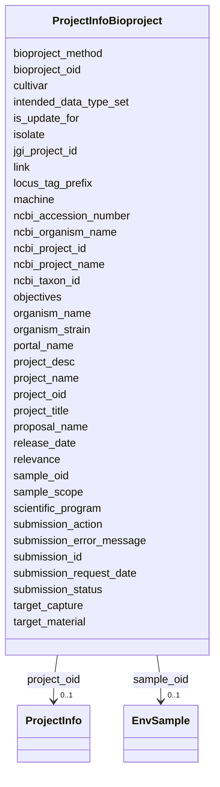

# Class: ProjectInfoBioproject 


URI: [imgsg_dev:ProjectInfoBioproject](https://w3id.org/jgi/imgsg_dev/ProjectInfoBioproject)





<!-- no inheritance hierarchy -->


## Slots

| Name | Cardinality and Range | Description | Inheritance |
| ---  | --- | --- | --- |
| [project_oid](project_oid.md) | 0..1 <br/> [ProjectInfo](ProjectInfo.md) | Foreign key to project_info | direct |
| [jgi_project_id](jgi_project_id.md) | 0..1 <br/> [Integer](Integer.md) |  | direct |
| [organism_name](organism_name.md) | 0..1 <br/> [String](String.md) |  | direct |
| [organism_strain](organism_strain.md) | 0..1 <br/> [String](String.md) |  | direct |
| [isolate](isolate.md) | 0..1 <br/> [String](String.md) |  | direct |
| [project_title](project_title.md) | 0..1 <br/> [String](String.md) |  | direct |
| [project_desc](project_desc.md) | 0..1 <br/> [String](String.md) |  | direct |
| [locus_tag_prefix](locus_tag_prefix.md) | 0..1 <br/> [String](String.md) |  | direct |
| [relevance](relevance.md) | 0..1 <br/> [String](String.md) |  | direct |
| [target_capture](target_capture.md) | 0..1 <br/> [String](String.md) |  | direct |
| [target_material](target_material.md) | 0..1 <br/> [String](String.md) |  | direct |
| [sample_scope](sample_scope.md) | 0..1 <br/> [String](String.md) |  | direct |
| [bioproject_method](bioproject_method.md) | 0..1 <br/> [String](String.md) |  | direct |
| [objectives](objectives.md) | 0..1 <br/> [String](String.md) |  | direct |
| [submission_status](submission_status.md) | 0..1 <br/> [String](String.md) |  | direct |
| [ncbi_project_id](ncbi_project_id.md) | 0..1 <br/> [String](String.md) |  | direct |
| [ncbi_taxon_id](ncbi_taxon_id.md) | 0..1 <br/> [String](String.md) |  | direct |
| [ncbi_accession_number](ncbi_accession_number.md) | 0..1 <br/> [String](String.md) |  | direct |
| [machine](machine.md) | 0..1 <br/> [String](String.md) |  | direct |
| [submission_action](submission_action.md) | 0..1 <br/> [String](String.md) |  | direct |
| [release_date](release_date.md) | 0..1 <br/> [Datetime](Datetime.md) |  | direct |
| [submission_request_date](submission_request_date.md) | 0..1 <br/> [Datetime](Datetime.md) |  | direct |
| [ncbi_organism_name](ncbi_organism_name.md) | 0..1 <br/> [String](String.md) |  | direct |
| [submission_id](submission_id.md) | 0..1 <br/> [Integer](Integer.md) |  | direct |
| [portal_name](portal_name.md) | 0..1 <br/> [String](String.md) |  | direct |
| [proposal_name](proposal_name.md) | 0..1 <br/> [String](String.md) |  | direct |
| [scientific_program](scientific_program.md) | 0..1 <br/> [String](String.md) |  | direct |
| [project_name](project_name.md) | 0..1 <br/> [String](String.md) |  | direct |
| [bioproject_oid](bioproject_oid.md) | 0..1 <br/> [Integer](Integer.md) |  | direct |
| [is_update_for](is_update_for.md) | 0..1 <br/> [Integer](Integer.md) |  | direct |
| [sample_oid](sample_oid.md) | 0..1 <br/> [EnvSample](EnvSample.md) | Foreign key to env_sample | direct |
| [intended_data_type_set](intended_data_type_set.md) | 0..1 <br/> [String](String.md) |  | direct |
| [link](link.md) | 0..1 <br/> [String](String.md) |  | direct |
| [submission_error_message](submission_error_message.md) | 0..1 <br/> [String](String.md) |  | direct |
| [cultivar](cultivar.md) | 0..1 <br/> [String](String.md) |  | direct |
| [ncbi_project_name](ncbi_project_name.md) | 0..1 <br/> [String](String.md) |  | direct |


## Usages

| used by | used in | type | used |
| ---  | --- | --- | --- |
| [BioprojectPropagation](BioprojectPropagation.md) | [fk_bioproject_oid](fk_bioproject_oid.md) | range | [ProjectInfoBioproject](ProjectInfoBioproject.md) |


## Identifier and Mapping Information


### Schema Source


* from schema: https://w3id.org/jgi/imgsg_dev


## Mappings

| Mapping Type | Mapped Value |
| ---  | ---  |
| self | imgsg_dev:ProjectInfoBioproject |
| native | imgsg_dev:ProjectInfoBioproject |


## LinkML Source

<!-- TODO: investigate https://stackoverflow.com/questions/37606292/how-to-create-tabbed-code-blocks-in-mkdocs-or-sphinx -->

### Direct

<details>
```yaml
name: project_info_bioproject
from_schema: https://w3id.org/jgi/imgsg_dev
attributes:
  project_oid:
    name: project_oid
    description: Foreign key to project_info
    from_schema: https://w3id.org/jgi/imgsg_dev
    domain_of:
    - bioproject_propagation
    - biosample
    - data_quality_flags
    - env_sample_soil_metadata
    - genbank_refseq_crossover
    - gold_analysis_project_lookup
    - gold_analysis_project_lookup2
    - gold_img_nat_prod_entity
    - ncbi_accessions
    - ncbi_accessions_jbtest
    - proj_info_cell_arrange_042014
    - project_info
    - project_info_04112013
    - project_info_bioproject
    - project_info_body_products
    - project_info_body_sites
    - project_info_cell_arrangement
    - project_info_collaborators
    - project_info_cyano_metadata
    - project_info_data_links
    - project_info_data_links_112013
    - project_info_diseases
    - project_info_energy_source
    - project_info_habitat
    - project_info_jgi_url
    - project_info_metabolism
    - project_info_natural_prods
    - project_info_nitrogen_fixation
    - project_info_nprods_metadata
    - project_info_phenotypes
    - project_info_project_relevance
    - project_info_seq_method
    - project_meta_updates
    - study_load
    - t_alex_test
    - t_all_gold_jgi_projects
    range: project_info
    required: false
  jgi_project_id:
    name: jgi_project_id
    from_schema: https://w3id.org/jgi/imgsg_dev
    domain_of:
    - lanl_project
    - ornl_project
    - pig_reruns
    - pig_retractions
    - pig_tracks
    - project_info_bioproject
    - project_info_biosample
    - project_info_genbank
    - t_jgi_catalogue
    range: integer
    required: false
  organism_name:
    name: organism_name
    from_schema: https://w3id.org/jgi/imgsg_dev
    domain_of:
    - assembly
    - project_info_bioproject
    range: string
    required: false
  organism_strain:
    name: organism_strain
    from_schema: https://w3id.org/jgi/imgsg_dev
    rank: 1000
    domain_of:
    - project_info_bioproject
    range: string
    required: false
  isolate:
    name: isolate
    from_schema: https://w3id.org/jgi/imgsg_dev
    rank: 1000
    domain_of:
    - project_info_bioproject
    range: string
    required: false
  project_title:
    name: project_title
    from_schema: https://w3id.org/jgi/imgsg_dev
    rank: 1000
    domain_of:
    - project_info_bioproject
    range: string
    required: false
  project_desc:
    name: project_desc
    from_schema: https://w3id.org/jgi/imgsg_dev
    rank: 1000
    domain_of:
    - project_info_bioproject
    range: string
    required: false
  locus_tag_prefix:
    name: locus_tag_prefix
    from_schema: https://w3id.org/jgi/imgsg_dev
    domain_of:
    - env_sample
    - pig_tracks
    - project_info_bioproject
    - project_info_biosample
    - project_info_genbank
    range: string
    required: false
  relevance:
    name: relevance
    from_schema: https://w3id.org/jgi/imgsg_dev
    domain_of:
    - bioproject_relevancecv
    - gold_sp_relevance
    - project_info_bioproject
    range: string
    required: false
  target_capture:
    name: target_capture
    from_schema: https://w3id.org/jgi/imgsg_dev
    rank: 1000
    domain_of:
    - project_info_bioproject
    range: string
    required: false
  target_material:
    name: target_material
    from_schema: https://w3id.org/jgi/imgsg_dev
    rank: 1000
    domain_of:
    - project_info_bioproject
    range: string
    required: false
  sample_scope:
    name: sample_scope
    from_schema: https://w3id.org/jgi/imgsg_dev
    rank: 1000
    domain_of:
    - project_info_bioproject
    range: string
    required: false
  bioproject_method:
    name: bioproject_method
    from_schema: https://w3id.org/jgi/imgsg_dev
    rank: 1000
    domain_of:
    - project_info_bioproject
    range: string
    required: false
  objectives:
    name: objectives
    from_schema: https://w3id.org/jgi/imgsg_dev
    rank: 1000
    domain_of:
    - project_info_bioproject
    range: string
    required: false
  submission_status:
    name: submission_status
    from_schema: https://w3id.org/jgi/imgsg_dev
    domain_of:
    - pig_tracks
    - project_info_bioproject
    - project_info_biosample
    - project_info_genbank
    range: string
    required: false
  ncbi_project_id:
    name: ncbi_project_id
    from_schema: https://w3id.org/jgi/imgsg_dev
    domain_of:
    - env_sample
    - gold_sequencing_project
    - project_info
    - project_info_04112013
    - project_info_bioproject
    - project_info_biosample
    - study_load
    - vsample
    range: string
    required: false
  ncbi_taxon_id:
    name: ncbi_taxon_id
    from_schema: https://w3id.org/jgi/imgsg_dev
    domain_of:
    - env_sample
    - genbank_refseq_crossover
    - gold_sequencing_project
    - organism_sort
    - project_info
    - project_info_04112013
    - project_info_bioproject
    range: string
    required: false
  ncbi_accession_number:
    name: ncbi_accession_number
    from_schema: https://w3id.org/jgi/imgsg_dev
    domain_of:
    - pig_genbank_emailed_accs
    - pig_retractions
    - pig_tracks
    - project_info_bioproject
    - project_info_biosample
    - project_info_genbank
    range: string
    required: false
  machine:
    name: machine
    from_schema: https://w3id.org/jgi/imgsg_dev
    domain_of:
    - pig_tracks
    - project_info_bioproject
    - project_info_biosample
    - project_info_genbank
    range: string
    required: false
  submission_action:
    name: submission_action
    from_schema: https://w3id.org/jgi/imgsg_dev
    rank: 1000
    domain_of:
    - project_info_bioproject
    - project_info_biosample
    range: string
    required: false
  release_date:
    name: release_date
    from_schema: https://w3id.org/jgi/imgsg_dev
    domain_of:
    - assembly
    - img_group_news
    - master_list
    - project_info_bioproject
    - project_info_biosample
    range: datetime
    required: false
  submission_request_date:
    name: submission_request_date
    from_schema: https://w3id.org/jgi/imgsg_dev
    rank: 1000
    domain_of:
    - project_info_bioproject
    - project_info_biosample
    range: datetime
    required: false
  ncbi_organism_name:
    name: ncbi_organism_name
    from_schema: https://w3id.org/jgi/imgsg_dev
    rank: 1000
    domain_of:
    - project_info_bioproject
    range: string
    required: false
  submission_id:
    name: submission_id
    from_schema: https://w3id.org/jgi/imgsg_dev
    domain_of:
    - annotation_contigs_proteins_counts
    - annotation_job_sbatch_args
    - annotation_job_stats
    - annotation_step_stats
    - bad_depth_file_warnings
    - bioproject_propagation
    - gold_analysis_project
    - mer_submissions_queue
    - merfs_aggregate_file_size
    - phajek_test
    - pig_tracks
    - project_info_bioproject
    - project_info_biosample
    - project_info_genbank
    - rnaseq_notify_phajek
    - rnaseq_notify_phajek_dev
    - submission
    - submission_data_files
    - submission_data_files_dmpath
    - submission_history
    - submission_img_contacts
    - submission_proc_stats
    - submission_proc_steps
    - submission_reads_file
    - submission_samples
    - t1_audit
    - v5_ap_imperfect_view
    range: integer
    required: false
  portal_name:
    name: portal_name
    from_schema: https://w3id.org/jgi/imgsg_dev
    rank: 1000
    domain_of:
    - project_info_bioproject
    - project_info_biosample
    range: string
    required: false
  proposal_name:
    name: proposal_name
    from_schema: https://w3id.org/jgi/imgsg_dev
    domain_of:
    - env_sample
    - project_info
    - project_info_04112013
    - project_info_bioproject
    range: string
    required: false
  scientific_program:
    name: scientific_program
    from_schema: https://w3id.org/jgi/imgsg_dev
    domain_of:
    - env_sample
    - project_info
    - project_info_04112013
    - project_info_bioproject
    - project_info_biosample
    range: string
    required: false
  project_name:
    name: project_name
    from_schema: https://w3id.org/jgi/imgsg_dev
    domain_of:
    - goldv5_view
    - project_info_bioproject
    - t_jgi_catalogue
    range: string
    required: false
  bioproject_oid:
    name: bioproject_oid
    from_schema: https://w3id.org/jgi/imgsg_dev
    rank: 1000
    domain_of:
    - project_info_bioproject
    - project_info_biosample
    range: integer
    required: false
  is_update_for:
    name: is_update_for
    from_schema: https://w3id.org/jgi/imgsg_dev
    rank: 1000
    domain_of:
    - project_info_bioproject
    - project_info_biosample
    range: integer
    required: false
  sample_oid:
    name: sample_oid
    description: Foreign key to env_sample
    from_schema: https://w3id.org/jgi/imgsg_dev
    domain_of:
    - contact_sample_perms
    - env_sample
    - env_sample_data_links
    - env_sample_diseases
    - env_sample_energy_source
    - env_sample_habitat_type
    - env_sample_jgi_url
    - env_sample_metabolism
    - env_sample_misc_meta_data
    - env_sample_phenotypes
    - env_sample_seq_method
    - gold_analysis_project_lookup
    - gold_analysis_project_lookup2
    - project_info
    - project_info_04112013
    - project_info_bioproject
    - project_info_biosample
    - submission
    - submission_samples
    - vsample
    range: env_sample
    required: false
  intended_data_type_set:
    name: intended_data_type_set
    from_schema: https://w3id.org/jgi/imgsg_dev
    rank: 1000
    domain_of:
    - project_info_bioproject
    range: string
    required: false
  link:
    name: link
    from_schema: https://w3id.org/jgi/imgsg_dev
    domain_of:
    - collaboratorcv
    - project_info_bioproject
    - project_info_biosample
    - seq_centercv
    range: string
    required: false
  submission_error_message:
    name: submission_error_message
    from_schema: https://w3id.org/jgi/imgsg_dev
    rank: 1000
    domain_of:
    - project_info_bioproject
    range: string
    required: false
  cultivar:
    name: cultivar
    from_schema: https://w3id.org/jgi/imgsg_dev
    rank: 1000
    domain_of:
    - project_info_bioproject
    - project_info_biosample
    range: string
    required: false
  ncbi_project_name:
    name: ncbi_project_name
    from_schema: https://w3id.org/jgi/imgsg_dev
    domain_of:
    - env_sample
    - project_info
    - project_info_04112013
    - project_info_bioproject
    - project_info_biosample
    - vsample
    range: string
    required: false

```
</details>

### Induced

<details>
```yaml
name: project_info_bioproject
from_schema: https://w3id.org/jgi/imgsg_dev
attributes:
  project_oid:
    name: project_oid
    description: Foreign key to project_info
    from_schema: https://w3id.org/jgi/imgsg_dev
    alias: project_oid
    owner: project_info_bioproject
    domain_of:
    - bioproject_propagation
    - biosample
    - data_quality_flags
    - env_sample_soil_metadata
    - genbank_refseq_crossover
    - gold_analysis_project_lookup
    - gold_analysis_project_lookup2
    - gold_img_nat_prod_entity
    - ncbi_accessions
    - ncbi_accessions_jbtest
    - proj_info_cell_arrange_042014
    - project_info
    - project_info_04112013
    - project_info_bioproject
    - project_info_body_products
    - project_info_body_sites
    - project_info_cell_arrangement
    - project_info_collaborators
    - project_info_cyano_metadata
    - project_info_data_links
    - project_info_data_links_112013
    - project_info_diseases
    - project_info_energy_source
    - project_info_habitat
    - project_info_jgi_url
    - project_info_metabolism
    - project_info_natural_prods
    - project_info_nitrogen_fixation
    - project_info_nprods_metadata
    - project_info_phenotypes
    - project_info_project_relevance
    - project_info_seq_method
    - project_meta_updates
    - study_load
    - t_alex_test
    - t_all_gold_jgi_projects
    range: project_info
    required: false
  jgi_project_id:
    name: jgi_project_id
    from_schema: https://w3id.org/jgi/imgsg_dev
    alias: jgi_project_id
    owner: project_info_bioproject
    domain_of:
    - lanl_project
    - ornl_project
    - pig_reruns
    - pig_retractions
    - pig_tracks
    - project_info_bioproject
    - project_info_biosample
    - project_info_genbank
    - t_jgi_catalogue
    range: integer
    required: false
  organism_name:
    name: organism_name
    from_schema: https://w3id.org/jgi/imgsg_dev
    alias: organism_name
    owner: project_info_bioproject
    domain_of:
    - assembly
    - project_info_bioproject
    range: string
    required: false
  organism_strain:
    name: organism_strain
    from_schema: https://w3id.org/jgi/imgsg_dev
    rank: 1000
    alias: organism_strain
    owner: project_info_bioproject
    domain_of:
    - project_info_bioproject
    range: string
    required: false
  isolate:
    name: isolate
    from_schema: https://w3id.org/jgi/imgsg_dev
    rank: 1000
    alias: isolate
    owner: project_info_bioproject
    domain_of:
    - project_info_bioproject
    range: string
    required: false
  project_title:
    name: project_title
    from_schema: https://w3id.org/jgi/imgsg_dev
    rank: 1000
    alias: project_title
    owner: project_info_bioproject
    domain_of:
    - project_info_bioproject
    range: string
    required: false
  project_desc:
    name: project_desc
    from_schema: https://w3id.org/jgi/imgsg_dev
    rank: 1000
    alias: project_desc
    owner: project_info_bioproject
    domain_of:
    - project_info_bioproject
    range: string
    required: false
  locus_tag_prefix:
    name: locus_tag_prefix
    from_schema: https://w3id.org/jgi/imgsg_dev
    alias: locus_tag_prefix
    owner: project_info_bioproject
    domain_of:
    - env_sample
    - pig_tracks
    - project_info_bioproject
    - project_info_biosample
    - project_info_genbank
    range: string
    required: false
  relevance:
    name: relevance
    from_schema: https://w3id.org/jgi/imgsg_dev
    alias: relevance
    owner: project_info_bioproject
    domain_of:
    - bioproject_relevancecv
    - gold_sp_relevance
    - project_info_bioproject
    range: string
    required: false
  target_capture:
    name: target_capture
    from_schema: https://w3id.org/jgi/imgsg_dev
    rank: 1000
    alias: target_capture
    owner: project_info_bioproject
    domain_of:
    - project_info_bioproject
    range: string
    required: false
  target_material:
    name: target_material
    from_schema: https://w3id.org/jgi/imgsg_dev
    rank: 1000
    alias: target_material
    owner: project_info_bioproject
    domain_of:
    - project_info_bioproject
    range: string
    required: false
  sample_scope:
    name: sample_scope
    from_schema: https://w3id.org/jgi/imgsg_dev
    rank: 1000
    alias: sample_scope
    owner: project_info_bioproject
    domain_of:
    - project_info_bioproject
    range: string
    required: false
  bioproject_method:
    name: bioproject_method
    from_schema: https://w3id.org/jgi/imgsg_dev
    rank: 1000
    alias: bioproject_method
    owner: project_info_bioproject
    domain_of:
    - project_info_bioproject
    range: string
    required: false
  objectives:
    name: objectives
    from_schema: https://w3id.org/jgi/imgsg_dev
    rank: 1000
    alias: objectives
    owner: project_info_bioproject
    domain_of:
    - project_info_bioproject
    range: string
    required: false
  submission_status:
    name: submission_status
    from_schema: https://w3id.org/jgi/imgsg_dev
    alias: submission_status
    owner: project_info_bioproject
    domain_of:
    - pig_tracks
    - project_info_bioproject
    - project_info_biosample
    - project_info_genbank
    range: string
    required: false
  ncbi_project_id:
    name: ncbi_project_id
    from_schema: https://w3id.org/jgi/imgsg_dev
    alias: ncbi_project_id
    owner: project_info_bioproject
    domain_of:
    - env_sample
    - gold_sequencing_project
    - project_info
    - project_info_04112013
    - project_info_bioproject
    - project_info_biosample
    - study_load
    - vsample
    range: string
    required: false
  ncbi_taxon_id:
    name: ncbi_taxon_id
    from_schema: https://w3id.org/jgi/imgsg_dev
    alias: ncbi_taxon_id
    owner: project_info_bioproject
    domain_of:
    - env_sample
    - genbank_refseq_crossover
    - gold_sequencing_project
    - organism_sort
    - project_info
    - project_info_04112013
    - project_info_bioproject
    range: string
    required: false
  ncbi_accession_number:
    name: ncbi_accession_number
    from_schema: https://w3id.org/jgi/imgsg_dev
    alias: ncbi_accession_number
    owner: project_info_bioproject
    domain_of:
    - pig_genbank_emailed_accs
    - pig_retractions
    - pig_tracks
    - project_info_bioproject
    - project_info_biosample
    - project_info_genbank
    range: string
    required: false
  machine:
    name: machine
    from_schema: https://w3id.org/jgi/imgsg_dev
    alias: machine
    owner: project_info_bioproject
    domain_of:
    - pig_tracks
    - project_info_bioproject
    - project_info_biosample
    - project_info_genbank
    range: string
    required: false
  submission_action:
    name: submission_action
    from_schema: https://w3id.org/jgi/imgsg_dev
    rank: 1000
    alias: submission_action
    owner: project_info_bioproject
    domain_of:
    - project_info_bioproject
    - project_info_biosample
    range: string
    required: false
  release_date:
    name: release_date
    from_schema: https://w3id.org/jgi/imgsg_dev
    alias: release_date
    owner: project_info_bioproject
    domain_of:
    - assembly
    - img_group_news
    - master_list
    - project_info_bioproject
    - project_info_biosample
    range: datetime
    required: false
  submission_request_date:
    name: submission_request_date
    from_schema: https://w3id.org/jgi/imgsg_dev
    rank: 1000
    alias: submission_request_date
    owner: project_info_bioproject
    domain_of:
    - project_info_bioproject
    - project_info_biosample
    range: datetime
    required: false
  ncbi_organism_name:
    name: ncbi_organism_name
    from_schema: https://w3id.org/jgi/imgsg_dev
    rank: 1000
    alias: ncbi_organism_name
    owner: project_info_bioproject
    domain_of:
    - project_info_bioproject
    range: string
    required: false
  submission_id:
    name: submission_id
    from_schema: https://w3id.org/jgi/imgsg_dev
    alias: submission_id
    owner: project_info_bioproject
    domain_of:
    - annotation_contigs_proteins_counts
    - annotation_job_sbatch_args
    - annotation_job_stats
    - annotation_step_stats
    - bad_depth_file_warnings
    - bioproject_propagation
    - gold_analysis_project
    - mer_submissions_queue
    - merfs_aggregate_file_size
    - phajek_test
    - pig_tracks
    - project_info_bioproject
    - project_info_biosample
    - project_info_genbank
    - rnaseq_notify_phajek
    - rnaseq_notify_phajek_dev
    - submission
    - submission_data_files
    - submission_data_files_dmpath
    - submission_history
    - submission_img_contacts
    - submission_proc_stats
    - submission_proc_steps
    - submission_reads_file
    - submission_samples
    - t1_audit
    - v5_ap_imperfect_view
    range: integer
    required: false
  portal_name:
    name: portal_name
    from_schema: https://w3id.org/jgi/imgsg_dev
    rank: 1000
    alias: portal_name
    owner: project_info_bioproject
    domain_of:
    - project_info_bioproject
    - project_info_biosample
    range: string
    required: false
  proposal_name:
    name: proposal_name
    from_schema: https://w3id.org/jgi/imgsg_dev
    alias: proposal_name
    owner: project_info_bioproject
    domain_of:
    - env_sample
    - project_info
    - project_info_04112013
    - project_info_bioproject
    range: string
    required: false
  scientific_program:
    name: scientific_program
    from_schema: https://w3id.org/jgi/imgsg_dev
    alias: scientific_program
    owner: project_info_bioproject
    domain_of:
    - env_sample
    - project_info
    - project_info_04112013
    - project_info_bioproject
    - project_info_biosample
    range: string
    required: false
  project_name:
    name: project_name
    from_schema: https://w3id.org/jgi/imgsg_dev
    alias: project_name
    owner: project_info_bioproject
    domain_of:
    - goldv5_view
    - project_info_bioproject
    - t_jgi_catalogue
    range: string
    required: false
  bioproject_oid:
    name: bioproject_oid
    from_schema: https://w3id.org/jgi/imgsg_dev
    rank: 1000
    alias: bioproject_oid
    owner: project_info_bioproject
    domain_of:
    - project_info_bioproject
    - project_info_biosample
    range: integer
    required: false
  is_update_for:
    name: is_update_for
    from_schema: https://w3id.org/jgi/imgsg_dev
    rank: 1000
    alias: is_update_for
    owner: project_info_bioproject
    domain_of:
    - project_info_bioproject
    - project_info_biosample
    range: integer
    required: false
  sample_oid:
    name: sample_oid
    description: Foreign key to env_sample
    from_schema: https://w3id.org/jgi/imgsg_dev
    alias: sample_oid
    owner: project_info_bioproject
    domain_of:
    - contact_sample_perms
    - env_sample
    - env_sample_data_links
    - env_sample_diseases
    - env_sample_energy_source
    - env_sample_habitat_type
    - env_sample_jgi_url
    - env_sample_metabolism
    - env_sample_misc_meta_data
    - env_sample_phenotypes
    - env_sample_seq_method
    - gold_analysis_project_lookup
    - gold_analysis_project_lookup2
    - project_info
    - project_info_04112013
    - project_info_bioproject
    - project_info_biosample
    - submission
    - submission_samples
    - vsample
    range: env_sample
    required: false
  intended_data_type_set:
    name: intended_data_type_set
    from_schema: https://w3id.org/jgi/imgsg_dev
    rank: 1000
    alias: intended_data_type_set
    owner: project_info_bioproject
    domain_of:
    - project_info_bioproject
    range: string
    required: false
  link:
    name: link
    from_schema: https://w3id.org/jgi/imgsg_dev
    alias: link
    owner: project_info_bioproject
    domain_of:
    - collaboratorcv
    - project_info_bioproject
    - project_info_biosample
    - seq_centercv
    range: string
    required: false
  submission_error_message:
    name: submission_error_message
    from_schema: https://w3id.org/jgi/imgsg_dev
    rank: 1000
    alias: submission_error_message
    owner: project_info_bioproject
    domain_of:
    - project_info_bioproject
    range: string
    required: false
  cultivar:
    name: cultivar
    from_schema: https://w3id.org/jgi/imgsg_dev
    rank: 1000
    alias: cultivar
    owner: project_info_bioproject
    domain_of:
    - project_info_bioproject
    - project_info_biosample
    range: string
    required: false
  ncbi_project_name:
    name: ncbi_project_name
    from_schema: https://w3id.org/jgi/imgsg_dev
    alias: ncbi_project_name
    owner: project_info_bioproject
    domain_of:
    - env_sample
    - project_info
    - project_info_04112013
    - project_info_bioproject
    - project_info_biosample
    - vsample
    range: string
    required: false

```
</details>