# Class: ProjectInfoBiosample 


URI: [imgsg_dev:ProjectInfoBiosample](https://w3id.org/jgi/imgsg_dev/ProjectInfoBiosample)

```mermaid
 classDiagram
    class ProjectInfoBiosample
    click ProjectInfoBiosample href "../ProjectInfoBiosample/"
      ProjectInfoBiosample : biome
        
      ProjectInfoBiosample : bioproject_oid
        
      ProjectInfoBiosample : biosample_oid
        
      ProjectInfoBiosample : biotic_relationship
        
      ProjectInfoBiosample : collection_date
        
      ProjectInfoBiosample : cultivar
        
      ProjectInfoBiosample : db_identifiers
        
      ProjectInfoBiosample : description
        
      ProjectInfoBiosample : encoded_traits
        
      ProjectInfoBiosample : env_package
        
      ProjectInfoBiosample : estimated_size
        
      ProjectInfoBiosample : experimental_factor
        
      ProjectInfoBiosample : extrachrom_elements
        
      ProjectInfoBiosample : feature
        
      ProjectInfoBiosample : geo_loc_name
        
      ProjectInfoBiosample : health_disease_stat
        
      ProjectInfoBiosample : host_spec_range
        
      ProjectInfoBiosample : investigation_type
        
      ProjectInfoBiosample : is_update_for
        
      ProjectInfoBiosample : isol_growth_condt
        
      ProjectInfoBiosample : jgi_project_id
        
      ProjectInfoBiosample : lat_lon
        
      ProjectInfoBiosample : link
        
      ProjectInfoBiosample : locus_tag_prefix
        
      ProjectInfoBiosample : machine
        
      ProjectInfoBiosample : material
        
      ProjectInfoBiosample : mims_me_project_name
        
      ProjectInfoBiosample : model
        
      ProjectInfoBiosample : ncbi_accession_number
        
      ProjectInfoBiosample : ncbi_project_id
        
      ProjectInfoBiosample : ncbi_project_name
        
      ProjectInfoBiosample : ncbi_sample_id
        
      ProjectInfoBiosample : num_replicons
        
      ProjectInfoBiosample : org_contact_email
        
      ProjectInfoBiosample : org_contact_first_name
        
      ProjectInfoBiosample : org_contact_last_name
        
      ProjectInfoBiosample : org_name
        
      ProjectInfoBiosample : pathogenicity
        
      ProjectInfoBiosample : ploidy
        
      ProjectInfoBiosample : portal_name
        
      ProjectInfoBiosample : propagation
        
      ProjectInfoBiosample : ref_biomaterial
        
      ProjectInfoBiosample : rel_to_oxygen
        
      ProjectInfoBiosample : release_date
        
      ProjectInfoBiosample : samp_collect_device
        
      ProjectInfoBiosample : samp_mat_process
        
      ProjectInfoBiosample : samp_size
        
      ProjectInfoBiosample : sample_id
        
      ProjectInfoBiosample : sample_oid
        
      ProjectInfoBiosample : scientific_program
        
      ProjectInfoBiosample : source_mat_id
        
      ProjectInfoBiosample : specific_host
        
      ProjectInfoBiosample : strain
        
      ProjectInfoBiosample : submission_action
        
      ProjectInfoBiosample : submission_comment
        
      ProjectInfoBiosample : submission_id
        
      ProjectInfoBiosample : submission_request_date
        
      ProjectInfoBiosample : submission_status
        
      ProjectInfoBiosample : subspecf_gen_lin
        
      ProjectInfoBiosample : tax_id
        
      ProjectInfoBiosample : tax_name
        
      ProjectInfoBiosample : trophic_level
        
      
```





<!-- no inheritance hierarchy -->


## Slots

| Name | Cardinality and Range | Description | Inheritance |
| ---  | --- | --- | --- |
| [submission_status](submission_status.md) | 0..1 <br/> [String](String.md) |  | direct |
| [machine](machine.md) | 0..1 <br/> [String](String.md) |  | direct |
| [submission_action](submission_action.md) | 0..1 <br/> [String](String.md) |  | direct |
| [submission_comment](submission_comment.md) | 0..1 <br/> [String](String.md) |  | direct |
| [submission_request_date](submission_request_date.md) | 0..1 <br/> [Datetime](Datetime.md) |  | direct |
| [submission_id](submission_id.md) | 0..1 <br/> [Integer](Integer.md) |  | direct |
| [sample_id](sample_id.md) | 0..1 <br/> [String](String.md) |  | direct |
| [description](description.md) | 0..1 <br/> [String](String.md) |  | direct |
| [model](model.md) | 0..1 <br/> [String](String.md) |  | direct |
| [link](link.md) | 0..1 <br/> [String](String.md) |  | direct |
| [tax_name](tax_name.md) | 0..1 <br/> [String](String.md) |  | direct |
| [tax_id](tax_id.md) | 0..1 <br/> [Integer](Integer.md) |  | direct |
| [strain](strain.md) | 0..1 <br/> [String](String.md) |  | direct |
| [biome](biome.md) | 0..1 <br/> [String](String.md) |  | direct |
| [collection_date](collection_date.md) | 0..1 <br/> [String](String.md) |  | direct |
| [env_package](env_package.md) | 0..1 <br/> [String](String.md) |  | direct |
| [feature](feature.md) | 0..1 <br/> [String](String.md) |  | direct |
| [geo_loc_name](geo_loc_name.md) | 0..1 <br/> [String](String.md) |  | direct |
| [investigation_type](investigation_type.md) | 0..1 <br/> [String](String.md) |  | direct |
| [isol_growth_condt](isol_growth_condt.md) | 0..1 <br/> [String](String.md) |  | direct |
| [lat_lon](lat_lon.md) | 0..1 <br/> [String](String.md) |  | direct |
| [material](material.md) | 0..1 <br/> [String](String.md) |  | direct |
| [num_replicons](num_replicons.md) | 0..1 <br/> [String](String.md) |  | direct |
| [ref_biomaterial](ref_biomaterial.md) | 0..1 <br/> [String](String.md) |  | direct |
| [biotic_relationship](biotic_relationship.md) | 0..1 <br/> [String](String.md) |  | direct |
| [encoded_traits](encoded_traits.md) | 0..1 <br/> [String](String.md) |  | direct |
| [estimated_size](estimated_size.md) | 0..1 <br/> [String](String.md) |  | direct |
| [experimental_factor](experimental_factor.md) | 0..1 <br/> [String](String.md) |  | direct |
| [extrachrom_elements](extrachrom_elements.md) | 0..1 <br/> [String](String.md) |  | direct |
| [health_disease_stat](health_disease_stat.md) | 0..1 <br/> [String](String.md) |  | direct |
| [host_spec_range](host_spec_range.md) | 0..1 <br/> [String](String.md) |  | direct |
| [pathogenicity](pathogenicity.md) | 0..1 <br/> [String](String.md) |  | direct |
| [rel_to_oxygen](rel_to_oxygen.md) | 0..1 <br/> [String](String.md) |  | direct |
| [samp_collect_device](samp_collect_device.md) | 0..1 <br/> [String](String.md) |  | direct |
| [samp_mat_process](samp_mat_process.md) | 0..1 <br/> [String](String.md) |  | direct |
| [samp_size](samp_size.md) | 0..1 <br/> [String](String.md) |  | direct |
| [source_mat_id](source_mat_id.md) | 0..1 <br/> [String](String.md) |  | direct |
| [specific_host](specific_host.md) | 0..1 <br/> [String](String.md) |  | direct |
| [subspecf_gen_lin](subspecf_gen_lin.md) | 0..1 <br/> [String](String.md) |  | direct |
| [trophic_level](trophic_level.md) | 0..1 <br/> [String](String.md) |  | direct |
| [ploidy](ploidy.md) | 0..1 <br/> [String](String.md) |  | direct |
| [propagation](propagation.md) | 0..1 <br/> [String](String.md) |  | direct |
| [sample_oid](sample_oid.md) | 0..1 <br/> [Integer](Integer.md) |  | direct |
| [jgi_project_id](jgi_project_id.md) | 0..1 <br/> [Integer](Integer.md) |  | direct |
| [scientific_program](scientific_program.md) | 0..1 <br/> [String](String.md) |  | direct |
| [ncbi_project_id](ncbi_project_id.md) | 0..1 <br/> [String](String.md) |  | direct |
| [portal_name](portal_name.md) | 0..1 <br/> [String](String.md) |  | direct |
| [biosample_oid](biosample_oid.md) | 0..1 <br/> [Integer](Integer.md) |  | direct |
| [release_date](release_date.md) | 0..1 <br/> [Datetime](Datetime.md) |  | direct |
| [mims_me_project_name](mims_me_project_name.md) | 0..1 <br/> [String](String.md) |  | direct |
| [db_identifiers](db_identifiers.md) | 0..1 <br/> [String](String.md) |  | direct |
| [bioproject_oid](bioproject_oid.md) | 0..1 <br/> [Integer](Integer.md) |  | direct |
| [org_name](org_name.md) | 0..1 <br/> [String](String.md) |  | direct |
| [org_contact_email](org_contact_email.md) | 0..1 <br/> [String](String.md) |  | direct |
| [org_contact_first_name](org_contact_first_name.md) | 0..1 <br/> [String](String.md) |  | direct |
| [org_contact_last_name](org_contact_last_name.md) | 0..1 <br/> [String](String.md) |  | direct |
| [ncbi_sample_id](ncbi_sample_id.md) | 0..1 <br/> [String](String.md) |  | direct |
| [ncbi_accession_number](ncbi_accession_number.md) | 0..1 <br/> [String](String.md) |  | direct |
| [locus_tag_prefix](locus_tag_prefix.md) | 0..1 <br/> [String](String.md) |  | direct |
| [is_update_for](is_update_for.md) | 0..1 <br/> [Integer](Integer.md) |  | direct |
| [ncbi_project_name](ncbi_project_name.md) | 0..1 <br/> [String](String.md) |  | direct |
| [cultivar](cultivar.md) | 0..1 <br/> [String](String.md) |  | direct |


## Identifier and Mapping Information


### Schema Source


* from schema: https://w3id.org/jgi/imgsg_dev


## Mappings

| Mapping Type | Mapped Value |
| ---  | ---  |
| self | imgsg_dev:ProjectInfoBiosample |
| native | imgsg_dev:ProjectInfoBiosample |


## LinkML Source

<!-- TODO: investigate https://stackoverflow.com/questions/37606292/how-to-create-tabbed-code-blocks-in-mkdocs-or-sphinx -->

### Direct

<details>
```yaml
name: project_info_biosample
from_schema: https://w3id.org/jgi/imgsg_dev
attributes:
  submission_status:
    name: submission_status
    from_schema: https://w3id.org/jgi/imgsg_dev
    domain_of:
    - pig_tracks
    - project_info_bioproject
    - project_info_biosample
    - project_info_genbank
    range: string
    required: false
  machine:
    name: machine
    from_schema: https://w3id.org/jgi/imgsg_dev
    domain_of:
    - pig_tracks
    - project_info_bioproject
    - project_info_biosample
    - project_info_genbank
    range: string
    required: false
  submission_action:
    name: submission_action
    from_schema: https://w3id.org/jgi/imgsg_dev
    domain_of:
    - project_info_bioproject
    - project_info_biosample
    range: string
    required: false
  submission_comment:
    name: submission_comment
    from_schema: https://w3id.org/jgi/imgsg_dev
    rank: 1000
    domain_of:
    - project_info_biosample
    range: string
    required: false
  submission_request_date:
    name: submission_request_date
    from_schema: https://w3id.org/jgi/imgsg_dev
    domain_of:
    - project_info_bioproject
    - project_info_biosample
    range: datetime
    required: false
  submission_id:
    name: submission_id
    from_schema: https://w3id.org/jgi/imgsg_dev
    domain_of:
    - annotation_contigs_proteins_counts
    - annotation_job_sbatch_args
    - annotation_job_stats
    - annotation_step_stats
    - bad_depth_file_warnings
    - bioproject_propagation
    - gold_analysis_project
    - mer_submissions_queue
    - merfs_aggregate_file_size
    - phajek_test
    - pig_tracks
    - project_info_bioproject
    - project_info_biosample
    - project_info_genbank
    - rnaseq_notify_phajek
    - rnaseq_notify_phajek_dev
    - submission
    - submission_data_files
    - submission_data_files_dmpath
    - submission_history
    - submission_img_contacts
    - submission_proc_stats
    - submission_proc_steps
    - submission_reads_file
    - submission_samples
    - t1_audit
    - v5_ap_imperfect_view
    range: integer
    required: false
  sample_id:
    name: sample_id
    from_schema: https://w3id.org/jgi/imgsg_dev
    rank: 1000
    domain_of:
    - project_info_biosample
    range: string
    required: false
  description:
    name: description
    from_schema: https://w3id.org/jgi/imgsg_dev
    domain_of:
    - gold_sequencing_project
    - img_group_news
    - imgcv
    - not_to_release
    - ora_aspnet_applications
    - ora_aspnet_roles
    - ora_aspnet_sitemap
    - project_info_biosample
    - public_workspace
    - study_load
    - submission_proc_stats
    - web_page_codecv
    - webpagecv
    range: string
    required: false
  model:
    name: model
    from_schema: https://w3id.org/jgi/imgsg_dev
    rank: 1000
    domain_of:
    - project_info_biosample
    range: string
    required: false
  link:
    name: link
    from_schema: https://w3id.org/jgi/imgsg_dev
    domain_of:
    - collaboratorcv
    - project_info_bioproject
    - project_info_biosample
    - seq_centercv
    range: string
    required: false
  tax_name:
    name: tax_name
    from_schema: https://w3id.org/jgi/imgsg_dev
    rank: 1000
    domain_of:
    - project_info_biosample
    range: string
    required: false
  tax_id:
    name: tax_id
    from_schema: https://w3id.org/jgi/imgsg_dev
    rank: 1000
    domain_of:
    - project_info_biosample
    range: integer
    required: false
  strain:
    name: strain
    from_schema: https://w3id.org/jgi/imgsg_dev
    domain_of:
    - gold_analysis_project
    - gold_sequencing_project
    - organism_sort
    - project_info
    - project_info_04112013
    - project_info_biosample
    range: string
    required: false
  biome:
    name: biome
    from_schema: https://w3id.org/jgi/imgsg_dev
    rank: 1000
    domain_of:
    - project_info_biosample
    range: string
    required: false
  collection_date:
    name: collection_date
    from_schema: https://w3id.org/jgi/imgsg_dev
    rank: 1000
    domain_of:
    - project_info_biosample
    range: string
    required: false
  env_package:
    name: env_package
    from_schema: https://w3id.org/jgi/imgsg_dev
    rank: 1000
    domain_of:
    - project_info_biosample
    range: string
    required: false
  feature:
    name: feature
    from_schema: https://w3id.org/jgi/imgsg_dev
    rank: 1000
    domain_of:
    - project_info_biosample
    range: string
    required: false
  geo_loc_name:
    name: geo_loc_name
    from_schema: https://w3id.org/jgi/imgsg_dev
    rank: 1000
    domain_of:
    - project_info_biosample
    range: string
    required: false
  investigation_type:
    name: investigation_type
    from_schema: https://w3id.org/jgi/imgsg_dev
    rank: 1000
    domain_of:
    - project_info_biosample
    range: string
    required: false
  isol_growth_condt:
    name: isol_growth_condt
    from_schema: https://w3id.org/jgi/imgsg_dev
    rank: 1000
    domain_of:
    - project_info_biosample
    range: string
    required: false
  lat_lon:
    name: lat_lon
    from_schema: https://w3id.org/jgi/imgsg_dev
    rank: 1000
    domain_of:
    - project_info_biosample
    range: string
    required: false
  material:
    name: material
    from_schema: https://w3id.org/jgi/imgsg_dev
    rank: 1000
    domain_of:
    - project_info_biosample
    range: string
    required: false
  num_replicons:
    name: num_replicons
    from_schema: https://w3id.org/jgi/imgsg_dev
    rank: 1000
    domain_of:
    - project_info_biosample
    range: string
    required: false
  ref_biomaterial:
    name: ref_biomaterial
    from_schema: https://w3id.org/jgi/imgsg_dev
    rank: 1000
    domain_of:
    - project_info_biosample
    range: string
    required: false
  biotic_relationship:
    name: biotic_relationship
    from_schema: https://w3id.org/jgi/imgsg_dev
    rank: 1000
    domain_of:
    - project_info_biosample
    range: string
    required: false
  encoded_traits:
    name: encoded_traits
    from_schema: https://w3id.org/jgi/imgsg_dev
    rank: 1000
    domain_of:
    - project_info_biosample
    range: string
    required: false
  estimated_size:
    name: estimated_size
    from_schema: https://w3id.org/jgi/imgsg_dev
    rank: 1000
    domain_of:
    - project_info_biosample
    range: string
    required: false
  experimental_factor:
    name: experimental_factor
    from_schema: https://w3id.org/jgi/imgsg_dev
    rank: 1000
    domain_of:
    - project_info_biosample
    range: string
    required: false
  extrachrom_elements:
    name: extrachrom_elements
    from_schema: https://w3id.org/jgi/imgsg_dev
    rank: 1000
    domain_of:
    - project_info_biosample
    range: string
    required: false
  health_disease_stat:
    name: health_disease_stat
    from_schema: https://w3id.org/jgi/imgsg_dev
    rank: 1000
    domain_of:
    - project_info_biosample
    range: string
    required: false
  host_spec_range:
    name: host_spec_range
    from_schema: https://w3id.org/jgi/imgsg_dev
    rank: 1000
    domain_of:
    - project_info_biosample
    range: string
    required: false
  pathogenicity:
    name: pathogenicity
    from_schema: https://w3id.org/jgi/imgsg_dev
    rank: 1000
    domain_of:
    - project_info_biosample
    range: string
    required: false
  rel_to_oxygen:
    name: rel_to_oxygen
    from_schema: https://w3id.org/jgi/imgsg_dev
    rank: 1000
    domain_of:
    - project_info_biosample
    range: string
    required: false
  samp_collect_device:
    name: samp_collect_device
    from_schema: https://w3id.org/jgi/imgsg_dev
    rank: 1000
    domain_of:
    - project_info_biosample
    range: string
    required: false
  samp_mat_process:
    name: samp_mat_process
    from_schema: https://w3id.org/jgi/imgsg_dev
    rank: 1000
    domain_of:
    - project_info_biosample
    range: string
    required: false
  samp_size:
    name: samp_size
    from_schema: https://w3id.org/jgi/imgsg_dev
    rank: 1000
    domain_of:
    - project_info_biosample
    range: string
    required: false
  source_mat_id:
    name: source_mat_id
    from_schema: https://w3id.org/jgi/imgsg_dev
    rank: 1000
    domain_of:
    - project_info_biosample
    range: string
    required: false
  specific_host:
    name: specific_host
    from_schema: https://w3id.org/jgi/imgsg_dev
    rank: 1000
    domain_of:
    - project_info_biosample
    range: string
    required: false
  subspecf_gen_lin:
    name: subspecf_gen_lin
    from_schema: https://w3id.org/jgi/imgsg_dev
    rank: 1000
    domain_of:
    - project_info_biosample
    range: string
    required: false
  trophic_level:
    name: trophic_level
    from_schema: https://w3id.org/jgi/imgsg_dev
    rank: 1000
    domain_of:
    - project_info_biosample
    range: string
    required: false
  ploidy:
    name: ploidy
    from_schema: https://w3id.org/jgi/imgsg_dev
    rank: 1000
    domain_of:
    - project_info_biosample
    range: string
    required: false
  propagation:
    name: propagation
    from_schema: https://w3id.org/jgi/imgsg_dev
    rank: 1000
    domain_of:
    - project_info_biosample
    range: string
    required: false
  sample_oid:
    name: sample_oid
    from_schema: https://w3id.org/jgi/imgsg_dev
    domain_of:
    - contact_sample_perms
    - env_sample
    - env_sample_data_links
    - env_sample_diseases
    - env_sample_energy_source
    - env_sample_habitat_type
    - env_sample_jgi_url
    - env_sample_metabolism
    - env_sample_misc_meta_data
    - env_sample_phenotypes
    - env_sample_seq_method
    - gold_analysis_project_lookup
    - gold_analysis_project_lookup2
    - project_info
    - project_info_04112013
    - project_info_bioproject
    - project_info_biosample
    - submission
    - submission_samples
    - vsample
    range: integer
    required: false
  jgi_project_id:
    name: jgi_project_id
    from_schema: https://w3id.org/jgi/imgsg_dev
    domain_of:
    - lanl_project
    - ornl_project
    - pig_reruns
    - pig_retractions
    - pig_tracks
    - project_info_bioproject
    - project_info_biosample
    - project_info_genbank
    - t_jgi_catalogue
    range: integer
    required: false
  scientific_program:
    name: scientific_program
    from_schema: https://w3id.org/jgi/imgsg_dev
    domain_of:
    - env_sample
    - project_info
    - project_info_04112013
    - project_info_bioproject
    - project_info_biosample
    range: string
    required: false
  ncbi_project_id:
    name: ncbi_project_id
    from_schema: https://w3id.org/jgi/imgsg_dev
    domain_of:
    - env_sample
    - gold_sequencing_project
    - project_info
    - project_info_04112013
    - project_info_bioproject
    - project_info_biosample
    - study_load
    - vsample
    range: string
    required: false
  portal_name:
    name: portal_name
    from_schema: https://w3id.org/jgi/imgsg_dev
    domain_of:
    - project_info_bioproject
    - project_info_biosample
    range: string
    required: false
  biosample_oid:
    name: biosample_oid
    from_schema: https://w3id.org/jgi/imgsg_dev
    rank: 1000
    domain_of:
    - project_info_biosample
    range: integer
    required: false
  release_date:
    name: release_date
    from_schema: https://w3id.org/jgi/imgsg_dev
    domain_of:
    - assembly
    - img_group_news
    - master_list
    - project_info_bioproject
    - project_info_biosample
    range: datetime
    required: false
  mims_me_project_name:
    name: mims_me_project_name
    from_schema: https://w3id.org/jgi/imgsg_dev
    rank: 1000
    domain_of:
    - project_info_biosample
    range: string
    required: false
  db_identifiers:
    name: db_identifiers
    from_schema: https://w3id.org/jgi/imgsg_dev
    rank: 1000
    domain_of:
    - project_info_biosample
    range: string
    required: false
  bioproject_oid:
    name: bioproject_oid
    from_schema: https://w3id.org/jgi/imgsg_dev
    domain_of:
    - project_info_bioproject
    - project_info_biosample
    range: integer
    required: false
  org_name:
    name: org_name
    from_schema: https://w3id.org/jgi/imgsg_dev
    rank: 1000
    domain_of:
    - project_info_biosample
    range: string
    required: false
  org_contact_email:
    name: org_contact_email
    from_schema: https://w3id.org/jgi/imgsg_dev
    rank: 1000
    domain_of:
    - project_info_biosample
    range: string
    required: false
  org_contact_first_name:
    name: org_contact_first_name
    from_schema: https://w3id.org/jgi/imgsg_dev
    rank: 1000
    domain_of:
    - project_info_biosample
    range: string
    required: false
  org_contact_last_name:
    name: org_contact_last_name
    from_schema: https://w3id.org/jgi/imgsg_dev
    rank: 1000
    domain_of:
    - project_info_biosample
    range: string
    required: false
  ncbi_sample_id:
    name: ncbi_sample_id
    from_schema: https://w3id.org/jgi/imgsg_dev
    rank: 1000
    domain_of:
    - project_info_biosample
    range: string
    required: false
  ncbi_accession_number:
    name: ncbi_accession_number
    from_schema: https://w3id.org/jgi/imgsg_dev
    domain_of:
    - pig_genbank_emailed_accs
    - pig_retractions
    - pig_tracks
    - project_info_bioproject
    - project_info_biosample
    - project_info_genbank
    range: string
    required: false
  locus_tag_prefix:
    name: locus_tag_prefix
    from_schema: https://w3id.org/jgi/imgsg_dev
    domain_of:
    - env_sample
    - pig_tracks
    - project_info_bioproject
    - project_info_biosample
    - project_info_genbank
    range: string
    required: false
  is_update_for:
    name: is_update_for
    from_schema: https://w3id.org/jgi/imgsg_dev
    domain_of:
    - project_info_bioproject
    - project_info_biosample
    range: integer
    required: false
  ncbi_project_name:
    name: ncbi_project_name
    from_schema: https://w3id.org/jgi/imgsg_dev
    domain_of:
    - env_sample
    - project_info
    - project_info_04112013
    - project_info_bioproject
    - project_info_biosample
    - vsample
    range: string
    required: false
  cultivar:
    name: cultivar
    from_schema: https://w3id.org/jgi/imgsg_dev
    domain_of:
    - project_info_bioproject
    - project_info_biosample
    range: string
    required: false

```
</details>

### Induced

<details>
```yaml
name: project_info_biosample
from_schema: https://w3id.org/jgi/imgsg_dev
attributes:
  submission_status:
    name: submission_status
    from_schema: https://w3id.org/jgi/imgsg_dev
    alias: submission_status
    owner: project_info_biosample
    domain_of:
    - pig_tracks
    - project_info_bioproject
    - project_info_biosample
    - project_info_genbank
    range: string
    required: false
  machine:
    name: machine
    from_schema: https://w3id.org/jgi/imgsg_dev
    alias: machine
    owner: project_info_biosample
    domain_of:
    - pig_tracks
    - project_info_bioproject
    - project_info_biosample
    - project_info_genbank
    range: string
    required: false
  submission_action:
    name: submission_action
    from_schema: https://w3id.org/jgi/imgsg_dev
    alias: submission_action
    owner: project_info_biosample
    domain_of:
    - project_info_bioproject
    - project_info_biosample
    range: string
    required: false
  submission_comment:
    name: submission_comment
    from_schema: https://w3id.org/jgi/imgsg_dev
    rank: 1000
    alias: submission_comment
    owner: project_info_biosample
    domain_of:
    - project_info_biosample
    range: string
    required: false
  submission_request_date:
    name: submission_request_date
    from_schema: https://w3id.org/jgi/imgsg_dev
    alias: submission_request_date
    owner: project_info_biosample
    domain_of:
    - project_info_bioproject
    - project_info_biosample
    range: datetime
    required: false
  submission_id:
    name: submission_id
    from_schema: https://w3id.org/jgi/imgsg_dev
    alias: submission_id
    owner: project_info_biosample
    domain_of:
    - annotation_contigs_proteins_counts
    - annotation_job_sbatch_args
    - annotation_job_stats
    - annotation_step_stats
    - bad_depth_file_warnings
    - bioproject_propagation
    - gold_analysis_project
    - mer_submissions_queue
    - merfs_aggregate_file_size
    - phajek_test
    - pig_tracks
    - project_info_bioproject
    - project_info_biosample
    - project_info_genbank
    - rnaseq_notify_phajek
    - rnaseq_notify_phajek_dev
    - submission
    - submission_data_files
    - submission_data_files_dmpath
    - submission_history
    - submission_img_contacts
    - submission_proc_stats
    - submission_proc_steps
    - submission_reads_file
    - submission_samples
    - t1_audit
    - v5_ap_imperfect_view
    range: integer
    required: false
  sample_id:
    name: sample_id
    from_schema: https://w3id.org/jgi/imgsg_dev
    rank: 1000
    alias: sample_id
    owner: project_info_biosample
    domain_of:
    - project_info_biosample
    range: string
    required: false
  description:
    name: description
    from_schema: https://w3id.org/jgi/imgsg_dev
    alias: description
    owner: project_info_biosample
    domain_of:
    - gold_sequencing_project
    - img_group_news
    - imgcv
    - not_to_release
    - ora_aspnet_applications
    - ora_aspnet_roles
    - ora_aspnet_sitemap
    - project_info_biosample
    - public_workspace
    - study_load
    - submission_proc_stats
    - web_page_codecv
    - webpagecv
    range: string
    required: false
  model:
    name: model
    from_schema: https://w3id.org/jgi/imgsg_dev
    rank: 1000
    alias: model
    owner: project_info_biosample
    domain_of:
    - project_info_biosample
    range: string
    required: false
  link:
    name: link
    from_schema: https://w3id.org/jgi/imgsg_dev
    alias: link
    owner: project_info_biosample
    domain_of:
    - collaboratorcv
    - project_info_bioproject
    - project_info_biosample
    - seq_centercv
    range: string
    required: false
  tax_name:
    name: tax_name
    from_schema: https://w3id.org/jgi/imgsg_dev
    rank: 1000
    alias: tax_name
    owner: project_info_biosample
    domain_of:
    - project_info_biosample
    range: string
    required: false
  tax_id:
    name: tax_id
    from_schema: https://w3id.org/jgi/imgsg_dev
    rank: 1000
    alias: tax_id
    owner: project_info_biosample
    domain_of:
    - project_info_biosample
    range: integer
    required: false
  strain:
    name: strain
    from_schema: https://w3id.org/jgi/imgsg_dev
    alias: strain
    owner: project_info_biosample
    domain_of:
    - gold_analysis_project
    - gold_sequencing_project
    - organism_sort
    - project_info
    - project_info_04112013
    - project_info_biosample
    range: string
    required: false
  biome:
    name: biome
    from_schema: https://w3id.org/jgi/imgsg_dev
    rank: 1000
    alias: biome
    owner: project_info_biosample
    domain_of:
    - project_info_biosample
    range: string
    required: false
  collection_date:
    name: collection_date
    from_schema: https://w3id.org/jgi/imgsg_dev
    rank: 1000
    alias: collection_date
    owner: project_info_biosample
    domain_of:
    - project_info_biosample
    range: string
    required: false
  env_package:
    name: env_package
    from_schema: https://w3id.org/jgi/imgsg_dev
    rank: 1000
    alias: env_package
    owner: project_info_biosample
    domain_of:
    - project_info_biosample
    range: string
    required: false
  feature:
    name: feature
    from_schema: https://w3id.org/jgi/imgsg_dev
    rank: 1000
    alias: feature
    owner: project_info_biosample
    domain_of:
    - project_info_biosample
    range: string
    required: false
  geo_loc_name:
    name: geo_loc_name
    from_schema: https://w3id.org/jgi/imgsg_dev
    rank: 1000
    alias: geo_loc_name
    owner: project_info_biosample
    domain_of:
    - project_info_biosample
    range: string
    required: false
  investigation_type:
    name: investigation_type
    from_schema: https://w3id.org/jgi/imgsg_dev
    rank: 1000
    alias: investigation_type
    owner: project_info_biosample
    domain_of:
    - project_info_biosample
    range: string
    required: false
  isol_growth_condt:
    name: isol_growth_condt
    from_schema: https://w3id.org/jgi/imgsg_dev
    rank: 1000
    alias: isol_growth_condt
    owner: project_info_biosample
    domain_of:
    - project_info_biosample
    range: string
    required: false
  lat_lon:
    name: lat_lon
    from_schema: https://w3id.org/jgi/imgsg_dev
    rank: 1000
    alias: lat_lon
    owner: project_info_biosample
    domain_of:
    - project_info_biosample
    range: string
    required: false
  material:
    name: material
    from_schema: https://w3id.org/jgi/imgsg_dev
    rank: 1000
    alias: material
    owner: project_info_biosample
    domain_of:
    - project_info_biosample
    range: string
    required: false
  num_replicons:
    name: num_replicons
    from_schema: https://w3id.org/jgi/imgsg_dev
    rank: 1000
    alias: num_replicons
    owner: project_info_biosample
    domain_of:
    - project_info_biosample
    range: string
    required: false
  ref_biomaterial:
    name: ref_biomaterial
    from_schema: https://w3id.org/jgi/imgsg_dev
    rank: 1000
    alias: ref_biomaterial
    owner: project_info_biosample
    domain_of:
    - project_info_biosample
    range: string
    required: false
  biotic_relationship:
    name: biotic_relationship
    from_schema: https://w3id.org/jgi/imgsg_dev
    rank: 1000
    alias: biotic_relationship
    owner: project_info_biosample
    domain_of:
    - project_info_biosample
    range: string
    required: false
  encoded_traits:
    name: encoded_traits
    from_schema: https://w3id.org/jgi/imgsg_dev
    rank: 1000
    alias: encoded_traits
    owner: project_info_biosample
    domain_of:
    - project_info_biosample
    range: string
    required: false
  estimated_size:
    name: estimated_size
    from_schema: https://w3id.org/jgi/imgsg_dev
    rank: 1000
    alias: estimated_size
    owner: project_info_biosample
    domain_of:
    - project_info_biosample
    range: string
    required: false
  experimental_factor:
    name: experimental_factor
    from_schema: https://w3id.org/jgi/imgsg_dev
    rank: 1000
    alias: experimental_factor
    owner: project_info_biosample
    domain_of:
    - project_info_biosample
    range: string
    required: false
  extrachrom_elements:
    name: extrachrom_elements
    from_schema: https://w3id.org/jgi/imgsg_dev
    rank: 1000
    alias: extrachrom_elements
    owner: project_info_biosample
    domain_of:
    - project_info_biosample
    range: string
    required: false
  health_disease_stat:
    name: health_disease_stat
    from_schema: https://w3id.org/jgi/imgsg_dev
    rank: 1000
    alias: health_disease_stat
    owner: project_info_biosample
    domain_of:
    - project_info_biosample
    range: string
    required: false
  host_spec_range:
    name: host_spec_range
    from_schema: https://w3id.org/jgi/imgsg_dev
    rank: 1000
    alias: host_spec_range
    owner: project_info_biosample
    domain_of:
    - project_info_biosample
    range: string
    required: false
  pathogenicity:
    name: pathogenicity
    from_schema: https://w3id.org/jgi/imgsg_dev
    rank: 1000
    alias: pathogenicity
    owner: project_info_biosample
    domain_of:
    - project_info_biosample
    range: string
    required: false
  rel_to_oxygen:
    name: rel_to_oxygen
    from_schema: https://w3id.org/jgi/imgsg_dev
    rank: 1000
    alias: rel_to_oxygen
    owner: project_info_biosample
    domain_of:
    - project_info_biosample
    range: string
    required: false
  samp_collect_device:
    name: samp_collect_device
    from_schema: https://w3id.org/jgi/imgsg_dev
    rank: 1000
    alias: samp_collect_device
    owner: project_info_biosample
    domain_of:
    - project_info_biosample
    range: string
    required: false
  samp_mat_process:
    name: samp_mat_process
    from_schema: https://w3id.org/jgi/imgsg_dev
    rank: 1000
    alias: samp_mat_process
    owner: project_info_biosample
    domain_of:
    - project_info_biosample
    range: string
    required: false
  samp_size:
    name: samp_size
    from_schema: https://w3id.org/jgi/imgsg_dev
    rank: 1000
    alias: samp_size
    owner: project_info_biosample
    domain_of:
    - project_info_biosample
    range: string
    required: false
  source_mat_id:
    name: source_mat_id
    from_schema: https://w3id.org/jgi/imgsg_dev
    rank: 1000
    alias: source_mat_id
    owner: project_info_biosample
    domain_of:
    - project_info_biosample
    range: string
    required: false
  specific_host:
    name: specific_host
    from_schema: https://w3id.org/jgi/imgsg_dev
    rank: 1000
    alias: specific_host
    owner: project_info_biosample
    domain_of:
    - project_info_biosample
    range: string
    required: false
  subspecf_gen_lin:
    name: subspecf_gen_lin
    from_schema: https://w3id.org/jgi/imgsg_dev
    rank: 1000
    alias: subspecf_gen_lin
    owner: project_info_biosample
    domain_of:
    - project_info_biosample
    range: string
    required: false
  trophic_level:
    name: trophic_level
    from_schema: https://w3id.org/jgi/imgsg_dev
    rank: 1000
    alias: trophic_level
    owner: project_info_biosample
    domain_of:
    - project_info_biosample
    range: string
    required: false
  ploidy:
    name: ploidy
    from_schema: https://w3id.org/jgi/imgsg_dev
    rank: 1000
    alias: ploidy
    owner: project_info_biosample
    domain_of:
    - project_info_biosample
    range: string
    required: false
  propagation:
    name: propagation
    from_schema: https://w3id.org/jgi/imgsg_dev
    rank: 1000
    alias: propagation
    owner: project_info_biosample
    domain_of:
    - project_info_biosample
    range: string
    required: false
  sample_oid:
    name: sample_oid
    from_schema: https://w3id.org/jgi/imgsg_dev
    alias: sample_oid
    owner: project_info_biosample
    domain_of:
    - contact_sample_perms
    - env_sample
    - env_sample_data_links
    - env_sample_diseases
    - env_sample_energy_source
    - env_sample_habitat_type
    - env_sample_jgi_url
    - env_sample_metabolism
    - env_sample_misc_meta_data
    - env_sample_phenotypes
    - env_sample_seq_method
    - gold_analysis_project_lookup
    - gold_analysis_project_lookup2
    - project_info
    - project_info_04112013
    - project_info_bioproject
    - project_info_biosample
    - submission
    - submission_samples
    - vsample
    range: integer
    required: false
  jgi_project_id:
    name: jgi_project_id
    from_schema: https://w3id.org/jgi/imgsg_dev
    alias: jgi_project_id
    owner: project_info_biosample
    domain_of:
    - lanl_project
    - ornl_project
    - pig_reruns
    - pig_retractions
    - pig_tracks
    - project_info_bioproject
    - project_info_biosample
    - project_info_genbank
    - t_jgi_catalogue
    range: integer
    required: false
  scientific_program:
    name: scientific_program
    from_schema: https://w3id.org/jgi/imgsg_dev
    alias: scientific_program
    owner: project_info_biosample
    domain_of:
    - env_sample
    - project_info
    - project_info_04112013
    - project_info_bioproject
    - project_info_biosample
    range: string
    required: false
  ncbi_project_id:
    name: ncbi_project_id
    from_schema: https://w3id.org/jgi/imgsg_dev
    alias: ncbi_project_id
    owner: project_info_biosample
    domain_of:
    - env_sample
    - gold_sequencing_project
    - project_info
    - project_info_04112013
    - project_info_bioproject
    - project_info_biosample
    - study_load
    - vsample
    range: string
    required: false
  portal_name:
    name: portal_name
    from_schema: https://w3id.org/jgi/imgsg_dev
    alias: portal_name
    owner: project_info_biosample
    domain_of:
    - project_info_bioproject
    - project_info_biosample
    range: string
    required: false
  biosample_oid:
    name: biosample_oid
    from_schema: https://w3id.org/jgi/imgsg_dev
    rank: 1000
    alias: biosample_oid
    owner: project_info_biosample
    domain_of:
    - project_info_biosample
    range: integer
    required: false
  release_date:
    name: release_date
    from_schema: https://w3id.org/jgi/imgsg_dev
    alias: release_date
    owner: project_info_biosample
    domain_of:
    - assembly
    - img_group_news
    - master_list
    - project_info_bioproject
    - project_info_biosample
    range: datetime
    required: false
  mims_me_project_name:
    name: mims_me_project_name
    from_schema: https://w3id.org/jgi/imgsg_dev
    rank: 1000
    alias: mims_me_project_name
    owner: project_info_biosample
    domain_of:
    - project_info_biosample
    range: string
    required: false
  db_identifiers:
    name: db_identifiers
    from_schema: https://w3id.org/jgi/imgsg_dev
    rank: 1000
    alias: db_identifiers
    owner: project_info_biosample
    domain_of:
    - project_info_biosample
    range: string
    required: false
  bioproject_oid:
    name: bioproject_oid
    from_schema: https://w3id.org/jgi/imgsg_dev
    alias: bioproject_oid
    owner: project_info_biosample
    domain_of:
    - project_info_bioproject
    - project_info_biosample
    range: integer
    required: false
  org_name:
    name: org_name
    from_schema: https://w3id.org/jgi/imgsg_dev
    rank: 1000
    alias: org_name
    owner: project_info_biosample
    domain_of:
    - project_info_biosample
    range: string
    required: false
  org_contact_email:
    name: org_contact_email
    from_schema: https://w3id.org/jgi/imgsg_dev
    rank: 1000
    alias: org_contact_email
    owner: project_info_biosample
    domain_of:
    - project_info_biosample
    range: string
    required: false
  org_contact_first_name:
    name: org_contact_first_name
    from_schema: https://w3id.org/jgi/imgsg_dev
    rank: 1000
    alias: org_contact_first_name
    owner: project_info_biosample
    domain_of:
    - project_info_biosample
    range: string
    required: false
  org_contact_last_name:
    name: org_contact_last_name
    from_schema: https://w3id.org/jgi/imgsg_dev
    rank: 1000
    alias: org_contact_last_name
    owner: project_info_biosample
    domain_of:
    - project_info_biosample
    range: string
    required: false
  ncbi_sample_id:
    name: ncbi_sample_id
    from_schema: https://w3id.org/jgi/imgsg_dev
    rank: 1000
    alias: ncbi_sample_id
    owner: project_info_biosample
    domain_of:
    - project_info_biosample
    range: string
    required: false
  ncbi_accession_number:
    name: ncbi_accession_number
    from_schema: https://w3id.org/jgi/imgsg_dev
    alias: ncbi_accession_number
    owner: project_info_biosample
    domain_of:
    - pig_genbank_emailed_accs
    - pig_retractions
    - pig_tracks
    - project_info_bioproject
    - project_info_biosample
    - project_info_genbank
    range: string
    required: false
  locus_tag_prefix:
    name: locus_tag_prefix
    from_schema: https://w3id.org/jgi/imgsg_dev
    alias: locus_tag_prefix
    owner: project_info_biosample
    domain_of:
    - env_sample
    - pig_tracks
    - project_info_bioproject
    - project_info_biosample
    - project_info_genbank
    range: string
    required: false
  is_update_for:
    name: is_update_for
    from_schema: https://w3id.org/jgi/imgsg_dev
    alias: is_update_for
    owner: project_info_biosample
    domain_of:
    - project_info_bioproject
    - project_info_biosample
    range: integer
    required: false
  ncbi_project_name:
    name: ncbi_project_name
    from_schema: https://w3id.org/jgi/imgsg_dev
    alias: ncbi_project_name
    owner: project_info_biosample
    domain_of:
    - env_sample
    - project_info
    - project_info_04112013
    - project_info_bioproject
    - project_info_biosample
    - vsample
    range: string
    required: false
  cultivar:
    name: cultivar
    from_schema: https://w3id.org/jgi/imgsg_dev
    alias: cultivar
    owner: project_info_biosample
    domain_of:
    - project_info_bioproject
    - project_info_biosample
    range: string
    required: false

```
</details>