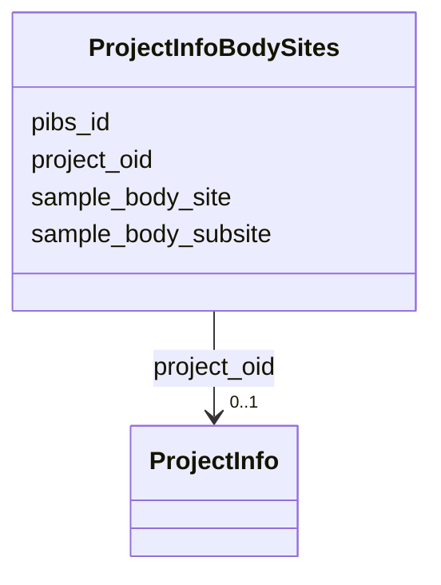

# Class: ProjectInfoBodySites 


URI: [imgsg_dev:ProjectInfoBodySites](https://w3id.org/jgi/imgsg_dev/ProjectInfoBodySites)





<!-- no inheritance hierarchy -->


## Slots

| Name | Cardinality and Range | Description | Inheritance |
| ---  | --- | --- | --- |
| [pibs_id](pibs_id.md) | 0..1 <br/> [Integer](Integer.md) |  | direct |
| [project_oid](project_oid.md) | 0..1 <br/> [ProjectInfo](ProjectInfo.md) | Foreign key to project_info | direct |
| [sample_body_site](sample_body_site.md) | 0..1 <br/> [String](String.md) |  | direct |
| [sample_body_subsite](sample_body_subsite.md) | 0..1 <br/> [String](String.md) |  | direct |


## Identifier and Mapping Information


### Schema Source


* from schema: https://w3id.org/jgi/imgsg_dev


## Mappings

| Mapping Type | Mapped Value |
| ---  | ---  |
| self | imgsg_dev:ProjectInfoBodySites |
| native | imgsg_dev:ProjectInfoBodySites |


## LinkML Source

<!-- TODO: investigate https://stackoverflow.com/questions/37606292/how-to-create-tabbed-code-blocks-in-mkdocs-or-sphinx -->

### Direct

<details>
```yaml
name: project_info_body_sites
from_schema: https://w3id.org/jgi/imgsg_dev
attributes:
  pibs_id:
    name: pibs_id
    from_schema: https://w3id.org/jgi/imgsg_dev
    rank: 1000
    domain_of:
    - project_info_body_sites
    range: integer
    required: false
  project_oid:
    name: project_oid
    description: Foreign key to project_info
    from_schema: https://w3id.org/jgi/imgsg_dev
    domain_of:
    - bioproject_propagation
    - biosample
    - data_quality_flags
    - env_sample_soil_metadata
    - genbank_refseq_crossover
    - gold_analysis_project_lookup
    - gold_analysis_project_lookup2
    - gold_img_nat_prod_entity
    - ncbi_accessions
    - ncbi_accessions_jbtest
    - proj_info_cell_arrange_042014
    - project_info
    - project_info_04112013
    - project_info_bioproject
    - project_info_body_products
    - project_info_body_sites
    - project_info_cell_arrangement
    - project_info_collaborators
    - project_info_cyano_metadata
    - project_info_data_links
    - project_info_data_links_112013
    - project_info_diseases
    - project_info_energy_source
    - project_info_habitat
    - project_info_jgi_url
    - project_info_metabolism
    - project_info_natural_prods
    - project_info_nitrogen_fixation
    - project_info_nprods_metadata
    - project_info_phenotypes
    - project_info_project_relevance
    - project_info_seq_method
    - project_meta_updates
    - study_load
    - t_alex_test
    - t_all_gold_jgi_projects
    range: project_info
    required: false
  sample_body_site:
    name: sample_body_site
    from_schema: https://w3id.org/jgi/imgsg_dev
    domain_of:
    - gold_sequencing_project
    - project_info_body_sites
    range: string
    required: false
  sample_body_subsite:
    name: sample_body_subsite
    from_schema: https://w3id.org/jgi/imgsg_dev
    domain_of:
    - gold_sequencing_project
    - project_info_body_sites
    range: string
    required: false

```
</details>

### Induced

<details>
```yaml
name: project_info_body_sites
from_schema: https://w3id.org/jgi/imgsg_dev
attributes:
  pibs_id:
    name: pibs_id
    from_schema: https://w3id.org/jgi/imgsg_dev
    rank: 1000
    alias: pibs_id
    owner: project_info_body_sites
    domain_of:
    - project_info_body_sites
    range: integer
    required: false
  project_oid:
    name: project_oid
    description: Foreign key to project_info
    from_schema: https://w3id.org/jgi/imgsg_dev
    alias: project_oid
    owner: project_info_body_sites
    domain_of:
    - bioproject_propagation
    - biosample
    - data_quality_flags
    - env_sample_soil_metadata
    - genbank_refseq_crossover
    - gold_analysis_project_lookup
    - gold_analysis_project_lookup2
    - gold_img_nat_prod_entity
    - ncbi_accessions
    - ncbi_accessions_jbtest
    - proj_info_cell_arrange_042014
    - project_info
    - project_info_04112013
    - project_info_bioproject
    - project_info_body_products
    - project_info_body_sites
    - project_info_cell_arrangement
    - project_info_collaborators
    - project_info_cyano_metadata
    - project_info_data_links
    - project_info_data_links_112013
    - project_info_diseases
    - project_info_energy_source
    - project_info_habitat
    - project_info_jgi_url
    - project_info_metabolism
    - project_info_natural_prods
    - project_info_nitrogen_fixation
    - project_info_nprods_metadata
    - project_info_phenotypes
    - project_info_project_relevance
    - project_info_seq_method
    - project_meta_updates
    - study_load
    - t_alex_test
    - t_all_gold_jgi_projects
    range: project_info
    required: false
  sample_body_site:
    name: sample_body_site
    from_schema: https://w3id.org/jgi/imgsg_dev
    alias: sample_body_site
    owner: project_info_body_sites
    domain_of:
    - gold_sequencing_project
    - project_info_body_sites
    range: string
    required: false
  sample_body_subsite:
    name: sample_body_subsite
    from_schema: https://w3id.org/jgi/imgsg_dev
    alias: sample_body_subsite
    owner: project_info_body_sites
    domain_of:
    - gold_sequencing_project
    - project_info_body_sites
    range: string
    required: false

```
</details>