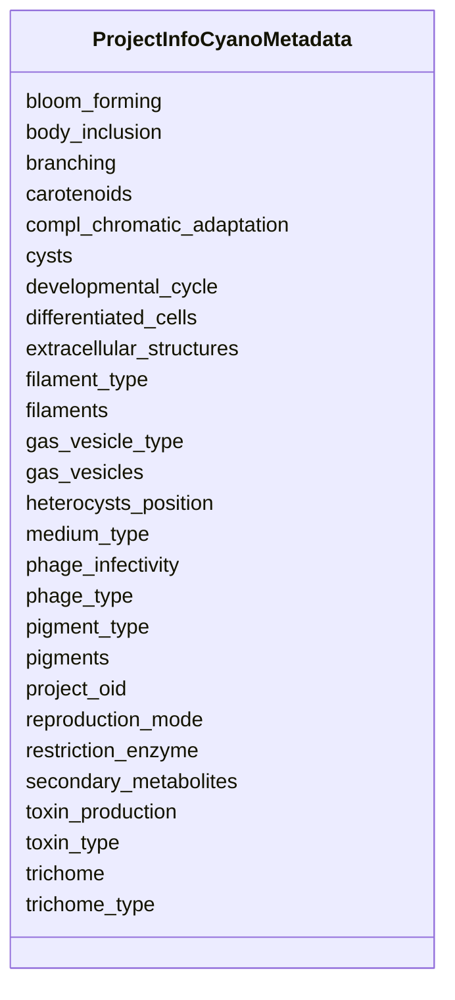

# Class: ProjectInfoCyanoMetadata 


URI: [imgsg_dev:ProjectInfoCyanoMetadata](https://w3id.org/jgi/imgsg_dev/ProjectInfoCyanoMetadata)





<!-- no inheritance hierarchy -->


## Slots

| Name | Cardinality and Range | Description | Inheritance |
| ---  | --- | --- | --- |
| [project_oid](project_oid.md) | 0..1 <br/> [Integer](Integer.md) |  | direct |
| [filaments](filaments.md) | 0..1 <br/> [String](String.md) |  | direct |
| [cysts](cysts.md) | 0..1 <br/> [String](String.md) |  | direct |
| [differentiated_cells](differentiated_cells.md) | 0..1 <br/> [String](String.md) |  | direct |
| [heterocysts_position](heterocysts_position.md) | 0..1 <br/> [String](String.md) |  | direct |
| [reproduction_mode](reproduction_mode.md) | 0..1 <br/> [String](String.md) |  | direct |
| [trichome](trichome.md) | 0..1 <br/> [String](String.md) |  | direct |
| [trichome_type](trichome_type.md) | 0..1 <br/> [String](String.md) |  | direct |
| [pigments](pigments.md) | 0..1 <br/> [String](String.md) |  | direct |
| [phage_infectivity](phage_infectivity.md) | 0..1 <br/> [String](String.md) |  | direct |
| [phage_type](phage_type.md) | 0..1 <br/> [String](String.md) |  | direct |
| [carotenoids](carotenoids.md) | 0..1 <br/> [String](String.md) |  | direct |
| [restriction_enzyme](restriction_enzyme.md) | 0..1 <br/> [String](String.md) |  | direct |
| [toxin_production](toxin_production.md) | 0..1 <br/> [String](String.md) |  | direct |
| [toxin_type](toxin_type.md) | 0..1 <br/> [String](String.md) |  | direct |
| [developmental_cycle](developmental_cycle.md) | 0..1 <br/> [String](String.md) |  | direct |
| [branching](branching.md) | 0..1 <br/> [String](String.md) |  | direct |
| [gas_vesicles](gas_vesicles.md) | 0..1 <br/> [String](String.md) |  | direct |
| [gas_vesicle_type](gas_vesicle_type.md) | 0..1 <br/> [String](String.md) |  | direct |
| [body_inclusion](body_inclusion.md) | 0..1 <br/> [String](String.md) |  | direct |
| [secondary_metabolites](secondary_metabolites.md) | 0..1 <br/> [String](String.md) |  | direct |
| [extracellular_structures](extracellular_structures.md) | 0..1 <br/> [String](String.md) |  | direct |
| [bloom_forming](bloom_forming.md) | 0..1 <br/> [String](String.md) |  | direct |
| [pigment_type](pigment_type.md) | 0..1 <br/> [String](String.md) |  | direct |
| [compl_chromatic_adaptation](compl_chromatic_adaptation.md) | 0..1 <br/> [String](String.md) |  | direct |
| [medium_type](medium_type.md) | 0..1 <br/> [String](String.md) |  | direct |
| [filament_type](filament_type.md) | 0..1 <br/> [String](String.md) |  | direct |


## Identifier and Mapping Information


### Schema Source


* from schema: https://w3id.org/jgi/imgsg_dev


## Mappings

| Mapping Type | Mapped Value |
| ---  | ---  |
| self | imgsg_dev:ProjectInfoCyanoMetadata |
| native | imgsg_dev:ProjectInfoCyanoMetadata |


## LinkML Source

<!-- TODO: investigate https://stackoverflow.com/questions/37606292/how-to-create-tabbed-code-blocks-in-mkdocs-or-sphinx -->

### Direct

<details>
```yaml
name: project_info_cyano_metadata
from_schema: https://w3id.org/jgi/imgsg_dev
attributes:
  project_oid:
    name: project_oid
    from_schema: https://w3id.org/jgi/imgsg_dev
    domain_of:
    - bioproject_propagation
    - biosample
    - data_quality_flags
    - env_sample_soil_metadata
    - genbank_refseq_crossover
    - gold_analysis_project_lookup
    - gold_analysis_project_lookup2
    - gold_img_nat_prod_entity
    - ncbi_accessions
    - ncbi_accessions_jbtest
    - proj_info_cell_arrange_042014
    - project_info
    - project_info_04112013
    - project_info_bioproject
    - project_info_body_products
    - project_info_body_sites
    - project_info_cell_arrangement
    - project_info_collaborators
    - project_info_cyano_metadata
    - project_info_data_links
    - project_info_data_links_112013
    - project_info_diseases
    - project_info_energy_source
    - project_info_habitat
    - project_info_jgi_url
    - project_info_metabolism
    - project_info_natural_prods
    - project_info_nitrogen_fixation
    - project_info_nprods_metadata
    - project_info_phenotypes
    - project_info_project_relevance
    - project_info_seq_method
    - project_meta_updates
    - study_load
    - t_alex_test
    - t_all_gold_jgi_projects
    range: integer
    required: false
  filaments:
    name: filaments
    from_schema: https://w3id.org/jgi/imgsg_dev
    rank: 1000
    domain_of:
    - project_info_cyano_metadata
    range: string
    required: false
  cysts:
    name: cysts
    from_schema: https://w3id.org/jgi/imgsg_dev
    rank: 1000
    domain_of:
    - project_info_cyano_metadata
    range: string
    required: false
  differentiated_cells:
    name: differentiated_cells
    from_schema: https://w3id.org/jgi/imgsg_dev
    rank: 1000
    domain_of:
    - project_info_cyano_metadata
    range: string
    required: false
  heterocysts_position:
    name: heterocysts_position
    from_schema: https://w3id.org/jgi/imgsg_dev
    rank: 1000
    domain_of:
    - project_info_cyano_metadata
    range: string
    required: false
  reproduction_mode:
    name: reproduction_mode
    from_schema: https://w3id.org/jgi/imgsg_dev
    rank: 1000
    domain_of:
    - project_info_cyano_metadata
    range: string
    required: false
  trichome:
    name: trichome
    from_schema: https://w3id.org/jgi/imgsg_dev
    rank: 1000
    domain_of:
    - project_info_cyano_metadata
    range: string
    required: false
  trichome_type:
    name: trichome_type
    from_schema: https://w3id.org/jgi/imgsg_dev
    rank: 1000
    domain_of:
    - project_info_cyano_metadata
    range: string
    required: false
  pigments:
    name: pigments
    from_schema: https://w3id.org/jgi/imgsg_dev
    rank: 1000
    domain_of:
    - project_info_cyano_metadata
    range: string
    required: false
  phage_infectivity:
    name: phage_infectivity
    from_schema: https://w3id.org/jgi/imgsg_dev
    rank: 1000
    domain_of:
    - project_info_cyano_metadata
    range: string
    required: false
  phage_type:
    name: phage_type
    from_schema: https://w3id.org/jgi/imgsg_dev
    rank: 1000
    domain_of:
    - project_info_cyano_metadata
    range: string
    required: false
  carotenoids:
    name: carotenoids
    from_schema: https://w3id.org/jgi/imgsg_dev
    rank: 1000
    domain_of:
    - project_info_cyano_metadata
    range: string
    required: false
  restriction_enzyme:
    name: restriction_enzyme
    from_schema: https://w3id.org/jgi/imgsg_dev
    rank: 1000
    domain_of:
    - project_info_cyano_metadata
    range: string
    required: false
  toxin_production:
    name: toxin_production
    from_schema: https://w3id.org/jgi/imgsg_dev
    rank: 1000
    domain_of:
    - project_info_cyano_metadata
    range: string
    required: false
  toxin_type:
    name: toxin_type
    from_schema: https://w3id.org/jgi/imgsg_dev
    rank: 1000
    domain_of:
    - project_info_cyano_metadata
    range: string
    required: false
  developmental_cycle:
    name: developmental_cycle
    from_schema: https://w3id.org/jgi/imgsg_dev
    rank: 1000
    domain_of:
    - project_info_cyano_metadata
    range: string
    required: false
  branching:
    name: branching
    from_schema: https://w3id.org/jgi/imgsg_dev
    rank: 1000
    domain_of:
    - project_info_cyano_metadata
    range: string
    required: false
  gas_vesicles:
    name: gas_vesicles
    from_schema: https://w3id.org/jgi/imgsg_dev
    rank: 1000
    domain_of:
    - project_info_cyano_metadata
    range: string
    required: false
  gas_vesicle_type:
    name: gas_vesicle_type
    from_schema: https://w3id.org/jgi/imgsg_dev
    rank: 1000
    domain_of:
    - project_info_cyano_metadata
    range: string
    required: false
  body_inclusion:
    name: body_inclusion
    from_schema: https://w3id.org/jgi/imgsg_dev
    rank: 1000
    domain_of:
    - project_info_cyano_metadata
    range: string
    required: false
  secondary_metabolites:
    name: secondary_metabolites
    from_schema: https://w3id.org/jgi/imgsg_dev
    rank: 1000
    domain_of:
    - project_info_cyano_metadata
    range: string
    required: false
  extracellular_structures:
    name: extracellular_structures
    from_schema: https://w3id.org/jgi/imgsg_dev
    rank: 1000
    domain_of:
    - project_info_cyano_metadata
    range: string
    required: false
  bloom_forming:
    name: bloom_forming
    from_schema: https://w3id.org/jgi/imgsg_dev
    rank: 1000
    domain_of:
    - project_info_cyano_metadata
    range: string
    required: false
  pigment_type:
    name: pigment_type
    from_schema: https://w3id.org/jgi/imgsg_dev
    rank: 1000
    domain_of:
    - project_info_cyano_metadata
    range: string
    required: false
  compl_chromatic_adaptation:
    name: compl_chromatic_adaptation
    from_schema: https://w3id.org/jgi/imgsg_dev
    rank: 1000
    domain_of:
    - project_info_cyano_metadata
    range: string
    required: false
  medium_type:
    name: medium_type
    from_schema: https://w3id.org/jgi/imgsg_dev
    rank: 1000
    domain_of:
    - project_info_cyano_metadata
    range: string
    required: false
  filament_type:
    name: filament_type
    from_schema: https://w3id.org/jgi/imgsg_dev
    rank: 1000
    domain_of:
    - project_info_cyano_metadata
    range: string
    required: false

```
</details>

### Induced

<details>
```yaml
name: project_info_cyano_metadata
from_schema: https://w3id.org/jgi/imgsg_dev
attributes:
  project_oid:
    name: project_oid
    from_schema: https://w3id.org/jgi/imgsg_dev
    alias: project_oid
    owner: project_info_cyano_metadata
    domain_of:
    - bioproject_propagation
    - biosample
    - data_quality_flags
    - env_sample_soil_metadata
    - genbank_refseq_crossover
    - gold_analysis_project_lookup
    - gold_analysis_project_lookup2
    - gold_img_nat_prod_entity
    - ncbi_accessions
    - ncbi_accessions_jbtest
    - proj_info_cell_arrange_042014
    - project_info
    - project_info_04112013
    - project_info_bioproject
    - project_info_body_products
    - project_info_body_sites
    - project_info_cell_arrangement
    - project_info_collaborators
    - project_info_cyano_metadata
    - project_info_data_links
    - project_info_data_links_112013
    - project_info_diseases
    - project_info_energy_source
    - project_info_habitat
    - project_info_jgi_url
    - project_info_metabolism
    - project_info_natural_prods
    - project_info_nitrogen_fixation
    - project_info_nprods_metadata
    - project_info_phenotypes
    - project_info_project_relevance
    - project_info_seq_method
    - project_meta_updates
    - study_load
    - t_alex_test
    - t_all_gold_jgi_projects
    range: integer
    required: false
  filaments:
    name: filaments
    from_schema: https://w3id.org/jgi/imgsg_dev
    rank: 1000
    alias: filaments
    owner: project_info_cyano_metadata
    domain_of:
    - project_info_cyano_metadata
    range: string
    required: false
  cysts:
    name: cysts
    from_schema: https://w3id.org/jgi/imgsg_dev
    rank: 1000
    alias: cysts
    owner: project_info_cyano_metadata
    domain_of:
    - project_info_cyano_metadata
    range: string
    required: false
  differentiated_cells:
    name: differentiated_cells
    from_schema: https://w3id.org/jgi/imgsg_dev
    rank: 1000
    alias: differentiated_cells
    owner: project_info_cyano_metadata
    domain_of:
    - project_info_cyano_metadata
    range: string
    required: false
  heterocysts_position:
    name: heterocysts_position
    from_schema: https://w3id.org/jgi/imgsg_dev
    rank: 1000
    alias: heterocysts_position
    owner: project_info_cyano_metadata
    domain_of:
    - project_info_cyano_metadata
    range: string
    required: false
  reproduction_mode:
    name: reproduction_mode
    from_schema: https://w3id.org/jgi/imgsg_dev
    rank: 1000
    alias: reproduction_mode
    owner: project_info_cyano_metadata
    domain_of:
    - project_info_cyano_metadata
    range: string
    required: false
  trichome:
    name: trichome
    from_schema: https://w3id.org/jgi/imgsg_dev
    rank: 1000
    alias: trichome
    owner: project_info_cyano_metadata
    domain_of:
    - project_info_cyano_metadata
    range: string
    required: false
  trichome_type:
    name: trichome_type
    from_schema: https://w3id.org/jgi/imgsg_dev
    rank: 1000
    alias: trichome_type
    owner: project_info_cyano_metadata
    domain_of:
    - project_info_cyano_metadata
    range: string
    required: false
  pigments:
    name: pigments
    from_schema: https://w3id.org/jgi/imgsg_dev
    rank: 1000
    alias: pigments
    owner: project_info_cyano_metadata
    domain_of:
    - project_info_cyano_metadata
    range: string
    required: false
  phage_infectivity:
    name: phage_infectivity
    from_schema: https://w3id.org/jgi/imgsg_dev
    rank: 1000
    alias: phage_infectivity
    owner: project_info_cyano_metadata
    domain_of:
    - project_info_cyano_metadata
    range: string
    required: false
  phage_type:
    name: phage_type
    from_schema: https://w3id.org/jgi/imgsg_dev
    rank: 1000
    alias: phage_type
    owner: project_info_cyano_metadata
    domain_of:
    - project_info_cyano_metadata
    range: string
    required: false
  carotenoids:
    name: carotenoids
    from_schema: https://w3id.org/jgi/imgsg_dev
    rank: 1000
    alias: carotenoids
    owner: project_info_cyano_metadata
    domain_of:
    - project_info_cyano_metadata
    range: string
    required: false
  restriction_enzyme:
    name: restriction_enzyme
    from_schema: https://w3id.org/jgi/imgsg_dev
    rank: 1000
    alias: restriction_enzyme
    owner: project_info_cyano_metadata
    domain_of:
    - project_info_cyano_metadata
    range: string
    required: false
  toxin_production:
    name: toxin_production
    from_schema: https://w3id.org/jgi/imgsg_dev
    rank: 1000
    alias: toxin_production
    owner: project_info_cyano_metadata
    domain_of:
    - project_info_cyano_metadata
    range: string
    required: false
  toxin_type:
    name: toxin_type
    from_schema: https://w3id.org/jgi/imgsg_dev
    rank: 1000
    alias: toxin_type
    owner: project_info_cyano_metadata
    domain_of:
    - project_info_cyano_metadata
    range: string
    required: false
  developmental_cycle:
    name: developmental_cycle
    from_schema: https://w3id.org/jgi/imgsg_dev
    rank: 1000
    alias: developmental_cycle
    owner: project_info_cyano_metadata
    domain_of:
    - project_info_cyano_metadata
    range: string
    required: false
  branching:
    name: branching
    from_schema: https://w3id.org/jgi/imgsg_dev
    rank: 1000
    alias: branching
    owner: project_info_cyano_metadata
    domain_of:
    - project_info_cyano_metadata
    range: string
    required: false
  gas_vesicles:
    name: gas_vesicles
    from_schema: https://w3id.org/jgi/imgsg_dev
    rank: 1000
    alias: gas_vesicles
    owner: project_info_cyano_metadata
    domain_of:
    - project_info_cyano_metadata
    range: string
    required: false
  gas_vesicle_type:
    name: gas_vesicle_type
    from_schema: https://w3id.org/jgi/imgsg_dev
    rank: 1000
    alias: gas_vesicle_type
    owner: project_info_cyano_metadata
    domain_of:
    - project_info_cyano_metadata
    range: string
    required: false
  body_inclusion:
    name: body_inclusion
    from_schema: https://w3id.org/jgi/imgsg_dev
    rank: 1000
    alias: body_inclusion
    owner: project_info_cyano_metadata
    domain_of:
    - project_info_cyano_metadata
    range: string
    required: false
  secondary_metabolites:
    name: secondary_metabolites
    from_schema: https://w3id.org/jgi/imgsg_dev
    rank: 1000
    alias: secondary_metabolites
    owner: project_info_cyano_metadata
    domain_of:
    - project_info_cyano_metadata
    range: string
    required: false
  extracellular_structures:
    name: extracellular_structures
    from_schema: https://w3id.org/jgi/imgsg_dev
    rank: 1000
    alias: extracellular_structures
    owner: project_info_cyano_metadata
    domain_of:
    - project_info_cyano_metadata
    range: string
    required: false
  bloom_forming:
    name: bloom_forming
    from_schema: https://w3id.org/jgi/imgsg_dev
    rank: 1000
    alias: bloom_forming
    owner: project_info_cyano_metadata
    domain_of:
    - project_info_cyano_metadata
    range: string
    required: false
  pigment_type:
    name: pigment_type
    from_schema: https://w3id.org/jgi/imgsg_dev
    rank: 1000
    alias: pigment_type
    owner: project_info_cyano_metadata
    domain_of:
    - project_info_cyano_metadata
    range: string
    required: false
  compl_chromatic_adaptation:
    name: compl_chromatic_adaptation
    from_schema: https://w3id.org/jgi/imgsg_dev
    rank: 1000
    alias: compl_chromatic_adaptation
    owner: project_info_cyano_metadata
    domain_of:
    - project_info_cyano_metadata
    range: string
    required: false
  medium_type:
    name: medium_type
    from_schema: https://w3id.org/jgi/imgsg_dev
    rank: 1000
    alias: medium_type
    owner: project_info_cyano_metadata
    domain_of:
    - project_info_cyano_metadata
    range: string
    required: false
  filament_type:
    name: filament_type
    from_schema: https://w3id.org/jgi/imgsg_dev
    rank: 1000
    alias: filament_type
    owner: project_info_cyano_metadata
    domain_of:
    - project_info_cyano_metadata
    range: string
    required: false

```
</details>