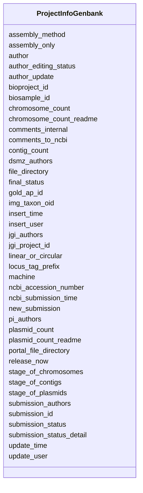

# Class: ProjectInfoGenbank 


URI: [imgsg_dev:ProjectInfoGenbank](https://w3id.org/jgi/imgsg_dev/ProjectInfoGenbank)





<!-- no inheritance hierarchy -->


## Slots

| Name | Cardinality and Range | Description | Inheritance |
| ---  | --- | --- | --- |
| [jgi_project_id](jgi_project_id.md) | 0..1 <br/> [Integer](Integer.md) |  | direct |
| [biosample_id](biosample_id.md) | 0..1 <br/> [Integer](Integer.md) |  | direct |
| [chromosome_count](chromosome_count.md) | 0..1 <br/> [Integer](Integer.md) |  | direct |
| [plasmid_count](plasmid_count.md) | 0..1 <br/> [Integer](Integer.md) |  | direct |
| [author](author.md) | 0..1 <br/> [String](String.md) |  | direct |
| [linear_or_circular](linear_or_circular.md) | 0..1 <br/> [String](String.md) |  | direct |
| [final_status](final_status.md) | 0..1 <br/> [String](String.md) |  | direct |
| [assembly_method](assembly_method.md) | 0..1 <br/> [String](String.md) |  | direct |
| [file_directory](file_directory.md) | 0..1 <br/> [String](String.md) |  | direct |
| [contig_count](contig_count.md) | 0..1 <br/> [Integer](Integer.md) |  | direct |
| [stage_of_contigs](stage_of_contigs.md) | 0..1 <br/> [String](String.md) |  | direct |
| [stage_of_chromosomes](stage_of_chromosomes.md) | 0..1 <br/> [String](String.md) |  | direct |
| [stage_of_plasmids](stage_of_plasmids.md) | 0..1 <br/> [String](String.md) |  | direct |
| [chromosome_count_readme](chromosome_count_readme.md) | 0..1 <br/> [Integer](Integer.md) |  | direct |
| [plasmid_count_readme](plasmid_count_readme.md) | 0..1 <br/> [Integer](Integer.md) |  | direct |
| [bioproject_id](bioproject_id.md) | 0..1 <br/> [Integer](Integer.md) |  | direct |
| [submission_status](submission_status.md) | 0..1 <br/> [String](String.md) |  | direct |
| [machine](machine.md) | 0..1 <br/> [String](String.md) |  | direct |
| [locus_tag_prefix](locus_tag_prefix.md) | 0..1 <br/> [String](String.md) |  | direct |
| [jgi_authors](jgi_authors.md) | 0..1 <br/> [String](String.md) |  | direct |
| [dsmz_authors](dsmz_authors.md) | 0..1 <br/> [String](String.md) |  | direct |
| [pi_authors](pi_authors.md) | 0..1 <br/> [String](String.md) |  | direct |
| [author_editing_status](author_editing_status.md) | 0..1 <br/> [String](String.md) |  | direct |
| [img_taxon_oid](img_taxon_oid.md) | 0..1 <br/> [Integer](Integer.md) |  | direct |
| [comments_to_ncbi](comments_to_ncbi.md) | 0..1 <br/> [String](String.md) |  | direct |
| [submission_id](submission_id.md) | 0..1 <br/> [Integer](Integer.md) |  | direct |
| [release_now](release_now.md) | 0..1 <br/> [Integer](Integer.md) |  | direct |
| [new_submission](new_submission.md) | 0..1 <br/> [Integer](Integer.md) |  | direct |
| [comments_internal](comments_internal.md) | 0..1 <br/> [String](String.md) |  | direct |
| [assembly_only](assembly_only.md) | 0..1 <br/> [Integer](Integer.md) |  | direct |
| [ncbi_accession_number](ncbi_accession_number.md) | 0..1 <br/> [String](String.md) |  | direct |
| [portal_file_directory](portal_file_directory.md) | 0..1 <br/> [String](String.md) |  | direct |
| [insert_user](insert_user.md) | 0..1 <br/> [String](String.md) |  | direct |
| [insert_time](insert_time.md) | 0..1 <br/> [Datetime](Datetime.md) |  | direct |
| [update_user](update_user.md) | 0..1 <br/> [String](String.md) |  | direct |
| [update_time](update_time.md) | 0..1 <br/> [Datetime](Datetime.md) |  | direct |
| [submission_status_detail](submission_status_detail.md) | 0..1 <br/> [String](String.md) |  | direct |
| [author_update](author_update.md) | 0..1 <br/> [Integer](Integer.md) |  | direct |
| [submission_authors](submission_authors.md) | 0..1 <br/> [String](String.md) |  | direct |
| [ncbi_submission_time](ncbi_submission_time.md) | 0..1 <br/> [Datetime](Datetime.md) |  | direct |
| [gold_ap_id](gold_ap_id.md) | 0..1 <br/> [String](String.md) |  | direct |


## Identifier and Mapping Information


### Schema Source


* from schema: https://w3id.org/jgi/imgsg_dev


## Mappings

| Mapping Type | Mapped Value |
| ---  | ---  |
| self | imgsg_dev:ProjectInfoGenbank |
| native | imgsg_dev:ProjectInfoGenbank |


## LinkML Source

<!-- TODO: investigate https://stackoverflow.com/questions/37606292/how-to-create-tabbed-code-blocks-in-mkdocs-or-sphinx -->

### Direct

<details>
```yaml
name: project_info_genbank
from_schema: https://w3id.org/jgi/imgsg_dev
attributes:
  jgi_project_id:
    name: jgi_project_id
    from_schema: https://w3id.org/jgi/imgsg_dev
    domain_of:
    - lanl_project
    - ornl_project
    - pig_reruns
    - pig_retractions
    - pig_tracks
    - project_info_bioproject
    - project_info_biosample
    - project_info_genbank
    - t_jgi_catalogue
    range: integer
    required: false
  biosample_id:
    name: biosample_id
    from_schema: https://w3id.org/jgi/imgsg_dev
    domain_of:
    - biosample
    - pig_tracks
    - project_info_genbank
    range: integer
    required: false
  chromosome_count:
    name: chromosome_count
    from_schema: https://w3id.org/jgi/imgsg_dev
    domain_of:
    - env_sample
    - pig_tracks
    - project_info
    - project_info_04112013
    - project_info_genbank
    - vsample
    range: integer
    required: false
  plasmid_count:
    name: plasmid_count
    from_schema: https://w3id.org/jgi/imgsg_dev
    domain_of:
    - env_sample
    - pig_tracks
    - project_info
    - project_info_04112013
    - project_info_genbank
    - vsample
    range: integer
    required: false
  author:
    name: author
    from_schema: https://w3id.org/jgi/imgsg_dev
    domain_of:
    - pig_tracks
    - project_info_genbank
    range: string
    required: false
  linear_or_circular:
    name: linear_or_circular
    from_schema: https://w3id.org/jgi/imgsg_dev
    domain_of:
    - pig_tracks
    - project_info_genbank
    range: string
    required: false
  final_status:
    name: final_status
    from_schema: https://w3id.org/jgi/imgsg_dev
    domain_of:
    - pig_tracks
    - project_info_genbank
    range: string
    required: false
  assembly_method:
    name: assembly_method
    from_schema: https://w3id.org/jgi/imgsg_dev
    domain_of:
    - env_sample
    - gold_analysis_project
    - pig_tracks
    - project_info
    - project_info_04112013
    - project_info_genbank
    - vsample
    range: string
    required: false
  file_directory:
    name: file_directory
    from_schema: https://w3id.org/jgi/imgsg_dev
    domain_of:
    - pig_tracks
    - project_info_genbank
    range: string
    required: false
  contig_count:
    name: contig_count
    from_schema: https://w3id.org/jgi/imgsg_dev
    domain_of:
    - env_sample
    - gold_analysis_project
    - pig_tracks
    - project_info
    - project_info_04112013
    - project_info_genbank
    - v5_ap_imperfect_view
    - vsample
    range: integer
    required: false
  stage_of_contigs:
    name: stage_of_contigs
    from_schema: https://w3id.org/jgi/imgsg_dev
    domain_of:
    - pig_tracks
    - project_info_genbank
    range: string
    required: false
  stage_of_chromosomes:
    name: stage_of_chromosomes
    from_schema: https://w3id.org/jgi/imgsg_dev
    domain_of:
    - pig_tracks
    - project_info_genbank
    range: string
    required: false
  stage_of_plasmids:
    name: stage_of_plasmids
    from_schema: https://w3id.org/jgi/imgsg_dev
    domain_of:
    - pig_tracks
    - project_info_genbank
    range: string
    required: false
  chromosome_count_readme:
    name: chromosome_count_readme
    from_schema: https://w3id.org/jgi/imgsg_dev
    domain_of:
    - pig_tracks
    - project_info_genbank
    range: integer
    required: false
  plasmid_count_readme:
    name: plasmid_count_readme
    from_schema: https://w3id.org/jgi/imgsg_dev
    domain_of:
    - pig_tracks
    - project_info_genbank
    range: integer
    required: false
  bioproject_id:
    name: bioproject_id
    from_schema: https://w3id.org/jgi/imgsg_dev
    domain_of:
    - load_genbank_prok_data
    - pig_genbank_emailed_accs
    - pig_retractions
    - pig_tracks
    - project_info_genbank
    range: integer
    required: false
  submission_status:
    name: submission_status
    from_schema: https://w3id.org/jgi/imgsg_dev
    domain_of:
    - pig_tracks
    - project_info_bioproject
    - project_info_biosample
    - project_info_genbank
    range: string
    required: false
  machine:
    name: machine
    from_schema: https://w3id.org/jgi/imgsg_dev
    domain_of:
    - pig_tracks
    - project_info_bioproject
    - project_info_biosample
    - project_info_genbank
    range: string
    required: false
  locus_tag_prefix:
    name: locus_tag_prefix
    from_schema: https://w3id.org/jgi/imgsg_dev
    domain_of:
    - env_sample
    - pig_tracks
    - project_info_bioproject
    - project_info_biosample
    - project_info_genbank
    range: string
    required: false
  jgi_authors:
    name: jgi_authors
    from_schema: https://w3id.org/jgi/imgsg_dev
    domain_of:
    - pig_tracks
    - project_info_genbank
    - project_info_genbank_authors
    range: string
    required: false
  dsmz_authors:
    name: dsmz_authors
    from_schema: https://w3id.org/jgi/imgsg_dev
    domain_of:
    - pig_tracks
    - project_info_genbank
    range: string
    required: false
  pi_authors:
    name: pi_authors
    from_schema: https://w3id.org/jgi/imgsg_dev
    domain_of:
    - pig_tracks
    - project_info_genbank
    range: string
    required: false
  author_editing_status:
    name: author_editing_status
    from_schema: https://w3id.org/jgi/imgsg_dev
    domain_of:
    - pig_tracks
    - project_info_genbank
    range: string
    required: false
  img_taxon_oid:
    name: img_taxon_oid
    from_schema: https://w3id.org/jgi/imgsg_dev
    domain_of:
    - gold_sequencing_project
    - pig_retractions
    - pig_tracks
    - project_info_genbank
    - submission
    range: integer
    required: false
  comments_to_ncbi:
    name: comments_to_ncbi
    from_schema: https://w3id.org/jgi/imgsg_dev
    domain_of:
    - pig_tracks
    - project_info_genbank
    range: string
    required: false
  submission_id:
    name: submission_id
    from_schema: https://w3id.org/jgi/imgsg_dev
    domain_of:
    - annotation_contigs_proteins_counts
    - annotation_job_sbatch_args
    - annotation_job_stats
    - annotation_step_stats
    - bad_depth_file_warnings
    - bioproject_propagation
    - gold_analysis_project
    - mer_submissions_queue
    - merfs_aggregate_file_size
    - phajek_test
    - pig_tracks
    - project_info_bioproject
    - project_info_biosample
    - project_info_genbank
    - rnaseq_notify_phajek
    - rnaseq_notify_phajek_dev
    - submission
    - submission_data_files
    - submission_data_files_dmpath
    - submission_history
    - submission_img_contacts
    - submission_proc_stats
    - submission_proc_steps
    - submission_reads_file
    - submission_samples
    - t1_audit
    - v5_ap_imperfect_view
    range: integer
    required: false
  release_now:
    name: release_now
    from_schema: https://w3id.org/jgi/imgsg_dev
    domain_of:
    - pig_tracks
    - project_info_genbank
    range: integer
    required: false
  new_submission:
    name: new_submission
    from_schema: https://w3id.org/jgi/imgsg_dev
    domain_of:
    - pig_tracks
    - project_info_genbank
    range: integer
    required: false
  comments_internal:
    name: comments_internal
    from_schema: https://w3id.org/jgi/imgsg_dev
    domain_of:
    - pig_tracks
    - project_info_genbank
    range: string
    required: false
  assembly_only:
    name: assembly_only
    from_schema: https://w3id.org/jgi/imgsg_dev
    domain_of:
    - pig_tracks
    - project_info_genbank
    range: integer
    required: false
  ncbi_accession_number:
    name: ncbi_accession_number
    from_schema: https://w3id.org/jgi/imgsg_dev
    domain_of:
    - pig_genbank_emailed_accs
    - pig_retractions
    - pig_tracks
    - project_info_bioproject
    - project_info_biosample
    - project_info_genbank
    range: string
    required: false
  portal_file_directory:
    name: portal_file_directory
    from_schema: https://w3id.org/jgi/imgsg_dev
    domain_of:
    - pig_tracks
    - project_info_genbank
    range: string
    required: false
  insert_user:
    name: insert_user
    from_schema: https://w3id.org/jgi/imgsg_dev
    domain_of:
    - pig_genbank_emailed_accs
    - pig_reruns
    - pig_retractions
    - pig_tracks
    - project_info_genbank
    range: string
    required: false
  insert_time:
    name: insert_time
    from_schema: https://w3id.org/jgi/imgsg_dev
    domain_of:
    - pig_genbank_emailed_accs
    - pig_reruns
    - pig_retractions
    - pig_tracks
    - project_info_genbank
    range: datetime
    required: false
  update_user:
    name: update_user
    from_schema: https://w3id.org/jgi/imgsg_dev
    domain_of:
    - pig_genbank_emailed_accs
    - pig_reruns
    - pig_retractions
    - pig_tracks
    - project_info_genbank
    range: string
    required: false
  update_time:
    name: update_time
    from_schema: https://w3id.org/jgi/imgsg_dev
    domain_of:
    - pig_genbank_emailed_accs
    - pig_reruns
    - pig_retractions
    - pig_tracks
    - project_info_genbank
    range: datetime
    required: false
  submission_status_detail:
    name: submission_status_detail
    from_schema: https://w3id.org/jgi/imgsg_dev
    domain_of:
    - pig_tracks
    - project_info_genbank
    range: string
    required: false
  author_update:
    name: author_update
    from_schema: https://w3id.org/jgi/imgsg_dev
    domain_of:
    - pig_tracks
    - project_info_genbank
    range: integer
    required: false
  submission_authors:
    name: submission_authors
    from_schema: https://w3id.org/jgi/imgsg_dev
    domain_of:
    - pig_tracks
    - project_info_genbank
    range: string
    required: false
  ncbi_submission_time:
    name: ncbi_submission_time
    from_schema: https://w3id.org/jgi/imgsg_dev
    domain_of:
    - pig_tracks
    - project_info_genbank
    range: datetime
    required: false
  gold_ap_id:
    name: gold_ap_id
    from_schema: https://w3id.org/jgi/imgsg_dev
    domain_of:
    - pig_tracks
    - project_info_genbank
    range: string
    required: false

```
</details>

### Induced

<details>
```yaml
name: project_info_genbank
from_schema: https://w3id.org/jgi/imgsg_dev
attributes:
  jgi_project_id:
    name: jgi_project_id
    from_schema: https://w3id.org/jgi/imgsg_dev
    alias: jgi_project_id
    owner: project_info_genbank
    domain_of:
    - lanl_project
    - ornl_project
    - pig_reruns
    - pig_retractions
    - pig_tracks
    - project_info_bioproject
    - project_info_biosample
    - project_info_genbank
    - t_jgi_catalogue
    range: integer
    required: false
  biosample_id:
    name: biosample_id
    from_schema: https://w3id.org/jgi/imgsg_dev
    alias: biosample_id
    owner: project_info_genbank
    domain_of:
    - biosample
    - pig_tracks
    - project_info_genbank
    range: integer
    required: false
  chromosome_count:
    name: chromosome_count
    from_schema: https://w3id.org/jgi/imgsg_dev
    alias: chromosome_count
    owner: project_info_genbank
    domain_of:
    - env_sample
    - pig_tracks
    - project_info
    - project_info_04112013
    - project_info_genbank
    - vsample
    range: integer
    required: false
  plasmid_count:
    name: plasmid_count
    from_schema: https://w3id.org/jgi/imgsg_dev
    alias: plasmid_count
    owner: project_info_genbank
    domain_of:
    - env_sample
    - pig_tracks
    - project_info
    - project_info_04112013
    - project_info_genbank
    - vsample
    range: integer
    required: false
  author:
    name: author
    from_schema: https://w3id.org/jgi/imgsg_dev
    alias: author
    owner: project_info_genbank
    domain_of:
    - pig_tracks
    - project_info_genbank
    range: string
    required: false
  linear_or_circular:
    name: linear_or_circular
    from_schema: https://w3id.org/jgi/imgsg_dev
    alias: linear_or_circular
    owner: project_info_genbank
    domain_of:
    - pig_tracks
    - project_info_genbank
    range: string
    required: false
  final_status:
    name: final_status
    from_schema: https://w3id.org/jgi/imgsg_dev
    alias: final_status
    owner: project_info_genbank
    domain_of:
    - pig_tracks
    - project_info_genbank
    range: string
    required: false
  assembly_method:
    name: assembly_method
    from_schema: https://w3id.org/jgi/imgsg_dev
    alias: assembly_method
    owner: project_info_genbank
    domain_of:
    - env_sample
    - gold_analysis_project
    - pig_tracks
    - project_info
    - project_info_04112013
    - project_info_genbank
    - vsample
    range: string
    required: false
  file_directory:
    name: file_directory
    from_schema: https://w3id.org/jgi/imgsg_dev
    alias: file_directory
    owner: project_info_genbank
    domain_of:
    - pig_tracks
    - project_info_genbank
    range: string
    required: false
  contig_count:
    name: contig_count
    from_schema: https://w3id.org/jgi/imgsg_dev
    alias: contig_count
    owner: project_info_genbank
    domain_of:
    - env_sample
    - gold_analysis_project
    - pig_tracks
    - project_info
    - project_info_04112013
    - project_info_genbank
    - v5_ap_imperfect_view
    - vsample
    range: integer
    required: false
  stage_of_contigs:
    name: stage_of_contigs
    from_schema: https://w3id.org/jgi/imgsg_dev
    alias: stage_of_contigs
    owner: project_info_genbank
    domain_of:
    - pig_tracks
    - project_info_genbank
    range: string
    required: false
  stage_of_chromosomes:
    name: stage_of_chromosomes
    from_schema: https://w3id.org/jgi/imgsg_dev
    alias: stage_of_chromosomes
    owner: project_info_genbank
    domain_of:
    - pig_tracks
    - project_info_genbank
    range: string
    required: false
  stage_of_plasmids:
    name: stage_of_plasmids
    from_schema: https://w3id.org/jgi/imgsg_dev
    alias: stage_of_plasmids
    owner: project_info_genbank
    domain_of:
    - pig_tracks
    - project_info_genbank
    range: string
    required: false
  chromosome_count_readme:
    name: chromosome_count_readme
    from_schema: https://w3id.org/jgi/imgsg_dev
    alias: chromosome_count_readme
    owner: project_info_genbank
    domain_of:
    - pig_tracks
    - project_info_genbank
    range: integer
    required: false
  plasmid_count_readme:
    name: plasmid_count_readme
    from_schema: https://w3id.org/jgi/imgsg_dev
    alias: plasmid_count_readme
    owner: project_info_genbank
    domain_of:
    - pig_tracks
    - project_info_genbank
    range: integer
    required: false
  bioproject_id:
    name: bioproject_id
    from_schema: https://w3id.org/jgi/imgsg_dev
    alias: bioproject_id
    owner: project_info_genbank
    domain_of:
    - load_genbank_prok_data
    - pig_genbank_emailed_accs
    - pig_retractions
    - pig_tracks
    - project_info_genbank
    range: integer
    required: false
  submission_status:
    name: submission_status
    from_schema: https://w3id.org/jgi/imgsg_dev
    alias: submission_status
    owner: project_info_genbank
    domain_of:
    - pig_tracks
    - project_info_bioproject
    - project_info_biosample
    - project_info_genbank
    range: string
    required: false
  machine:
    name: machine
    from_schema: https://w3id.org/jgi/imgsg_dev
    alias: machine
    owner: project_info_genbank
    domain_of:
    - pig_tracks
    - project_info_bioproject
    - project_info_biosample
    - project_info_genbank
    range: string
    required: false
  locus_tag_prefix:
    name: locus_tag_prefix
    from_schema: https://w3id.org/jgi/imgsg_dev
    alias: locus_tag_prefix
    owner: project_info_genbank
    domain_of:
    - env_sample
    - pig_tracks
    - project_info_bioproject
    - project_info_biosample
    - project_info_genbank
    range: string
    required: false
  jgi_authors:
    name: jgi_authors
    from_schema: https://w3id.org/jgi/imgsg_dev
    alias: jgi_authors
    owner: project_info_genbank
    domain_of:
    - pig_tracks
    - project_info_genbank
    - project_info_genbank_authors
    range: string
    required: false
  dsmz_authors:
    name: dsmz_authors
    from_schema: https://w3id.org/jgi/imgsg_dev
    alias: dsmz_authors
    owner: project_info_genbank
    domain_of:
    - pig_tracks
    - project_info_genbank
    range: string
    required: false
  pi_authors:
    name: pi_authors
    from_schema: https://w3id.org/jgi/imgsg_dev
    alias: pi_authors
    owner: project_info_genbank
    domain_of:
    - pig_tracks
    - project_info_genbank
    range: string
    required: false
  author_editing_status:
    name: author_editing_status
    from_schema: https://w3id.org/jgi/imgsg_dev
    alias: author_editing_status
    owner: project_info_genbank
    domain_of:
    - pig_tracks
    - project_info_genbank
    range: string
    required: false
  img_taxon_oid:
    name: img_taxon_oid
    from_schema: https://w3id.org/jgi/imgsg_dev
    alias: img_taxon_oid
    owner: project_info_genbank
    domain_of:
    - gold_sequencing_project
    - pig_retractions
    - pig_tracks
    - project_info_genbank
    - submission
    range: integer
    required: false
  comments_to_ncbi:
    name: comments_to_ncbi
    from_schema: https://w3id.org/jgi/imgsg_dev
    alias: comments_to_ncbi
    owner: project_info_genbank
    domain_of:
    - pig_tracks
    - project_info_genbank
    range: string
    required: false
  submission_id:
    name: submission_id
    from_schema: https://w3id.org/jgi/imgsg_dev
    alias: submission_id
    owner: project_info_genbank
    domain_of:
    - annotation_contigs_proteins_counts
    - annotation_job_sbatch_args
    - annotation_job_stats
    - annotation_step_stats
    - bad_depth_file_warnings
    - bioproject_propagation
    - gold_analysis_project
    - mer_submissions_queue
    - merfs_aggregate_file_size
    - phajek_test
    - pig_tracks
    - project_info_bioproject
    - project_info_biosample
    - project_info_genbank
    - rnaseq_notify_phajek
    - rnaseq_notify_phajek_dev
    - submission
    - submission_data_files
    - submission_data_files_dmpath
    - submission_history
    - submission_img_contacts
    - submission_proc_stats
    - submission_proc_steps
    - submission_reads_file
    - submission_samples
    - t1_audit
    - v5_ap_imperfect_view
    range: integer
    required: false
  release_now:
    name: release_now
    from_schema: https://w3id.org/jgi/imgsg_dev
    alias: release_now
    owner: project_info_genbank
    domain_of:
    - pig_tracks
    - project_info_genbank
    range: integer
    required: false
  new_submission:
    name: new_submission
    from_schema: https://w3id.org/jgi/imgsg_dev
    alias: new_submission
    owner: project_info_genbank
    domain_of:
    - pig_tracks
    - project_info_genbank
    range: integer
    required: false
  comments_internal:
    name: comments_internal
    from_schema: https://w3id.org/jgi/imgsg_dev
    alias: comments_internal
    owner: project_info_genbank
    domain_of:
    - pig_tracks
    - project_info_genbank
    range: string
    required: false
  assembly_only:
    name: assembly_only
    from_schema: https://w3id.org/jgi/imgsg_dev
    alias: assembly_only
    owner: project_info_genbank
    domain_of:
    - pig_tracks
    - project_info_genbank
    range: integer
    required: false
  ncbi_accession_number:
    name: ncbi_accession_number
    from_schema: https://w3id.org/jgi/imgsg_dev
    alias: ncbi_accession_number
    owner: project_info_genbank
    domain_of:
    - pig_genbank_emailed_accs
    - pig_retractions
    - pig_tracks
    - project_info_bioproject
    - project_info_biosample
    - project_info_genbank
    range: string
    required: false
  portal_file_directory:
    name: portal_file_directory
    from_schema: https://w3id.org/jgi/imgsg_dev
    alias: portal_file_directory
    owner: project_info_genbank
    domain_of:
    - pig_tracks
    - project_info_genbank
    range: string
    required: false
  insert_user:
    name: insert_user
    from_schema: https://w3id.org/jgi/imgsg_dev
    alias: insert_user
    owner: project_info_genbank
    domain_of:
    - pig_genbank_emailed_accs
    - pig_reruns
    - pig_retractions
    - pig_tracks
    - project_info_genbank
    range: string
    required: false
  insert_time:
    name: insert_time
    from_schema: https://w3id.org/jgi/imgsg_dev
    alias: insert_time
    owner: project_info_genbank
    domain_of:
    - pig_genbank_emailed_accs
    - pig_reruns
    - pig_retractions
    - pig_tracks
    - project_info_genbank
    range: datetime
    required: false
  update_user:
    name: update_user
    from_schema: https://w3id.org/jgi/imgsg_dev
    alias: update_user
    owner: project_info_genbank
    domain_of:
    - pig_genbank_emailed_accs
    - pig_reruns
    - pig_retractions
    - pig_tracks
    - project_info_genbank
    range: string
    required: false
  update_time:
    name: update_time
    from_schema: https://w3id.org/jgi/imgsg_dev
    alias: update_time
    owner: project_info_genbank
    domain_of:
    - pig_genbank_emailed_accs
    - pig_reruns
    - pig_retractions
    - pig_tracks
    - project_info_genbank
    range: datetime
    required: false
  submission_status_detail:
    name: submission_status_detail
    from_schema: https://w3id.org/jgi/imgsg_dev
    alias: submission_status_detail
    owner: project_info_genbank
    domain_of:
    - pig_tracks
    - project_info_genbank
    range: string
    required: false
  author_update:
    name: author_update
    from_schema: https://w3id.org/jgi/imgsg_dev
    alias: author_update
    owner: project_info_genbank
    domain_of:
    - pig_tracks
    - project_info_genbank
    range: integer
    required: false
  submission_authors:
    name: submission_authors
    from_schema: https://w3id.org/jgi/imgsg_dev
    alias: submission_authors
    owner: project_info_genbank
    domain_of:
    - pig_tracks
    - project_info_genbank
    range: string
    required: false
  ncbi_submission_time:
    name: ncbi_submission_time
    from_schema: https://w3id.org/jgi/imgsg_dev
    alias: ncbi_submission_time
    owner: project_info_genbank
    domain_of:
    - pig_tracks
    - project_info_genbank
    range: datetime
    required: false
  gold_ap_id:
    name: gold_ap_id
    from_schema: https://w3id.org/jgi/imgsg_dev
    alias: gold_ap_id
    owner: project_info_genbank
    domain_of:
    - pig_tracks
    - project_info_genbank
    range: string
    required: false

```
</details>