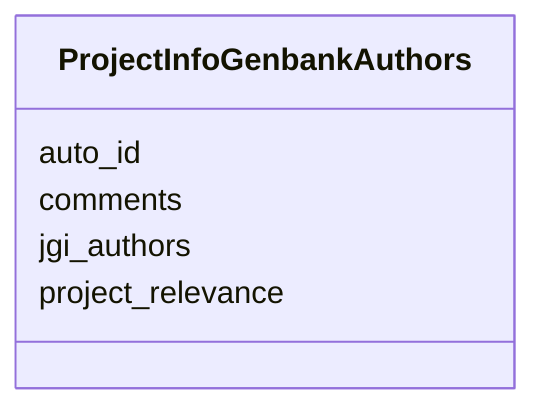

# Class: ProjectInfoGenbankAuthors 


URI: [imgsg_dev:ProjectInfoGenbankAuthors](https://w3id.org/jgi/imgsg_dev/ProjectInfoGenbankAuthors)





<!-- no inheritance hierarchy -->


## Slots

| Name | Cardinality and Range | Description | Inheritance |
| ---  | --- | --- | --- |
| [auto_id](auto_id.md) | 0..1 <br/> [Integer](Integer.md) |  | direct |
| [project_relevance](project_relevance.md) | 0..1 <br/> [String](String.md) |  | direct |
| [jgi_authors](jgi_authors.md) | 0..1 <br/> [String](String.md) |  | direct |
| [comments](comments.md) | 0..1 <br/> [String](String.md) |  | direct |


## Identifier and Mapping Information


### Schema Source


* from schema: https://w3id.org/jgi/imgsg_dev


## Mappings

| Mapping Type | Mapped Value |
| ---  | ---  |
| self | imgsg_dev:ProjectInfoGenbankAuthors |
| native | imgsg_dev:ProjectInfoGenbankAuthors |


## LinkML Source

<!-- TODO: investigate https://stackoverflow.com/questions/37606292/how-to-create-tabbed-code-blocks-in-mkdocs-or-sphinx -->

### Direct

<details>
```yaml
name: project_info_genbank_authors
from_schema: https://w3id.org/jgi/imgsg_dev
attributes:
  auto_id:
    name: auto_id
    from_schema: https://w3id.org/jgi/imgsg_dev
    rank: 1000
    domain_of:
    - project_info_genbank_authors
    range: integer
    required: false
  project_relevance:
    name: project_relevance
    from_schema: https://w3id.org/jgi/imgsg_dev
    rank: 1000
    domain_of:
    - project_info_genbank_authors
    - project_info_genbank_comments
    - project_info_project_relevance
    range: string
    required: false
  jgi_authors:
    name: jgi_authors
    from_schema: https://w3id.org/jgi/imgsg_dev
    domain_of:
    - pig_tracks
    - project_info_genbank
    - project_info_genbank_authors
    range: string
    required: false
  comments:
    name: comments
    from_schema: https://w3id.org/jgi/imgsg_dev
    domain_of:
    - assembly
    - cancelled_user
    - contact
    - env_sample
    - gold_analysis_project
    - gold_sequencing_project
    - img_group
    - ora_aspnet_membership
    - project_info
    - project_info_04112013
    - project_info_genbank_authors
    - project_info_nitrogen_fixation
    - request_account
    - submission
    - submission_history
    - submission_proc_steps
    - v5_ap_imperfect_view
    - vsample
    range: string
    required: false

```
</details>

### Induced

<details>
```yaml
name: project_info_genbank_authors
from_schema: https://w3id.org/jgi/imgsg_dev
attributes:
  auto_id:
    name: auto_id
    from_schema: https://w3id.org/jgi/imgsg_dev
    rank: 1000
    alias: auto_id
    owner: project_info_genbank_authors
    domain_of:
    - project_info_genbank_authors
    range: integer
    required: false
  project_relevance:
    name: project_relevance
    from_schema: https://w3id.org/jgi/imgsg_dev
    rank: 1000
    alias: project_relevance
    owner: project_info_genbank_authors
    domain_of:
    - project_info_genbank_authors
    - project_info_genbank_comments
    - project_info_project_relevance
    range: string
    required: false
  jgi_authors:
    name: jgi_authors
    from_schema: https://w3id.org/jgi/imgsg_dev
    alias: jgi_authors
    owner: project_info_genbank_authors
    domain_of:
    - pig_tracks
    - project_info_genbank
    - project_info_genbank_authors
    range: string
    required: false
  comments:
    name: comments
    from_schema: https://w3id.org/jgi/imgsg_dev
    alias: comments
    owner: project_info_genbank_authors
    domain_of:
    - assembly
    - cancelled_user
    - contact
    - env_sample
    - gold_analysis_project
    - gold_sequencing_project
    - img_group
    - ora_aspnet_membership
    - project_info
    - project_info_04112013
    - project_info_genbank_authors
    - project_info_nitrogen_fixation
    - request_account
    - submission
    - submission_history
    - submission_proc_steps
    - v5_ap_imperfect_view
    - vsample
    range: string
    required: false

```
</details>