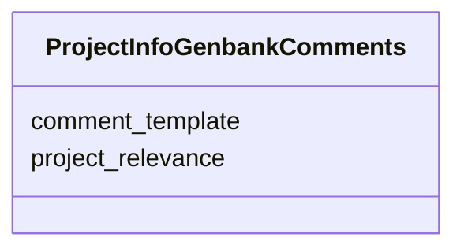

# Class: ProjectInfoGenbankComments 


URI: [imgsg_dev:ProjectInfoGenbankComments](https://w3id.org/jgi/imgsg_dev/ProjectInfoGenbankComments)





<!-- no inheritance hierarchy -->


## Slots

| Name | Cardinality and Range | Description | Inheritance |
| ---  | --- | --- | --- |
| [project_relevance](project_relevance.md) | 0..1 <br/> [String](String.md) |  | direct |
| [comment_template](comment_template.md) | 0..1 <br/> [String](String.md) |  | direct |


## Identifier and Mapping Information


### Schema Source


* from schema: https://w3id.org/jgi/imgsg_dev


## Mappings

| Mapping Type | Mapped Value |
| ---  | ---  |
| self | imgsg_dev:ProjectInfoGenbankComments |
| native | imgsg_dev:ProjectInfoGenbankComments |


## LinkML Source

<!-- TODO: investigate https://stackoverflow.com/questions/37606292/how-to-create-tabbed-code-blocks-in-mkdocs-or-sphinx -->

### Direct

<details>
```yaml
name: project_info_genbank_comments
from_schema: https://w3id.org/jgi/imgsg_dev
attributes:
  project_relevance:
    name: project_relevance
    from_schema: https://w3id.org/jgi/imgsg_dev
    domain_of:
    - project_info_genbank_authors
    - project_info_genbank_comments
    - project_info_project_relevance
    range: string
    required: false
  comment_template:
    name: comment_template
    from_schema: https://w3id.org/jgi/imgsg_dev
    domain_of:
    - genbank_comment_templates
    - project_info_genbank_comments
    range: string
    required: false

```
</details>

### Induced

<details>
```yaml
name: project_info_genbank_comments
from_schema: https://w3id.org/jgi/imgsg_dev
attributes:
  project_relevance:
    name: project_relevance
    from_schema: https://w3id.org/jgi/imgsg_dev
    alias: project_relevance
    owner: project_info_genbank_comments
    domain_of:
    - project_info_genbank_authors
    - project_info_genbank_comments
    - project_info_project_relevance
    range: string
    required: false
  comment_template:
    name: comment_template
    from_schema: https://w3id.org/jgi/imgsg_dev
    alias: comment_template
    owner: project_info_genbank_comments
    domain_of:
    - genbank_comment_templates
    - project_info_genbank_comments
    range: string
    required: false

```
</details>