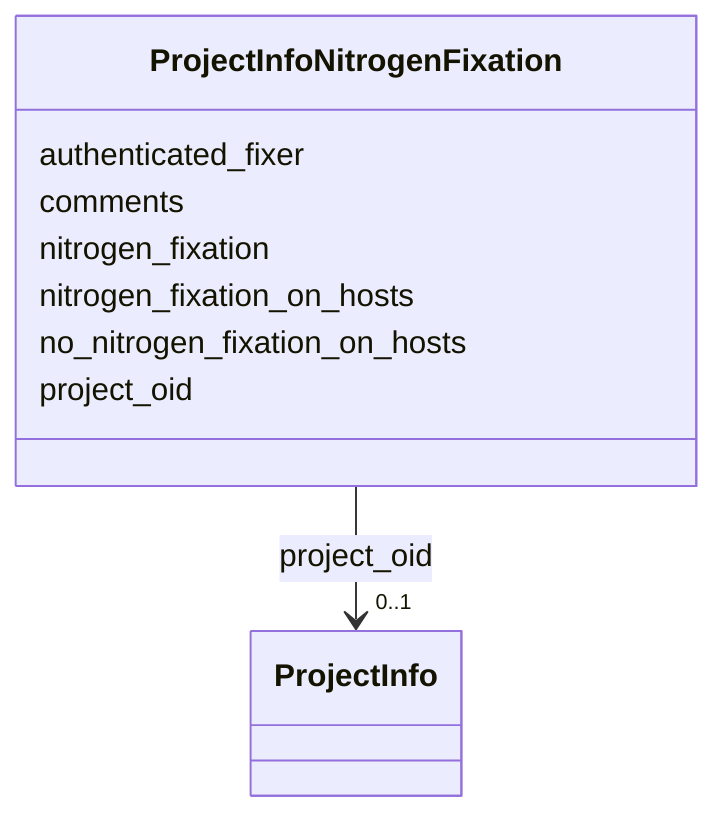

# Class: ProjectInfoNitrogenFixation 


URI: [imgsg_dev:ProjectInfoNitrogenFixation](https://w3id.org/jgi/imgsg_dev/ProjectInfoNitrogenFixation)





<!-- no inheritance hierarchy -->


## Slots

| Name | Cardinality and Range | Description | Inheritance |
| ---  | --- | --- | --- |
| [project_oid](project_oid.md) | 0..1 <br/> [ProjectInfo](ProjectInfo.md) | Foreign key to project_info | direct |
| [nitrogen_fixation](nitrogen_fixation.md) | 0..1 <br/> [String](String.md) |  | direct |
| [authenticated_fixer](authenticated_fixer.md) | 0..1 <br/> [String](String.md) |  | direct |
| [nitrogen_fixation_on_hosts](nitrogen_fixation_on_hosts.md) | 0..1 <br/> [String](String.md) |  | direct |
| [no_nitrogen_fixation_on_hosts](no_nitrogen_fixation_on_hosts.md) | 0..1 <br/> [String](String.md) |  | direct |
| [comments](comments.md) | 0..1 <br/> [String](String.md) |  | direct |


## Identifier and Mapping Information


### Schema Source


* from schema: https://w3id.org/jgi/imgsg_dev


## Mappings

| Mapping Type | Mapped Value |
| ---  | ---  |
| self | imgsg_dev:ProjectInfoNitrogenFixation |
| native | imgsg_dev:ProjectInfoNitrogenFixation |


## LinkML Source

<!-- TODO: investigate https://stackoverflow.com/questions/37606292/how-to-create-tabbed-code-blocks-in-mkdocs-or-sphinx -->

### Direct

<details>
```yaml
name: project_info_nitrogen_fixation
from_schema: https://w3id.org/jgi/imgsg_dev
attributes:
  project_oid:
    name: project_oid
    description: Foreign key to project_info
    from_schema: https://w3id.org/jgi/imgsg_dev
    domain_of:
    - bioproject_propagation
    - biosample
    - data_quality_flags
    - env_sample_soil_metadata
    - genbank_refseq_crossover
    - gold_analysis_project_lookup
    - gold_analysis_project_lookup2
    - gold_img_nat_prod_entity
    - ncbi_accessions
    - ncbi_accessions_jbtest
    - proj_info_cell_arrange_042014
    - project_info
    - project_info_04112013
    - project_info_bioproject
    - project_info_body_products
    - project_info_body_sites
    - project_info_cell_arrangement
    - project_info_collaborators
    - project_info_cyano_metadata
    - project_info_data_links
    - project_info_data_links_112013
    - project_info_diseases
    - project_info_energy_source
    - project_info_habitat
    - project_info_jgi_url
    - project_info_metabolism
    - project_info_natural_prods
    - project_info_nitrogen_fixation
    - project_info_nprods_metadata
    - project_info_phenotypes
    - project_info_project_relevance
    - project_info_seq_method
    - project_meta_updates
    - study_load
    - t_alex_test
    - t_all_gold_jgi_projects
    range: project_info
    required: false
  nitrogen_fixation:
    name: nitrogen_fixation
    from_schema: https://w3id.org/jgi/imgsg_dev
    rank: 1000
    domain_of:
    - project_info_nitrogen_fixation
    range: string
    required: false
  authenticated_fixer:
    name: authenticated_fixer
    from_schema: https://w3id.org/jgi/imgsg_dev
    rank: 1000
    domain_of:
    - project_info_nitrogen_fixation
    range: string
    required: false
  nitrogen_fixation_on_hosts:
    name: nitrogen_fixation_on_hosts
    from_schema: https://w3id.org/jgi/imgsg_dev
    rank: 1000
    domain_of:
    - project_info_nitrogen_fixation
    range: string
    required: false
  no_nitrogen_fixation_on_hosts:
    name: no_nitrogen_fixation_on_hosts
    from_schema: https://w3id.org/jgi/imgsg_dev
    rank: 1000
    domain_of:
    - project_info_nitrogen_fixation
    range: string
    required: false
  comments:
    name: comments
    from_schema: https://w3id.org/jgi/imgsg_dev
    domain_of:
    - assembly
    - cancelled_user
    - contact
    - env_sample
    - gold_analysis_project
    - gold_sequencing_project
    - img_group
    - ora_aspnet_membership
    - project_info
    - project_info_04112013
    - project_info_genbank_authors
    - project_info_nitrogen_fixation
    - request_account
    - submission
    - submission_history
    - submission_proc_steps
    - v5_ap_imperfect_view
    - vsample
    range: string
    required: false

```
</details>

### Induced

<details>
```yaml
name: project_info_nitrogen_fixation
from_schema: https://w3id.org/jgi/imgsg_dev
attributes:
  project_oid:
    name: project_oid
    description: Foreign key to project_info
    from_schema: https://w3id.org/jgi/imgsg_dev
    alias: project_oid
    owner: project_info_nitrogen_fixation
    domain_of:
    - bioproject_propagation
    - biosample
    - data_quality_flags
    - env_sample_soil_metadata
    - genbank_refseq_crossover
    - gold_analysis_project_lookup
    - gold_analysis_project_lookup2
    - gold_img_nat_prod_entity
    - ncbi_accessions
    - ncbi_accessions_jbtest
    - proj_info_cell_arrange_042014
    - project_info
    - project_info_04112013
    - project_info_bioproject
    - project_info_body_products
    - project_info_body_sites
    - project_info_cell_arrangement
    - project_info_collaborators
    - project_info_cyano_metadata
    - project_info_data_links
    - project_info_data_links_112013
    - project_info_diseases
    - project_info_energy_source
    - project_info_habitat
    - project_info_jgi_url
    - project_info_metabolism
    - project_info_natural_prods
    - project_info_nitrogen_fixation
    - project_info_nprods_metadata
    - project_info_phenotypes
    - project_info_project_relevance
    - project_info_seq_method
    - project_meta_updates
    - study_load
    - t_alex_test
    - t_all_gold_jgi_projects
    range: project_info
    required: false
  nitrogen_fixation:
    name: nitrogen_fixation
    from_schema: https://w3id.org/jgi/imgsg_dev
    rank: 1000
    alias: nitrogen_fixation
    owner: project_info_nitrogen_fixation
    domain_of:
    - project_info_nitrogen_fixation
    range: string
    required: false
  authenticated_fixer:
    name: authenticated_fixer
    from_schema: https://w3id.org/jgi/imgsg_dev
    rank: 1000
    alias: authenticated_fixer
    owner: project_info_nitrogen_fixation
    domain_of:
    - project_info_nitrogen_fixation
    range: string
    required: false
  nitrogen_fixation_on_hosts:
    name: nitrogen_fixation_on_hosts
    from_schema: https://w3id.org/jgi/imgsg_dev
    rank: 1000
    alias: nitrogen_fixation_on_hosts
    owner: project_info_nitrogen_fixation
    domain_of:
    - project_info_nitrogen_fixation
    range: string
    required: false
  no_nitrogen_fixation_on_hosts:
    name: no_nitrogen_fixation_on_hosts
    from_schema: https://w3id.org/jgi/imgsg_dev
    rank: 1000
    alias: no_nitrogen_fixation_on_hosts
    owner: project_info_nitrogen_fixation
    domain_of:
    - project_info_nitrogen_fixation
    range: string
    required: false
  comments:
    name: comments
    from_schema: https://w3id.org/jgi/imgsg_dev
    alias: comments
    owner: project_info_nitrogen_fixation
    domain_of:
    - assembly
    - cancelled_user
    - contact
    - env_sample
    - gold_analysis_project
    - gold_sequencing_project
    - img_group
    - ora_aspnet_membership
    - project_info
    - project_info_04112013
    - project_info_genbank_authors
    - project_info_nitrogen_fixation
    - request_account
    - submission
    - submission_history
    - submission_proc_steps
    - v5_ap_imperfect_view
    - vsample
    range: string
    required: false

```
</details>