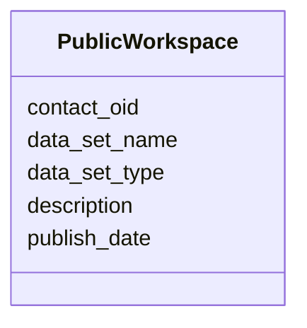

# Class: PublicWorkspace 


URI: [imgsg_dev:PublicWorkspace](https://w3id.org/jgi/imgsg_dev/PublicWorkspace)





<!-- no inheritance hierarchy -->


## Slots

| Name | Cardinality and Range | Description | Inheritance |
| ---  | --- | --- | --- |
| [contact_oid](contact_oid.md) | 0..1 <br/> [Integer](Integer.md) |  | direct |
| [data_set_type](data_set_type.md) | 0..1 <br/> [String](String.md) |  | direct |
| [data_set_name](data_set_name.md) | 0..1 <br/> [String](String.md) |  | direct |
| [publish_date](publish_date.md) | 0..1 <br/> [Datetime](Datetime.md) |  | direct |
| [description](description.md) | 0..1 <br/> [String](String.md) |  | direct |


## Identifier and Mapping Information


### Schema Source


* from schema: https://w3id.org/jgi/imgsg_dev


## Mappings

| Mapping Type | Mapped Value |
| ---  | ---  |
| self | imgsg_dev:PublicWorkspace |
| native | imgsg_dev:PublicWorkspace |


## LinkML Source

<!-- TODO: investigate https://stackoverflow.com/questions/37606292/how-to-create-tabbed-code-blocks-in-mkdocs-or-sphinx -->

### Direct

<details>
```yaml
name: public_workspace
from_schema: https://w3id.org/jgi/imgsg_dev
attributes:
  contact_oid:
    name: contact_oid
    from_schema: https://w3id.org/jgi/imgsg_dev
    domain_of:
    - analysis_project_permissions
    - contact
    - contact_img_groups
    - contact_jgi_accounts
    - contact_project_permissions
    - contact_protexp_permissions
    - contact_rna_data_permissions
    - contact_rnaexp_permissions
    - contact_sample_permissions
    - contact_sample_perms
    - contact_snp_exp_permissions
    - contact_taxon_permissions
    - contact_workspace_group
    - gold_sequencing_project
    - gold_study
    - project_info
    - project_info_04112013
    - public_workspace
    range: integer
    required: false
  data_set_type:
    name: data_set_type
    from_schema: https://w3id.org/jgi/imgsg_dev
    domain_of:
    - contact_workspace_group
    - public_workspace
    range: string
    required: false
  data_set_name:
    name: data_set_name
    from_schema: https://w3id.org/jgi/imgsg_dev
    domain_of:
    - contact_workspace_group
    - public_workspace
    range: string
    required: false
  publish_date:
    name: publish_date
    from_schema: https://w3id.org/jgi/imgsg_dev
    rank: 1000
    domain_of:
    - public_workspace
    range: datetime
    required: false
  description:
    name: description
    from_schema: https://w3id.org/jgi/imgsg_dev
    domain_of:
    - gold_sequencing_project
    - img_group_news
    - imgcv
    - not_to_release
    - ora_aspnet_applications
    - ora_aspnet_roles
    - ora_aspnet_sitemap
    - project_info_biosample
    - public_workspace
    - study_load
    - submission_proc_stats
    - web_page_codecv
    - webpagecv
    range: string
    required: false

```
</details>

### Induced

<details>
```yaml
name: public_workspace
from_schema: https://w3id.org/jgi/imgsg_dev
attributes:
  contact_oid:
    name: contact_oid
    from_schema: https://w3id.org/jgi/imgsg_dev
    alias: contact_oid
    owner: public_workspace
    domain_of:
    - analysis_project_permissions
    - contact
    - contact_img_groups
    - contact_jgi_accounts
    - contact_project_permissions
    - contact_protexp_permissions
    - contact_rna_data_permissions
    - contact_rnaexp_permissions
    - contact_sample_permissions
    - contact_sample_perms
    - contact_snp_exp_permissions
    - contact_taxon_permissions
    - contact_workspace_group
    - gold_sequencing_project
    - gold_study
    - project_info
    - project_info_04112013
    - public_workspace
    range: integer
    required: false
  data_set_type:
    name: data_set_type
    from_schema: https://w3id.org/jgi/imgsg_dev
    alias: data_set_type
    owner: public_workspace
    domain_of:
    - contact_workspace_group
    - public_workspace
    range: string
    required: false
  data_set_name:
    name: data_set_name
    from_schema: https://w3id.org/jgi/imgsg_dev
    alias: data_set_name
    owner: public_workspace
    domain_of:
    - contact_workspace_group
    - public_workspace
    range: string
    required: false
  publish_date:
    name: publish_date
    from_schema: https://w3id.org/jgi/imgsg_dev
    rank: 1000
    alias: publish_date
    owner: public_workspace
    domain_of:
    - public_workspace
    range: datetime
    required: false
  description:
    name: description
    from_schema: https://w3id.org/jgi/imgsg_dev
    alias: description
    owner: public_workspace
    domain_of:
    - gold_sequencing_project
    - img_group_news
    - imgcv
    - not_to_release
    - ora_aspnet_applications
    - ora_aspnet_roles
    - ora_aspnet_sitemap
    - project_info_biosample
    - public_workspace
    - study_load
    - submission_proc_stats
    - web_page_codecv
    - webpagecv
    range: string
    required: false

```
</details>