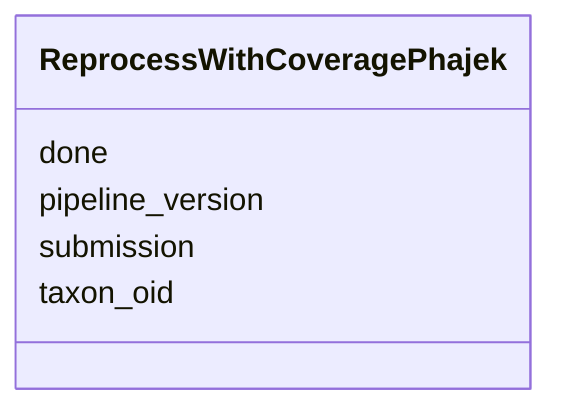

# Class: ReprocessWithCoveragePhajek 


URI: [imgsg_dev:ReprocessWithCoveragePhajek](https://w3id.org/jgi/imgsg_dev/ReprocessWithCoveragePhajek)





<!-- no inheritance hierarchy -->


## Slots

| Name | Cardinality and Range | Description | Inheritance |
| ---  | --- | --- | --- |
| [submission](submission.md) | 0..1 <br/> [Integer](Integer.md) |  | direct |
| [done](done.md) | 0..1 <br/> [String](String.md) |  | direct |
| [pipeline_version](pipeline_version.md) | 0..1 <br/> [String](String.md) |  | direct |
| [taxon_oid](taxon_oid.md) | 0..1 <br/> [Integer](Integer.md) |  | direct |


## Identifier and Mapping Information


### Schema Source


* from schema: https://w3id.org/jgi/imgsg_dev


## Mappings

| Mapping Type | Mapped Value |
| ---  | ---  |
| self | imgsg_dev:ReprocessWithCoveragePhajek |
| native | imgsg_dev:ReprocessWithCoveragePhajek |


## LinkML Source

<!-- TODO: investigate https://stackoverflow.com/questions/37606292/how-to-create-tabbed-code-blocks-in-mkdocs-or-sphinx -->

### Direct

<details>
```yaml
name: reprocess_with_coverage_phajek
from_schema: https://w3id.org/jgi/imgsg_dev
attributes:
  submission:
    name: submission
    from_schema: https://w3id.org/jgi/imgsg_dev
    domain_of:
    - reprocess_submissions_phajek
    - reprocess_with_coverage_phajek
    range: integer
    required: false
  done:
    name: done
    from_schema: https://w3id.org/jgi/imgsg_dev
    domain_of:
    - reprocess_submissions_phajek
    - reprocess_with_coverage_phajek
    range: string
    required: false
  pipeline_version:
    name: pipeline_version
    from_schema: https://w3id.org/jgi/imgsg_dev
    domain_of:
    - gold_analysis_project
    - reprocess_submissions_phajek
    - reprocess_with_coverage_phajek
    range: string
    required: false
  taxon_oid:
    name: taxon_oid
    from_schema: https://w3id.org/jgi/imgsg_dev
    domain_of:
    - initiate_restore
    - not_to_release
    - perferred_mbin_queue
    - portal_taxons
    - reprocess_submissions_phajek
    - reprocess_with_coverage_phajek
    - taxon_gene_info
    - taxon_scaffold_info
    range: integer
    required: false

```
</details>

### Induced

<details>
```yaml
name: reprocess_with_coverage_phajek
from_schema: https://w3id.org/jgi/imgsg_dev
attributes:
  submission:
    name: submission
    from_schema: https://w3id.org/jgi/imgsg_dev
    alias: submission
    owner: reprocess_with_coverage_phajek
    domain_of:
    - reprocess_submissions_phajek
    - reprocess_with_coverage_phajek
    range: integer
    required: false
  done:
    name: done
    from_schema: https://w3id.org/jgi/imgsg_dev
    alias: done
    owner: reprocess_with_coverage_phajek
    domain_of:
    - reprocess_submissions_phajek
    - reprocess_with_coverage_phajek
    range: string
    required: false
  pipeline_version:
    name: pipeline_version
    from_schema: https://w3id.org/jgi/imgsg_dev
    alias: pipeline_version
    owner: reprocess_with_coverage_phajek
    domain_of:
    - gold_analysis_project
    - reprocess_submissions_phajek
    - reprocess_with_coverage_phajek
    range: string
    required: false
  taxon_oid:
    name: taxon_oid
    from_schema: https://w3id.org/jgi/imgsg_dev
    alias: taxon_oid
    owner: reprocess_with_coverage_phajek
    domain_of:
    - initiate_restore
    - not_to_release
    - perferred_mbin_queue
    - portal_taxons
    - reprocess_submissions_phajek
    - reprocess_with_coverage_phajek
    - taxon_gene_info
    - taxon_scaffold_info
    range: integer
    required: false

```
</details>