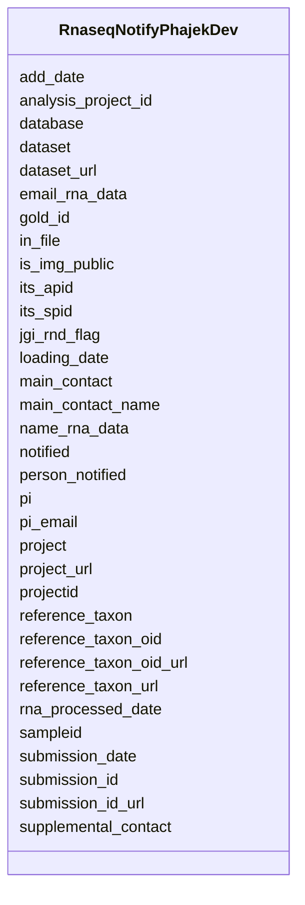

# Class: RnaseqNotifyPhajekDev 


URI: [imgsg_dev:RnaseqNotifyPhajekDev](https://w3id.org/jgi/imgsg_dev/RnaseqNotifyPhajekDev)





<!-- no inheritance hierarchy -->


## Slots

| Name | Cardinality and Range | Description | Inheritance |
| ---  | --- | --- | --- |
| [submission_id](submission_id.md) | 0..1 <br/> [Integer](Integer.md) |  | direct |
| [dataset](dataset.md) | 0..1 <br/> [Integer](Integer.md) |  | direct |
| [submission_date](submission_date.md) | 0..1 <br/> [Datetime](Datetime.md) |  | direct |
| [reference_taxon_oid](reference_taxon_oid.md) | 0..1 <br/> [Integer](Integer.md) |  | direct |
| [reference_taxon](reference_taxon.md) | 0..1 <br/> [String](String.md) |  | direct |
| [project](project.md) | 0..1 <br/> [String](String.md) |  | direct |
| [loading_date](loading_date.md) | 0..1 <br/> [Datetime](Datetime.md) |  | direct |
| [pi](pi.md) | 0..1 <br/> [String](String.md) |  | direct |
| [its_spid](its_spid.md) | 0..1 <br/> [Integer](Integer.md) |  | direct |
| [its_apid](its_apid.md) | 0..1 <br/> [Integer](Integer.md) |  | direct |
| [rna_processed_date](rna_processed_date.md) | 0..1 <br/> [Datetime](Datetime.md) |  | direct |
| [notified](notified.md) | 0..1 <br/> [String](String.md) |  | direct |
| [pi_email](pi_email.md) | 0..1 <br/> [String](String.md) |  | direct |
| [dataset_url](dataset_url.md) | 0..1 <br/> [String](String.md) |  | direct |
| [submission_id_url](submission_id_url.md) | 0..1 <br/> [String](String.md) |  | direct |
| [reference_taxon_oid_url](reference_taxon_oid_url.md) | 0..1 <br/> [String](String.md) |  | direct |
| [reference_taxon_url](reference_taxon_url.md) | 0..1 <br/> [String](String.md) |  | direct |
| [project_url](project_url.md) | 0..1 <br/> [String](String.md) |  | direct |
| [main_contact](main_contact.md) | 0..1 <br/> [String](String.md) |  | direct |
| [supplemental_contact](supplemental_contact.md) | 0..1 <br/> [String](String.md) |  | direct |
| [gold_id](gold_id.md) | 0..1 <br/> [String](String.md) |  | direct |
| [person_notified](person_notified.md) | 0..1 <br/> [String](String.md) |  | direct |
| [email_rna_data](email_rna_data.md) | 0..1 <br/> [String](String.md) |  | direct |
| [name_rna_data](name_rna_data.md) | 0..1 <br/> [String](String.md) |  | direct |
| [main_contact_name](main_contact_name.md) | 0..1 <br/> [String](String.md) |  | direct |
| [database](database.md) | 0..1 <br/> [String](String.md) |  | direct |
| [jgi_rnd_flag](jgi_rnd_flag.md) | 0..1 <br/> [String](String.md) |  | direct |
| [in_file](in_file.md) | 0..1 <br/> [String](String.md) |  | direct |
| [is_img_public](is_img_public.md) | 0..1 <br/> [String](String.md) |  | direct |
| [analysis_project_id](analysis_project_id.md) | 0..1 <br/> [String](String.md) |  | direct |
| [add_date](add_date.md) | 0..1 <br/> [Datetime](Datetime.md) |  | direct |
| [projectid](projectid.md) | 0..1 <br/> [String](String.md) |  | direct |
| [sampleid](sampleid.md) | 0..1 <br/> [String](String.md) |  | direct |


## Identifier and Mapping Information


### Schema Source


* from schema: https://w3id.org/jgi/imgsg_dev


## Mappings

| Mapping Type | Mapped Value |
| ---  | ---  |
| self | imgsg_dev:RnaseqNotifyPhajekDev |
| native | imgsg_dev:RnaseqNotifyPhajekDev |


## LinkML Source

<!-- TODO: investigate https://stackoverflow.com/questions/37606292/how-to-create-tabbed-code-blocks-in-mkdocs-or-sphinx -->

### Direct

<details>
```yaml
name: rnaseq_notify_phajek_dev
from_schema: https://w3id.org/jgi/imgsg_dev
attributes:
  submission_id:
    name: submission_id
    from_schema: https://w3id.org/jgi/imgsg_dev
    domain_of:
    - annotation_contigs_proteins_counts
    - annotation_job_sbatch_args
    - annotation_job_stats
    - annotation_step_stats
    - bad_depth_file_warnings
    - bioproject_propagation
    - gold_analysis_project
    - mer_submissions_queue
    - merfs_aggregate_file_size
    - phajek_test
    - pig_tracks
    - project_info_bioproject
    - project_info_biosample
    - project_info_genbank
    - rnaseq_notify_phajek
    - rnaseq_notify_phajek_dev
    - submission
    - submission_data_files
    - submission_data_files_dmpath
    - submission_history
    - submission_img_contacts
    - submission_proc_stats
    - submission_proc_steps
    - submission_reads_file
    - submission_samples
    - t1_audit
    - v5_ap_imperfect_view
    range: integer
    required: false
  dataset:
    name: dataset
    from_schema: https://w3id.org/jgi/imgsg_dev
    rank: 1000
    domain_of:
    - rnaseq_notify_phajek_dev
    range: integer
    required: false
  submission_date:
    name: submission_date
    from_schema: https://w3id.org/jgi/imgsg_dev
    domain_of:
    - rnaseq_notify_phajek
    - rnaseq_notify_phajek_dev
    - submission
    range: datetime
    required: false
  reference_taxon_oid:
    name: reference_taxon_oid
    from_schema: https://w3id.org/jgi/imgsg_dev
    domain_of:
    - rnaseq_notify_phajek
    - rnaseq_notify_phajek_dev
    range: integer
    required: false
  reference_taxon:
    name: reference_taxon
    from_schema: https://w3id.org/jgi/imgsg_dev
    domain_of:
    - rnaseq_notify_phajek
    - rnaseq_notify_phajek_dev
    range: string
    required: false
  project:
    name: project
    from_schema: https://w3id.org/jgi/imgsg_dev
    domain_of:
    - rnaseq_notify_phajek
    - rnaseq_notify_phajek_dev
    range: string
    required: false
  loading_date:
    name: loading_date
    from_schema: https://w3id.org/jgi/imgsg_dev
    domain_of:
    - rnaseq_notify_phajek
    - rnaseq_notify_phajek_dev
    range: datetime
    required: false
  pi:
    name: pi
    from_schema: https://w3id.org/jgi/imgsg_dev
    domain_of:
    - rnaseq_notify_phajek
    - rnaseq_notify_phajek_dev
    range: string
    required: false
  its_spid:
    name: its_spid
    from_schema: https://w3id.org/jgi/imgsg_dev
    domain_of:
    - assembly
    - env_sample
    - gold_analysis_project_lookup
    - gold_analysis_project_lookup2
    - gold_sequencing_project
    - goldv5_view
    - project_info
    - project_info_04112013
    - rnaseq_notify_phajek
    - rnaseq_notify_phajek_dev
    - t_all_gold_jgi_projects
    range: integer
    required: false
  its_apid:
    name: its_apid
    from_schema: https://w3id.org/jgi/imgsg_dev
    domain_of:
    - rnaseq_notify_phajek
    - rnaseq_notify_phajek_dev
    range: integer
    required: false
  rna_processed_date:
    name: rna_processed_date
    from_schema: https://w3id.org/jgi/imgsg_dev
    domain_of:
    - rnaseq_notify_phajek
    - rnaseq_notify_phajek_dev
    range: datetime
    required: false
  notified:
    name: notified
    from_schema: https://w3id.org/jgi/imgsg_dev
    domain_of:
    - mer_submissions_queue
    - rnaseq_notify_phajek
    - rnaseq_notify_phajek_dev
    range: string
    required: false
  pi_email:
    name: pi_email
    from_schema: https://w3id.org/jgi/imgsg_dev
    domain_of:
    - gold_analysis_project
    - gold_sequencing_project
    - rnaseq_notify_phajek
    - rnaseq_notify_phajek_dev
    - v5_ap_imperfect_view
    range: string
    required: false
  dataset_url:
    name: dataset_url
    from_schema: https://w3id.org/jgi/imgsg_dev
    domain_of:
    - rnaseq_notify_phajek
    - rnaseq_notify_phajek_dev
    range: string
    required: false
  submission_id_url:
    name: submission_id_url
    from_schema: https://w3id.org/jgi/imgsg_dev
    domain_of:
    - rnaseq_notify_phajek
    - rnaseq_notify_phajek_dev
    range: string
    required: false
  reference_taxon_oid_url:
    name: reference_taxon_oid_url
    from_schema: https://w3id.org/jgi/imgsg_dev
    domain_of:
    - rnaseq_notify_phajek
    - rnaseq_notify_phajek_dev
    range: string
    required: false
  reference_taxon_url:
    name: reference_taxon_url
    from_schema: https://w3id.org/jgi/imgsg_dev
    domain_of:
    - rnaseq_notify_phajek
    - rnaseq_notify_phajek_dev
    range: string
    required: false
  project_url:
    name: project_url
    from_schema: https://w3id.org/jgi/imgsg_dev
    domain_of:
    - rnaseq_notify_phajek
    - rnaseq_notify_phajek_dev
    range: string
    required: false
  main_contact:
    name: main_contact
    from_schema: https://w3id.org/jgi/imgsg_dev
    domain_of:
    - rnaseq_notify_phajek
    - rnaseq_notify_phajek_dev
    range: string
    required: false
  supplemental_contact:
    name: supplemental_contact
    from_schema: https://w3id.org/jgi/imgsg_dev
    domain_of:
    - rnaseq_notify_phajek
    - rnaseq_notify_phajek_dev
    range: string
    required: false
  gold_id:
    name: gold_id
    from_schema: https://w3id.org/jgi/imgsg_dev
    domain_of:
    - analysis_project_permissions
    - env_sample
    - gold_analysis_project
    - gold_analysis_project_genbanks
    - gold_analysis_project_jgi_award_dois
    - gold_analysis_project_lookup
    - gold_analysis_project_lookup2
    - gold_analysis_project_sra_runs
    - gold_analysis_project_users
    - gold_ap_genbank_anomalous_reasons
    - gold_ap_publications
    - gold_sequencing_project
    - gold_sp_cell_arrangement
    - gold_sp_collaborator
    - gold_sp_disease
    - gold_sp_energy_source
    - gold_sp_genome_publications
    - gold_sp_habitat
    - gold_sp_metabolism
    - gold_sp_phenotype
    - gold_sp_relevance
    - gold_sp_seq_center
    - gold_sp_seq_method
    - gold_sp_sra
    - gold_sp_study_gold_id
    - gold_study
    - gold_study_info
    - rnaseq_notify_phajek
    - rnaseq_notify_phajek_dev
    - study_load
    - v5_ap_imperfect_view
    - vsample
    range: string
    required: false
  person_notified:
    name: person_notified
    from_schema: https://w3id.org/jgi/imgsg_dev
    domain_of:
    - rnaseq_notify_phajek
    - rnaseq_notify_phajek_dev
    range: string
    required: false
  email_rna_data:
    name: email_rna_data
    from_schema: https://w3id.org/jgi/imgsg_dev
    domain_of:
    - rnaseq_notify_phajek
    - rnaseq_notify_phajek_dev
    range: string
    required: false
  name_rna_data:
    name: name_rna_data
    from_schema: https://w3id.org/jgi/imgsg_dev
    domain_of:
    - rnaseq_notify_phajek
    - rnaseq_notify_phajek_dev
    range: string
    required: false
  main_contact_name:
    name: main_contact_name
    from_schema: https://w3id.org/jgi/imgsg_dev
    domain_of:
    - rnaseq_notify_phajek
    - rnaseq_notify_phajek_dev
    range: string
    required: false
  database:
    name: database
    from_schema: https://w3id.org/jgi/imgsg_dev
    domain_of:
    - batch
    - rnaseq_notify_phajek
    - rnaseq_notify_phajek_dev
    - submission
    range: string
    required: false
  jgi_rnd_flag:
    name: jgi_rnd_flag
    from_schema: https://w3id.org/jgi/imgsg_dev
    domain_of:
    - rnaseq_notify_phajek
    - rnaseq_notify_phajek_dev
    - submission
    range: string
    required: false
  in_file:
    name: in_file
    from_schema: https://w3id.org/jgi/imgsg_dev
    domain_of:
    - rnaseq_notify_phajek
    - rnaseq_notify_phajek_dev
    - submission
    range: string
    required: false
  is_img_public:
    name: is_img_public
    from_schema: https://w3id.org/jgi/imgsg_dev
    domain_of:
    - rnaseq_notify_phajek
    - rnaseq_notify_phajek_dev
    - submission
    range: string
    required: false
  analysis_project_id:
    name: analysis_project_id
    from_schema: https://w3id.org/jgi/imgsg_dev
    domain_of:
    - goldv5_view
    - rnaseq_notify_phajek
    - rnaseq_notify_phajek_dev
    - submission
    range: string
    required: false
  add_date:
    name: add_date
    from_schema: https://w3id.org/jgi/imgsg_dev
    domain_of:
    - contact
    - env_sample
    - gold_sequencing_project
    - img_group
    - img_group_news
    - not_to_release
    - perferred_mbin_queue
    - project_info
    - project_info_04112013
    - rnaseq_notify_phajek
    - rnaseq_notify_phajek_dev
    - study_load
    - vsample
    range: datetime
    required: false
  projectid:
    name: projectid
    from_schema: https://w3id.org/jgi/imgsg_dev
    domain_of:
    - rnaseq_notify_phajek
    - rnaseq_notify_phajek_dev
    range: string
    required: false
  sampleid:
    name: sampleid
    from_schema: https://w3id.org/jgi/imgsg_dev
    domain_of:
    - rnaseq_notify_phajek
    - rnaseq_notify_phajek_dev
    range: string
    required: false

```
</details>

### Induced

<details>
```yaml
name: rnaseq_notify_phajek_dev
from_schema: https://w3id.org/jgi/imgsg_dev
attributes:
  submission_id:
    name: submission_id
    from_schema: https://w3id.org/jgi/imgsg_dev
    alias: submission_id
    owner: rnaseq_notify_phajek_dev
    domain_of:
    - annotation_contigs_proteins_counts
    - annotation_job_sbatch_args
    - annotation_job_stats
    - annotation_step_stats
    - bad_depth_file_warnings
    - bioproject_propagation
    - gold_analysis_project
    - mer_submissions_queue
    - merfs_aggregate_file_size
    - phajek_test
    - pig_tracks
    - project_info_bioproject
    - project_info_biosample
    - project_info_genbank
    - rnaseq_notify_phajek
    - rnaseq_notify_phajek_dev
    - submission
    - submission_data_files
    - submission_data_files_dmpath
    - submission_history
    - submission_img_contacts
    - submission_proc_stats
    - submission_proc_steps
    - submission_reads_file
    - submission_samples
    - t1_audit
    - v5_ap_imperfect_view
    range: integer
    required: false
  dataset:
    name: dataset
    from_schema: https://w3id.org/jgi/imgsg_dev
    rank: 1000
    alias: dataset
    owner: rnaseq_notify_phajek_dev
    domain_of:
    - rnaseq_notify_phajek_dev
    range: integer
    required: false
  submission_date:
    name: submission_date
    from_schema: https://w3id.org/jgi/imgsg_dev
    alias: submission_date
    owner: rnaseq_notify_phajek_dev
    domain_of:
    - rnaseq_notify_phajek
    - rnaseq_notify_phajek_dev
    - submission
    range: datetime
    required: false
  reference_taxon_oid:
    name: reference_taxon_oid
    from_schema: https://w3id.org/jgi/imgsg_dev
    alias: reference_taxon_oid
    owner: rnaseq_notify_phajek_dev
    domain_of:
    - rnaseq_notify_phajek
    - rnaseq_notify_phajek_dev
    range: integer
    required: false
  reference_taxon:
    name: reference_taxon
    from_schema: https://w3id.org/jgi/imgsg_dev
    alias: reference_taxon
    owner: rnaseq_notify_phajek_dev
    domain_of:
    - rnaseq_notify_phajek
    - rnaseq_notify_phajek_dev
    range: string
    required: false
  project:
    name: project
    from_schema: https://w3id.org/jgi/imgsg_dev
    alias: project
    owner: rnaseq_notify_phajek_dev
    domain_of:
    - rnaseq_notify_phajek
    - rnaseq_notify_phajek_dev
    range: string
    required: false
  loading_date:
    name: loading_date
    from_schema: https://w3id.org/jgi/imgsg_dev
    alias: loading_date
    owner: rnaseq_notify_phajek_dev
    domain_of:
    - rnaseq_notify_phajek
    - rnaseq_notify_phajek_dev
    range: datetime
    required: false
  pi:
    name: pi
    from_schema: https://w3id.org/jgi/imgsg_dev
    alias: pi
    owner: rnaseq_notify_phajek_dev
    domain_of:
    - rnaseq_notify_phajek
    - rnaseq_notify_phajek_dev
    range: string
    required: false
  its_spid:
    name: its_spid
    from_schema: https://w3id.org/jgi/imgsg_dev
    alias: its_spid
    owner: rnaseq_notify_phajek_dev
    domain_of:
    - assembly
    - env_sample
    - gold_analysis_project_lookup
    - gold_analysis_project_lookup2
    - gold_sequencing_project
    - goldv5_view
    - project_info
    - project_info_04112013
    - rnaseq_notify_phajek
    - rnaseq_notify_phajek_dev
    - t_all_gold_jgi_projects
    range: integer
    required: false
  its_apid:
    name: its_apid
    from_schema: https://w3id.org/jgi/imgsg_dev
    alias: its_apid
    owner: rnaseq_notify_phajek_dev
    domain_of:
    - rnaseq_notify_phajek
    - rnaseq_notify_phajek_dev
    range: integer
    required: false
  rna_processed_date:
    name: rna_processed_date
    from_schema: https://w3id.org/jgi/imgsg_dev
    alias: rna_processed_date
    owner: rnaseq_notify_phajek_dev
    domain_of:
    - rnaseq_notify_phajek
    - rnaseq_notify_phajek_dev
    range: datetime
    required: false
  notified:
    name: notified
    from_schema: https://w3id.org/jgi/imgsg_dev
    alias: notified
    owner: rnaseq_notify_phajek_dev
    domain_of:
    - mer_submissions_queue
    - rnaseq_notify_phajek
    - rnaseq_notify_phajek_dev
    range: string
    required: false
  pi_email:
    name: pi_email
    from_schema: https://w3id.org/jgi/imgsg_dev
    alias: pi_email
    owner: rnaseq_notify_phajek_dev
    domain_of:
    - gold_analysis_project
    - gold_sequencing_project
    - rnaseq_notify_phajek
    - rnaseq_notify_phajek_dev
    - v5_ap_imperfect_view
    range: string
    required: false
  dataset_url:
    name: dataset_url
    from_schema: https://w3id.org/jgi/imgsg_dev
    alias: dataset_url
    owner: rnaseq_notify_phajek_dev
    domain_of:
    - rnaseq_notify_phajek
    - rnaseq_notify_phajek_dev
    range: string
    required: false
  submission_id_url:
    name: submission_id_url
    from_schema: https://w3id.org/jgi/imgsg_dev
    alias: submission_id_url
    owner: rnaseq_notify_phajek_dev
    domain_of:
    - rnaseq_notify_phajek
    - rnaseq_notify_phajek_dev
    range: string
    required: false
  reference_taxon_oid_url:
    name: reference_taxon_oid_url
    from_schema: https://w3id.org/jgi/imgsg_dev
    alias: reference_taxon_oid_url
    owner: rnaseq_notify_phajek_dev
    domain_of:
    - rnaseq_notify_phajek
    - rnaseq_notify_phajek_dev
    range: string
    required: false
  reference_taxon_url:
    name: reference_taxon_url
    from_schema: https://w3id.org/jgi/imgsg_dev
    alias: reference_taxon_url
    owner: rnaseq_notify_phajek_dev
    domain_of:
    - rnaseq_notify_phajek
    - rnaseq_notify_phajek_dev
    range: string
    required: false
  project_url:
    name: project_url
    from_schema: https://w3id.org/jgi/imgsg_dev
    alias: project_url
    owner: rnaseq_notify_phajek_dev
    domain_of:
    - rnaseq_notify_phajek
    - rnaseq_notify_phajek_dev
    range: string
    required: false
  main_contact:
    name: main_contact
    from_schema: https://w3id.org/jgi/imgsg_dev
    alias: main_contact
    owner: rnaseq_notify_phajek_dev
    domain_of:
    - rnaseq_notify_phajek
    - rnaseq_notify_phajek_dev
    range: string
    required: false
  supplemental_contact:
    name: supplemental_contact
    from_schema: https://w3id.org/jgi/imgsg_dev
    alias: supplemental_contact
    owner: rnaseq_notify_phajek_dev
    domain_of:
    - rnaseq_notify_phajek
    - rnaseq_notify_phajek_dev
    range: string
    required: false
  gold_id:
    name: gold_id
    from_schema: https://w3id.org/jgi/imgsg_dev
    alias: gold_id
    owner: rnaseq_notify_phajek_dev
    domain_of:
    - analysis_project_permissions
    - env_sample
    - gold_analysis_project
    - gold_analysis_project_genbanks
    - gold_analysis_project_jgi_award_dois
    - gold_analysis_project_lookup
    - gold_analysis_project_lookup2
    - gold_analysis_project_sra_runs
    - gold_analysis_project_users
    - gold_ap_genbank_anomalous_reasons
    - gold_ap_publications
    - gold_sequencing_project
    - gold_sp_cell_arrangement
    - gold_sp_collaborator
    - gold_sp_disease
    - gold_sp_energy_source
    - gold_sp_genome_publications
    - gold_sp_habitat
    - gold_sp_metabolism
    - gold_sp_phenotype
    - gold_sp_relevance
    - gold_sp_seq_center
    - gold_sp_seq_method
    - gold_sp_sra
    - gold_sp_study_gold_id
    - gold_study
    - gold_study_info
    - rnaseq_notify_phajek
    - rnaseq_notify_phajek_dev
    - study_load
    - v5_ap_imperfect_view
    - vsample
    range: string
    required: false
  person_notified:
    name: person_notified
    from_schema: https://w3id.org/jgi/imgsg_dev
    alias: person_notified
    owner: rnaseq_notify_phajek_dev
    domain_of:
    - rnaseq_notify_phajek
    - rnaseq_notify_phajek_dev
    range: string
    required: false
  email_rna_data:
    name: email_rna_data
    from_schema: https://w3id.org/jgi/imgsg_dev
    alias: email_rna_data
    owner: rnaseq_notify_phajek_dev
    domain_of:
    - rnaseq_notify_phajek
    - rnaseq_notify_phajek_dev
    range: string
    required: false
  name_rna_data:
    name: name_rna_data
    from_schema: https://w3id.org/jgi/imgsg_dev
    alias: name_rna_data
    owner: rnaseq_notify_phajek_dev
    domain_of:
    - rnaseq_notify_phajek
    - rnaseq_notify_phajek_dev
    range: string
    required: false
  main_contact_name:
    name: main_contact_name
    from_schema: https://w3id.org/jgi/imgsg_dev
    alias: main_contact_name
    owner: rnaseq_notify_phajek_dev
    domain_of:
    - rnaseq_notify_phajek
    - rnaseq_notify_phajek_dev
    range: string
    required: false
  database:
    name: database
    from_schema: https://w3id.org/jgi/imgsg_dev
    alias: database
    owner: rnaseq_notify_phajek_dev
    domain_of:
    - batch
    - rnaseq_notify_phajek
    - rnaseq_notify_phajek_dev
    - submission
    range: string
    required: false
  jgi_rnd_flag:
    name: jgi_rnd_flag
    from_schema: https://w3id.org/jgi/imgsg_dev
    alias: jgi_rnd_flag
    owner: rnaseq_notify_phajek_dev
    domain_of:
    - rnaseq_notify_phajek
    - rnaseq_notify_phajek_dev
    - submission
    range: string
    required: false
  in_file:
    name: in_file
    from_schema: https://w3id.org/jgi/imgsg_dev
    alias: in_file
    owner: rnaseq_notify_phajek_dev
    domain_of:
    - rnaseq_notify_phajek
    - rnaseq_notify_phajek_dev
    - submission
    range: string
    required: false
  is_img_public:
    name: is_img_public
    from_schema: https://w3id.org/jgi/imgsg_dev
    alias: is_img_public
    owner: rnaseq_notify_phajek_dev
    domain_of:
    - rnaseq_notify_phajek
    - rnaseq_notify_phajek_dev
    - submission
    range: string
    required: false
  analysis_project_id:
    name: analysis_project_id
    from_schema: https://w3id.org/jgi/imgsg_dev
    alias: analysis_project_id
    owner: rnaseq_notify_phajek_dev
    domain_of:
    - goldv5_view
    - rnaseq_notify_phajek
    - rnaseq_notify_phajek_dev
    - submission
    range: string
    required: false
  add_date:
    name: add_date
    from_schema: https://w3id.org/jgi/imgsg_dev
    alias: add_date
    owner: rnaseq_notify_phajek_dev
    domain_of:
    - contact
    - env_sample
    - gold_sequencing_project
    - img_group
    - img_group_news
    - not_to_release
    - perferred_mbin_queue
    - project_info
    - project_info_04112013
    - rnaseq_notify_phajek
    - rnaseq_notify_phajek_dev
    - study_load
    - vsample
    range: datetime
    required: false
  projectid:
    name: projectid
    from_schema: https://w3id.org/jgi/imgsg_dev
    alias: projectid
    owner: rnaseq_notify_phajek_dev
    domain_of:
    - rnaseq_notify_phajek
    - rnaseq_notify_phajek_dev
    range: string
    required: false
  sampleid:
    name: sampleid
    from_schema: https://w3id.org/jgi/imgsg_dev
    alias: sampleid
    owner: rnaseq_notify_phajek_dev
    domain_of:
    - rnaseq_notify_phajek
    - rnaseq_notify_phajek_dev
    range: string
    required: false

```
</details>