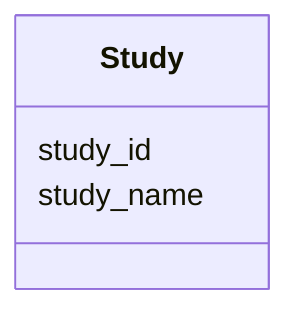

# Class: Study 


URI: [imgsg_dev:Study](https://w3id.org/jgi/imgsg_dev/Study)





<!-- no inheritance hierarchy -->


## Slots

| Name | Cardinality and Range | Description | Inheritance |
| ---  | --- | --- | --- |
| [study_id](study_id.md) | 0..1 <br/> [Integer](Integer.md) |  | direct |
| [study_name](study_name.md) | 0..1 <br/> [String](String.md) |  | direct |


## Usages

| used by | used in | type | used |
| ---  | --- | --- | --- |
| [ProjectInfo](ProjectInfo.md) | [fk_study_id](fk_study_id.md) | range | [Study](Study.md) |


## Identifier and Mapping Information


### Schema Source


* from schema: https://w3id.org/jgi/imgsg_dev


## Mappings

| Mapping Type | Mapped Value |
| ---  | ---  |
| self | imgsg_dev:Study |
| native | imgsg_dev:Study |


## LinkML Source

<!-- TODO: investigate https://stackoverflow.com/questions/37606292/how-to-create-tabbed-code-blocks-in-mkdocs-or-sphinx -->

### Direct

<details>
```yaml
name: study
from_schema: https://w3id.org/jgi/imgsg_dev
attributes:
  study_id:
    name: study_id
    from_schema: https://w3id.org/jgi/imgsg_dev
    domain_of:
    - gold_study
    - study
    range: integer
    required: false
  study_name:
    name: study_name
    from_schema: https://w3id.org/jgi/imgsg_dev
    domain_of:
    - gold_study
    - goldv5_view
    - study
    - study_load
    range: string
    required: false

```
</details>

### Induced

<details>
```yaml
name: study
from_schema: https://w3id.org/jgi/imgsg_dev
attributes:
  study_id:
    name: study_id
    from_schema: https://w3id.org/jgi/imgsg_dev
    alias: study_id
    owner: study
    domain_of:
    - gold_study
    - study
    range: integer
    required: false
  study_name:
    name: study_name
    from_schema: https://w3id.org/jgi/imgsg_dev
    alias: study_name
    owner: study
    domain_of:
    - gold_study
    - goldv5_view
    - study
    - study_load
    range: string
    required: false

```
</details>