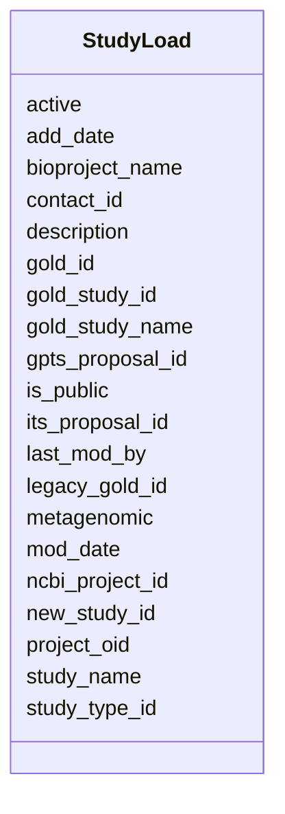

# Class: StudyLoad 


URI: [imgsg_dev:StudyLoad](https://w3id.org/jgi/imgsg_dev/StudyLoad)





<!-- no inheritance hierarchy -->


## Slots

| Name | Cardinality and Range | Description | Inheritance |
| ---  | --- | --- | --- |
| [new_study_id](new_study_id.md) | 0..1 <br/> [Integer](Integer.md) |  | direct |
| [gold_study_id](gold_study_id.md) | 0..1 <br/> [Integer](Integer.md) |  | direct |
| [study_name](study_name.md) | 0..1 <br/> [String](String.md) |  | direct |
| [its_proposal_id](its_proposal_id.md) | 0..1 <br/> [Integer](Integer.md) |  | direct |
| [ncbi_project_id](ncbi_project_id.md) | 0..1 <br/> [Integer](Integer.md) |  | direct |
| [add_date](add_date.md) | 0..1 <br/> [Datetime](Datetime.md) |  | direct |
| [mod_date](mod_date.md) | 0..1 <br/> [Datetime](Datetime.md) |  | direct |
| [contact_id](contact_id.md) | 0..1 <br/> [Integer](Integer.md) |  | direct |
| [last_mod_by](last_mod_by.md) | 0..1 <br/> [Integer](Integer.md) |  | direct |
| [is_public](is_public.md) | 0..1 <br/> [String](String.md) |  | direct |
| [gpts_proposal_id](gpts_proposal_id.md) | 0..1 <br/> [Integer](Integer.md) |  | direct |
| [project_oid](project_oid.md) | 0..1 <br/> [Integer](Integer.md) |  | direct |
| [active](active.md) | 0..1 <br/> [String](String.md) |  | direct |
| [legacy_gold_id](legacy_gold_id.md) | 0..1 <br/> [String](String.md) |  | direct |
| [bioproject_name](bioproject_name.md) | 0..1 <br/> [String](String.md) |  | direct |
| [gold_study_name](gold_study_name.md) | 0..1 <br/> [String](String.md) |  | direct |
| [description](description.md) | 0..1 <br/> [String](String.md) |  | direct |
| [gold_id](gold_id.md) | 0..1 <br/> [String](String.md) |  | direct |
| [metagenomic](metagenomic.md) | 0..1 <br/> [String](String.md) |  | direct |
| [study_type_id](study_type_id.md) | 0..1 <br/> [Integer](Integer.md) |  | direct |


## Identifier and Mapping Information


### Schema Source


* from schema: https://w3id.org/jgi/imgsg_dev


## Mappings

| Mapping Type | Mapped Value |
| ---  | ---  |
| self | imgsg_dev:StudyLoad |
| native | imgsg_dev:StudyLoad |


## LinkML Source

<!-- TODO: investigate https://stackoverflow.com/questions/37606292/how-to-create-tabbed-code-blocks-in-mkdocs-or-sphinx -->

### Direct

<details>
```yaml
name: study_load
from_schema: https://w3id.org/jgi/imgsg_dev
attributes:
  new_study_id:
    name: new_study_id
    from_schema: https://w3id.org/jgi/imgsg_dev
    rank: 1000
    domain_of:
    - study_load
    range: integer
    required: false
  gold_study_id:
    name: gold_study_id
    from_schema: https://w3id.org/jgi/imgsg_dev
    rank: 1000
    domain_of:
    - study_load
    range: integer
    required: false
  study_name:
    name: study_name
    from_schema: https://w3id.org/jgi/imgsg_dev
    domain_of:
    - gold_study
    - goldv5_view
    - study
    - study_load
    range: string
    required: false
  its_proposal_id:
    name: its_proposal_id
    from_schema: https://w3id.org/jgi/imgsg_dev
    domain_of:
    - env_sample
    - gold_sequencing_project
    - project_info
    - project_info_04112013
    - study_load
    range: integer
    required: false
  ncbi_project_id:
    name: ncbi_project_id
    from_schema: https://w3id.org/jgi/imgsg_dev
    domain_of:
    - env_sample
    - gold_sequencing_project
    - project_info
    - project_info_04112013
    - project_info_bioproject
    - project_info_biosample
    - study_load
    - vsample
    range: integer
    required: false
  add_date:
    name: add_date
    from_schema: https://w3id.org/jgi/imgsg_dev
    domain_of:
    - contact
    - env_sample
    - gold_sequencing_project
    - img_group
    - img_group_news
    - not_to_release
    - perferred_mbin_queue
    - project_info
    - project_info_04112013
    - rnaseq_notify_phajek
    - rnaseq_notify_phajek_dev
    - study_load
    - vsample
    range: datetime
    required: false
  mod_date:
    name: mod_date
    from_schema: https://w3id.org/jgi/imgsg_dev
    domain_of:
    - announcement
    - cancelled_user
    - env_sample
    - gold_analysis_project
    - gold_sequencing_project
    - gold_study
    - img_group_news
    - lanl_project
    - ornl_project
    - project_info
    - project_info_04112013
    - project_info_natural_prods
    - request_account
    - study_load
    - submission
    - submission_history
    - vsample
    range: datetime
    required: false
  contact_id:
    name: contact_id
    from_schema: https://w3id.org/jgi/imgsg_dev
    rank: 1000
    domain_of:
    - study_load
    range: integer
    required: false
  last_mod_by:
    name: last_mod_by
    from_schema: https://w3id.org/jgi/imgsg_dev
    rank: 1000
    domain_of:
    - study_load
    range: integer
    required: false
  is_public:
    name: is_public
    from_schema: https://w3id.org/jgi/imgsg_dev
    domain_of:
    - img_group_news
    - study_load
    range: string
    required: false
  gpts_proposal_id:
    name: gpts_proposal_id
    from_schema: https://w3id.org/jgi/imgsg_dev
    domain_of:
    - gold_sequencing_project
    - study_load
    range: integer
    required: false
  project_oid:
    name: project_oid
    from_schema: https://w3id.org/jgi/imgsg_dev
    domain_of:
    - bioproject_propagation
    - biosample
    - data_quality_flags
    - env_sample_soil_metadata
    - genbank_refseq_crossover
    - gold_analysis_project_lookup
    - gold_analysis_project_lookup2
    - gold_img_nat_prod_entity
    - ncbi_accessions
    - ncbi_accessions_jbtest
    - proj_info_cell_arrange_042014
    - project_info
    - project_info_04112013
    - project_info_bioproject
    - project_info_body_products
    - project_info_body_sites
    - project_info_cell_arrangement
    - project_info_collaborators
    - project_info_cyano_metadata
    - project_info_data_links
    - project_info_data_links_112013
    - project_info_diseases
    - project_info_energy_source
    - project_info_habitat
    - project_info_jgi_url
    - project_info_metabolism
    - project_info_natural_prods
    - project_info_nitrogen_fixation
    - project_info_nprods_metadata
    - project_info_phenotypes
    - project_info_project_relevance
    - project_info_seq_method
    - project_meta_updates
    - study_load
    - t_alex_test
    - t_all_gold_jgi_projects
    range: integer
    required: false
  active:
    name: active
    from_schema: https://w3id.org/jgi/imgsg_dev
    rank: 1000
    domain_of:
    - study_load
    range: string
    required: false
  legacy_gold_id:
    name: legacy_gold_id
    from_schema: https://w3id.org/jgi/imgsg_dev
    domain_of:
    - env_sample
    - gold_analysis_project_lookup
    - goldv5_view
    - project_info
    - study_load
    range: string
    required: false
  bioproject_name:
    name: bioproject_name
    from_schema: https://w3id.org/jgi/imgsg_dev
    domain_of:
    - project_info
    - project_info_04112013
    - study_load
    range: string
    required: false
  gold_study_name:
    name: gold_study_name
    from_schema: https://w3id.org/jgi/imgsg_dev
    rank: 1000
    domain_of:
    - study_load
    range: string
    required: false
  description:
    name: description
    from_schema: https://w3id.org/jgi/imgsg_dev
    domain_of:
    - gold_sequencing_project
    - img_group_news
    - imgcv
    - not_to_release
    - ora_aspnet_applications
    - ora_aspnet_roles
    - ora_aspnet_sitemap
    - project_info_biosample
    - public_workspace
    - study_load
    - submission_proc_stats
    - web_page_codecv
    - webpagecv
    range: string
    required: false
  gold_id:
    name: gold_id
    from_schema: https://w3id.org/jgi/imgsg_dev
    domain_of:
    - analysis_project_permissions
    - env_sample
    - gold_analysis_project
    - gold_analysis_project_genbanks
    - gold_analysis_project_jgi_award_dois
    - gold_analysis_project_lookup
    - gold_analysis_project_lookup2
    - gold_analysis_project_sra_runs
    - gold_analysis_project_users
    - gold_ap_genbank_anomalous_reasons
    - gold_ap_publications
    - gold_sequencing_project
    - gold_sp_cell_arrangement
    - gold_sp_collaborator
    - gold_sp_disease
    - gold_sp_energy_source
    - gold_sp_genome_publications
    - gold_sp_habitat
    - gold_sp_metabolism
    - gold_sp_phenotype
    - gold_sp_relevance
    - gold_sp_seq_center
    - gold_sp_seq_method
    - gold_sp_sra
    - gold_sp_study_gold_id
    - gold_study
    - gold_study_info
    - rnaseq_notify_phajek
    - rnaseq_notify_phajek_dev
    - study_load
    - v5_ap_imperfect_view
    - vsample
    range: string
    required: false
  metagenomic:
    name: metagenomic
    from_schema: https://w3id.org/jgi/imgsg_dev
    rank: 1000
    domain_of:
    - study_load
    range: string
    required: false
  study_type_id:
    name: study_type_id
    from_schema: https://w3id.org/jgi/imgsg_dev
    rank: 1000
    domain_of:
    - study_load
    range: integer
    required: false

```
</details>

### Induced

<details>
```yaml
name: study_load
from_schema: https://w3id.org/jgi/imgsg_dev
attributes:
  new_study_id:
    name: new_study_id
    from_schema: https://w3id.org/jgi/imgsg_dev
    rank: 1000
    alias: new_study_id
    owner: study_load
    domain_of:
    - study_load
    range: integer
    required: false
  gold_study_id:
    name: gold_study_id
    from_schema: https://w3id.org/jgi/imgsg_dev
    rank: 1000
    alias: gold_study_id
    owner: study_load
    domain_of:
    - study_load
    range: integer
    required: false
  study_name:
    name: study_name
    from_schema: https://w3id.org/jgi/imgsg_dev
    alias: study_name
    owner: study_load
    domain_of:
    - gold_study
    - goldv5_view
    - study
    - study_load
    range: string
    required: false
  its_proposal_id:
    name: its_proposal_id
    from_schema: https://w3id.org/jgi/imgsg_dev
    alias: its_proposal_id
    owner: study_load
    domain_of:
    - env_sample
    - gold_sequencing_project
    - project_info
    - project_info_04112013
    - study_load
    range: integer
    required: false
  ncbi_project_id:
    name: ncbi_project_id
    from_schema: https://w3id.org/jgi/imgsg_dev
    alias: ncbi_project_id
    owner: study_load
    domain_of:
    - env_sample
    - gold_sequencing_project
    - project_info
    - project_info_04112013
    - project_info_bioproject
    - project_info_biosample
    - study_load
    - vsample
    range: integer
    required: false
  add_date:
    name: add_date
    from_schema: https://w3id.org/jgi/imgsg_dev
    alias: add_date
    owner: study_load
    domain_of:
    - contact
    - env_sample
    - gold_sequencing_project
    - img_group
    - img_group_news
    - not_to_release
    - perferred_mbin_queue
    - project_info
    - project_info_04112013
    - rnaseq_notify_phajek
    - rnaseq_notify_phajek_dev
    - study_load
    - vsample
    range: datetime
    required: false
  mod_date:
    name: mod_date
    from_schema: https://w3id.org/jgi/imgsg_dev
    alias: mod_date
    owner: study_load
    domain_of:
    - announcement
    - cancelled_user
    - env_sample
    - gold_analysis_project
    - gold_sequencing_project
    - gold_study
    - img_group_news
    - lanl_project
    - ornl_project
    - project_info
    - project_info_04112013
    - project_info_natural_prods
    - request_account
    - study_load
    - submission
    - submission_history
    - vsample
    range: datetime
    required: false
  contact_id:
    name: contact_id
    from_schema: https://w3id.org/jgi/imgsg_dev
    rank: 1000
    alias: contact_id
    owner: study_load
    domain_of:
    - study_load
    range: integer
    required: false
  last_mod_by:
    name: last_mod_by
    from_schema: https://w3id.org/jgi/imgsg_dev
    rank: 1000
    alias: last_mod_by
    owner: study_load
    domain_of:
    - study_load
    range: integer
    required: false
  is_public:
    name: is_public
    from_schema: https://w3id.org/jgi/imgsg_dev
    alias: is_public
    owner: study_load
    domain_of:
    - img_group_news
    - study_load
    range: string
    required: false
  gpts_proposal_id:
    name: gpts_proposal_id
    from_schema: https://w3id.org/jgi/imgsg_dev
    alias: gpts_proposal_id
    owner: study_load
    domain_of:
    - gold_sequencing_project
    - study_load
    range: integer
    required: false
  project_oid:
    name: project_oid
    from_schema: https://w3id.org/jgi/imgsg_dev
    alias: project_oid
    owner: study_load
    domain_of:
    - bioproject_propagation
    - biosample
    - data_quality_flags
    - env_sample_soil_metadata
    - genbank_refseq_crossover
    - gold_analysis_project_lookup
    - gold_analysis_project_lookup2
    - gold_img_nat_prod_entity
    - ncbi_accessions
    - ncbi_accessions_jbtest
    - proj_info_cell_arrange_042014
    - project_info
    - project_info_04112013
    - project_info_bioproject
    - project_info_body_products
    - project_info_body_sites
    - project_info_cell_arrangement
    - project_info_collaborators
    - project_info_cyano_metadata
    - project_info_data_links
    - project_info_data_links_112013
    - project_info_diseases
    - project_info_energy_source
    - project_info_habitat
    - project_info_jgi_url
    - project_info_metabolism
    - project_info_natural_prods
    - project_info_nitrogen_fixation
    - project_info_nprods_metadata
    - project_info_phenotypes
    - project_info_project_relevance
    - project_info_seq_method
    - project_meta_updates
    - study_load
    - t_alex_test
    - t_all_gold_jgi_projects
    range: integer
    required: false
  active:
    name: active
    from_schema: https://w3id.org/jgi/imgsg_dev
    rank: 1000
    alias: active
    owner: study_load
    domain_of:
    - study_load
    range: string
    required: false
  legacy_gold_id:
    name: legacy_gold_id
    from_schema: https://w3id.org/jgi/imgsg_dev
    alias: legacy_gold_id
    owner: study_load
    domain_of:
    - env_sample
    - gold_analysis_project_lookup
    - goldv5_view
    - project_info
    - study_load
    range: string
    required: false
  bioproject_name:
    name: bioproject_name
    from_schema: https://w3id.org/jgi/imgsg_dev
    alias: bioproject_name
    owner: study_load
    domain_of:
    - project_info
    - project_info_04112013
    - study_load
    range: string
    required: false
  gold_study_name:
    name: gold_study_name
    from_schema: https://w3id.org/jgi/imgsg_dev
    rank: 1000
    alias: gold_study_name
    owner: study_load
    domain_of:
    - study_load
    range: string
    required: false
  description:
    name: description
    from_schema: https://w3id.org/jgi/imgsg_dev
    alias: description
    owner: study_load
    domain_of:
    - gold_sequencing_project
    - img_group_news
    - imgcv
    - not_to_release
    - ora_aspnet_applications
    - ora_aspnet_roles
    - ora_aspnet_sitemap
    - project_info_biosample
    - public_workspace
    - study_load
    - submission_proc_stats
    - web_page_codecv
    - webpagecv
    range: string
    required: false
  gold_id:
    name: gold_id
    from_schema: https://w3id.org/jgi/imgsg_dev
    alias: gold_id
    owner: study_load
    domain_of:
    - analysis_project_permissions
    - env_sample
    - gold_analysis_project
    - gold_analysis_project_genbanks
    - gold_analysis_project_jgi_award_dois
    - gold_analysis_project_lookup
    - gold_analysis_project_lookup2
    - gold_analysis_project_sra_runs
    - gold_analysis_project_users
    - gold_ap_genbank_anomalous_reasons
    - gold_ap_publications
    - gold_sequencing_project
    - gold_sp_cell_arrangement
    - gold_sp_collaborator
    - gold_sp_disease
    - gold_sp_energy_source
    - gold_sp_genome_publications
    - gold_sp_habitat
    - gold_sp_metabolism
    - gold_sp_phenotype
    - gold_sp_relevance
    - gold_sp_seq_center
    - gold_sp_seq_method
    - gold_sp_sra
    - gold_sp_study_gold_id
    - gold_study
    - gold_study_info
    - rnaseq_notify_phajek
    - rnaseq_notify_phajek_dev
    - study_load
    - v5_ap_imperfect_view
    - vsample
    range: string
    required: false
  metagenomic:
    name: metagenomic
    from_schema: https://w3id.org/jgi/imgsg_dev
    rank: 1000
    alias: metagenomic
    owner: study_load
    domain_of:
    - study_load
    range: string
    required: false
  study_type_id:
    name: study_type_id
    from_schema: https://w3id.org/jgi/imgsg_dev
    rank: 1000
    alias: study_type_id
    owner: study_load
    domain_of:
    - study_load
    range: integer
    required: false

```
</details>