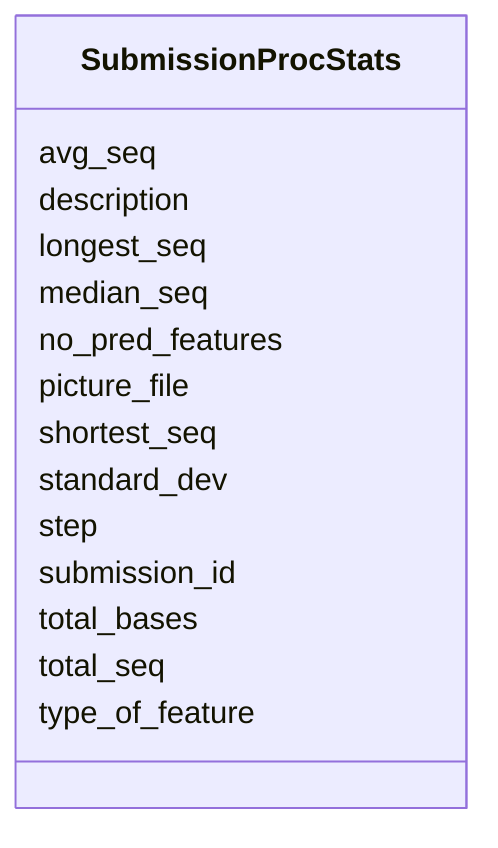

# Class: SubmissionProcStats 


URI: [imgsg_dev:SubmissionProcStats](https://w3id.org/jgi/imgsg_dev/SubmissionProcStats)





<!-- no inheritance hierarchy -->


## Slots

| Name | Cardinality and Range | Description | Inheritance |
| ---  | --- | --- | --- |
| [submission_id](submission_id.md) | 0..1 <br/> [Integer](Integer.md) |  | direct |
| [step](step.md) | 0..1 <br/> [String](String.md) |  | direct |
| [description](description.md) | 0..1 <br/> [String](String.md) |  | direct |
| [total_seq](total_seq.md) | 0..1 <br/> [Integer](Integer.md) |  | direct |
| [total_bases](total_bases.md) | 0..1 <br/> [Integer](Integer.md) |  | direct |
| [shortest_seq](shortest_seq.md) | 0..1 <br/> [Integer](Integer.md) |  | direct |
| [longest_seq](longest_seq.md) | 0..1 <br/> [Integer](Integer.md) |  | direct |
| [avg_seq](avg_seq.md) | 0..1 <br/> [Integer](Integer.md) |  | direct |
| [median_seq](median_seq.md) | 0..1 <br/> [Integer](Integer.md) |  | direct |
| [standard_dev](standard_dev.md) | 0..1 <br/> [Integer](Integer.md) |  | direct |
| [picture_file](picture_file.md) | 0..1 <br/> [String](String.md) |  | direct |
| [type_of_feature](type_of_feature.md) | 0..1 <br/> [String](String.md) |  | direct |
| [no_pred_features](no_pred_features.md) | 0..1 <br/> [Integer](Integer.md) |  | direct |


## Identifier and Mapping Information


### Schema Source


* from schema: https://w3id.org/jgi/imgsg_dev


## Mappings

| Mapping Type | Mapped Value |
| ---  | ---  |
| self | imgsg_dev:SubmissionProcStats |
| native | imgsg_dev:SubmissionProcStats |


## LinkML Source

<!-- TODO: investigate https://stackoverflow.com/questions/37606292/how-to-create-tabbed-code-blocks-in-mkdocs-or-sphinx -->

### Direct

<details>
```yaml
name: submission_proc_stats
from_schema: https://w3id.org/jgi/imgsg_dev
attributes:
  submission_id:
    name: submission_id
    from_schema: https://w3id.org/jgi/imgsg_dev
    domain_of:
    - annotation_contigs_proteins_counts
    - annotation_job_sbatch_args
    - annotation_job_stats
    - annotation_step_stats
    - bad_depth_file_warnings
    - bioproject_propagation
    - gold_analysis_project
    - mer_submissions_queue
    - merfs_aggregate_file_size
    - phajek_test
    - pig_tracks
    - project_info_bioproject
    - project_info_biosample
    - project_info_genbank
    - rnaseq_notify_phajek
    - rnaseq_notify_phajek_dev
    - submission
    - submission_data_files
    - submission_data_files_dmpath
    - submission_history
    - submission_img_contacts
    - submission_proc_stats
    - submission_proc_steps
    - submission_reads_file
    - submission_samples
    - t1_audit
    - v5_ap_imperfect_view
    range: integer
    required: false
  step:
    name: step
    from_schema: https://w3id.org/jgi/imgsg_dev
    domain_of:
    - annotation_step_stats
    - submission_proc_stats
    - submission_proc_steps
    range: string
    required: false
  description:
    name: description
    from_schema: https://w3id.org/jgi/imgsg_dev
    domain_of:
    - gold_sequencing_project
    - img_group_news
    - imgcv
    - not_to_release
    - ora_aspnet_applications
    - ora_aspnet_roles
    - ora_aspnet_sitemap
    - project_info_biosample
    - public_workspace
    - study_load
    - submission_proc_stats
    - web_page_codecv
    - webpagecv
    range: string
    required: false
  total_seq:
    name: total_seq
    from_schema: https://w3id.org/jgi/imgsg_dev
    rank: 1000
    domain_of:
    - submission_proc_stats
    range: integer
    required: false
  total_bases:
    name: total_bases
    from_schema: https://w3id.org/jgi/imgsg_dev
    rank: 1000
    domain_of:
    - submission_proc_stats
    range: integer
    required: false
  shortest_seq:
    name: shortest_seq
    from_schema: https://w3id.org/jgi/imgsg_dev
    rank: 1000
    domain_of:
    - submission_proc_stats
    range: integer
    required: false
  longest_seq:
    name: longest_seq
    from_schema: https://w3id.org/jgi/imgsg_dev
    rank: 1000
    domain_of:
    - submission_proc_stats
    range: integer
    required: false
  avg_seq:
    name: avg_seq
    from_schema: https://w3id.org/jgi/imgsg_dev
    rank: 1000
    domain_of:
    - submission_proc_stats
    range: integer
    required: false
  median_seq:
    name: median_seq
    from_schema: https://w3id.org/jgi/imgsg_dev
    rank: 1000
    domain_of:
    - submission_proc_stats
    range: integer
    required: false
  standard_dev:
    name: standard_dev
    from_schema: https://w3id.org/jgi/imgsg_dev
    rank: 1000
    domain_of:
    - submission_proc_stats
    range: integer
    required: false
  picture_file:
    name: picture_file
    from_schema: https://w3id.org/jgi/imgsg_dev
    rank: 1000
    domain_of:
    - submission_proc_stats
    range: string
    required: false
  type_of_feature:
    name: type_of_feature
    from_schema: https://w3id.org/jgi/imgsg_dev
    rank: 1000
    domain_of:
    - submission_proc_stats
    range: string
    required: false
  no_pred_features:
    name: no_pred_features
    from_schema: https://w3id.org/jgi/imgsg_dev
    rank: 1000
    domain_of:
    - submission_proc_stats
    range: integer
    required: false

```
</details>

### Induced

<details>
```yaml
name: submission_proc_stats
from_schema: https://w3id.org/jgi/imgsg_dev
attributes:
  submission_id:
    name: submission_id
    from_schema: https://w3id.org/jgi/imgsg_dev
    alias: submission_id
    owner: submission_proc_stats
    domain_of:
    - annotation_contigs_proteins_counts
    - annotation_job_sbatch_args
    - annotation_job_stats
    - annotation_step_stats
    - bad_depth_file_warnings
    - bioproject_propagation
    - gold_analysis_project
    - mer_submissions_queue
    - merfs_aggregate_file_size
    - phajek_test
    - pig_tracks
    - project_info_bioproject
    - project_info_biosample
    - project_info_genbank
    - rnaseq_notify_phajek
    - rnaseq_notify_phajek_dev
    - submission
    - submission_data_files
    - submission_data_files_dmpath
    - submission_history
    - submission_img_contacts
    - submission_proc_stats
    - submission_proc_steps
    - submission_reads_file
    - submission_samples
    - t1_audit
    - v5_ap_imperfect_view
    range: integer
    required: false
  step:
    name: step
    from_schema: https://w3id.org/jgi/imgsg_dev
    alias: step
    owner: submission_proc_stats
    domain_of:
    - annotation_step_stats
    - submission_proc_stats
    - submission_proc_steps
    range: string
    required: false
  description:
    name: description
    from_schema: https://w3id.org/jgi/imgsg_dev
    alias: description
    owner: submission_proc_stats
    domain_of:
    - gold_sequencing_project
    - img_group_news
    - imgcv
    - not_to_release
    - ora_aspnet_applications
    - ora_aspnet_roles
    - ora_aspnet_sitemap
    - project_info_biosample
    - public_workspace
    - study_load
    - submission_proc_stats
    - web_page_codecv
    - webpagecv
    range: string
    required: false
  total_seq:
    name: total_seq
    from_schema: https://w3id.org/jgi/imgsg_dev
    rank: 1000
    alias: total_seq
    owner: submission_proc_stats
    domain_of:
    - submission_proc_stats
    range: integer
    required: false
  total_bases:
    name: total_bases
    from_schema: https://w3id.org/jgi/imgsg_dev
    rank: 1000
    alias: total_bases
    owner: submission_proc_stats
    domain_of:
    - submission_proc_stats
    range: integer
    required: false
  shortest_seq:
    name: shortest_seq
    from_schema: https://w3id.org/jgi/imgsg_dev
    rank: 1000
    alias: shortest_seq
    owner: submission_proc_stats
    domain_of:
    - submission_proc_stats
    range: integer
    required: false
  longest_seq:
    name: longest_seq
    from_schema: https://w3id.org/jgi/imgsg_dev
    rank: 1000
    alias: longest_seq
    owner: submission_proc_stats
    domain_of:
    - submission_proc_stats
    range: integer
    required: false
  avg_seq:
    name: avg_seq
    from_schema: https://w3id.org/jgi/imgsg_dev
    rank: 1000
    alias: avg_seq
    owner: submission_proc_stats
    domain_of:
    - submission_proc_stats
    range: integer
    required: false
  median_seq:
    name: median_seq
    from_schema: https://w3id.org/jgi/imgsg_dev
    rank: 1000
    alias: median_seq
    owner: submission_proc_stats
    domain_of:
    - submission_proc_stats
    range: integer
    required: false
  standard_dev:
    name: standard_dev
    from_schema: https://w3id.org/jgi/imgsg_dev
    rank: 1000
    alias: standard_dev
    owner: submission_proc_stats
    domain_of:
    - submission_proc_stats
    range: integer
    required: false
  picture_file:
    name: picture_file
    from_schema: https://w3id.org/jgi/imgsg_dev
    rank: 1000
    alias: picture_file
    owner: submission_proc_stats
    domain_of:
    - submission_proc_stats
    range: string
    required: false
  type_of_feature:
    name: type_of_feature
    from_schema: https://w3id.org/jgi/imgsg_dev
    rank: 1000
    alias: type_of_feature
    owner: submission_proc_stats
    domain_of:
    - submission_proc_stats
    range: string
    required: false
  no_pred_features:
    name: no_pred_features
    from_schema: https://w3id.org/jgi/imgsg_dev
    rank: 1000
    alias: no_pred_features
    owner: submission_proc_stats
    domain_of:
    - submission_proc_stats
    range: integer
    required: false

```
</details>