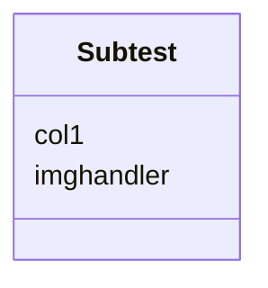

# Class: Subtest 


URI: [imgsg_dev:Subtest](https://w3id.org/jgi/imgsg_dev/Subtest)





<!-- no inheritance hierarchy -->


## Slots

| Name | Cardinality and Range | Description | Inheritance |
| ---  | --- | --- | --- |
| [col1](col1.md) | 0..1 <br/> [Integer](Integer.md) |  | direct |
| [imghandler](imghandler.md) | 0..1 <br/> [String](String.md) |  | direct |


## Identifier and Mapping Information


### Schema Source


* from schema: https://w3id.org/jgi/imgsg_dev


## Mappings

| Mapping Type | Mapped Value |
| ---  | ---  |
| self | imgsg_dev:Subtest |
| native | imgsg_dev:Subtest |


## LinkML Source

<!-- TODO: investigate https://stackoverflow.com/questions/37606292/how-to-create-tabbed-code-blocks-in-mkdocs-or-sphinx -->

### Direct

<details>
```yaml
name: subtest
from_schema: https://w3id.org/jgi/imgsg_dev
attributes:
  col1:
    name: col1
    from_schema: https://w3id.org/jgi/imgsg_dev
    rank: 1000
    domain_of:
    - subtest
    range: integer
    required: false
  imghandler:
    name: imghandler
    from_schema: https://w3id.org/jgi/imgsg_dev
    rank: 1000
    domain_of:
    - subtest
    range: string
    required: false

```
</details>

### Induced

<details>
```yaml
name: subtest
from_schema: https://w3id.org/jgi/imgsg_dev
attributes:
  col1:
    name: col1
    from_schema: https://w3id.org/jgi/imgsg_dev
    rank: 1000
    alias: col1
    owner: subtest
    domain_of:
    - subtest
    range: integer
    required: false
  imghandler:
    name: imghandler
    from_schema: https://w3id.org/jgi/imgsg_dev
    rank: 1000
    alias: imghandler
    owner: subtest
    domain_of:
    - subtest
    range: string
    required: false

```
</details>