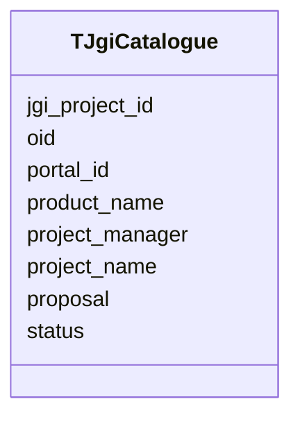

# Class: TJgiCatalogue 


URI: [imgsg_dev:TJgiCatalogue](https://w3id.org/jgi/imgsg_dev/TJgiCatalogue)





<!-- no inheritance hierarchy -->


## Slots

| Name | Cardinality and Range | Description | Inheritance |
| ---  | --- | --- | --- |
| [oid](oid.md) | 0..1 <br/> [Integer](Integer.md) |  | direct |
| [jgi_project_id](jgi_project_id.md) | 0..1 <br/> [Integer](Integer.md) |  | direct |
| [portal_id](portal_id.md) | 0..1 <br/> [String](String.md) |  | direct |
| [status](status.md) | 0..1 <br/> [String](String.md) |  | direct |
| [proposal](proposal.md) | 0..1 <br/> [String](String.md) |  | direct |
| [product_name](product_name.md) | 0..1 <br/> [String](String.md) |  | direct |
| [project_manager](project_manager.md) | 0..1 <br/> [String](String.md) |  | direct |
| [project_name](project_name.md) | 0..1 <br/> [String](String.md) |  | direct |


## Identifier and Mapping Information


### Schema Source


* from schema: https://w3id.org/jgi/imgsg_dev


## Mappings

| Mapping Type | Mapped Value |
| ---  | ---  |
| self | imgsg_dev:TJgiCatalogue |
| native | imgsg_dev:TJgiCatalogue |


## LinkML Source

<!-- TODO: investigate https://stackoverflow.com/questions/37606292/how-to-create-tabbed-code-blocks-in-mkdocs-or-sphinx -->

### Direct

<details>
```yaml
name: t_jgi_catalogue
from_schema: https://w3id.org/jgi/imgsg_dev
attributes:
  oid:
    name: oid
    from_schema: https://w3id.org/jgi/imgsg_dev
    rank: 1000
    domain_of:
    - t_jgi_catalogue
    range: integer
    required: false
  jgi_project_id:
    name: jgi_project_id
    from_schema: https://w3id.org/jgi/imgsg_dev
    domain_of:
    - lanl_project
    - ornl_project
    - pig_reruns
    - pig_retractions
    - pig_tracks
    - project_info_bioproject
    - project_info_biosample
    - project_info_genbank
    - t_jgi_catalogue
    range: integer
    required: false
  portal_id:
    name: portal_id
    from_schema: https://w3id.org/jgi/imgsg_dev
    rank: 1000
    domain_of:
    - t_jgi_catalogue
    range: string
    required: false
  status:
    name: status
    from_schema: https://w3id.org/jgi/imgsg_dev
    domain_of:
    - gold_analysis_project
    - lanl_project
    - load_genbank_prok_data
    - mer_submissions_queue
    - merfs_aggregate_file_size
    - ornl_project
    - request_account
    - submission
    - submission_history
    - t_jgi_catalogue
    - v5_ap_imperfect_view
    range: string
    required: false
  proposal:
    name: proposal
    from_schema: https://w3id.org/jgi/imgsg_dev
    rank: 1000
    domain_of:
    - t_jgi_catalogue
    range: string
    required: false
  product_name:
    name: product_name
    from_schema: https://w3id.org/jgi/imgsg_dev
    rank: 1000
    domain_of:
    - t_jgi_catalogue
    range: string
    required: false
  project_manager:
    name: project_manager
    from_schema: https://w3id.org/jgi/imgsg_dev
    rank: 1000
    domain_of:
    - t_jgi_catalogue
    range: string
    required: false
  project_name:
    name: project_name
    from_schema: https://w3id.org/jgi/imgsg_dev
    domain_of:
    - goldv5_view
    - project_info_bioproject
    - t_jgi_catalogue
    range: string
    required: false

```
</details>

### Induced

<details>
```yaml
name: t_jgi_catalogue
from_schema: https://w3id.org/jgi/imgsg_dev
attributes:
  oid:
    name: oid
    from_schema: https://w3id.org/jgi/imgsg_dev
    rank: 1000
    alias: oid
    owner: t_jgi_catalogue
    domain_of:
    - t_jgi_catalogue
    range: integer
    required: false
  jgi_project_id:
    name: jgi_project_id
    from_schema: https://w3id.org/jgi/imgsg_dev
    alias: jgi_project_id
    owner: t_jgi_catalogue
    domain_of:
    - lanl_project
    - ornl_project
    - pig_reruns
    - pig_retractions
    - pig_tracks
    - project_info_bioproject
    - project_info_biosample
    - project_info_genbank
    - t_jgi_catalogue
    range: integer
    required: false
  portal_id:
    name: portal_id
    from_schema: https://w3id.org/jgi/imgsg_dev
    rank: 1000
    alias: portal_id
    owner: t_jgi_catalogue
    domain_of:
    - t_jgi_catalogue
    range: string
    required: false
  status:
    name: status
    from_schema: https://w3id.org/jgi/imgsg_dev
    alias: status
    owner: t_jgi_catalogue
    domain_of:
    - gold_analysis_project
    - lanl_project
    - load_genbank_prok_data
    - mer_submissions_queue
    - merfs_aggregate_file_size
    - ornl_project
    - request_account
    - submission
    - submission_history
    - t_jgi_catalogue
    - v5_ap_imperfect_view
    range: string
    required: false
  proposal:
    name: proposal
    from_schema: https://w3id.org/jgi/imgsg_dev
    rank: 1000
    alias: proposal
    owner: t_jgi_catalogue
    domain_of:
    - t_jgi_catalogue
    range: string
    required: false
  product_name:
    name: product_name
    from_schema: https://w3id.org/jgi/imgsg_dev
    rank: 1000
    alias: product_name
    owner: t_jgi_catalogue
    domain_of:
    - t_jgi_catalogue
    range: string
    required: false
  project_manager:
    name: project_manager
    from_schema: https://w3id.org/jgi/imgsg_dev
    rank: 1000
    alias: project_manager
    owner: t_jgi_catalogue
    domain_of:
    - t_jgi_catalogue
    range: string
    required: false
  project_name:
    name: project_name
    from_schema: https://w3id.org/jgi/imgsg_dev
    alias: project_name
    owner: t_jgi_catalogue
    domain_of:
    - goldv5_view
    - project_info_bioproject
    - t_jgi_catalogue
    range: string
    required: false

```
</details>