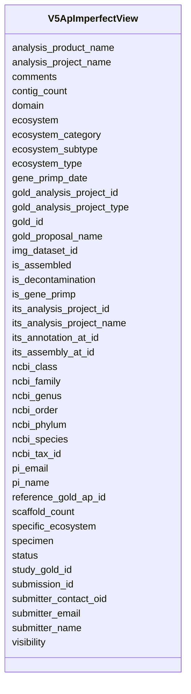

# Class: V5ApImperfectView 


URI: [imgsg_dev:V5ApImperfectView](https://w3id.org/jgi/imgsg_dev/V5ApImperfectView)





<!-- no inheritance hierarchy -->


## Slots

| Name | Cardinality and Range | Description | Inheritance |
| ---  | --- | --- | --- |
| [gold_analysis_project_id](gold_analysis_project_id.md) | 0..1 <br/> [Integer](Integer.md) |  | direct |
| [its_analysis_project_id](its_analysis_project_id.md) | 0..1 <br/> [Integer](Integer.md) |  | direct |
| [its_assembly_at_id](its_assembly_at_id.md) | 0..1 <br/> [Integer](Integer.md) |  | direct |
| [its_annotation_at_id](its_annotation_at_id.md) | 0..1 <br/> [Integer](Integer.md) |  | direct |
| [analysis_project_name](analysis_project_name.md) | 0..1 <br/> [String](String.md) |  | direct |
| [its_analysis_project_name](its_analysis_project_name.md) | 0..1 <br/> [String](String.md) |  | direct |
| [gold_id](gold_id.md) | 0..1 <br/> [String](String.md) |  | direct |
| [reference_gold_ap_id](reference_gold_ap_id.md) | 0..1 <br/> [Integer](Integer.md) |  | direct |
| [img_dataset_id](img_dataset_id.md) | 0..1 <br/> [String](String.md) |  | direct |
| [analysis_product_name](analysis_product_name.md) | 0..1 <br/> [String](String.md) |  | direct |
| [ncbi_tax_id](ncbi_tax_id.md) | 0..1 <br/> [Integer](Integer.md) |  | direct |
| [visibility](visibility.md) | 0..1 <br/> [String](String.md) |  | direct |
| [domain](domain.md) | 0..1 <br/> [String](String.md) |  | direct |
| [ncbi_phylum](ncbi_phylum.md) | 0..1 <br/> [String](String.md) |  | direct |
| [ncbi_class](ncbi_class.md) | 0..1 <br/> [String](String.md) |  | direct |
| [ncbi_order](ncbi_order.md) | 0..1 <br/> [String](String.md) |  | direct |
| [ncbi_family](ncbi_family.md) | 0..1 <br/> [String](String.md) |  | direct |
| [ncbi_genus](ncbi_genus.md) | 0..1 <br/> [String](String.md) |  | direct |
| [ncbi_species](ncbi_species.md) | 0..1 <br/> [String](String.md) |  | direct |
| [gold_analysis_project_type](gold_analysis_project_type.md) | 0..1 <br/> [String](String.md) |  | direct |
| [study_gold_id](study_gold_id.md) | 0..1 <br/> [String](String.md) |  | direct |
| [gold_proposal_name](gold_proposal_name.md) | 0..1 <br/> [String](String.md) |  | direct |
| [ecosystem](ecosystem.md) | 0..1 <br/> [String](String.md) |  | direct |
| [ecosystem_category](ecosystem_category.md) | 0..1 <br/> [String](String.md) |  | direct |
| [ecosystem_type](ecosystem_type.md) | 0..1 <br/> [String](String.md) |  | direct |
| [ecosystem_subtype](ecosystem_subtype.md) | 0..1 <br/> [String](String.md) |  | direct |
| [specific_ecosystem](specific_ecosystem.md) | 0..1 <br/> [String](String.md) |  | direct |
| [pi_name](pi_name.md) | 0..1 <br/> [String](String.md) |  | direct |
| [pi_email](pi_email.md) | 0..1 <br/> [String](String.md) |  | direct |
| [submitter_contact_oid](submitter_contact_oid.md) | 0..1 <br/> [Integer](Integer.md) |  | direct |
| [submitter_name](submitter_name.md) | 0..1 <br/> [String](String.md) |  | direct |
| [submitter_email](submitter_email.md) | 0..1 <br/> [String](String.md) |  | direct |
| [specimen](specimen.md) | 0..1 <br/> [String](String.md) |  | direct |
| [comments](comments.md) | 0..1 <br/> [String](String.md) |  | direct |
| [submission_id](submission_id.md) | 0..1 <br/> [Integer](Integer.md) |  | direct |
| [is_assembled](is_assembled.md) | 0..1 <br/> [String](String.md) |  | direct |
| [is_decontamination](is_decontamination.md) | 0..1 <br/> [String](String.md) |  | direct |
| [is_gene_primp](is_gene_primp.md) | 0..1 <br/> [String](String.md) |  | direct |
| [gene_primp_date](gene_primp_date.md) | 0..1 <br/> [Datetime](Datetime.md) |  | direct |
| [contig_count](contig_count.md) | 0..1 <br/> [Integer](Integer.md) |  | direct |
| [scaffold_count](scaffold_count.md) | 0..1 <br/> [Integer](Integer.md) |  | direct |
| [status](status.md) | 0..1 <br/> [String](String.md) |  | direct |


## Identifier and Mapping Information


### Schema Source


* from schema: https://w3id.org/jgi/imgsg_dev


## Mappings

| Mapping Type | Mapped Value |
| ---  | ---  |
| self | imgsg_dev:V5ApImperfectView |
| native | imgsg_dev:V5ApImperfectView |


## LinkML Source

<!-- TODO: investigate https://stackoverflow.com/questions/37606292/how-to-create-tabbed-code-blocks-in-mkdocs-or-sphinx -->

### Direct

<details>
```yaml
name: v5_ap_imperfect_view
from_schema: https://w3id.org/jgi/imgsg_dev
attributes:
  gold_analysis_project_id:
    name: gold_analysis_project_id
    from_schema: https://w3id.org/jgi/imgsg_dev
    domain_of:
    - gold_analysis_project
    - gold_analysis_project_lookup
    - gold_ap_genbank
    - ncbi_accessions
    - v5_ap_imperfect_view
    range: integer
    required: false
  its_analysis_project_id:
    name: its_analysis_project_id
    from_schema: https://w3id.org/jgi/imgsg_dev
    domain_of:
    - gold_analysis_project
    - v5_ap_imperfect_view
    range: integer
    required: false
  its_assembly_at_id:
    name: its_assembly_at_id
    from_schema: https://w3id.org/jgi/imgsg_dev
    domain_of:
    - gold_analysis_project
    - v5_ap_imperfect_view
    range: integer
    required: false
  its_annotation_at_id:
    name: its_annotation_at_id
    from_schema: https://w3id.org/jgi/imgsg_dev
    domain_of:
    - gold_analysis_project
    - goldv5_view
    - v5_ap_imperfect_view
    range: integer
    required: false
  analysis_project_name:
    name: analysis_project_name
    from_schema: https://w3id.org/jgi/imgsg_dev
    domain_of:
    - gold_analysis_project
    - v5_ap_imperfect_view
    range: string
    required: false
  its_analysis_project_name:
    name: its_analysis_project_name
    from_schema: https://w3id.org/jgi/imgsg_dev
    domain_of:
    - gold_analysis_project
    - v5_ap_imperfect_view
    range: string
    required: false
  gold_id:
    name: gold_id
    from_schema: https://w3id.org/jgi/imgsg_dev
    domain_of:
    - analysis_project_permissions
    - env_sample
    - gold_analysis_project
    - gold_analysis_project_genbanks
    - gold_analysis_project_jgi_award_dois
    - gold_analysis_project_lookup
    - gold_analysis_project_lookup2
    - gold_analysis_project_sra_runs
    - gold_analysis_project_users
    - gold_ap_genbank_anomalous_reasons
    - gold_ap_publications
    - gold_sequencing_project
    - gold_sp_cell_arrangement
    - gold_sp_collaborator
    - gold_sp_disease
    - gold_sp_energy_source
    - gold_sp_genome_publications
    - gold_sp_habitat
    - gold_sp_metabolism
    - gold_sp_phenotype
    - gold_sp_relevance
    - gold_sp_seq_center
    - gold_sp_seq_method
    - gold_sp_sra
    - gold_sp_study_gold_id
    - gold_study
    - gold_study_info
    - rnaseq_notify_phajek
    - rnaseq_notify_phajek_dev
    - study_load
    - v5_ap_imperfect_view
    - vsample
    range: string
    required: false
  reference_gold_ap_id:
    name: reference_gold_ap_id
    from_schema: https://w3id.org/jgi/imgsg_dev
    domain_of:
    - gold_analysis_project
    - v5_ap_imperfect_view
    range: integer
    required: false
  img_dataset_id:
    name: img_dataset_id
    from_schema: https://w3id.org/jgi/imgsg_dev
    domain_of:
    - gold_analysis_project
    - v5_ap_imperfect_view
    range: string
    required: false
  analysis_product_name:
    name: analysis_product_name
    from_schema: https://w3id.org/jgi/imgsg_dev
    domain_of:
    - gold_analysis_project
    - v5_ap_imperfect_view
    range: string
    required: false
  ncbi_tax_id:
    name: ncbi_tax_id
    from_schema: https://w3id.org/jgi/imgsg_dev
    domain_of:
    - gold_analysis_project
    - v5_ap_imperfect_view
    range: integer
    required: false
  visibility:
    name: visibility
    from_schema: https://w3id.org/jgi/imgsg_dev
    domain_of:
    - gold_analysis_project
    - v5_ap_imperfect_view
    range: string
    required: false
  domain:
    name: domain
    from_schema: https://w3id.org/jgi/imgsg_dev
    domain_of:
    - gold_analysis_project
    - gold_sequencing_project
    - organism_sort
    - project_info
    - project_info_04112013
    - v5_ap_imperfect_view
    range: string
    required: false
  ncbi_phylum:
    name: ncbi_phylum
    from_schema: https://w3id.org/jgi/imgsg_dev
    domain_of:
    - gold_analysis_project
    - gold_sequencing_project
    - organism_sort
    - project_info
    - project_info_04112013
    - v5_ap_imperfect_view
    range: string
    required: false
  ncbi_class:
    name: ncbi_class
    from_schema: https://w3id.org/jgi/imgsg_dev
    domain_of:
    - gold_analysis_project
    - gold_sequencing_project
    - organism_sort
    - project_info
    - project_info_04112013
    - v5_ap_imperfect_view
    range: string
    required: false
  ncbi_order:
    name: ncbi_order
    from_schema: https://w3id.org/jgi/imgsg_dev
    domain_of:
    - gold_analysis_project
    - gold_sequencing_project
    - organism_sort
    - project_info
    - project_info_04112013
    - v5_ap_imperfect_view
    range: string
    required: false
  ncbi_family:
    name: ncbi_family
    from_schema: https://w3id.org/jgi/imgsg_dev
    domain_of:
    - gold_analysis_project
    - gold_sequencing_project
    - project_info
    - project_info_04112013
    - v5_ap_imperfect_view
    range: string
    required: false
  ncbi_genus:
    name: ncbi_genus
    from_schema: https://w3id.org/jgi/imgsg_dev
    domain_of:
    - gold_analysis_project
    - gold_sequencing_project
    - organism_sort
    - project_info
    - project_info_04112013
    - v5_ap_imperfect_view
    range: string
    required: false
  ncbi_species:
    name: ncbi_species
    from_schema: https://w3id.org/jgi/imgsg_dev
    domain_of:
    - gold_analysis_project
    - gold_sequencing_project
    - organism_sort
    - project_info
    - project_info_04112013
    - v5_ap_imperfect_view
    range: string
    required: false
  gold_analysis_project_type:
    name: gold_analysis_project_type
    from_schema: https://w3id.org/jgi/imgsg_dev
    domain_of:
    - gold_analysis_project
    - v5_ap_imperfect_view
    range: string
    required: false
  study_gold_id:
    name: study_gold_id
    from_schema: https://w3id.org/jgi/imgsg_dev
    domain_of:
    - gold_analysis_project
    - gold_sp_study_gold_id
    - goldv5_view
    - v5_ap_imperfect_view
    range: string
    required: false
  gold_proposal_name:
    name: gold_proposal_name
    from_schema: https://w3id.org/jgi/imgsg_dev
    domain_of:
    - gold_analysis_project
    - v5_ap_imperfect_view
    range: string
    required: false
  ecosystem:
    name: ecosystem
    from_schema: https://w3id.org/jgi/imgsg_dev
    domain_of:
    - cvecosystem
    - env_sample
    - gold_analysis_project
    - gold_sequencing_project
    - gold_study
    - metagenomic_class_nodes
    - metagenomic_class_nodes_new
    - metagenomic_class_nodes_new_bk
    - metagenomic_classification
    - project_info
    - project_info_04112013
    - v5_ap_imperfect_view
    - vsample
    range: string
    required: false
  ecosystem_category:
    name: ecosystem_category
    from_schema: https://w3id.org/jgi/imgsg_dev
    domain_of:
    - cvecosystem_category
    - env_sample
    - gold_analysis_project
    - gold_sequencing_project
    - gold_study
    - metagenomic_class_nodes
    - metagenomic_class_nodes_new
    - metagenomic_class_nodes_new_bk
    - metagenomic_classification
    - project_info
    - project_info_04112013
    - v5_ap_imperfect_view
    - vsample
    range: string
    required: false
  ecosystem_type:
    name: ecosystem_type
    from_schema: https://w3id.org/jgi/imgsg_dev
    domain_of:
    - cvecosystem_type
    - env_sample
    - gold_analysis_project
    - gold_sequencing_project
    - gold_study
    - metagenomic_class_nodes
    - metagenomic_class_nodes_new
    - metagenomic_class_nodes_new_bk
    - metagenomic_classification
    - project_info
    - project_info_04112013
    - v5_ap_imperfect_view
    - vsample
    range: string
    required: false
  ecosystem_subtype:
    name: ecosystem_subtype
    from_schema: https://w3id.org/jgi/imgsg_dev
    domain_of:
    - cvecosystem_subtype
    - env_sample
    - gold_analysis_project
    - gold_sequencing_project
    - gold_study
    - metagenomic_class_nodes
    - metagenomic_class_nodes_new
    - metagenomic_class_nodes_new_bk
    - metagenomic_classification
    - project_info
    - project_info_04112013
    - v5_ap_imperfect_view
    - vsample
    range: string
    required: false
  specific_ecosystem:
    name: specific_ecosystem
    from_schema: https://w3id.org/jgi/imgsg_dev
    domain_of:
    - cvspecific_ecosystem
    - env_sample
    - gold_analysis_project
    - gold_sequencing_project
    - gold_study
    - metagenomic_class_nodes
    - metagenomic_class_nodes_new
    - metagenomic_class_nodes_new_bk
    - metagenomic_classification
    - project_info
    - project_info_04112013
    - v5_ap_imperfect_view
    - vsample
    range: string
    required: false
  pi_name:
    name: pi_name
    from_schema: https://w3id.org/jgi/imgsg_dev
    domain_of:
    - gold_analysis_project
    - gold_sequencing_project
    - v5_ap_imperfect_view
    range: string
    required: false
  pi_email:
    name: pi_email
    from_schema: https://w3id.org/jgi/imgsg_dev
    domain_of:
    - gold_analysis_project
    - gold_sequencing_project
    - rnaseq_notify_phajek
    - rnaseq_notify_phajek_dev
    - v5_ap_imperfect_view
    range: string
    required: false
  submitter_contact_oid:
    name: submitter_contact_oid
    from_schema: https://w3id.org/jgi/imgsg_dev
    domain_of:
    - gold_analysis_project
    - v5_ap_imperfect_view
    range: integer
    required: false
  submitter_name:
    name: submitter_name
    from_schema: https://w3id.org/jgi/imgsg_dev
    rank: 1000
    domain_of:
    - v5_ap_imperfect_view
    range: string
    required: false
  submitter_email:
    name: submitter_email
    from_schema: https://w3id.org/jgi/imgsg_dev
    domain_of:
    - gold_analysis_project
    - v5_ap_imperfect_view
    range: string
    required: false
  specimen:
    name: specimen
    from_schema: https://w3id.org/jgi/imgsg_dev
    domain_of:
    - gold_analysis_project
    - v5_ap_imperfect_view
    range: string
    required: false
  comments:
    name: comments
    from_schema: https://w3id.org/jgi/imgsg_dev
    domain_of:
    - assembly
    - cancelled_user
    - contact
    - env_sample
    - gold_analysis_project
    - gold_sequencing_project
    - img_group
    - ora_aspnet_membership
    - project_info
    - project_info_04112013
    - project_info_genbank_authors
    - project_info_nitrogen_fixation
    - request_account
    - submission
    - submission_history
    - submission_proc_steps
    - v5_ap_imperfect_view
    - vsample
    range: string
    required: false
  submission_id:
    name: submission_id
    from_schema: https://w3id.org/jgi/imgsg_dev
    domain_of:
    - annotation_contigs_proteins_counts
    - annotation_job_sbatch_args
    - annotation_job_stats
    - annotation_step_stats
    - bad_depth_file_warnings
    - bioproject_propagation
    - gold_analysis_project
    - mer_submissions_queue
    - merfs_aggregate_file_size
    - phajek_test
    - pig_tracks
    - project_info_bioproject
    - project_info_biosample
    - project_info_genbank
    - rnaseq_notify_phajek
    - rnaseq_notify_phajek_dev
    - submission
    - submission_data_files
    - submission_data_files_dmpath
    - submission_history
    - submission_img_contacts
    - submission_proc_stats
    - submission_proc_steps
    - submission_reads_file
    - submission_samples
    - t1_audit
    - v5_ap_imperfect_view
    range: integer
    required: false
  is_assembled:
    name: is_assembled
    from_schema: https://w3id.org/jgi/imgsg_dev
    domain_of:
    - gold_analysis_project
    - v5_ap_imperfect_view
    range: string
    required: false
  is_decontamination:
    name: is_decontamination
    from_schema: https://w3id.org/jgi/imgsg_dev
    domain_of:
    - gold_analysis_project
    - v5_ap_imperfect_view
    range: string
    required: false
  is_gene_primp:
    name: is_gene_primp
    from_schema: https://w3id.org/jgi/imgsg_dev
    domain_of:
    - gold_analysis_project
    - v5_ap_imperfect_view
    range: string
    required: false
  gene_primp_date:
    name: gene_primp_date
    from_schema: https://w3id.org/jgi/imgsg_dev
    domain_of:
    - gold_analysis_project
    - v5_ap_imperfect_view
    range: datetime
    required: false
  contig_count:
    name: contig_count
    from_schema: https://w3id.org/jgi/imgsg_dev
    domain_of:
    - env_sample
    - gold_analysis_project
    - pig_tracks
    - project_info
    - project_info_04112013
    - project_info_genbank
    - v5_ap_imperfect_view
    - vsample
    range: integer
    required: false
  scaffold_count:
    name: scaffold_count
    from_schema: https://w3id.org/jgi/imgsg_dev
    domain_of:
    - env_sample
    - gold_analysis_project
    - project_info
    - project_info_04112013
    - submission
    - v5_ap_imperfect_view
    range: integer
    required: false
  status:
    name: status
    from_schema: https://w3id.org/jgi/imgsg_dev
    domain_of:
    - gold_analysis_project
    - lanl_project
    - load_genbank_prok_data
    - mer_submissions_queue
    - merfs_aggregate_file_size
    - ornl_project
    - request_account
    - submission
    - submission_history
    - t_jgi_catalogue
    - v5_ap_imperfect_view
    range: string
    required: false

```
</details>

### Induced

<details>
```yaml
name: v5_ap_imperfect_view
from_schema: https://w3id.org/jgi/imgsg_dev
attributes:
  gold_analysis_project_id:
    name: gold_analysis_project_id
    from_schema: https://w3id.org/jgi/imgsg_dev
    alias: gold_analysis_project_id
    owner: v5_ap_imperfect_view
    domain_of:
    - gold_analysis_project
    - gold_analysis_project_lookup
    - gold_ap_genbank
    - ncbi_accessions
    - v5_ap_imperfect_view
    range: integer
    required: false
  its_analysis_project_id:
    name: its_analysis_project_id
    from_schema: https://w3id.org/jgi/imgsg_dev
    alias: its_analysis_project_id
    owner: v5_ap_imperfect_view
    domain_of:
    - gold_analysis_project
    - v5_ap_imperfect_view
    range: integer
    required: false
  its_assembly_at_id:
    name: its_assembly_at_id
    from_schema: https://w3id.org/jgi/imgsg_dev
    alias: its_assembly_at_id
    owner: v5_ap_imperfect_view
    domain_of:
    - gold_analysis_project
    - v5_ap_imperfect_view
    range: integer
    required: false
  its_annotation_at_id:
    name: its_annotation_at_id
    from_schema: https://w3id.org/jgi/imgsg_dev
    alias: its_annotation_at_id
    owner: v5_ap_imperfect_view
    domain_of:
    - gold_analysis_project
    - goldv5_view
    - v5_ap_imperfect_view
    range: integer
    required: false
  analysis_project_name:
    name: analysis_project_name
    from_schema: https://w3id.org/jgi/imgsg_dev
    alias: analysis_project_name
    owner: v5_ap_imperfect_view
    domain_of:
    - gold_analysis_project
    - v5_ap_imperfect_view
    range: string
    required: false
  its_analysis_project_name:
    name: its_analysis_project_name
    from_schema: https://w3id.org/jgi/imgsg_dev
    alias: its_analysis_project_name
    owner: v5_ap_imperfect_view
    domain_of:
    - gold_analysis_project
    - v5_ap_imperfect_view
    range: string
    required: false
  gold_id:
    name: gold_id
    from_schema: https://w3id.org/jgi/imgsg_dev
    alias: gold_id
    owner: v5_ap_imperfect_view
    domain_of:
    - analysis_project_permissions
    - env_sample
    - gold_analysis_project
    - gold_analysis_project_genbanks
    - gold_analysis_project_jgi_award_dois
    - gold_analysis_project_lookup
    - gold_analysis_project_lookup2
    - gold_analysis_project_sra_runs
    - gold_analysis_project_users
    - gold_ap_genbank_anomalous_reasons
    - gold_ap_publications
    - gold_sequencing_project
    - gold_sp_cell_arrangement
    - gold_sp_collaborator
    - gold_sp_disease
    - gold_sp_energy_source
    - gold_sp_genome_publications
    - gold_sp_habitat
    - gold_sp_metabolism
    - gold_sp_phenotype
    - gold_sp_relevance
    - gold_sp_seq_center
    - gold_sp_seq_method
    - gold_sp_sra
    - gold_sp_study_gold_id
    - gold_study
    - gold_study_info
    - rnaseq_notify_phajek
    - rnaseq_notify_phajek_dev
    - study_load
    - v5_ap_imperfect_view
    - vsample
    range: string
    required: false
  reference_gold_ap_id:
    name: reference_gold_ap_id
    from_schema: https://w3id.org/jgi/imgsg_dev
    alias: reference_gold_ap_id
    owner: v5_ap_imperfect_view
    domain_of:
    - gold_analysis_project
    - v5_ap_imperfect_view
    range: integer
    required: false
  img_dataset_id:
    name: img_dataset_id
    from_schema: https://w3id.org/jgi/imgsg_dev
    alias: img_dataset_id
    owner: v5_ap_imperfect_view
    domain_of:
    - gold_analysis_project
    - v5_ap_imperfect_view
    range: string
    required: false
  analysis_product_name:
    name: analysis_product_name
    from_schema: https://w3id.org/jgi/imgsg_dev
    alias: analysis_product_name
    owner: v5_ap_imperfect_view
    domain_of:
    - gold_analysis_project
    - v5_ap_imperfect_view
    range: string
    required: false
  ncbi_tax_id:
    name: ncbi_tax_id
    from_schema: https://w3id.org/jgi/imgsg_dev
    alias: ncbi_tax_id
    owner: v5_ap_imperfect_view
    domain_of:
    - gold_analysis_project
    - v5_ap_imperfect_view
    range: integer
    required: false
  visibility:
    name: visibility
    from_schema: https://w3id.org/jgi/imgsg_dev
    alias: visibility
    owner: v5_ap_imperfect_view
    domain_of:
    - gold_analysis_project
    - v5_ap_imperfect_view
    range: string
    required: false
  domain:
    name: domain
    from_schema: https://w3id.org/jgi/imgsg_dev
    alias: domain
    owner: v5_ap_imperfect_view
    domain_of:
    - gold_analysis_project
    - gold_sequencing_project
    - organism_sort
    - project_info
    - project_info_04112013
    - v5_ap_imperfect_view
    range: string
    required: false
  ncbi_phylum:
    name: ncbi_phylum
    from_schema: https://w3id.org/jgi/imgsg_dev
    alias: ncbi_phylum
    owner: v5_ap_imperfect_view
    domain_of:
    - gold_analysis_project
    - gold_sequencing_project
    - organism_sort
    - project_info
    - project_info_04112013
    - v5_ap_imperfect_view
    range: string
    required: false
  ncbi_class:
    name: ncbi_class
    from_schema: https://w3id.org/jgi/imgsg_dev
    alias: ncbi_class
    owner: v5_ap_imperfect_view
    domain_of:
    - gold_analysis_project
    - gold_sequencing_project
    - organism_sort
    - project_info
    - project_info_04112013
    - v5_ap_imperfect_view
    range: string
    required: false
  ncbi_order:
    name: ncbi_order
    from_schema: https://w3id.org/jgi/imgsg_dev
    alias: ncbi_order
    owner: v5_ap_imperfect_view
    domain_of:
    - gold_analysis_project
    - gold_sequencing_project
    - organism_sort
    - project_info
    - project_info_04112013
    - v5_ap_imperfect_view
    range: string
    required: false
  ncbi_family:
    name: ncbi_family
    from_schema: https://w3id.org/jgi/imgsg_dev
    alias: ncbi_family
    owner: v5_ap_imperfect_view
    domain_of:
    - gold_analysis_project
    - gold_sequencing_project
    - project_info
    - project_info_04112013
    - v5_ap_imperfect_view
    range: string
    required: false
  ncbi_genus:
    name: ncbi_genus
    from_schema: https://w3id.org/jgi/imgsg_dev
    alias: ncbi_genus
    owner: v5_ap_imperfect_view
    domain_of:
    - gold_analysis_project
    - gold_sequencing_project
    - organism_sort
    - project_info
    - project_info_04112013
    - v5_ap_imperfect_view
    range: string
    required: false
  ncbi_species:
    name: ncbi_species
    from_schema: https://w3id.org/jgi/imgsg_dev
    alias: ncbi_species
    owner: v5_ap_imperfect_view
    domain_of:
    - gold_analysis_project
    - gold_sequencing_project
    - organism_sort
    - project_info
    - project_info_04112013
    - v5_ap_imperfect_view
    range: string
    required: false
  gold_analysis_project_type:
    name: gold_analysis_project_type
    from_schema: https://w3id.org/jgi/imgsg_dev
    alias: gold_analysis_project_type
    owner: v5_ap_imperfect_view
    domain_of:
    - gold_analysis_project
    - v5_ap_imperfect_view
    range: string
    required: false
  study_gold_id:
    name: study_gold_id
    from_schema: https://w3id.org/jgi/imgsg_dev
    alias: study_gold_id
    owner: v5_ap_imperfect_view
    domain_of:
    - gold_analysis_project
    - gold_sp_study_gold_id
    - goldv5_view
    - v5_ap_imperfect_view
    range: string
    required: false
  gold_proposal_name:
    name: gold_proposal_name
    from_schema: https://w3id.org/jgi/imgsg_dev
    alias: gold_proposal_name
    owner: v5_ap_imperfect_view
    domain_of:
    - gold_analysis_project
    - v5_ap_imperfect_view
    range: string
    required: false
  ecosystem:
    name: ecosystem
    from_schema: https://w3id.org/jgi/imgsg_dev
    alias: ecosystem
    owner: v5_ap_imperfect_view
    domain_of:
    - cvecosystem
    - env_sample
    - gold_analysis_project
    - gold_sequencing_project
    - gold_study
    - metagenomic_class_nodes
    - metagenomic_class_nodes_new
    - metagenomic_class_nodes_new_bk
    - metagenomic_classification
    - project_info
    - project_info_04112013
    - v5_ap_imperfect_view
    - vsample
    range: string
    required: false
  ecosystem_category:
    name: ecosystem_category
    from_schema: https://w3id.org/jgi/imgsg_dev
    alias: ecosystem_category
    owner: v5_ap_imperfect_view
    domain_of:
    - cvecosystem_category
    - env_sample
    - gold_analysis_project
    - gold_sequencing_project
    - gold_study
    - metagenomic_class_nodes
    - metagenomic_class_nodes_new
    - metagenomic_class_nodes_new_bk
    - metagenomic_classification
    - project_info
    - project_info_04112013
    - v5_ap_imperfect_view
    - vsample
    range: string
    required: false
  ecosystem_type:
    name: ecosystem_type
    from_schema: https://w3id.org/jgi/imgsg_dev
    alias: ecosystem_type
    owner: v5_ap_imperfect_view
    domain_of:
    - cvecosystem_type
    - env_sample
    - gold_analysis_project
    - gold_sequencing_project
    - gold_study
    - metagenomic_class_nodes
    - metagenomic_class_nodes_new
    - metagenomic_class_nodes_new_bk
    - metagenomic_classification
    - project_info
    - project_info_04112013
    - v5_ap_imperfect_view
    - vsample
    range: string
    required: false
  ecosystem_subtype:
    name: ecosystem_subtype
    from_schema: https://w3id.org/jgi/imgsg_dev
    alias: ecosystem_subtype
    owner: v5_ap_imperfect_view
    domain_of:
    - cvecosystem_subtype
    - env_sample
    - gold_analysis_project
    - gold_sequencing_project
    - gold_study
    - metagenomic_class_nodes
    - metagenomic_class_nodes_new
    - metagenomic_class_nodes_new_bk
    - metagenomic_classification
    - project_info
    - project_info_04112013
    - v5_ap_imperfect_view
    - vsample
    range: string
    required: false
  specific_ecosystem:
    name: specific_ecosystem
    from_schema: https://w3id.org/jgi/imgsg_dev
    alias: specific_ecosystem
    owner: v5_ap_imperfect_view
    domain_of:
    - cvspecific_ecosystem
    - env_sample
    - gold_analysis_project
    - gold_sequencing_project
    - gold_study
    - metagenomic_class_nodes
    - metagenomic_class_nodes_new
    - metagenomic_class_nodes_new_bk
    - metagenomic_classification
    - project_info
    - project_info_04112013
    - v5_ap_imperfect_view
    - vsample
    range: string
    required: false
  pi_name:
    name: pi_name
    from_schema: https://w3id.org/jgi/imgsg_dev
    alias: pi_name
    owner: v5_ap_imperfect_view
    domain_of:
    - gold_analysis_project
    - gold_sequencing_project
    - v5_ap_imperfect_view
    range: string
    required: false
  pi_email:
    name: pi_email
    from_schema: https://w3id.org/jgi/imgsg_dev
    alias: pi_email
    owner: v5_ap_imperfect_view
    domain_of:
    - gold_analysis_project
    - gold_sequencing_project
    - rnaseq_notify_phajek
    - rnaseq_notify_phajek_dev
    - v5_ap_imperfect_view
    range: string
    required: false
  submitter_contact_oid:
    name: submitter_contact_oid
    from_schema: https://w3id.org/jgi/imgsg_dev
    alias: submitter_contact_oid
    owner: v5_ap_imperfect_view
    domain_of:
    - gold_analysis_project
    - v5_ap_imperfect_view
    range: integer
    required: false
  submitter_name:
    name: submitter_name
    from_schema: https://w3id.org/jgi/imgsg_dev
    rank: 1000
    alias: submitter_name
    owner: v5_ap_imperfect_view
    domain_of:
    - v5_ap_imperfect_view
    range: string
    required: false
  submitter_email:
    name: submitter_email
    from_schema: https://w3id.org/jgi/imgsg_dev
    alias: submitter_email
    owner: v5_ap_imperfect_view
    domain_of:
    - gold_analysis_project
    - v5_ap_imperfect_view
    range: string
    required: false
  specimen:
    name: specimen
    from_schema: https://w3id.org/jgi/imgsg_dev
    alias: specimen
    owner: v5_ap_imperfect_view
    domain_of:
    - gold_analysis_project
    - v5_ap_imperfect_view
    range: string
    required: false
  comments:
    name: comments
    from_schema: https://w3id.org/jgi/imgsg_dev
    alias: comments
    owner: v5_ap_imperfect_view
    domain_of:
    - assembly
    - cancelled_user
    - contact
    - env_sample
    - gold_analysis_project
    - gold_sequencing_project
    - img_group
    - ora_aspnet_membership
    - project_info
    - project_info_04112013
    - project_info_genbank_authors
    - project_info_nitrogen_fixation
    - request_account
    - submission
    - submission_history
    - submission_proc_steps
    - v5_ap_imperfect_view
    - vsample
    range: string
    required: false
  submission_id:
    name: submission_id
    from_schema: https://w3id.org/jgi/imgsg_dev
    alias: submission_id
    owner: v5_ap_imperfect_view
    domain_of:
    - annotation_contigs_proteins_counts
    - annotation_job_sbatch_args
    - annotation_job_stats
    - annotation_step_stats
    - bad_depth_file_warnings
    - bioproject_propagation
    - gold_analysis_project
    - mer_submissions_queue
    - merfs_aggregate_file_size
    - phajek_test
    - pig_tracks
    - project_info_bioproject
    - project_info_biosample
    - project_info_genbank
    - rnaseq_notify_phajek
    - rnaseq_notify_phajek_dev
    - submission
    - submission_data_files
    - submission_data_files_dmpath
    - submission_history
    - submission_img_contacts
    - submission_proc_stats
    - submission_proc_steps
    - submission_reads_file
    - submission_samples
    - t1_audit
    - v5_ap_imperfect_view
    range: integer
    required: false
  is_assembled:
    name: is_assembled
    from_schema: https://w3id.org/jgi/imgsg_dev
    alias: is_assembled
    owner: v5_ap_imperfect_view
    domain_of:
    - gold_analysis_project
    - v5_ap_imperfect_view
    range: string
    required: false
  is_decontamination:
    name: is_decontamination
    from_schema: https://w3id.org/jgi/imgsg_dev
    alias: is_decontamination
    owner: v5_ap_imperfect_view
    domain_of:
    - gold_analysis_project
    - v5_ap_imperfect_view
    range: string
    required: false
  is_gene_primp:
    name: is_gene_primp
    from_schema: https://w3id.org/jgi/imgsg_dev
    alias: is_gene_primp
    owner: v5_ap_imperfect_view
    domain_of:
    - gold_analysis_project
    - v5_ap_imperfect_view
    range: string
    required: false
  gene_primp_date:
    name: gene_primp_date
    from_schema: https://w3id.org/jgi/imgsg_dev
    alias: gene_primp_date
    owner: v5_ap_imperfect_view
    domain_of:
    - gold_analysis_project
    - v5_ap_imperfect_view
    range: datetime
    required: false
  contig_count:
    name: contig_count
    from_schema: https://w3id.org/jgi/imgsg_dev
    alias: contig_count
    owner: v5_ap_imperfect_view
    domain_of:
    - env_sample
    - gold_analysis_project
    - pig_tracks
    - project_info
    - project_info_04112013
    - project_info_genbank
    - v5_ap_imperfect_view
    - vsample
    range: integer
    required: false
  scaffold_count:
    name: scaffold_count
    from_schema: https://w3id.org/jgi/imgsg_dev
    alias: scaffold_count
    owner: v5_ap_imperfect_view
    domain_of:
    - env_sample
    - gold_analysis_project
    - project_info
    - project_info_04112013
    - submission
    - v5_ap_imperfect_view
    range: integer
    required: false
  status:
    name: status
    from_schema: https://w3id.org/jgi/imgsg_dev
    alias: status
    owner: v5_ap_imperfect_view
    domain_of:
    - gold_analysis_project
    - lanl_project
    - load_genbank_prok_data
    - mer_submissions_queue
    - merfs_aggregate_file_size
    - ornl_project
    - request_account
    - submission
    - submission_history
    - t_jgi_catalogue
    - v5_ap_imperfect_view
    range: string
    required: false

```
</details>