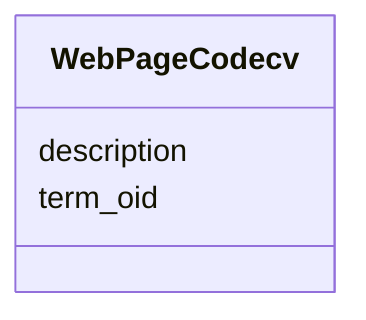

# Class: WebPageCodecv 


URI: [imgsg_dev:WebPageCodecv](https://w3id.org/jgi/imgsg_dev/WebPageCodecv)





<!-- no inheritance hierarchy -->


## Slots

| Name | Cardinality and Range | Description | Inheritance |
| ---  | --- | --- | --- |
| [term_oid](term_oid.md) | 0..1 <br/> [Integer](Integer.md) |  | direct |
| [description](description.md) | 0..1 <br/> [String](String.md) |  | direct |


## Identifier and Mapping Information


### Schema Source


* from schema: https://w3id.org/jgi/imgsg_dev


## Mappings

| Mapping Type | Mapped Value |
| ---  | ---  |
| self | imgsg_dev:WebPageCodecv |
| native | imgsg_dev:WebPageCodecv |


## LinkML Source

<!-- TODO: investigate https://stackoverflow.com/questions/37606292/how-to-create-tabbed-code-blocks-in-mkdocs-or-sphinx -->

### Direct

<details>
```yaml
name: web_page_codecv
from_schema: https://w3id.org/jgi/imgsg_dev
attributes:
  term_oid:
    name: term_oid
    from_schema: https://w3id.org/jgi/imgsg_dev
    domain_of:
    - submission_querycv
    - submission_statuscv
    - web_page_codecv
    range: integer
    required: false
  description:
    name: description
    from_schema: https://w3id.org/jgi/imgsg_dev
    domain_of:
    - gold_sequencing_project
    - img_group_news
    - imgcv
    - not_to_release
    - ora_aspnet_applications
    - ora_aspnet_roles
    - ora_aspnet_sitemap
    - project_info_biosample
    - public_workspace
    - study_load
    - submission_proc_stats
    - web_page_codecv
    - webpagecv
    range: string
    required: false

```
</details>

### Induced

<details>
```yaml
name: web_page_codecv
from_schema: https://w3id.org/jgi/imgsg_dev
attributes:
  term_oid:
    name: term_oid
    from_schema: https://w3id.org/jgi/imgsg_dev
    alias: term_oid
    owner: web_page_codecv
    domain_of:
    - submission_querycv
    - submission_statuscv
    - web_page_codecv
    range: integer
    required: false
  description:
    name: description
    from_schema: https://w3id.org/jgi/imgsg_dev
    alias: description
    owner: web_page_codecv
    domain_of:
    - gold_sequencing_project
    - img_group_news
    - imgcv
    - not_to_release
    - ora_aspnet_applications
    - ora_aspnet_roles
    - ora_aspnet_sitemap
    - project_info_biosample
    - public_workspace
    - study_load
    - submission_proc_stats
    - web_page_codecv
    - webpagecv
    range: string
    required: false

```
</details>