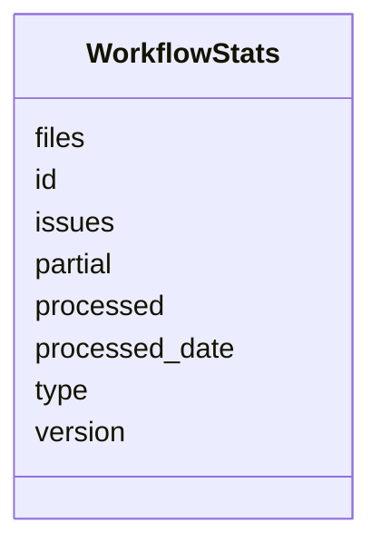

# Class: WorkflowStats 


URI: [imgsg_dev:WorkflowStats](https://w3id.org/jgi/imgsg_dev/WorkflowStats)





<!-- no inheritance hierarchy -->


## Slots

| Name | Cardinality and Range | Description | Inheritance |
| ---  | --- | --- | --- |
| [processed](processed.md) | 0..1 <br/> [String](String.md) |  | direct |
| [issues](issues.md) | 0..1 <br/> [String](String.md) |  | direct |
| [version](version.md) | 0..1 <br/> [String](String.md) |  | direct |
| [processed_date](processed_date.md) | 0..1 <br/> [Datetime](Datetime.md) |  | direct |
| [type](type.md) | 0..1 <br/> [String](String.md) |  | direct |
| [files](files.md) | 0..1 <br/> [String](String.md) |  | direct |
| [id](id.md) | 0..1 <br/> [String](String.md) |  | direct |
| [partial](partial.md) | 0..1 <br/> [String](String.md) |  | direct |


## Identifier and Mapping Information


### Schema Source


* from schema: https://w3id.org/jgi/imgsg_dev


## Mappings

| Mapping Type | Mapped Value |
| ---  | ---  |
| self | imgsg_dev:WorkflowStats |
| native | imgsg_dev:WorkflowStats |


## LinkML Source

<!-- TODO: investigate https://stackoverflow.com/questions/37606292/how-to-create-tabbed-code-blocks-in-mkdocs-or-sphinx -->

### Direct

<details>
```yaml
name: workflow_stats
from_schema: https://w3id.org/jgi/imgsg_dev
attributes:
  processed:
    name: processed
    from_schema: https://w3id.org/jgi/imgsg_dev
    rank: 1000
    domain_of:
    - workflow_stats
    range: string
    required: false
  issues:
    name: issues
    from_schema: https://w3id.org/jgi/imgsg_dev
    domain_of:
    - perferred_mbin_queue
    - workflow_stats
    range: string
    required: false
  version:
    name: version
    from_schema: https://w3id.org/jgi/imgsg_dev
    domain_of:
    - schema_migrations
    - workflow_stats
    range: string
    required: false
  processed_date:
    name: processed_date
    from_schema: https://w3id.org/jgi/imgsg_dev
    rank: 1000
    domain_of:
    - workflow_stats
    range: datetime
    required: false
  type:
    name: type
    from_schema: https://w3id.org/jgi/imgsg_dev
    domain_of:
    - announcement
    - gold_analysis_project_genbanks
    - ncbi_accessions
    - ncbi_accessions_jbtest
    - workflow_stats
    range: string
    required: false
  files:
    name: files
    from_schema: https://w3id.org/jgi/imgsg_dev
    rank: 1000
    domain_of:
    - workflow_stats
    range: string
    required: false
  id:
    name: id
    from_schema: https://w3id.org/jgi/imgsg_dev
    domain_of:
    - dacc_logon
    - env_sample_data_links
    - gold_ap_genbank
    - master_list
    - oprop
    - ora_aspnet_personaliznperuser
    - ora_aspnet_sitemap
    - pig_genbank_emailed_accs
    - pig_reruns
    - pig_retractions
    - pig_tracks
    - plan_table
    - plan_table_20131114
    - project_info_data_links
    - project_info_data_links_112013
    - t_reddy_test
    - workflow_stats
    range: string
    required: false
  partial:
    name: partial
    from_schema: https://w3id.org/jgi/imgsg_dev
    rank: 1000
    domain_of:
    - workflow_stats
    range: string
    required: false

```
</details>

### Induced

<details>
```yaml
name: workflow_stats
from_schema: https://w3id.org/jgi/imgsg_dev
attributes:
  processed:
    name: processed
    from_schema: https://w3id.org/jgi/imgsg_dev
    rank: 1000
    alias: processed
    owner: workflow_stats
    domain_of:
    - workflow_stats
    range: string
    required: false
  issues:
    name: issues
    from_schema: https://w3id.org/jgi/imgsg_dev
    alias: issues
    owner: workflow_stats
    domain_of:
    - perferred_mbin_queue
    - workflow_stats
    range: string
    required: false
  version:
    name: version
    from_schema: https://w3id.org/jgi/imgsg_dev
    alias: version
    owner: workflow_stats
    domain_of:
    - schema_migrations
    - workflow_stats
    range: string
    required: false
  processed_date:
    name: processed_date
    from_schema: https://w3id.org/jgi/imgsg_dev
    rank: 1000
    alias: processed_date
    owner: workflow_stats
    domain_of:
    - workflow_stats
    range: datetime
    required: false
  type:
    name: type
    from_schema: https://w3id.org/jgi/imgsg_dev
    alias: type
    owner: workflow_stats
    domain_of:
    - announcement
    - gold_analysis_project_genbanks
    - ncbi_accessions
    - ncbi_accessions_jbtest
    - workflow_stats
    range: string
    required: false
  files:
    name: files
    from_schema: https://w3id.org/jgi/imgsg_dev
    rank: 1000
    alias: files
    owner: workflow_stats
    domain_of:
    - workflow_stats
    range: string
    required: false
  id:
    name: id
    from_schema: https://w3id.org/jgi/imgsg_dev
    alias: id
    owner: workflow_stats
    domain_of:
    - dacc_logon
    - env_sample_data_links
    - gold_ap_genbank
    - master_list
    - oprop
    - ora_aspnet_personaliznperuser
    - ora_aspnet_sitemap
    - pig_genbank_emailed_accs
    - pig_reruns
    - pig_retractions
    - pig_tracks
    - plan_table
    - plan_table_20131114
    - project_info_data_links
    - project_info_data_links_112013
    - t_reddy_test
    - workflow_stats
    range: string
    required: false
  partial:
    name: partial
    from_schema: https://w3id.org/jgi/imgsg_dev
    rank: 1000
    alias: partial
    owner: workflow_stats
    domain_of:
    - workflow_stats
    range: string
    required: false

```
</details>