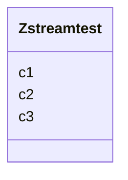

# Class: Zstreamtest 


URI: [imgsg_dev:Zstreamtest](https://w3id.org/jgi/imgsg_dev/Zstreamtest)





<!-- no inheritance hierarchy -->


## Slots

| Name | Cardinality and Range | Description | Inheritance |
| ---  | --- | --- | --- |
| [c1](c1.md) | 0..1 <br/> [Integer](Integer.md) |  | direct |
| [c2](c2.md) | 0..1 <br/> [Datetime](Datetime.md) |  | direct |
| [c3](c3.md) | 0..1 <br/> [String](String.md) |  | direct |


## Identifier and Mapping Information


### Schema Source


* from schema: https://w3id.org/jgi/imgsg_dev


## Mappings

| Mapping Type | Mapped Value |
| ---  | ---  |
| self | imgsg_dev:Zstreamtest |
| native | imgsg_dev:Zstreamtest |


## LinkML Source

<!-- TODO: investigate https://stackoverflow.com/questions/37606292/how-to-create-tabbed-code-blocks-in-mkdocs-or-sphinx -->

### Direct

<details>
```yaml
name: zstreamtest
from_schema: https://w3id.org/jgi/imgsg_dev
attributes:
  c1:
    name: c1
    from_schema: https://w3id.org/jgi/imgsg_dev
    rank: 1000
    domain_of:
    - zstreamtest
    range: integer
    required: false
  c2:
    name: c2
    from_schema: https://w3id.org/jgi/imgsg_dev
    rank: 1000
    domain_of:
    - zstreamtest
    range: datetime
    required: false
  c3:
    name: c3
    from_schema: https://w3id.org/jgi/imgsg_dev
    rank: 1000
    domain_of:
    - zstreamtest
    range: string
    required: false

```
</details>

### Induced

<details>
```yaml
name: zstreamtest
from_schema: https://w3id.org/jgi/imgsg_dev
attributes:
  c1:
    name: c1
    from_schema: https://w3id.org/jgi/imgsg_dev
    rank: 1000
    alias: c1
    owner: zstreamtest
    domain_of:
    - zstreamtest
    range: integer
    required: false
  c2:
    name: c2
    from_schema: https://w3id.org/jgi/imgsg_dev
    rank: 1000
    alias: c2
    owner: zstreamtest
    domain_of:
    - zstreamtest
    range: datetime
    required: false
  c3:
    name: c3
    from_schema: https://w3id.org/jgi/imgsg_dev
    rank: 1000
    alias: c3
    owner: zstreamtest
    domain_of:
    - zstreamtest
    range: string
    required: false

```
</details>