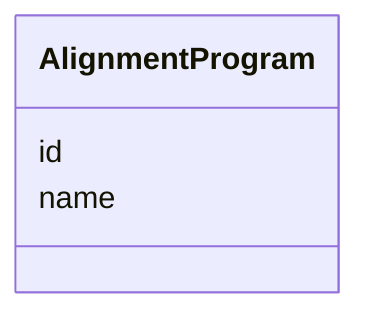

# Class: AlignmentProgram 


_Alignment program (BLAST, etc.)._


URI: [https://w3id.org/jgi/jgi_portal/AlignmentProgram](https://w3id.org/jgi/jgi_portal/AlignmentProgram)





<!-- no inheritance hierarchy -->


## Slots

| Name | Cardinality and Range | Description | Inheritance |
| ---  | --- | --- | --- |
| [id](id.md) | 1 <br/> [Integer](Integer.md) |  | direct |
| [name](name.md) | 0..1 <br/> [String](String.md) |  | direct |


## Identifier and Mapping Information


### Annotations

| property | value |
| --- | --- |
| source_table | alignmentPrograms |


### Schema Source


* from schema: https://w3id.org/jgi/jgi_portal


## Mappings

| Mapping Type | Mapped Value |
| ---  | ---  |
| self | https://w3id.org/jgi/jgi_portal/AlignmentProgram |
| native | https://w3id.org/jgi/jgi_portal/AlignmentProgram |


## LinkML Source

<!-- TODO: investigate https://stackoverflow.com/questions/37606292/how-to-create-tabbed-code-blocks-in-mkdocs-or-sphinx -->

### Direct

<details>
```yaml
name: AlignmentProgram
annotations:
  source_table:
    tag: source_table
    value: alignmentPrograms
description: Alignment program (BLAST, etc.).
from_schema: https://w3id.org/jgi/jgi_portal
attributes:
  id:
    name: id
    from_schema: https://w3id.org/jgi/jgi_portal
    identifier: true
    domain_of:
    - JobType
    - JobGroup
    - AlignmentDb
    - AlignmentProgram
    - DownloadRequest
    - DownloadRequestFile
    - GlobusDownloadRequest
    - GlobusIdentity
    - CustomTrack
    - MyFavorite
    - FungiTaxonomyInfo
    - ImgTaxonOid
    - KbasePushLog
    range: integer
    required: true
  name:
    name: name
    from_schema: https://w3id.org/jgi/jgi_portal
    domain_of:
    - JobType
    - JobGroup
    - AlignmentDb
    - AlignmentProgram
    - CustomTrack
    range: string

```
</details>

### Induced

<details>
```yaml
name: AlignmentProgram
annotations:
  source_table:
    tag: source_table
    value: alignmentPrograms
description: Alignment program (BLAST, etc.).
from_schema: https://w3id.org/jgi/jgi_portal
attributes:
  id:
    name: id
    from_schema: https://w3id.org/jgi/jgi_portal
    identifier: true
    alias: id
    owner: AlignmentProgram
    domain_of:
    - JobType
    - JobGroup
    - AlignmentDb
    - AlignmentProgram
    - DownloadRequest
    - DownloadRequestFile
    - GlobusDownloadRequest
    - GlobusIdentity
    - CustomTrack
    - MyFavorite
    - FungiTaxonomyInfo
    - ImgTaxonOid
    - KbasePushLog
    range: integer
    required: true
  name:
    name: name
    from_schema: https://w3id.org/jgi/jgi_portal
    alias: name
    owner: AlignmentProgram
    domain_of:
    - JobType
    - JobGroup
    - AlignmentDb
    - AlignmentProgram
    - CustomTrack
    range: string

```
</details>