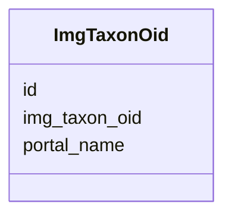

# Class: ImgTaxonOid 


_IMG taxon OID mapping._


URI: [https://w3id.org/jgi/jgi_portal/ImgTaxonOid](https://w3id.org/jgi/jgi_portal/ImgTaxonOid)





<!-- no inheritance hierarchy -->


## Slots

| Name | Cardinality and Range | Description | Inheritance |
| ---  | --- | --- | --- |
| [id](id.md) | 1 <br/> [Integer](Integer.md) |  | direct |
| [portal_name](portal_name.md) | 0..1 <br/> [String](String.md) |  | direct |
| [img_taxon_oid](img_taxon_oid.md) | 0..1 <br/> [Integer](Integer.md) |  | direct |


## Identifier and Mapping Information


### Annotations

| property | value |
| --- | --- |
| source_table | imgTaxonOids |


### Schema Source


* from schema: https://w3id.org/jgi/jgi_portal


## Mappings

| Mapping Type | Mapped Value |
| ---  | ---  |
| self | https://w3id.org/jgi/jgi_portal/ImgTaxonOid |
| native | https://w3id.org/jgi/jgi_portal/ImgTaxonOid |


## LinkML Source

<!-- TODO: investigate https://stackoverflow.com/questions/37606292/how-to-create-tabbed-code-blocks-in-mkdocs-or-sphinx -->

### Direct

<details>
```yaml
name: ImgTaxonOid
annotations:
  source_table:
    tag: source_table
    value: imgTaxonOids
description: IMG taxon OID mapping.
from_schema: https://w3id.org/jgi/jgi_portal
attributes:
  id:
    name: id
    from_schema: https://w3id.org/jgi/jgi_portal
    identifier: true
    domain_of:
    - JobType
    - JobGroup
    - AlignmentDb
    - AlignmentProgram
    - DownloadRequest
    - DownloadRequestFile
    - GlobusDownloadRequest
    - GlobusIdentity
    - CustomTrack
    - MyFavorite
    - FungiTaxonomyInfo
    - ImgTaxonOid
    - KbasePushLog
    range: integer
    required: true
  portal_name:
    name: portal_name
    from_schema: https://w3id.org/jgi/jgi_portal
    domain_of:
    - FungiTaxonomyInfo
    - ImgTaxonOid
    range: string
  img_taxon_oid:
    name: img_taxon_oid
    from_schema: https://w3id.org/jgi/jgi_portal
    rank: 1000
    domain_of:
    - ImgTaxonOid
    range: integer

```
</details>

### Induced

<details>
```yaml
name: ImgTaxonOid
annotations:
  source_table:
    tag: source_table
    value: imgTaxonOids
description: IMG taxon OID mapping.
from_schema: https://w3id.org/jgi/jgi_portal
attributes:
  id:
    name: id
    from_schema: https://w3id.org/jgi/jgi_portal
    identifier: true
    alias: id
    owner: ImgTaxonOid
    domain_of:
    - JobType
    - JobGroup
    - AlignmentDb
    - AlignmentProgram
    - DownloadRequest
    - DownloadRequestFile
    - GlobusDownloadRequest
    - GlobusIdentity
    - CustomTrack
    - MyFavorite
    - FungiTaxonomyInfo
    - ImgTaxonOid
    - KbasePushLog
    range: integer
    required: true
  portal_name:
    name: portal_name
    from_schema: https://w3id.org/jgi/jgi_portal
    alias: portal_name
    owner: ImgTaxonOid
    domain_of:
    - FungiTaxonomyInfo
    - ImgTaxonOid
    range: string
  img_taxon_oid:
    name: img_taxon_oid
    from_schema: https://w3id.org/jgi/jgi_portal
    rank: 1000
    alias: img_taxon_oid
    owner: ImgTaxonOid
    domain_of:
    - ImgTaxonOid
    range: integer

```
</details>