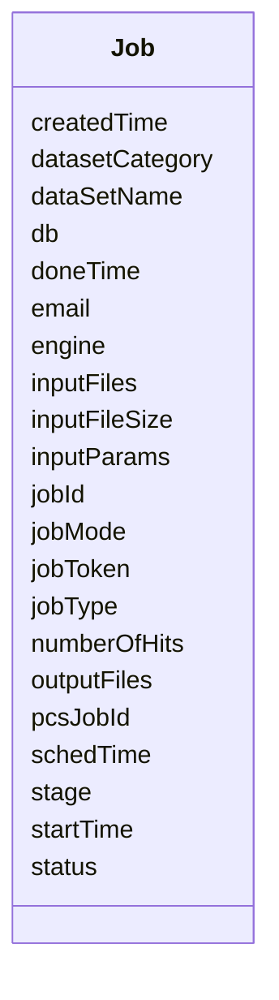

# Class: Job 


_Computational job (BLAST, alignment, etc.)._

_EXAMPLE: - jobId: 53954770, jobType: webblast, db: Dibbae1, stage: Complete_


URI: [https://w3id.org/jgi/jgi_portal/Job](https://w3id.org/jgi/jgi_portal/Job)





<!-- no inheritance hierarchy -->


## Slots

| Name | Cardinality and Range | Description | Inheritance |
| ---  | --- | --- | --- |
| [jobId](jobId.md) | 1 <br/> [Integer](Integer.md) | Unique job identifier | direct |
| [jobToken](jobToken.md) | 0..1 <br/> [Integer](Integer.md) |  | direct |
| [pcsJobId](pcsJobId.md) | 0..1 <br/> [Integer](Integer.md) | PCS (Pipeline Control System) job ID | direct |
| [jobType](jobType.md) | 0..1 <br/> [String](String.md) | Type of job (webblast, clustalw, etc | direct |
| [jobMode](jobMode.md) | 0..1 <br/> [Integer](Integer.md) |  | direct |
| [db](db.md) | 0..1 <br/> [String](String.md) | Target database/genome | direct |
| [inputFiles](inputFiles.md) | 0..1 <br/> [String](String.md) | Path to input files | direct |
| [outputFiles](outputFiles.md) | 0..1 <br/> [String](String.md) | Path to output files | direct |
| [inputParams](inputParams.md) | 0..1 <br/> [String](String.md) | Job parameters (pipe-delimited) | direct |
| [status](status.md) | 0..1 <br/> [Integer](Integer.md) | Job status code | direct |
| [stage](stage.md) | 0..1 <br/> [String](String.md) | Job stage description | direct |
| [schedTime](schedTime.md) | 0..1 <br/> [Integer](Integer.md) | Scheduled time (Unix timestamp) | direct |
| [startTime](startTime.md) | 0..1 <br/> [Integer](Integer.md) | Start time (Unix timestamp) | direct |
| [doneTime](doneTime.md) | 0..1 <br/> [Integer](Integer.md) | Completion time (Unix timestamp) | direct |
| [email](email.md) | 0..1 <br/> [String](String.md) | User email for notifications | direct |
| [inputFileSize](inputFileSize.md) | 0..1 <br/> [Integer](Integer.md) | Size of input in bytes | direct |
| [dataSetName](dataSetName.md) | 0..1 <br/> [String](String.md) | Target dataset name | direct |
| [datasetCategory](datasetCategory.md) | 0..1 <br/> [String](String.md) | Dataset category | direct |
| [engine](engine.md) | 0..1 <br/> [String](String.md) | Compute engine used | direct |
| [createdTime](createdTime.md) | 0..1 <br/> [Integer](Integer.md) |  | direct |
| [numberOfHits](numberOfHits.md) | 0..1 <br/> [Integer](Integer.md) | Number of hits/results | direct |


## Identifier and Mapping Information


### Annotations

| property | value |
| --- | --- |
| source_table | jobs |


### Schema Source


* from schema: https://w3id.org/jgi/jgi_portal


## Mappings

| Mapping Type | Mapped Value |
| ---  | ---  |
| self | https://w3id.org/jgi/jgi_portal/Job |
| native | https://w3id.org/jgi/jgi_portal/Job |


## LinkML Source

<!-- TODO: investigate https://stackoverflow.com/questions/37606292/how-to-create-tabbed-code-blocks-in-mkdocs-or-sphinx -->

### Direct

<details>
```yaml
name: Job
annotations:
  source_table:
    tag: source_table
    value: jobs
description: 'Computational job (BLAST, alignment, etc.).

  EXAMPLE: - jobId: 53954770, jobType: webblast, db: Dibbae1, stage: Complete'
from_schema: https://w3id.org/jgi/jgi_portal
attributes:
  jobId:
    name: jobId
    description: Unique job identifier
    examples:
    - value: '53954770'
    from_schema: https://w3id.org/jgi/jgi_portal
    rank: 1000
    identifier: true
    domain_of:
    - Job
    range: integer
    required: true
  jobToken:
    name: jobToken
    from_schema: https://w3id.org/jgi/jgi_portal
    rank: 1000
    domain_of:
    - Job
    range: integer
  pcsJobId:
    name: pcsJobId
    description: PCS (Pipeline Control System) job ID
    from_schema: https://w3id.org/jgi/jgi_portal
    rank: 1000
    domain_of:
    - Job
    range: integer
  jobType:
    name: jobType
    description: Type of job (webblast, clustalw, etc.)
    examples:
    - value: webblast
    from_schema: https://w3id.org/jgi/jgi_portal
    rank: 1000
    domain_of:
    - Job
    range: string
  jobMode:
    name: jobMode
    from_schema: https://w3id.org/jgi/jgi_portal
    rank: 1000
    domain_of:
    - Job
    range: integer
  db:
    name: db
    description: Target database/genome
    examples:
    - value: Dibbae1
    - value: Morkaki1
    from_schema: https://w3id.org/jgi/jgi_portal
    rank: 1000
    domain_of:
    - Job
    range: string
  inputFiles:
    name: inputFiles
    description: Path to input files
    from_schema: https://w3id.org/jgi/jgi_portal
    rank: 1000
    domain_of:
    - Job
    range: string
  outputFiles:
    name: outputFiles
    description: Path to output files
    from_schema: https://w3id.org/jgi/jgi_portal
    rank: 1000
    domain_of:
    - Job
    range: string
  inputParams:
    name: inputParams
    description: Job parameters (pipe-delimited)
    from_schema: https://w3id.org/jgi/jgi_portal
    rank: 1000
    domain_of:
    - Job
    range: string
  status:
    name: status
    description: Job status code
    from_schema: https://w3id.org/jgi/jgi_portal
    rank: 1000
    domain_of:
    - Job
    - DownloadRequest
    - KbasePushLog
    range: integer
  stage:
    name: stage
    description: Job stage description
    examples:
    - value: Complete
    from_schema: https://w3id.org/jgi/jgi_portal
    rank: 1000
    domain_of:
    - Job
    range: string
  schedTime:
    name: schedTime
    description: Scheduled time (Unix timestamp)
    from_schema: https://w3id.org/jgi/jgi_portal
    rank: 1000
    domain_of:
    - Job
    range: integer
  startTime:
    name: startTime
    description: Start time (Unix timestamp)
    from_schema: https://w3id.org/jgi/jgi_portal
    rank: 1000
    domain_of:
    - Job
    range: integer
  doneTime:
    name: doneTime
    description: Completion time (Unix timestamp)
    from_schema: https://w3id.org/jgi/jgi_portal
    rank: 1000
    domain_of:
    - Job
    range: integer
  email:
    name: email
    description: User email for notifications
    from_schema: https://w3id.org/jgi/jgi_portal
    rank: 1000
    domain_of:
    - Job
    range: string
  inputFileSize:
    name: inputFileSize
    description: Size of input in bytes
    from_schema: https://w3id.org/jgi/jgi_portal
    rank: 1000
    domain_of:
    - Job
    range: integer
  dataSetName:
    name: dataSetName
    description: Target dataset name
    examples:
    - value: Dibbae1_AssemblyScaffolds_Repeatmasked
    from_schema: https://w3id.org/jgi/jgi_portal
    rank: 1000
    domain_of:
    - Job
    range: string
  datasetCategory:
    name: datasetCategory
    description: Dataset category
    examples:
    - value: Assembly--Repeatmasked
    from_schema: https://w3id.org/jgi/jgi_portal
    rank: 1000
    domain_of:
    - Job
    range: string
  engine:
    name: engine
    description: Compute engine used
    examples:
    - value: aces
    from_schema: https://w3id.org/jgi/jgi_portal
    rank: 1000
    domain_of:
    - Job
    range: string
  createdTime:
    name: createdTime
    from_schema: https://w3id.org/jgi/jgi_portal
    rank: 1000
    domain_of:
    - Job
    range: integer
  numberOfHits:
    name: numberOfHits
    description: Number of hits/results
    from_schema: https://w3id.org/jgi/jgi_portal
    rank: 1000
    domain_of:
    - Job
    range: integer

```
</details>

### Induced

<details>
```yaml
name: Job
annotations:
  source_table:
    tag: source_table
    value: jobs
description: 'Computational job (BLAST, alignment, etc.).

  EXAMPLE: - jobId: 53954770, jobType: webblast, db: Dibbae1, stage: Complete'
from_schema: https://w3id.org/jgi/jgi_portal
attributes:
  jobId:
    name: jobId
    description: Unique job identifier
    examples:
    - value: '53954770'
    from_schema: https://w3id.org/jgi/jgi_portal
    rank: 1000
    identifier: true
    alias: jobId
    owner: Job
    domain_of:
    - Job
    range: integer
  jobToken:
    name: jobToken
    from_schema: https://w3id.org/jgi/jgi_portal
    rank: 1000
    alias: jobToken
    owner: Job
    domain_of:
    - Job
    range: integer
  pcsJobId:
    name: pcsJobId
    description: PCS (Pipeline Control System) job ID
    from_schema: https://w3id.org/jgi/jgi_portal
    rank: 1000
    alias: pcsJobId
    owner: Job
    domain_of:
    - Job
    range: integer
  jobType:
    name: jobType
    description: Type of job (webblast, clustalw, etc.)
    examples:
    - value: webblast
    from_schema: https://w3id.org/jgi/jgi_portal
    rank: 1000
    alias: jobType
    owner: Job
    domain_of:
    - Job
    range: string
  jobMode:
    name: jobMode
    from_schema: https://w3id.org/jgi/jgi_portal
    rank: 1000
    alias: jobMode
    owner: Job
    domain_of:
    - Job
    range: integer
  db:
    name: db
    description: Target database/genome
    examples:
    - value: Dibbae1
    - value: Morkaki1
    from_schema: https://w3id.org/jgi/jgi_portal
    rank: 1000
    alias: db
    owner: Job
    domain_of:
    - Job
    range: string
  inputFiles:
    name: inputFiles
    description: Path to input files
    from_schema: https://w3id.org/jgi/jgi_portal
    rank: 1000
    alias: inputFiles
    owner: Job
    domain_of:
    - Job
    range: string
  outputFiles:
    name: outputFiles
    description: Path to output files
    from_schema: https://w3id.org/jgi/jgi_portal
    rank: 1000
    alias: outputFiles
    owner: Job
    domain_of:
    - Job
    range: string
  inputParams:
    name: inputParams
    description: Job parameters (pipe-delimited)
    from_schema: https://w3id.org/jgi/jgi_portal
    rank: 1000
    alias: inputParams
    owner: Job
    domain_of:
    - Job
    range: string
  status:
    name: status
    description: Job status code
    from_schema: https://w3id.org/jgi/jgi_portal
    rank: 1000
    alias: status
    owner: Job
    domain_of:
    - Job
    - DownloadRequest
    - KbasePushLog
    range: integer
  stage:
    name: stage
    description: Job stage description
    examples:
    - value: Complete
    from_schema: https://w3id.org/jgi/jgi_portal
    rank: 1000
    alias: stage
    owner: Job
    domain_of:
    - Job
    range: string
  schedTime:
    name: schedTime
    description: Scheduled time (Unix timestamp)
    from_schema: https://w3id.org/jgi/jgi_portal
    rank: 1000
    alias: schedTime
    owner: Job
    domain_of:
    - Job
    range: integer
  startTime:
    name: startTime
    description: Start time (Unix timestamp)
    from_schema: https://w3id.org/jgi/jgi_portal
    rank: 1000
    alias: startTime
    owner: Job
    domain_of:
    - Job
    range: integer
  doneTime:
    name: doneTime
    description: Completion time (Unix timestamp)
    from_schema: https://w3id.org/jgi/jgi_portal
    rank: 1000
    alias: doneTime
    owner: Job
    domain_of:
    - Job
    range: integer
  email:
    name: email
    description: User email for notifications
    from_schema: https://w3id.org/jgi/jgi_portal
    rank: 1000
    alias: email
    owner: Job
    domain_of:
    - Job
    range: string
  inputFileSize:
    name: inputFileSize
    description: Size of input in bytes
    from_schema: https://w3id.org/jgi/jgi_portal
    rank: 1000
    alias: inputFileSize
    owner: Job
    domain_of:
    - Job
    range: integer
  dataSetName:
    name: dataSetName
    description: Target dataset name
    examples:
    - value: Dibbae1_AssemblyScaffolds_Repeatmasked
    from_schema: https://w3id.org/jgi/jgi_portal
    rank: 1000
    alias: dataSetName
    owner: Job
    domain_of:
    - Job
    range: string
  datasetCategory:
    name: datasetCategory
    description: Dataset category
    examples:
    - value: Assembly--Repeatmasked
    from_schema: https://w3id.org/jgi/jgi_portal
    rank: 1000
    alias: datasetCategory
    owner: Job
    domain_of:
    - Job
    range: string
  engine:
    name: engine
    description: Compute engine used
    examples:
    - value: aces
    from_schema: https://w3id.org/jgi/jgi_portal
    rank: 1000
    alias: engine
    owner: Job
    domain_of:
    - Job
    range: string
  createdTime:
    name: createdTime
    from_schema: https://w3id.org/jgi/jgi_portal
    rank: 1000
    alias: createdTime
    owner: Job
    domain_of:
    - Job
    range: integer
  numberOfHits:
    name: numberOfHits
    description: Number of hits/results
    from_schema: https://w3id.org/jgi/jgi_portal
    rank: 1000
    alias: numberOfHits
    owner: Job
    domain_of:
    - Job
    range: integer

```
</details>