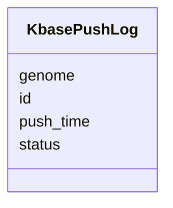

# Class: KbasePushLog 


_Log of data pushes to KBase._


URI: [https://w3id.org/jgi/jgi_portal/KbasePushLog](https://w3id.org/jgi/jgi_portal/KbasePushLog)





<!-- no inheritance hierarchy -->


## Slots

| Name | Cardinality and Range | Description | Inheritance |
| ---  | --- | --- | --- |
| [id](id.md) | 1 <br/> [Integer](Integer.md) |  | direct |
| [genome](genome.md) | 0..1 <br/> [String](String.md) |  | direct |
| [push_time](push_time.md) | 0..1 <br/> [Datetime](Datetime.md) |  | direct |
| [status](status.md) | 0..1 <br/> [String](String.md) |  | direct |


## Identifier and Mapping Information


### Annotations

| property | value |
| --- | --- |
| source_table | kbasePushLog |


### Schema Source


* from schema: https://w3id.org/jgi/jgi_portal


## Mappings

| Mapping Type | Mapped Value |
| ---  | ---  |
| self | https://w3id.org/jgi/jgi_portal/KbasePushLog |
| native | https://w3id.org/jgi/jgi_portal/KbasePushLog |


## LinkML Source

<!-- TODO: investigate https://stackoverflow.com/questions/37606292/how-to-create-tabbed-code-blocks-in-mkdocs-or-sphinx -->

### Direct

<details>
```yaml
name: KbasePushLog
annotations:
  source_table:
    tag: source_table
    value: kbasePushLog
description: Log of data pushes to KBase.
from_schema: https://w3id.org/jgi/jgi_portal
attributes:
  id:
    name: id
    from_schema: https://w3id.org/jgi/jgi_portal
    identifier: true
    domain_of:
    - JobType
    - JobGroup
    - AlignmentDb
    - AlignmentProgram
    - DownloadRequest
    - DownloadRequestFile
    - GlobusDownloadRequest
    - GlobusIdentity
    - CustomTrack
    - MyFavorite
    - FungiTaxonomyInfo
    - ImgTaxonOid
    - KbasePushLog
    range: integer
    required: true
  genome:
    name: genome
    from_schema: https://w3id.org/jgi/jgi_portal
    domain_of:
    - CustomTrack
    - KbasePushLog
    range: string
  push_time:
    name: push_time
    from_schema: https://w3id.org/jgi/jgi_portal
    rank: 1000
    domain_of:
    - KbasePushLog
    range: datetime
  status:
    name: status
    from_schema: https://w3id.org/jgi/jgi_portal
    domain_of:
    - Job
    - DownloadRequest
    - KbasePushLog
    range: string

```
</details>

### Induced

<details>
```yaml
name: KbasePushLog
annotations:
  source_table:
    tag: source_table
    value: kbasePushLog
description: Log of data pushes to KBase.
from_schema: https://w3id.org/jgi/jgi_portal
attributes:
  id:
    name: id
    from_schema: https://w3id.org/jgi/jgi_portal
    identifier: true
    alias: id
    owner: KbasePushLog
    domain_of:
    - JobType
    - JobGroup
    - AlignmentDb
    - AlignmentProgram
    - DownloadRequest
    - DownloadRequestFile
    - GlobusDownloadRequest
    - GlobusIdentity
    - CustomTrack
    - MyFavorite
    - FungiTaxonomyInfo
    - ImgTaxonOid
    - KbasePushLog
    range: integer
    required: true
  genome:
    name: genome
    from_schema: https://w3id.org/jgi/jgi_portal
    alias: genome
    owner: KbasePushLog
    domain_of:
    - CustomTrack
    - KbasePushLog
    range: string
  push_time:
    name: push_time
    from_schema: https://w3id.org/jgi/jgi_portal
    rank: 1000
    alias: push_time
    owner: KbasePushLog
    domain_of:
    - KbasePushLog
    range: datetime
  status:
    name: status
    from_schema: https://w3id.org/jgi/jgi_portal
    alias: status
    owner: KbasePushLog
    domain_of:
    - Job
    - DownloadRequest
    - KbasePushLog
    range: string

```
</details>