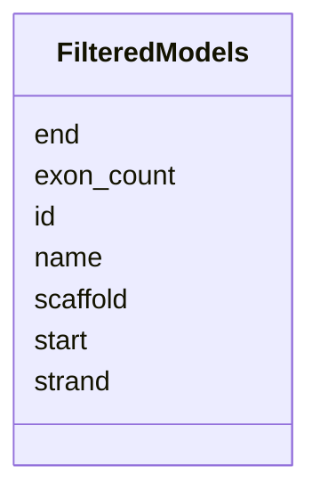

# Class: FilteredModels 


_Curated/filtered gene models - the primary gene set._


URI: [https://w3id.org/jgi/mycocosm/FilteredModels](https://w3id.org/jgi/mycocosm/FilteredModels)





<!-- no inheritance hierarchy -->


## Slots

| Name | Cardinality and Range | Description | Inheritance |
| ---  | --- | --- | --- |
| [id](id.md) | 1 <br/> [Integer](Integer.md) |  | direct |
| [name](name.md) | 0..1 <br/> [String](String.md) | Gene model name/ID | direct |
| [scaffold](scaffold.md) | 0..1 <br/> [String](String.md) |  | direct |
| [start](start.md) | 0..1 <br/> [Integer](Integer.md) |  | direct |
| [end](end.md) | 0..1 <br/> [Integer](Integer.md) |  | direct |
| [strand](strand.md) | 0..1 <br/> [String](String.md) |  | direct |
| [exon_count](exon_count.md) | 0..1 <br/> [Integer](Integer.md) |  | direct |


## Identifier and Mapping Information


### Annotations

| property | value |
| --- | --- |
| source_table | FilteredModels1 |


### Schema Source


* from schema: https://w3id.org/jgi/mycocosm


## Mappings

| Mapping Type | Mapped Value |
| ---  | ---  |
| self | https://w3id.org/jgi/mycocosm/FilteredModels |
| native | https://w3id.org/jgi/mycocosm/FilteredModels |


## LinkML Source

<!-- TODO: investigate https://stackoverflow.com/questions/37606292/how-to-create-tabbed-code-blocks-in-mkdocs-or-sphinx -->

### Direct

<details>
```yaml
name: FilteredModels
annotations:
  source_table:
    tag: source_table
    value: FilteredModels1
description: Curated/filtered gene models - the primary gene set.
from_schema: https://w3id.org/jgi/mycocosm
attributes:
  id:
    name: id
    from_schema: https://w3id.org/jgi/mycocosm
    rank: 1000
    identifier: true
    domain_of:
    - FilteredModels
    - FilteredModelsBase
    - GeneCatalog
    - GenemarkPrediction
    - GenewisePrediction
    - BlastpHit
    - AllModels
    - BlatESTCluster
    - BlatESTClusterHit
    - SMCluster
    - SMClass
    - SMClusterMember
    - RepeatMaskerHit
    - RepeatMaskerSimple
    - TransposableElement
    - CEGMACompleteness
    - CEGMACompletenessDetail
    - ChromInfo
    - AnnotationState
    - AnnotationPriority
    - UserModel
    - PMAnnotationGroup
    - PMAnnotationStatus
    - PMAnnotator
    range: integer
    required: true
  name:
    name: name
    description: Gene model name/ID
    from_schema: https://w3id.org/jgi/mycocosm
    rank: 1000
    domain_of:
    - FilteredModels
    - GeneCatalog
    - AllModels
    - SMCluster
    - SMClass
    - ChromInfo
    - PMAnnotationGroup
    - PMAnnotator
    range: string
  scaffold:
    name: scaffold
    from_schema: https://w3id.org/jgi/mycocosm
    rank: 1000
    domain_of:
    - FilteredModels
    - GenemarkPrediction
    - GenewisePrediction
    - BlatESTCluster
    - SMCluster
    - RepeatMaskerHit
    - RepeatMaskerSimple
    - TransposableElement
    - UserModel
    range: string
  start:
    name: start
    from_schema: https://w3id.org/jgi/mycocosm
    rank: 1000
    domain_of:
    - FilteredModels
    - GenemarkPrediction
    - GenewisePrediction
    - BlatESTCluster
    - SMCluster
    - RepeatMaskerHit
    - RepeatMaskerSimple
    - TransposableElement
    - UserModel
    range: integer
  end:
    name: end
    from_schema: https://w3id.org/jgi/mycocosm
    rank: 1000
    domain_of:
    - FilteredModels
    - GenemarkPrediction
    - GenewisePrediction
    - BlatESTCluster
    - SMCluster
    - RepeatMaskerHit
    - RepeatMaskerSimple
    - TransposableElement
    - UserModel
    range: integer
  strand:
    name: strand
    from_schema: https://w3id.org/jgi/mycocosm
    rank: 1000
    domain_of:
    - FilteredModels
    - GenemarkPrediction
    - GenewisePrediction
    range: string
  exon_count:
    name: exon_count
    from_schema: https://w3id.org/jgi/mycocosm
    rank: 1000
    domain_of:
    - FilteredModels
    range: integer

```
</details>

### Induced

<details>
```yaml
name: FilteredModels
annotations:
  source_table:
    tag: source_table
    value: FilteredModels1
description: Curated/filtered gene models - the primary gene set.
from_schema: https://w3id.org/jgi/mycocosm
attributes:
  id:
    name: id
    from_schema: https://w3id.org/jgi/mycocosm
    rank: 1000
    identifier: true
    alias: id
    owner: FilteredModels
    domain_of:
    - FilteredModels
    - FilteredModelsBase
    - GeneCatalog
    - GenemarkPrediction
    - GenewisePrediction
    - BlastpHit
    - AllModels
    - BlatESTCluster
    - BlatESTClusterHit
    - SMCluster
    - SMClass
    - SMClusterMember
    - RepeatMaskerHit
    - RepeatMaskerSimple
    - TransposableElement
    - CEGMACompleteness
    - CEGMACompletenessDetail
    - ChromInfo
    - AnnotationState
    - AnnotationPriority
    - UserModel
    - PMAnnotationGroup
    - PMAnnotationStatus
    - PMAnnotator
    range: integer
  name:
    name: name
    description: Gene model name/ID
    from_schema: https://w3id.org/jgi/mycocosm
    rank: 1000
    alias: name
    owner: FilteredModels
    domain_of:
    - FilteredModels
    - GeneCatalog
    - AllModels
    - SMCluster
    - SMClass
    - ChromInfo
    - PMAnnotationGroup
    - PMAnnotator
    range: string
  scaffold:
    name: scaffold
    from_schema: https://w3id.org/jgi/mycocosm
    rank: 1000
    alias: scaffold
    owner: FilteredModels
    domain_of:
    - FilteredModels
    - GenemarkPrediction
    - GenewisePrediction
    - BlatESTCluster
    - SMCluster
    - RepeatMaskerHit
    - RepeatMaskerSimple
    - TransposableElement
    - UserModel
    range: string
  start:
    name: start
    from_schema: https://w3id.org/jgi/mycocosm
    rank: 1000
    alias: start
    owner: FilteredModels
    domain_of:
    - FilteredModels
    - GenemarkPrediction
    - GenewisePrediction
    - BlatESTCluster
    - SMCluster
    - RepeatMaskerHit
    - RepeatMaskerSimple
    - TransposableElement
    - UserModel
    range: integer
  end:
    name: end
    from_schema: https://w3id.org/jgi/mycocosm
    rank: 1000
    alias: end
    owner: FilteredModels
    domain_of:
    - FilteredModels
    - GenemarkPrediction
    - GenewisePrediction
    - BlatESTCluster
    - SMCluster
    - RepeatMaskerHit
    - RepeatMaskerSimple
    - TransposableElement
    - UserModel
    range: integer
  strand:
    name: strand
    from_schema: https://w3id.org/jgi/mycocosm
    rank: 1000
    alias: strand
    owner: FilteredModels
    domain_of:
    - FilteredModels
    - GenemarkPrediction
    - GenewisePrediction
    range: string
  exon_count:
    name: exon_count
    from_schema: https://w3id.org/jgi/mycocosm
    rank: 1000
    alias: exon_count
    owner: FilteredModels
    domain_of:
    - FilteredModels
    range: integer

```
</details>