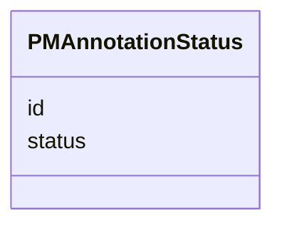

# Class: PMAnnotationStatus 


_Annotation status in portal._


URI: [https://w3id.org/jgi/mycocosm/PMAnnotationStatus](https://w3id.org/jgi/mycocosm/PMAnnotationStatus)





<!-- no inheritance hierarchy -->


## Slots

| Name | Cardinality and Range | Description | Inheritance |
| ---  | --- | --- | --- |
| [id](id.md) | 1 <br/> [Integer](Integer.md) |  | direct |
| [status](status.md) | 0..1 <br/> [String](String.md) |  | direct |


## Identifier and Mapping Information


### Annotations

| property | value |
| --- | --- |
| source_table | PMAnnotationStatus |


### Schema Source


* from schema: https://w3id.org/jgi/mycocosm


## Mappings

| Mapping Type | Mapped Value |
| ---  | ---  |
| self | https://w3id.org/jgi/mycocosm/PMAnnotationStatus |
| native | https://w3id.org/jgi/mycocosm/PMAnnotationStatus |


## LinkML Source

<!-- TODO: investigate https://stackoverflow.com/questions/37606292/how-to-create-tabbed-code-blocks-in-mkdocs-or-sphinx -->

### Direct

<details>
```yaml
name: PMAnnotationStatus
annotations:
  source_table:
    tag: source_table
    value: PMAnnotationStatus
description: Annotation status in portal.
from_schema: https://w3id.org/jgi/mycocosm
attributes:
  id:
    name: id
    from_schema: https://w3id.org/jgi/mycocosm
    identifier: true
    domain_of:
    - FilteredModels
    - FilteredModelsBase
    - GeneCatalog
    - GenemarkPrediction
    - GenewisePrediction
    - BlastpHit
    - AllModels
    - BlatESTCluster
    - BlatESTClusterHit
    - SMCluster
    - SMClass
    - SMClusterMember
    - RepeatMaskerHit
    - RepeatMaskerSimple
    - TransposableElement
    - CEGMACompleteness
    - CEGMACompletenessDetail
    - ChromInfo
    - AnnotationState
    - AnnotationPriority
    - UserModel
    - PMAnnotationGroup
    - PMAnnotationStatus
    - PMAnnotator
    range: integer
    required: true
  status:
    name: status
    from_schema: https://w3id.org/jgi/mycocosm
    domain_of:
    - CEGMACompletenessDetail
    - UserModel
    - PMAnnotationStatus
    range: string

```
</details>

### Induced

<details>
```yaml
name: PMAnnotationStatus
annotations:
  source_table:
    tag: source_table
    value: PMAnnotationStatus
description: Annotation status in portal.
from_schema: https://w3id.org/jgi/mycocosm
attributes:
  id:
    name: id
    from_schema: https://w3id.org/jgi/mycocosm
    identifier: true
    alias: id
    owner: PMAnnotationStatus
    domain_of:
    - FilteredModels
    - FilteredModelsBase
    - GeneCatalog
    - GenemarkPrediction
    - GenewisePrediction
    - BlastpHit
    - AllModels
    - BlatESTCluster
    - BlatESTClusterHit
    - SMCluster
    - SMClass
    - SMClusterMember
    - RepeatMaskerHit
    - RepeatMaskerSimple
    - TransposableElement
    - CEGMACompleteness
    - CEGMACompletenessDetail
    - ChromInfo
    - AnnotationState
    - AnnotationPriority
    - UserModel
    - PMAnnotationGroup
    - PMAnnotationStatus
    - PMAnnotator
    range: integer
    required: true
  status:
    name: status
    from_schema: https://w3id.org/jgi/mycocosm
    alias: status
    owner: PMAnnotationStatus
    domain_of:
    - CEGMACompletenessDetail
    - UserModel
    - PMAnnotationStatus
    range: string

```
</details>