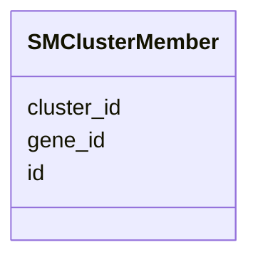

# Class: SMClusterMember 


_Gene member of an SM cluster._


URI: [https://w3id.org/jgi/mycocosm/SMClusterMember](https://w3id.org/jgi/mycocosm/SMClusterMember)





<!-- no inheritance hierarchy -->


## Slots

| Name | Cardinality and Range | Description | Inheritance |
| ---  | --- | --- | --- |
| [id](id.md) | 1 <br/> [Integer](Integer.md) |  | direct |
| [cluster_id](cluster_id.md) | 0..1 <br/> [Integer](Integer.md) |  | direct |
| [gene_id](gene_id.md) | 0..1 <br/> [Integer](Integer.md) |  | direct |


## Identifier and Mapping Information


### Annotations

| property | value |
| --- | --- |
| source_table | SM_cluster_member |


### Schema Source


* from schema: https://w3id.org/jgi/mycocosm


## Mappings

| Mapping Type | Mapped Value |
| ---  | ---  |
| self | https://w3id.org/jgi/mycocosm/SMClusterMember |
| native | https://w3id.org/jgi/mycocosm/SMClusterMember |


## LinkML Source

<!-- TODO: investigate https://stackoverflow.com/questions/37606292/how-to-create-tabbed-code-blocks-in-mkdocs-or-sphinx -->

### Direct

<details>
```yaml
name: SMClusterMember
annotations:
  source_table:
    tag: source_table
    value: SM_cluster_member
description: Gene member of an SM cluster.
from_schema: https://w3id.org/jgi/mycocosm
attributes:
  id:
    name: id
    from_schema: https://w3id.org/jgi/mycocosm
    identifier: true
    domain_of:
    - FilteredModels
    - FilteredModelsBase
    - GeneCatalog
    - GenemarkPrediction
    - GenewisePrediction
    - BlastpHit
    - AllModels
    - BlatESTCluster
    - BlatESTClusterHit
    - SMCluster
    - SMClass
    - SMClusterMember
    - RepeatMaskerHit
    - RepeatMaskerSimple
    - TransposableElement
    - CEGMACompleteness
    - CEGMACompletenessDetail
    - ChromInfo
    - AnnotationState
    - AnnotationPriority
    - UserModel
    - PMAnnotationGroup
    - PMAnnotationStatus
    - PMAnnotator
    range: integer
    required: true
  cluster_id:
    name: cluster_id
    comments:
    - Foreign key to SMCluster.id
    from_schema: https://w3id.org/jgi/mycocosm
    domain_of:
    - BlatESTCluster
    - BlatESTClusterHit
    - SMClusterMember
    range: integer
  gene_id:
    name: gene_id
    from_schema: https://w3id.org/jgi/mycocosm
    rank: 1000
    domain_of:
    - SMClusterMember
    range: integer

```
</details>

### Induced

<details>
```yaml
name: SMClusterMember
annotations:
  source_table:
    tag: source_table
    value: SM_cluster_member
description: Gene member of an SM cluster.
from_schema: https://w3id.org/jgi/mycocosm
attributes:
  id:
    name: id
    from_schema: https://w3id.org/jgi/mycocosm
    identifier: true
    alias: id
    owner: SMClusterMember
    domain_of:
    - FilteredModels
    - FilteredModelsBase
    - GeneCatalog
    - GenemarkPrediction
    - GenewisePrediction
    - BlastpHit
    - AllModels
    - BlatESTCluster
    - BlatESTClusterHit
    - SMCluster
    - SMClass
    - SMClusterMember
    - RepeatMaskerHit
    - RepeatMaskerSimple
    - TransposableElement
    - CEGMACompleteness
    - CEGMACompletenessDetail
    - ChromInfo
    - AnnotationState
    - AnnotationPriority
    - UserModel
    - PMAnnotationGroup
    - PMAnnotationStatus
    - PMAnnotator
    range: integer
    required: true
  cluster_id:
    name: cluster_id
    comments:
    - Foreign key to SMCluster.id
    from_schema: https://w3id.org/jgi/mycocosm
    alias: cluster_id
    owner: SMClusterMember
    domain_of:
    - BlatESTCluster
    - BlatESTClusterHit
    - SMClusterMember
    range: integer
  gene_id:
    name: gene_id
    from_schema: https://w3id.org/jgi/mycocosm
    rank: 1000
    alias: gene_id
    owner: SMClusterMember
    domain_of:
    - SMClusterMember
    range: integer

```
</details>