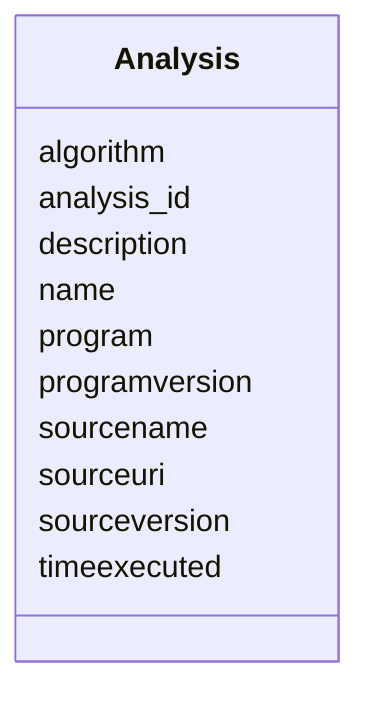

# Class: Analysis 


_Computational analysis/pipeline._


URI: [https://w3id.org/jgi/phytozome/Analysis](https://w3id.org/jgi/phytozome/Analysis)





<!-- no inheritance hierarchy -->


## Slots

| Name | Cardinality and Range | Description | Inheritance |
| ---  | --- | --- | --- |
| [analysis_id](analysis_id.md) | 1 <br/> [Integer](Integer.md) |  | direct |
| [name](name.md) | 0..1 <br/> [String](String.md) |  | direct |
| [description](description.md) | 0..1 <br/> [String](String.md) |  | direct |
| [program](program.md) | 0..1 <br/> [String](String.md) | Analysis program name | direct |
| [programversion](programversion.md) | 0..1 <br/> [String](String.md) |  | direct |
| [algorithm](algorithm.md) | 0..1 <br/> [String](String.md) |  | direct |
| [sourcename](sourcename.md) | 0..1 <br/> [String](String.md) |  | direct |
| [sourceversion](sourceversion.md) | 0..1 <br/> [String](String.md) |  | direct |
| [sourceuri](sourceuri.md) | 0..1 <br/> [String](String.md) |  | direct |
| [timeexecuted](timeexecuted.md) | 0..1 <br/> [Datetime](Datetime.md) |  | direct |


## Identifier and Mapping Information


### Annotations

| property | value |
| --- | --- |
| source_table | analysis |


### Schema Source


* from schema: https://w3id.org/jgi/phytozome


## Mappings

| Mapping Type | Mapped Value |
| ---  | ---  |
| self | https://w3id.org/jgi/phytozome/Analysis |
| native | https://w3id.org/jgi/phytozome/Analysis |


## LinkML Source

<!-- TODO: investigate https://stackoverflow.com/questions/37606292/how-to-create-tabbed-code-blocks-in-mkdocs-or-sphinx -->

### Direct

<details>
```yaml
name: Analysis
annotations:
  source_table:
    tag: source_table
    value: analysis
description: Computational analysis/pipeline.
from_schema: https://w3id.org/jgi/phytozome
attributes:
  analysis_id:
    name: analysis_id
    from_schema: https://w3id.org/jgi/phytozome
    rank: 1000
    identifier: true
    domain_of:
    - Analysis
    - AnalysisFeature
    range: integer
    required: true
  name:
    name: name
    from_schema: https://w3id.org/jgi/phytozome
    domain_of:
    - Feature
    - Analysis
    - CV
    - CVTerm
    - Biomaterial
    - CellLine
    - Assay
    - ArrayDesign
    - Acquisition
    - AnalysisSet
    - AnalysisGrp
    - Contact
    range: string
  description:
    name: description
    from_schema: https://w3id.org/jgi/phytozome
    rank: 1000
    domain_of:
    - Analysis
    - Biomaterial
    - Assay
    - AnalysisSet
    - Contact
    range: string
  program:
    name: program
    description: Analysis program name
    from_schema: https://w3id.org/jgi/phytozome
    rank: 1000
    domain_of:
    - Analysis
    range: string
  programversion:
    name: programversion
    from_schema: https://w3id.org/jgi/phytozome
    rank: 1000
    domain_of:
    - Analysis
    range: string
  algorithm:
    name: algorithm
    from_schema: https://w3id.org/jgi/phytozome
    rank: 1000
    domain_of:
    - Analysis
    range: string
  sourcename:
    name: sourcename
    from_schema: https://w3id.org/jgi/phytozome
    rank: 1000
    domain_of:
    - Analysis
    range: string
  sourceversion:
    name: sourceversion
    from_schema: https://w3id.org/jgi/phytozome
    rank: 1000
    domain_of:
    - Analysis
    range: string
  sourceuri:
    name: sourceuri
    from_schema: https://w3id.org/jgi/phytozome
    rank: 1000
    domain_of:
    - Analysis
    range: string
  timeexecuted:
    name: timeexecuted
    from_schema: https://w3id.org/jgi/phytozome
    rank: 1000
    domain_of:
    - Analysis
    range: datetime

```
</details>

### Induced

<details>
```yaml
name: Analysis
annotations:
  source_table:
    tag: source_table
    value: analysis
description: Computational analysis/pipeline.
from_schema: https://w3id.org/jgi/phytozome
attributes:
  analysis_id:
    name: analysis_id
    from_schema: https://w3id.org/jgi/phytozome
    rank: 1000
    identifier: true
    alias: analysis_id
    owner: Analysis
    domain_of:
    - Analysis
    - AnalysisFeature
    range: integer
    required: true
  name:
    name: name
    from_schema: https://w3id.org/jgi/phytozome
    alias: name
    owner: Analysis
    domain_of:
    - Feature
    - Analysis
    - CV
    - CVTerm
    - Biomaterial
    - CellLine
    - Assay
    - ArrayDesign
    - Acquisition
    - AnalysisSet
    - AnalysisGrp
    - Contact
    range: string
  description:
    name: description
    from_schema: https://w3id.org/jgi/phytozome
    rank: 1000
    alias: description
    owner: Analysis
    domain_of:
    - Analysis
    - Biomaterial
    - Assay
    - AnalysisSet
    - Contact
    range: string
  program:
    name: program
    description: Analysis program name
    from_schema: https://w3id.org/jgi/phytozome
    rank: 1000
    alias: program
    owner: Analysis
    domain_of:
    - Analysis
    range: string
  programversion:
    name: programversion
    from_schema: https://w3id.org/jgi/phytozome
    rank: 1000
    alias: programversion
    owner: Analysis
    domain_of:
    - Analysis
    range: string
  algorithm:
    name: algorithm
    from_schema: https://w3id.org/jgi/phytozome
    rank: 1000
    alias: algorithm
    owner: Analysis
    domain_of:
    - Analysis
    range: string
  sourcename:
    name: sourcename
    from_schema: https://w3id.org/jgi/phytozome
    rank: 1000
    alias: sourcename
    owner: Analysis
    domain_of:
    - Analysis
    range: string
  sourceversion:
    name: sourceversion
    from_schema: https://w3id.org/jgi/phytozome
    rank: 1000
    alias: sourceversion
    owner: Analysis
    domain_of:
    - Analysis
    range: string
  sourceuri:
    name: sourceuri
    from_schema: https://w3id.org/jgi/phytozome
    rank: 1000
    alias: sourceuri
    owner: Analysis
    domain_of:
    - Analysis
    range: string
  timeexecuted:
    name: timeexecuted
    from_schema: https://w3id.org/jgi/phytozome
    rank: 1000
    alias: timeexecuted
    owner: Analysis
    domain_of:
    - Analysis
    range: datetime

```
</details>