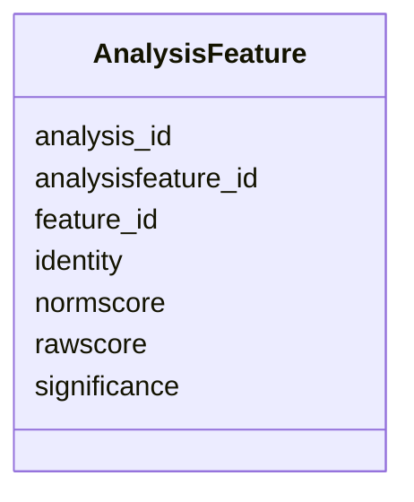

# Class: AnalysisFeature 


_Link between analysis and features it produced._


URI: [https://w3id.org/jgi/phytozome/AnalysisFeature](https://w3id.org/jgi/phytozome/AnalysisFeature)





<!-- no inheritance hierarchy -->


## Slots

| Name | Cardinality and Range | Description | Inheritance |
| ---  | --- | --- | --- |
| [analysisfeature_id](analysisfeature_id.md) | 1 <br/> [Integer](Integer.md) |  | direct |
| [feature_id](feature_id.md) | 0..1 <br/> [Integer](Integer.md) |  | direct |
| [analysis_id](analysis_id.md) | 0..1 <br/> [Integer](Integer.md) |  | direct |
| [rawscore](rawscore.md) | 0..1 <br/> [Float](Float.md) |  | direct |
| [normscore](normscore.md) | 0..1 <br/> [Float](Float.md) |  | direct |
| [significance](significance.md) | 0..1 <br/> [Float](Float.md) |  | direct |
| [identity](identity.md) | 0..1 <br/> [Float](Float.md) |  | direct |


## Identifier and Mapping Information


### Annotations

| property | value |
| --- | --- |
| source_table | analysisfeature |


### Schema Source


* from schema: https://w3id.org/jgi/phytozome


## Mappings

| Mapping Type | Mapped Value |
| ---  | ---  |
| self | https://w3id.org/jgi/phytozome/AnalysisFeature |
| native | https://w3id.org/jgi/phytozome/AnalysisFeature |


## LinkML Source

<!-- TODO: investigate https://stackoverflow.com/questions/37606292/how-to-create-tabbed-code-blocks-in-mkdocs-or-sphinx -->

### Direct

<details>
```yaml
name: AnalysisFeature
annotations:
  source_table:
    tag: source_table
    value: analysisfeature
description: Link between analysis and features it produced.
from_schema: https://w3id.org/jgi/phytozome
attributes:
  analysisfeature_id:
    name: analysisfeature_id
    from_schema: https://w3id.org/jgi/phytozome
    rank: 1000
    identifier: true
    domain_of:
    - AnalysisFeature
    range: integer
    required: true
  feature_id:
    name: feature_id
    comments:
    - Foreign key to feature.feature_id
    from_schema: https://w3id.org/jgi/phytozome
    domain_of:
    - Feature
    - AnalysisFeature
    - CellLineFeature
    range: integer
  analysis_id:
    name: analysis_id
    comments:
    - Foreign key to analysis.analysis_id
    from_schema: https://w3id.org/jgi/phytozome
    domain_of:
    - Analysis
    - AnalysisFeature
    range: integer
  rawscore:
    name: rawscore
    from_schema: https://w3id.org/jgi/phytozome
    rank: 1000
    domain_of:
    - AnalysisFeature
    range: float
  normscore:
    name: normscore
    from_schema: https://w3id.org/jgi/phytozome
    rank: 1000
    domain_of:
    - AnalysisFeature
    range: float
  significance:
    name: significance
    from_schema: https://w3id.org/jgi/phytozome
    rank: 1000
    domain_of:
    - AnalysisFeature
    range: float
  identity:
    name: identity
    from_schema: https://w3id.org/jgi/phytozome
    rank: 1000
    domain_of:
    - AnalysisFeature
    range: float

```
</details>

### Induced

<details>
```yaml
name: AnalysisFeature
annotations:
  source_table:
    tag: source_table
    value: analysisfeature
description: Link between analysis and features it produced.
from_schema: https://w3id.org/jgi/phytozome
attributes:
  analysisfeature_id:
    name: analysisfeature_id
    from_schema: https://w3id.org/jgi/phytozome
    rank: 1000
    identifier: true
    alias: analysisfeature_id
    owner: AnalysisFeature
    domain_of:
    - AnalysisFeature
    range: integer
    required: true
  feature_id:
    name: feature_id
    comments:
    - Foreign key to feature.feature_id
    from_schema: https://w3id.org/jgi/phytozome
    alias: feature_id
    owner: AnalysisFeature
    domain_of:
    - Feature
    - AnalysisFeature
    - CellLineFeature
    range: integer
  analysis_id:
    name: analysis_id
    comments:
    - Foreign key to analysis.analysis_id
    from_schema: https://w3id.org/jgi/phytozome
    alias: analysis_id
    owner: AnalysisFeature
    domain_of:
    - Analysis
    - AnalysisFeature
    range: integer
  rawscore:
    name: rawscore
    from_schema: https://w3id.org/jgi/phytozome
    rank: 1000
    alias: rawscore
    owner: AnalysisFeature
    domain_of:
    - AnalysisFeature
    range: float
  normscore:
    name: normscore
    from_schema: https://w3id.org/jgi/phytozome
    rank: 1000
    alias: normscore
    owner: AnalysisFeature
    domain_of:
    - AnalysisFeature
    range: float
  significance:
    name: significance
    from_schema: https://w3id.org/jgi/phytozome
    rank: 1000
    alias: significance
    owner: AnalysisFeature
    domain_of:
    - AnalysisFeature
    range: float
  identity:
    name: identity
    from_schema: https://w3id.org/jgi/phytozome
    rank: 1000
    alias: identity
    owner: AnalysisFeature
    domain_of:
    - AnalysisFeature
    range: float

```
</details>