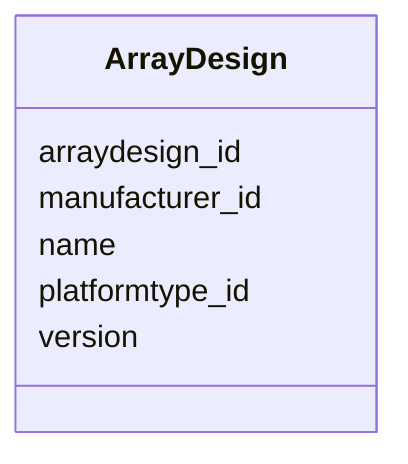

# Class: ArrayDesign 


_Microarray or expression platform design._


URI: [https://w3id.org/jgi/phytozome/ArrayDesign](https://w3id.org/jgi/phytozome/ArrayDesign)





<!-- no inheritance hierarchy -->


## Slots

| Name | Cardinality and Range | Description | Inheritance |
| ---  | --- | --- | --- |
| [arraydesign_id](arraydesign_id.md) | 1 <br/> [Integer](Integer.md) |  | direct |
| [manufacturer_id](manufacturer_id.md) | 0..1 <br/> [Integer](Integer.md) |  | direct |
| [platformtype_id](platformtype_id.md) | 0..1 <br/> [Integer](Integer.md) |  | direct |
| [name](name.md) | 0..1 <br/> [String](String.md) |  | direct |
| [version](version.md) | 0..1 <br/> [String](String.md) |  | direct |


## Identifier and Mapping Information


### Annotations

| property | value |
| --- | --- |
| source_table | arraydesign |


### Schema Source


* from schema: https://w3id.org/jgi/phytozome


## Mappings

| Mapping Type | Mapped Value |
| ---  | ---  |
| self | https://w3id.org/jgi/phytozome/ArrayDesign |
| native | https://w3id.org/jgi/phytozome/ArrayDesign |


## LinkML Source

<!-- TODO: investigate https://stackoverflow.com/questions/37606292/how-to-create-tabbed-code-blocks-in-mkdocs-or-sphinx -->

### Direct

<details>
```yaml
name: ArrayDesign
annotations:
  source_table:
    tag: source_table
    value: arraydesign
description: Microarray or expression platform design.
from_schema: https://w3id.org/jgi/phytozome
attributes:
  arraydesign_id:
    name: arraydesign_id
    from_schema: https://w3id.org/jgi/phytozome
    identifier: true
    domain_of:
    - Assay
    - ArrayDesign
    range: integer
    required: true
  manufacturer_id:
    name: manufacturer_id
    from_schema: https://w3id.org/jgi/phytozome
    rank: 1000
    domain_of:
    - ArrayDesign
    range: integer
  platformtype_id:
    name: platformtype_id
    from_schema: https://w3id.org/jgi/phytozome
    rank: 1000
    domain_of:
    - ArrayDesign
    range: integer
  name:
    name: name
    from_schema: https://w3id.org/jgi/phytozome
    domain_of:
    - Feature
    - Analysis
    - CV
    - CVTerm
    - Biomaterial
    - CellLine
    - Assay
    - ArrayDesign
    - Acquisition
    - AnalysisSet
    - AnalysisGrp
    - Contact
    range: string
  version:
    name: version
    from_schema: https://w3id.org/jgi/phytozome
    rank: 1000
    domain_of:
    - ArrayDesign
    range: string

```
</details>

### Induced

<details>
```yaml
name: ArrayDesign
annotations:
  source_table:
    tag: source_table
    value: arraydesign
description: Microarray or expression platform design.
from_schema: https://w3id.org/jgi/phytozome
attributes:
  arraydesign_id:
    name: arraydesign_id
    from_schema: https://w3id.org/jgi/phytozome
    identifier: true
    alias: arraydesign_id
    owner: ArrayDesign
    domain_of:
    - Assay
    - ArrayDesign
    range: integer
    required: true
  manufacturer_id:
    name: manufacturer_id
    from_schema: https://w3id.org/jgi/phytozome
    rank: 1000
    alias: manufacturer_id
    owner: ArrayDesign
    domain_of:
    - ArrayDesign
    range: integer
  platformtype_id:
    name: platformtype_id
    from_schema: https://w3id.org/jgi/phytozome
    rank: 1000
    alias: platformtype_id
    owner: ArrayDesign
    domain_of:
    - ArrayDesign
    range: integer
  name:
    name: name
    from_schema: https://w3id.org/jgi/phytozome
    alias: name
    owner: ArrayDesign
    domain_of:
    - Feature
    - Analysis
    - CV
    - CVTerm
    - Biomaterial
    - CellLine
    - Assay
    - ArrayDesign
    - Acquisition
    - AnalysisSet
    - AnalysisGrp
    - Contact
    range: string
  version:
    name: version
    from_schema: https://w3id.org/jgi/phytozome
    rank: 1000
    alias: version
    owner: ArrayDesign
    domain_of:
    - ArrayDesign
    range: string

```
</details>