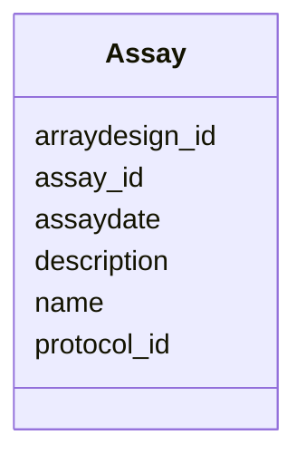

# Class: Assay 


_Expression assay experiment._


URI: [https://w3id.org/jgi/phytozome/Assay](https://w3id.org/jgi/phytozome/Assay)





<!-- no inheritance hierarchy -->


## Slots

| Name | Cardinality and Range | Description | Inheritance |
| ---  | --- | --- | --- |
| [assay_id](assay_id.md) | 1 <br/> [Integer](Integer.md) |  | direct |
| [arraydesign_id](arraydesign_id.md) | 0..1 <br/> [Integer](Integer.md) |  | direct |
| [protocol_id](protocol_id.md) | 0..1 <br/> [Integer](Integer.md) |  | direct |
| [assaydate](assaydate.md) | 0..1 <br/> [Datetime](Datetime.md) |  | direct |
| [name](name.md) | 0..1 <br/> [String](String.md) |  | direct |
| [description](description.md) | 0..1 <br/> [String](String.md) |  | direct |


## Identifier and Mapping Information


### Annotations

| property | value |
| --- | --- |
| source_table | assay |


### Schema Source


* from schema: https://w3id.org/jgi/phytozome


## Mappings

| Mapping Type | Mapped Value |
| ---  | ---  |
| self | https://w3id.org/jgi/phytozome/Assay |
| native | https://w3id.org/jgi/phytozome/Assay |


## LinkML Source

<!-- TODO: investigate https://stackoverflow.com/questions/37606292/how-to-create-tabbed-code-blocks-in-mkdocs-or-sphinx -->

### Direct

<details>
```yaml
name: Assay
annotations:
  source_table:
    tag: source_table
    value: assay
description: Expression assay experiment.
from_schema: https://w3id.org/jgi/phytozome
attributes:
  assay_id:
    name: assay_id
    from_schema: https://w3id.org/jgi/phytozome
    rank: 1000
    identifier: true
    domain_of:
    - Assay
    - AssayBiomaterial
    - Acquisition
    range: integer
    required: true
  arraydesign_id:
    name: arraydesign_id
    from_schema: https://w3id.org/jgi/phytozome
    rank: 1000
    domain_of:
    - Assay
    - ArrayDesign
    range: integer
  protocol_id:
    name: protocol_id
    from_schema: https://w3id.org/jgi/phytozome
    rank: 1000
    domain_of:
    - Assay
    - Acquisition
    range: integer
  assaydate:
    name: assaydate
    from_schema: https://w3id.org/jgi/phytozome
    rank: 1000
    domain_of:
    - Assay
    range: datetime
  name:
    name: name
    from_schema: https://w3id.org/jgi/phytozome
    domain_of:
    - Feature
    - Analysis
    - CV
    - CVTerm
    - Biomaterial
    - CellLine
    - Assay
    - ArrayDesign
    - Acquisition
    - AnalysisSet
    - AnalysisGrp
    - Contact
    range: string
  description:
    name: description
    from_schema: https://w3id.org/jgi/phytozome
    domain_of:
    - Analysis
    - Biomaterial
    - Assay
    - AnalysisSet
    - Contact
    range: string

```
</details>

### Induced

<details>
```yaml
name: Assay
annotations:
  source_table:
    tag: source_table
    value: assay
description: Expression assay experiment.
from_schema: https://w3id.org/jgi/phytozome
attributes:
  assay_id:
    name: assay_id
    from_schema: https://w3id.org/jgi/phytozome
    rank: 1000
    identifier: true
    alias: assay_id
    owner: Assay
    domain_of:
    - Assay
    - AssayBiomaterial
    - Acquisition
    range: integer
    required: true
  arraydesign_id:
    name: arraydesign_id
    from_schema: https://w3id.org/jgi/phytozome
    rank: 1000
    alias: arraydesign_id
    owner: Assay
    domain_of:
    - Assay
    - ArrayDesign
    range: integer
  protocol_id:
    name: protocol_id
    from_schema: https://w3id.org/jgi/phytozome
    rank: 1000
    alias: protocol_id
    owner: Assay
    domain_of:
    - Assay
    - Acquisition
    range: integer
  assaydate:
    name: assaydate
    from_schema: https://w3id.org/jgi/phytozome
    rank: 1000
    alias: assaydate
    owner: Assay
    domain_of:
    - Assay
    range: datetime
  name:
    name: name
    from_schema: https://w3id.org/jgi/phytozome
    alias: name
    owner: Assay
    domain_of:
    - Feature
    - Analysis
    - CV
    - CVTerm
    - Biomaterial
    - CellLine
    - Assay
    - ArrayDesign
    - Acquisition
    - AnalysisSet
    - AnalysisGrp
    - Contact
    range: string
  description:
    name: description
    from_schema: https://w3id.org/jgi/phytozome
    alias: description
    owner: Assay
    domain_of:
    - Analysis
    - Biomaterial
    - Assay
    - AnalysisSet
    - Contact
    range: string

```
</details>