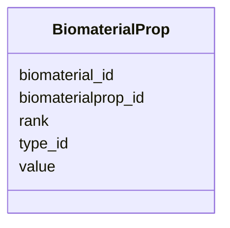

# Class: BiomaterialProp 


_Property of a biomaterial._


URI: [https://w3id.org/jgi/phytozome/BiomaterialProp](https://w3id.org/jgi/phytozome/BiomaterialProp)





<!-- no inheritance hierarchy -->


## Slots

| Name | Cardinality and Range | Description | Inheritance |
| ---  | --- | --- | --- |
| [biomaterialprop_id](biomaterialprop_id.md) | 1 <br/> [Integer](Integer.md) |  | direct |
| [biomaterial_id](biomaterial_id.md) | 0..1 <br/> [Integer](Integer.md) |  | direct |
| [type_id](type_id.md) | 0..1 <br/> [Integer](Integer.md) |  | direct |
| [value](value.md) | 0..1 <br/> [String](String.md) |  | direct |
| [rank](rank.md) | 0..1 <br/> [Integer](Integer.md) |  | direct |


## Identifier and Mapping Information


### Annotations

| property | value |
| --- | --- |
| source_table | biomaterialprop |


### Schema Source


* from schema: https://w3id.org/jgi/phytozome


## Mappings

| Mapping Type | Mapped Value |
| ---  | ---  |
| self | https://w3id.org/jgi/phytozome/BiomaterialProp |
| native | https://w3id.org/jgi/phytozome/BiomaterialProp |


## LinkML Source

<!-- TODO: investigate https://stackoverflow.com/questions/37606292/how-to-create-tabbed-code-blocks-in-mkdocs-or-sphinx -->

### Direct

<details>
```yaml
name: BiomaterialProp
annotations:
  source_table:
    tag: source_table
    value: biomaterialprop
description: Property of a biomaterial.
from_schema: https://w3id.org/jgi/phytozome
attributes:
  biomaterialprop_id:
    name: biomaterialprop_id
    from_schema: https://w3id.org/jgi/phytozome
    rank: 1000
    identifier: true
    domain_of:
    - BiomaterialProp
    range: integer
    required: true
  biomaterial_id:
    name: biomaterial_id
    comments:
    - Foreign key to biomaterial.biomaterial_id
    from_schema: https://w3id.org/jgi/phytozome
    domain_of:
    - Biomaterial
    - BiomaterialProp
    - BiomaterialTreatment
    - AssayBiomaterial
    range: integer
  type_id:
    name: type_id
    from_schema: https://w3id.org/jgi/phytozome
    domain_of:
    - Feature
    - BiomaterialProp
    - BiomaterialRelationship
    - CellLineProp
    - ContactRelationship
    range: integer
  value:
    name: value
    from_schema: https://w3id.org/jgi/phytozome
    rank: 1000
    domain_of:
    - BiomaterialProp
    - CellLineProp
    range: string
  rank:
    name: rank
    from_schema: https://w3id.org/jgi/phytozome
    rank: 1000
    domain_of:
    - BiomaterialProp
    range: integer

```
</details>

### Induced

<details>
```yaml
name: BiomaterialProp
annotations:
  source_table:
    tag: source_table
    value: biomaterialprop
description: Property of a biomaterial.
from_schema: https://w3id.org/jgi/phytozome
attributes:
  biomaterialprop_id:
    name: biomaterialprop_id
    from_schema: https://w3id.org/jgi/phytozome
    rank: 1000
    identifier: true
    alias: biomaterialprop_id
    owner: BiomaterialProp
    domain_of:
    - BiomaterialProp
    range: integer
    required: true
  biomaterial_id:
    name: biomaterial_id
    comments:
    - Foreign key to biomaterial.biomaterial_id
    from_schema: https://w3id.org/jgi/phytozome
    alias: biomaterial_id
    owner: BiomaterialProp
    domain_of:
    - Biomaterial
    - BiomaterialProp
    - BiomaterialTreatment
    - AssayBiomaterial
    range: integer
  type_id:
    name: type_id
    from_schema: https://w3id.org/jgi/phytozome
    alias: type_id
    owner: BiomaterialProp
    domain_of:
    - Feature
    - BiomaterialProp
    - BiomaterialRelationship
    - CellLineProp
    - ContactRelationship
    range: integer
  value:
    name: value
    from_schema: https://w3id.org/jgi/phytozome
    rank: 1000
    alias: value
    owner: BiomaterialProp
    domain_of:
    - BiomaterialProp
    - CellLineProp
    range: string
  rank:
    name: rank
    from_schema: https://w3id.org/jgi/phytozome
    rank: 1000
    alias: rank
    owner: BiomaterialProp
    domain_of:
    - BiomaterialProp
    range: integer

```
</details>