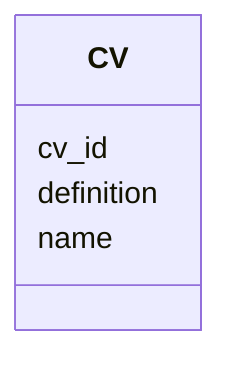

# Class: CV 


_Controlled vocabulary (GO, SO, etc.)._


URI: [https://w3id.org/jgi/phytozome/CV](https://w3id.org/jgi/phytozome/CV)





<!-- no inheritance hierarchy -->


## Slots

| Name | Cardinality and Range | Description | Inheritance |
| ---  | --- | --- | --- |
| [cv_id](cv_id.md) | 1 <br/> [Integer](Integer.md) |  | direct |
| [name](name.md) | 0..1 <br/> [String](String.md) | CV name (e | direct |
| [definition](definition.md) | 0..1 <br/> [String](String.md) |  | direct |


## Identifier and Mapping Information


### Annotations

| property | value |
| --- | --- |
| source_table | cv |


### Schema Source


* from schema: https://w3id.org/jgi/phytozome


## Mappings

| Mapping Type | Mapped Value |
| ---  | ---  |
| self | https://w3id.org/jgi/phytozome/CV |
| native | https://w3id.org/jgi/phytozome/CV |


## LinkML Source

<!-- TODO: investigate https://stackoverflow.com/questions/37606292/how-to-create-tabbed-code-blocks-in-mkdocs-or-sphinx -->

### Direct

<details>
```yaml
name: CV
annotations:
  source_table:
    tag: source_table
    value: cv
description: Controlled vocabulary (GO, SO, etc.).
from_schema: https://w3id.org/jgi/phytozome
attributes:
  cv_id:
    name: cv_id
    from_schema: https://w3id.org/jgi/phytozome
    rank: 1000
    identifier: true
    domain_of:
    - CV
    - CVTerm
    range: integer
    required: true
  name:
    name: name
    description: CV name (e.g., "sequence", "gene_ontology")
    from_schema: https://w3id.org/jgi/phytozome
    domain_of:
    - Feature
    - Analysis
    - CV
    - CVTerm
    - Biomaterial
    - CellLine
    - Assay
    - ArrayDesign
    - Acquisition
    - AnalysisSet
    - AnalysisGrp
    - Contact
    range: string
  definition:
    name: definition
    from_schema: https://w3id.org/jgi/phytozome
    rank: 1000
    domain_of:
    - CV
    - CVTerm
    range: string

```
</details>

### Induced

<details>
```yaml
name: CV
annotations:
  source_table:
    tag: source_table
    value: cv
description: Controlled vocabulary (GO, SO, etc.).
from_schema: https://w3id.org/jgi/phytozome
attributes:
  cv_id:
    name: cv_id
    from_schema: https://w3id.org/jgi/phytozome
    rank: 1000
    identifier: true
    alias: cv_id
    owner: CV
    domain_of:
    - CV
    - CVTerm
    range: integer
    required: true
  name:
    name: name
    description: CV name (e.g., "sequence", "gene_ontology")
    from_schema: https://w3id.org/jgi/phytozome
    alias: name
    owner: CV
    domain_of:
    - Feature
    - Analysis
    - CV
    - CVTerm
    - Biomaterial
    - CellLine
    - Assay
    - ArrayDesign
    - Acquisition
    - AnalysisSet
    - AnalysisGrp
    - Contact
    range: string
  definition:
    name: definition
    from_schema: https://w3id.org/jgi/phytozome
    rank: 1000
    alias: definition
    owner: CV
    domain_of:
    - CV
    - CVTerm
    range: string

```
</details>