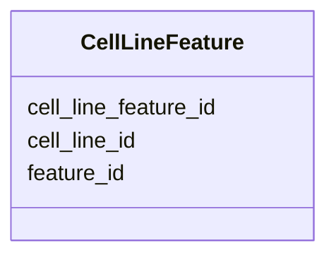

# Class: CellLineFeature 


_Feature associated with cell line._


URI: [https://w3id.org/jgi/phytozome/CellLineFeature](https://w3id.org/jgi/phytozome/CellLineFeature)





<!-- no inheritance hierarchy -->


## Slots

| Name | Cardinality and Range | Description | Inheritance |
| ---  | --- | --- | --- |
| [cell_line_feature_id](cell_line_feature_id.md) | 1 <br/> [Integer](Integer.md) |  | direct |
| [cell_line_id](cell_line_id.md) | 0..1 <br/> [Integer](Integer.md) |  | direct |
| [feature_id](feature_id.md) | 0..1 <br/> [Integer](Integer.md) |  | direct |


## Identifier and Mapping Information


### Annotations

| property | value |
| --- | --- |
| source_table | cell_line_feature |


### Schema Source


* from schema: https://w3id.org/jgi/phytozome


## Mappings

| Mapping Type | Mapped Value |
| ---  | ---  |
| self | https://w3id.org/jgi/phytozome/CellLineFeature |
| native | https://w3id.org/jgi/phytozome/CellLineFeature |


## LinkML Source

<!-- TODO: investigate https://stackoverflow.com/questions/37606292/how-to-create-tabbed-code-blocks-in-mkdocs-or-sphinx -->

### Direct

<details>
```yaml
name: CellLineFeature
annotations:
  source_table:
    tag: source_table
    value: cell_line_feature
description: Feature associated with cell line.
from_schema: https://w3id.org/jgi/phytozome
attributes:
  cell_line_feature_id:
    name: cell_line_feature_id
    from_schema: https://w3id.org/jgi/phytozome
    rank: 1000
    identifier: true
    domain_of:
    - CellLineFeature
    range: integer
    required: true
  cell_line_id:
    name: cell_line_id
    from_schema: https://w3id.org/jgi/phytozome
    domain_of:
    - CellLine
    - CellLineProp
    - CellLineFeature
    range: integer
  feature_id:
    name: feature_id
    from_schema: https://w3id.org/jgi/phytozome
    domain_of:
    - Feature
    - AnalysisFeature
    - CellLineFeature
    range: integer

```
</details>

### Induced

<details>
```yaml
name: CellLineFeature
annotations:
  source_table:
    tag: source_table
    value: cell_line_feature
description: Feature associated with cell line.
from_schema: https://w3id.org/jgi/phytozome
attributes:
  cell_line_feature_id:
    name: cell_line_feature_id
    from_schema: https://w3id.org/jgi/phytozome
    rank: 1000
    identifier: true
    alias: cell_line_feature_id
    owner: CellLineFeature
    domain_of:
    - CellLineFeature
    range: integer
    required: true
  cell_line_id:
    name: cell_line_id
    from_schema: https://w3id.org/jgi/phytozome
    alias: cell_line_id
    owner: CellLineFeature
    domain_of:
    - CellLine
    - CellLineProp
    - CellLineFeature
    range: integer
  feature_id:
    name: feature_id
    from_schema: https://w3id.org/jgi/phytozome
    alias: feature_id
    owner: CellLineFeature
    domain_of:
    - Feature
    - AnalysisFeature
    - CellLineFeature
    range: integer

```
</details>