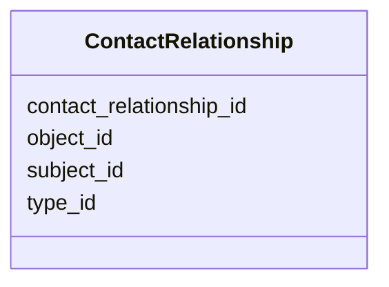

# Class: ContactRelationship 


_Relationship between contacts._


URI: [https://w3id.org/jgi/phytozome/ContactRelationship](https://w3id.org/jgi/phytozome/ContactRelationship)





<!-- no inheritance hierarchy -->


## Slots

| Name | Cardinality and Range | Description | Inheritance |
| ---  | --- | --- | --- |
| [contact_relationship_id](contact_relationship_id.md) | 1 <br/> [Integer](Integer.md) |  | direct |
| [subject_id](subject_id.md) | 0..1 <br/> [Integer](Integer.md) |  | direct |
| [object_id](object_id.md) | 0..1 <br/> [Integer](Integer.md) |  | direct |
| [type_id](type_id.md) | 0..1 <br/> [Integer](Integer.md) |  | direct |


## Identifier and Mapping Information


### Annotations

| property | value |
| --- | --- |
| source_table | contact_relationship |


### Schema Source


* from schema: https://w3id.org/jgi/phytozome


## Mappings

| Mapping Type | Mapped Value |
| ---  | ---  |
| self | https://w3id.org/jgi/phytozome/ContactRelationship |
| native | https://w3id.org/jgi/phytozome/ContactRelationship |


## LinkML Source

<!-- TODO: investigate https://stackoverflow.com/questions/37606292/how-to-create-tabbed-code-blocks-in-mkdocs-or-sphinx -->

### Direct

<details>
```yaml
name: ContactRelationship
annotations:
  source_table:
    tag: source_table
    value: contact_relationship
description: Relationship between contacts.
from_schema: https://w3id.org/jgi/phytozome
attributes:
  contact_relationship_id:
    name: contact_relationship_id
    from_schema: https://w3id.org/jgi/phytozome
    rank: 1000
    identifier: true
    domain_of:
    - ContactRelationship
    range: integer
    required: true
  subject_id:
    name: subject_id
    from_schema: https://w3id.org/jgi/phytozome
    domain_of:
    - BiomaterialRelationship
    - ContactRelationship
    range: integer
  object_id:
    name: object_id
    from_schema: https://w3id.org/jgi/phytozome
    domain_of:
    - BiomaterialRelationship
    - ContactRelationship
    range: integer
  type_id:
    name: type_id
    from_schema: https://w3id.org/jgi/phytozome
    domain_of:
    - Feature
    - BiomaterialProp
    - BiomaterialRelationship
    - CellLineProp
    - ContactRelationship
    range: integer

```
</details>

### Induced

<details>
```yaml
name: ContactRelationship
annotations:
  source_table:
    tag: source_table
    value: contact_relationship
description: Relationship between contacts.
from_schema: https://w3id.org/jgi/phytozome
attributes:
  contact_relationship_id:
    name: contact_relationship_id
    from_schema: https://w3id.org/jgi/phytozome
    rank: 1000
    identifier: true
    alias: contact_relationship_id
    owner: ContactRelationship
    domain_of:
    - ContactRelationship
    range: integer
    required: true
  subject_id:
    name: subject_id
    from_schema: https://w3id.org/jgi/phytozome
    alias: subject_id
    owner: ContactRelationship
    domain_of:
    - BiomaterialRelationship
    - ContactRelationship
    range: integer
  object_id:
    name: object_id
    from_schema: https://w3id.org/jgi/phytozome
    alias: object_id
    owner: ContactRelationship
    domain_of:
    - BiomaterialRelationship
    - ContactRelationship
    range: integer
  type_id:
    name: type_id
    from_schema: https://w3id.org/jgi/phytozome
    alias: type_id
    owner: ContactRelationship
    domain_of:
    - Feature
    - BiomaterialProp
    - BiomaterialRelationship
    - CellLineProp
    - ContactRelationship
    range: integer

```
</details>